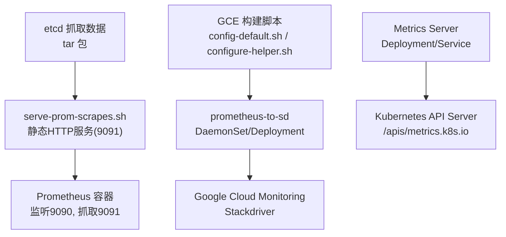
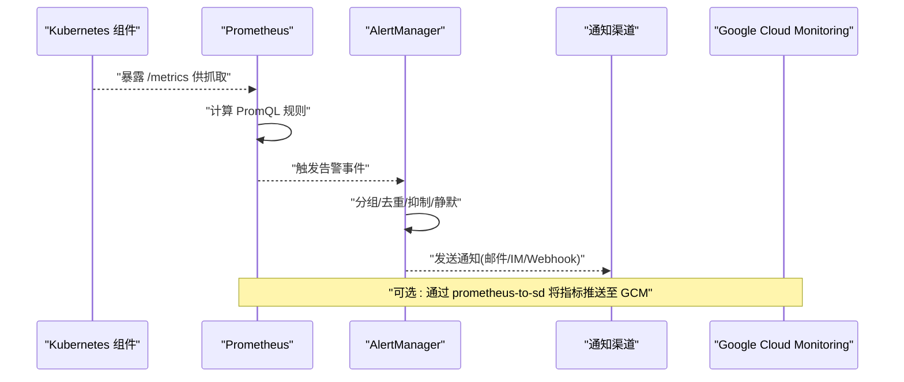
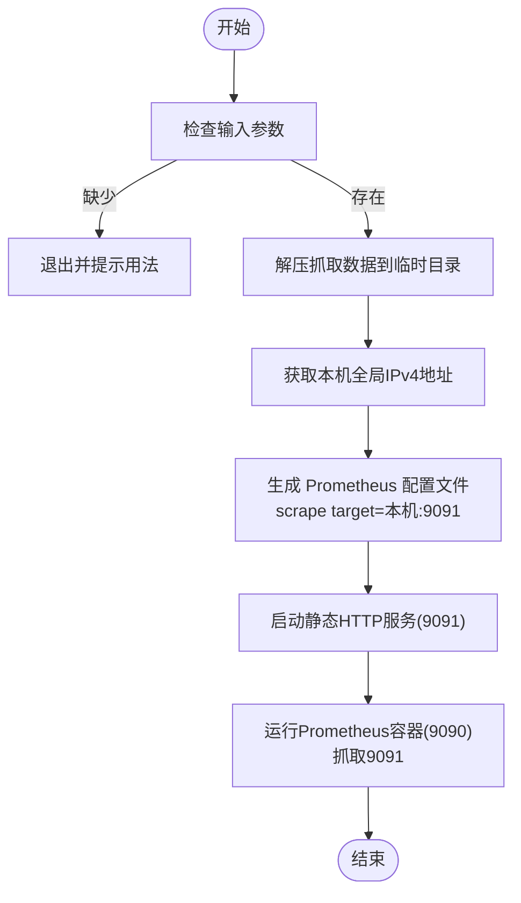
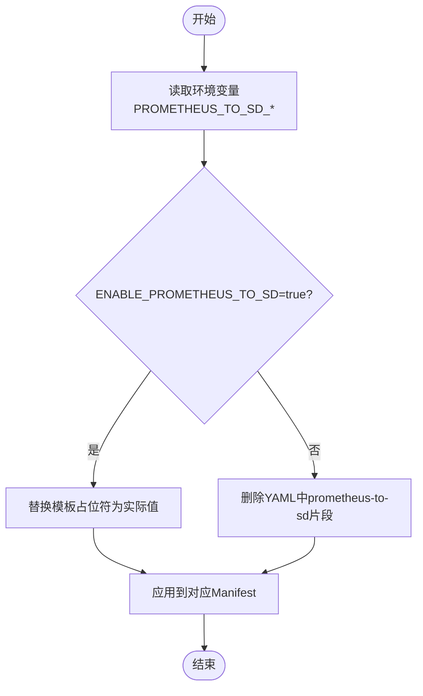
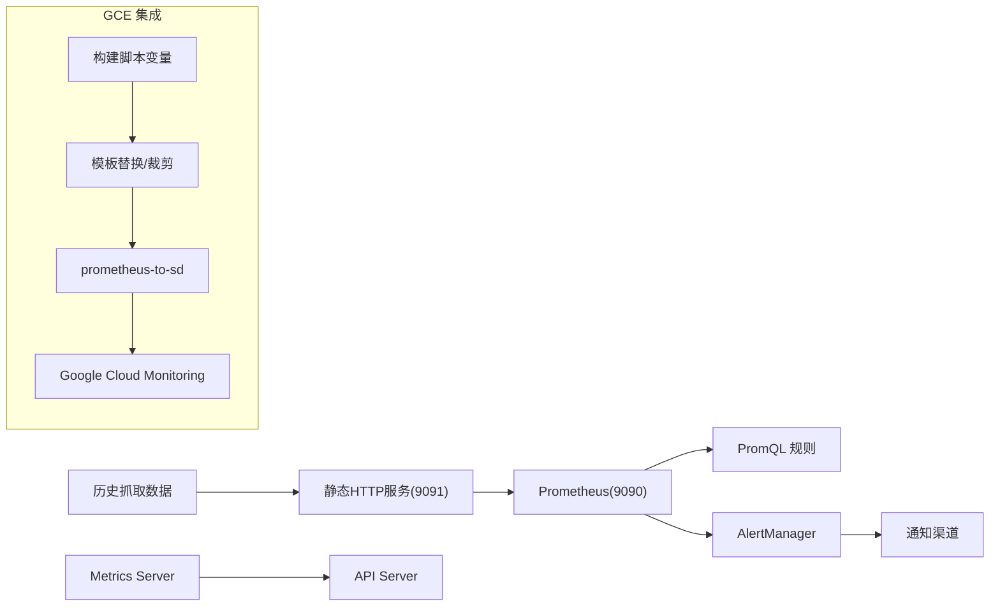

# 告警配置

<cite>
**本文引用的文件**   
- [run-prometheus-on-etcd-scrapes.sh](file://hack/run-prometheus-on-etcd-scrapes.sh)
- [config-default.sh](file://cluster/gce/config-default.sh)
- [configure-helper.sh](file://cluster/gce/gci/configure-helper.sh)
- [metrics-server README.md](file://cluster/addons/metrics-server/README.md)
</cite>

## 目录
1. [简介](#简介)
2. [项目结构](#项目结构)
3. [核心组件](#核心组件)
4. [架构总览](#架构总览)
5. [详细组件分析](#详细组件分析)
6. [依赖关系分析](#依赖关系分析)
7. [性能与阈值调优](#性能与阈值调优)
8. [故障排查指南](#故障排查指南)
9. [结论](#结论)
10. [附录](#附录)

## 简介
本指南面向在 Kubernetes 集群中落地 Prometheus + AlertManager 告警体系的用户，提供从采集、规则、通知到抑制与分级的完整实践。结合仓库中与监控相关的脚本与文档，说明如何：
- 使用本地 Prometheus 快速验证历史抓取数据
- 通过 GCE 构建脚本启用 prometheus-to-sd 将指标导出至云监控
- 部署 Metrics Server 以支撑资源指标与 HPA
- 设计并管理告警规则、分级策略、通知渠道与抑制机制
- 进行生命周期管理、历史数据分析与效果评估
- 与第三方监控系统集成（如 Stackdriver/GCM）

## 项目结构
仓库中与监控/告警直接相关的要点包括：
- 开发/测试工具：用于将历史 etcd scrape 打包并以 Prometheus 服务暴露，便于离线分析与规则验证
- GCE 构建脚本：提供 prometheus-to-sd 的开关与参数注入，支持将指标推送到 Google Cloud Monitoring
- Metrics Server 插件：提供资源指标 API，支撑 HPA 与 kubectl top

图表来源
- [run-prometheus-on-etcd-scrapes.sh:85-99](file://hack/run-prometheus-on-etcd-scrapes.sh#L85-L99)
- [config-default.sh:456-461](file://cluster/gce/config-default.sh#L456-L461)
- [configure-helper.sh:2643-2664](file://cluster/gce/gci/configure-helper.sh#L2643-L2664)

章节来源
- [run-prometheus-on-etcd-scrapes.sh:1-99](file://hack/run-prometheus-on-etcd-scrapes.sh#L1-L99)
- [config-default.sh:450-543](file://cluster/gce/config-default.sh#L450-L543)
- [configure-helper.sh:2640-2839](file://cluster/gce/gci/configure-helper.sh#L2640-L2839)
- [metrics-server README.md:1-19](file://cluster/addons/metrics-server/README.md#L1-L19)

## 核心组件
- Prometheus 与 AlertManager
  - 负责指标抓取、存储、查询与告警判定；AlertManager 负责路由、去重、抑制与通知
- 指标源
  - kubelet、kube-apiserver、etcd、node-exporter/cadvisor、业务应用等
  - 通过 prometheus-to-sd 可将部分指标转发至外部系统（如 GCM）
- Metrics Server
  - 提供资源指标 API，支撑 HPA 与 kubectl top
- 通知渠道
  - 邮件、企业微信、钉钉、Slack、Webhook、PagerDuty 等

章节来源
- [metrics-server README.md:1-19](file://cluster/addons/metrics-server/README.md#L1-L19)

## 架构总览
下图展示“采集—处理—告警—通知”的端到端链路，以及可选的外部监控集成路径。

图表来源
- [run-prometheus-on-etcd-scrapes.sh:85-99](file://hack/run-prometheus-on-etcd-scrapes.sh#L85-L99)
- [config-default.sh:456-461](file://cluster/gce/config-default.sh#L456-L461)
- [configure-helper.sh:2643-2664](file://cluster/gce/gci/configure-helper.sh#L2643-L2664)

## 详细组件分析

### 组件A：本地 Prometheus 快速验证（历史抓取）
- 作用
  - 将历史 etcd scrape 数据解压并通过简单 HTTP 服务暴露，启动 Prometheus 抓取该服务，便于离线验证规则与看板
- 关键流程
  - 解析 tar 包中的时间戳命名文件，生成带时间戳的抓取数据
  - 启动本地静态服务（默认端口 9091）
  - 生成 Prometheus 配置文件，指向本地 9091 目标
  - 运行 Prometheus 容器（默认端口 9090），设置较长保留期以便分析
- 适用场景
  - 规则编写与回归验证
  - 问题复现与回溯分析

图表来源
- [run-prometheus-on-etcd-scrapes.sh:38-48](file://hack/run-prometheus-on-etcd-scrapes.sh#L38-L48)
- [run-prometheus-on-etcd-scrapes.sh:68-77](file://hack/run-prometheus-on-etcd-scrapes.sh#L68-L77)
- [run-prometheus-on-etcd-scrapes.sh:85-99](file://hack/run-prometheus-on-etcd-scrapes.sh#L85-L99)

章节来源
- [run-prometheus-on-etcd-scrapes.sh:1-99](file://hack/run-prometheus-on-etcd-scrapes.sh#L1-L99)

### 组件B：GCE 环境下的 prometheus-to-sd 集成
- 作用
  - 在 GCE 集群中，通过环境变量控制是否启用 prometheus-to-sd，并将指标写入 Google Cloud Monitoring
- 关键变量
  - PROMETHEUS_TO_SD_ENDPOINT：外部监控端点
  - PROMETHEUS_TO_SD_PREFIX：指标前缀
  - ENABLE_PROMETHEUS_TO_SD：是否启用
- 关键逻辑
  - 根据开关决定是否替换模板占位符或移除相关 YAML 片段
  - 对 DaemonSet 级别的配置有独立开关，支持更细粒度控制

图表来源
- [config-default.sh:456-461](file://cluster/gce/config-default.sh#L456-L461)
- [configure-helper.sh:2643-2664](file://cluster/gce/gci/configure-helper.sh#L2643-L2664)

章节来源
- [config-default.sh:450-543](file://cluster/gce/config-default.sh#L450-L543)
- [configure-helper.sh:2640-2839](file://cluster/gce/gci/configure-helper.sh#L2640-L2839)

### 组件C：Metrics Server 与资源指标
- 作用
  - 暴露资源指标 API，支撑 HPA、kubectl top 等能力
- 注意事项
  - 节点上 Pod 数量较多时可能受限或 OOM，可通过覆盖资源需求调整
  - 降低系统组件资源可能导致 HPA/kubectl top 不可用

章节来源
- [metrics-server README.md:1-19](file://cluster/addons/metrics-server/README.md#L1-L19)

## 依赖关系分析
- 本地验证链路
  - 历史抓取数据 → 静态HTTP服务 → Prometheus 抓取 → 规则计算
- GCE 集成链路
  - 构建脚本 → 模板替换/裁剪 → prometheus-to-sd → 外部监控
- 资源指标链路
  - Metrics Server → API Server → HPA/kubectl top

图表来源
- [run-prometheus-on-etcd-scrapes.sh:85-99](file://hack/run-prometheus-on-etcd-scrapes.sh#L85-L99)
- [config-default.sh:456-461](file://cluster/gce/config-default.sh#L456-L461)
- [configure-helper.sh:2643-2664](file://cluster/gce/gci/configure-helper.sh#L2643-L2664)

## 性能与阈值调优
- 抓取与存储
  - 合理设置 scrape_interval 与 retention.time，避免磁盘与内存压力
  - 对高基数指标进行标签裁剪与降采样
- 规则计算
  - 避免过于复杂的 PromQL 与过短窗口；优先使用预聚合指标
  - 将高频规则拆分到不同组，错峰执行
- 通知与抑制
  - 使用分组与抑制减少风暴；对维护窗口设置静默
- Metrics Server
  - 按节点规模与 Pod 密度调整资源请求/限制，参考官方建议

[本节为通用指导，不直接分析具体文件]

## 故障排查指南
- 本地 Prometheus 无法抓取
  - 确认静态HTTP服务已启动且可达（默认 9091）
  - 检查 Prometheus 配置中的 targets 是否正确
  - 查看容器日志与端口映射
- prometheus-to-sd 未生效
  - 确认 ENABLE_PROMETHEUS_TO_SD 是否为 true
  - 检查模板占位符是否被正确替换
  - 核对 Endpoint 与 Prefix 配置
- Metrics Server 异常
  - 关注 OOM 与节流现象，适当提高资源配额
  - 验证 API Server 的 metrics 接口可达性

章节来源
- [run-prometheus-on-etcd-scrapes.sh:85-99](file://hack/run-prometheus-on-etcd-scrapes.sh#L85-L99)
- [config-default.sh:456-461](file://cluster/gce/config-default.sh#L456-L461)
- [configure-helper.sh:2643-2664](file://cluster/gce/gci/configure-helper.sh#L2643-L2664)
- [metrics-server README.md:10-19](file://cluster/addons/metrics-server/README.md#L10-L19)

## 结论
通过在仓库现有脚本与文档基础上组合 Prometheus、AlertManager、Metrics Server 与外部监控集成，可构建稳定、可扩展的告警体系。建议以本地历史抓取数据先行验证规则，再在生产环境逐步上线，并结合抑制与分级策略提升告警质量与处置效率。

[本节为总结性内容，不直接分析具体文件]

## 附录

### 告警规则编写规范（建议）
- 命名与标签
  - 统一命名空间与层级，使用标准化标签（如 cluster、namespace、service、job）
- 条件与时窗
  - 明确持续时间 with 条件，避免抖动误报
- 严重级别
  - 定义 P0/P1/P2/P3 等级，分别对应不同响应时效与通知渠道
- 示例主题
  - 集群健康：NodeNotReady、EtcdLeaderChanged、APIServerDown
  - 资源使用率：NodeCPUUsage、NodeMemoryPressure、PodOOMKilled
  - 服务可用性：EndpointDown、HPAFailedToScale、IngressLatencyHigh

[本节为概念性指导，不直接分析具体文件]

### 通知渠道配置（建议）
- 渠道类型
  - 邮件、企业微信、钉钉、Slack、Webhook、PagerDuty、飞书等
- 路由策略
  - 基于标签匹配路由到不同接收者；按严重级别分流
- 抑制与静默
  - 抑制低级别告警在高级别告警期间重复触发
  - 维护窗口内对特定维度设置静默

[本节为概念性指导，不直接分析具体文件]

### 告警生命周期管理
- 创建与评审
  - 提交变更需经过同行评审与灰度验证
- 发布与回滚
  - 先灰度小范围，观察误报与漏报后全量发布
- 退役与归档
  - 定期清理无效规则，归档历史告警统计

[本节为概念性指导，不直接分析具体文件]

### 历史数据分析与效果评估
- 指标
  - 告警总量、误报率、平均恢复时间(MTTR)、通知到达率
- 方法
  - 基于 Prometheus 历史数据进行回放与对比
  - 结合本地 Prometheus 快速验证新规则的效果

[本节为概念性指导，不直接分析具体文件]

### 与第三方监控系统集成（最佳实践）
- 使用 prometheus-to-sd 将指标写入外部监控平台
- 保持指标命名一致，避免重复计数
- 对外部平台的限流与重试策略进行适配

章节来源
- [config-default.sh:456-461](file://cluster/gce/config-default.sh#L456-L461)
- [configure-helper.sh:2643-2664](file://cluster/gce/gci/configure-helper.sh#L2643-L2664)