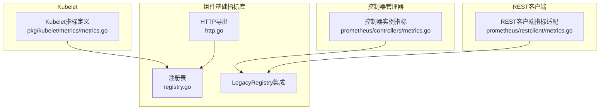
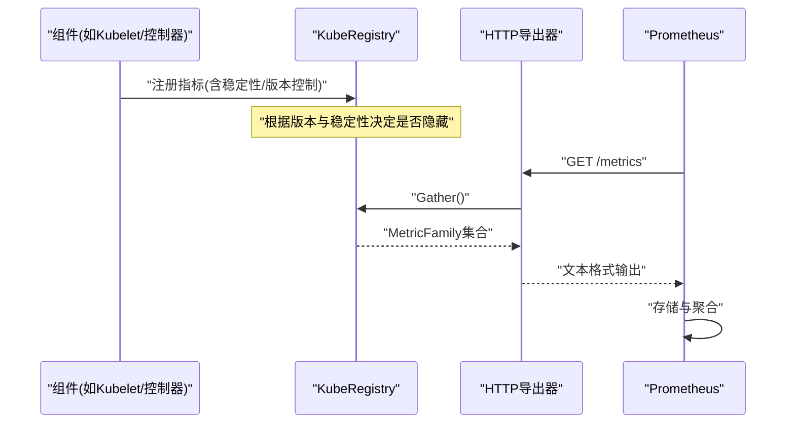
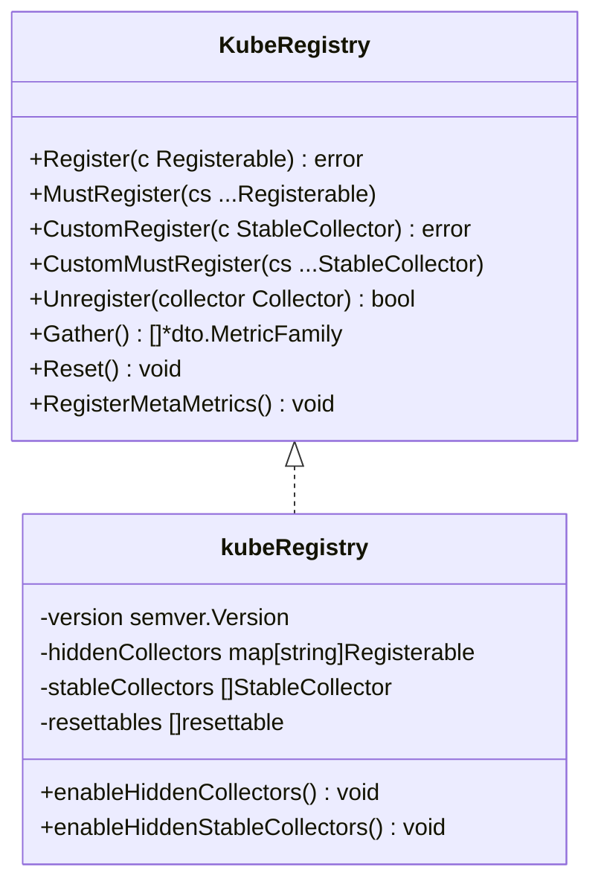
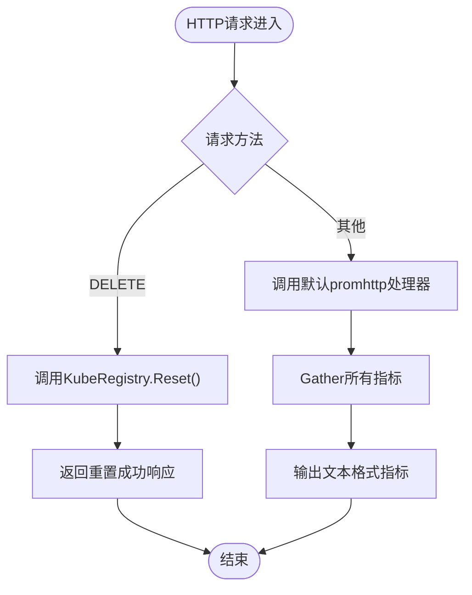
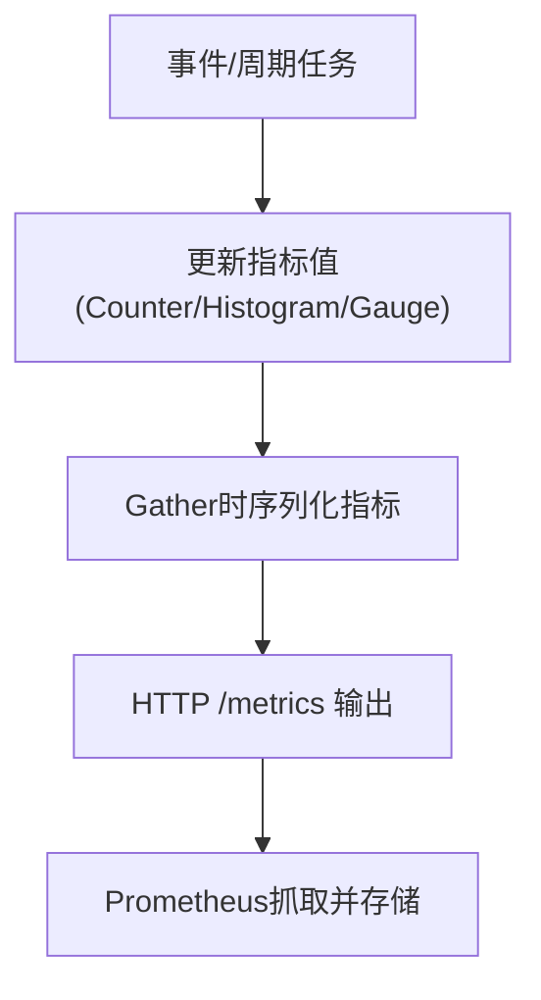
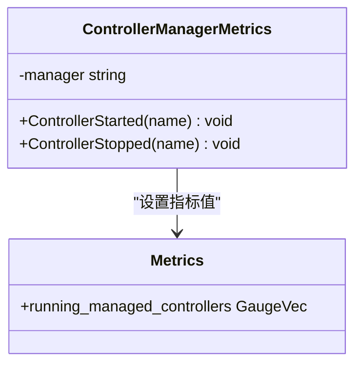
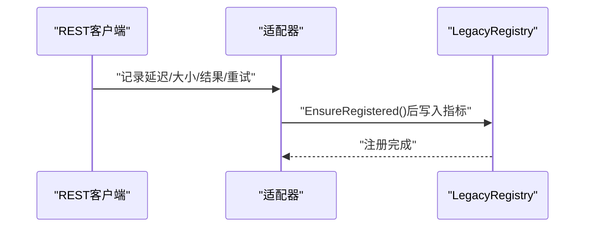
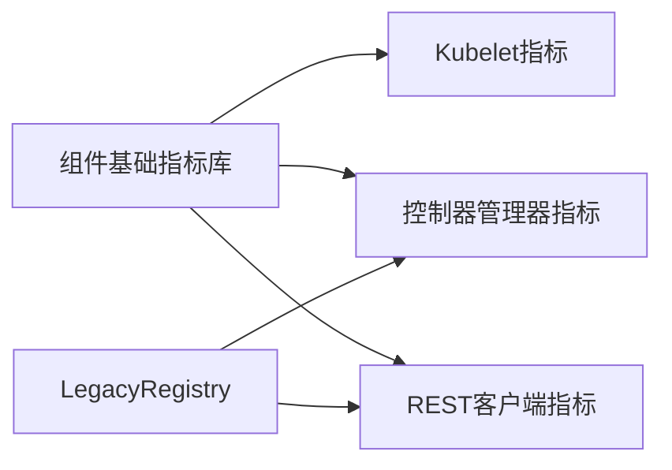

# 指标监控

<cite>
**本文引用的文件**   
- [registry.go](file://staging/src/k8s.io/component-base/metrics/registry.go)
- [http.go](file://staging/src/k8s.io/component-base/metrics/http.go)
- [metrics.go](file://pkg/kubelet/metrics/metrics.go)
- [metrics.go](file://staging/src/k8s.io/component-base/metrics/prometheus/controllers/metrics.go)
- [metrics.go](file://staging/src/k8s.io/component-base/metrics/prometheus/restclient/metrics.go)
</cite>

## 目录
1. [简介](#简介)
2. [项目结构](#项目结构)
3. [核心组件](#核心组件)
4. [架构总览](#架构总览)
5. [详细组件分析](#详细组件分析)
6. [依赖关系分析](#依赖关系分析)
7. [性能考量](#性能考量)
8. [故障排查指南](#故障排查指南)
9. [结论](#结论)
10. [附录](#附录)

## 简介
本文件面向Kubernetes指标监控系统，聚焦Prometheus指标收集机制与自定义指标注册方法，系统梳理关键组件（API Server、Controller Manager、Scheduler、Kubelet等）的核心监控指标，说明指标命名规范、标签使用最佳实践、采集频率与数据持久化策略，并给出HTTP端点配置、批量采集优化建议、Grafana仪表板配置示例及常用查询语句。文档内容基于仓库中组件基础指标库与Kubelet指标实现进行技术级解读。

## 项目结构
围绕指标监控的关键代码主要分布在以下位置：
- 组件基础指标库：staging/src/k8s.io/component-base/metrics
  - 注册表、HTTP导出、版本与稳定性控制、LegacyRegistry集成等
- Kubelet指标定义与采集：pkg/kubelet/metrics
  - 大量以kubelet为子系统的指标定义与桶边界、标签维度设计
- 控制器管理器通用指标：staging/src/k8s.io/component-base/metrics/prometheus/controllers
  - 控制器实例运行状态指标
- REST客户端指标：staging/src/k8s.io/component-base/metrics/prometheus/restclient
  - 将client-go的指标接口适配到Prometheus度量

图表来源
- [registry.go:1-367](file://staging/src/k8s.io/component-base/metrics/registry.go#L1-L367)
- [http.go:1-88](file://staging/src/k8s.io/component-base/metrics/http.go#L1-L88)
- [metrics.go](file://pkg/kubelet/metrics/metrics.go)
- [metrics.go:1-69](file://staging/src/k8s.io/component-base/metrics/prometheus/controllers/metrics.go#L1-L69)
- [metrics.go:1-391](file://staging/src/k8s.io/component-base/metrics/prometheus/restclient/metrics.go#L1-L391)

章节来源
- [registry.go:1-367](file://staging/src/k8s.io/component-base/metrics/registry.go#L1-L367)
- [http.go:1-88](file://staging/src/k8s.io/component-base/metrics/http.go#L1-L88)
- [metrics.go](file://pkg/kubelet/metrics/metrics.go)
- [metrics.go:1-69](file://staging/src/k8s.io/component-base/metrics/prometheus/controllers/metrics.go#L1-L69)
- [metrics.go:1-391](file://staging/src/k8s.io/component-base/metrics/prometheus/restclient/metrics.go#L1-L391)

## 核心组件
- 指标注册表与生命周期管理
  - 提供KubeRegistry封装，支持按版本与稳定性级别隐藏/启用指标，统一Reset能力，以及元指标统计。
- HTTP导出器
  - 基于promhttp.HandlerFor包装，支持错误处理策略与可选的Reset端点。
- Kubelet指标子系统
  - 集中定义kubelet相关指标名称、标签与直方图桶边界，覆盖Pod启动、PLEG、运行时操作、驱逐、设备插件、资源管理等。
- 控制器管理器指标
  - 暴露控制器实例运行状态，便于观测控制器健康与并发度。
- REST客户端指标
  - 将client-go工具层指标桥接到Prometheus，涵盖请求延迟、大小、重试、传输缓存、证书轮换等。

章节来源
- [registry.go:1-367](file://staging/src/k8s.io/component-base/metrics/registry.go#L1-L367)
- [http.go:1-88](file://staging/src/k8s.io/component-base/metrics/http.go#L1-L88)
- [metrics.go](file://pkg/kubelet/metrics/metrics.go)
- [metrics.go:1-69](file://staging/src/k8s.io/component-base/metrics/prometheus/controllers/metrics.go#L1-L69)
- [metrics.go:1-391](file://staging/src/k8s.io/component-base/metrics/prometheus/restclient/metrics.go#L1-L391)

## 架构总览
下图展示从组件内部指标定义到Prometheus抓取的整体流程，包括注册、导出与采集。

图表来源
- [registry.go:150-367](file://staging/src/k8s.io/component-base/metrics/registry.go#L150-L367)
- [http.go:60-88](file://staging/src/k8s.io/component-base/metrics/http.go#L60-L88)

## 详细组件分析

### 指标注册表与版本/稳定性控制
- 功能要点
  - 通过Register/MustRegister/CastomRegister等接口注册指标，并在创建时依据当前二进制版本与指标声明的弃用版本计算是否隐藏。
  - 维护隐藏收集器列表与稳定收集器列表，支持在需要时重新启用。
  - 提供Reset能力，对实现resettable接口的指标进行重置。
  - 注册元指标，用于跟踪已注册、禁用、隐藏的指标数量。
- 复杂度与性能
  - 注册路径包含版本解析与锁保护，整体为O(n)遍历注册；Gather直接委托底层Prometheus Gatherer，开销主要由指标自身Collect实现决定。
- 错误处理
  - 注册失败返回错误；Must系列在首次错误时panic；隐藏逻辑避免重复注册导致的不一致。

图表来源
- [registry.go:118-367](file://staging/src/k8s.io/component-base/metrics/registry.go#L118-L367)

章节来源
- [registry.go:1-367](file://staging/src/k8s.io/component-base/metrics/registry.go#L1-L367)

### HTTP导出器与端点配置
- 功能要点
  - 提供HandlerFor用于生成未加额外计量的HTTP处理器，支持错误处理策略（遇到错误即停、尽力继续、或panic）。
  - 提供HandlerWithReset，在DELETE请求时触发指标重置，便于测试与调试。
  - 自动注入进程启动时间，便于计算uptime类指标。
- 采集频率与持久化
  - 导出器本身不决定采集频率；由Prometheus scrape_interval控制拉取周期。
  - 数据持久化由Prometheus TSDB负责，非导出器职责。

图表来源
- [http.go:57-88](file://staging/src/k8s.io/component-base/metrics/http.go#L57-L88)

章节来源
- [http.go:1-88](file://staging/src/k8s.io/component-base/metrics/http.go#L1-L88)

### Kubelet指标体系
- 指标范围
  - Pod生命周期：启动时长、SLI时长、总时长、工作器同步耗时、状态同步耗时等。
  - PLEG：重列举耗时、丢弃事件计数、连接错误/成功/延迟等。
  - 运行时操作：远程运行时操作次数、耗时、错误数；设备插件注册与分配耗时；PodResource端点请求与错误。
  - 驱逐与抢占：按信号维度的累计次数与统计年龄分布。
  - 容器与镜像：启动/终止计数、错误分类、镜像垃圾回收计数等。
  - 资源管理：CPU/内存/拓扑管理器相关请求、错误、分配计数；内存QoS阈值等。
  - DRA操作：操作与gRPC操作耗时分布。
  - 其它：节点名、每Pod容器数、Cgroup版本、用户态命名空间Pod、HostProcess容器等。
- 标签与命名规范
  - 采用“子系统_指标名”形式，如kubelet_*；标签键多为语义明确的英文小写下划线，如operation_type、eviction_signal、container_state等。
  - 直方图桶边界针对业务场景定制，例如Pod启动时长、镜像拉取时长、DRA操作耗时等。
- 采集频率
  - 指标值更新由Kubelet内部事件驱动与周期性任务触发；Prometheus拉取间隔由scrape_interval控制。
- 数据持久化
  - 由Prometheus TSDB持久化，Kubelet仅负责暴露最新值。

图表来源
- [metrics.go](file://pkg/kubelet/metrics/metrics.go)

章节来源
- [metrics.go](file://pkg/kubelet/metrics/metrics.go)

### 控制器管理器指标
- 指标含义
  - running_managed_controllers：指示某控制器实例当前是否正在运行，标签包含name与manager。
- 使用方式
  - 通过NewControllerManagerMetrics(manager)创建实例，在控制器启动/停止时设置值为1/0，避免重复计数。
- 注册机制
  - 使用once.Do确保只注册一次，并通过legacyregistry.MustRegister完成注册。

图表来源
- [metrics.go:1-69](file://staging/src/k8s.io/component-base/metrics/prometheus/controllers/metrics.go#L1-L69)

章节来源
- [metrics.go:1-69](file://staging/src/k8s.io/component-base/metrics/prometheus/controllers/metrics.go#L1-L69)

### REST客户端指标
- 指标范围
  - 请求延迟、DNS解析延迟、请求/响应大小、速率限制延迟、请求结果与重试计数。
  - exec插件调用与策略匹配计数、证书TTL与旋转年龄。
  - 传输层缓存条目、创建调用、CA重载、GC清理等。
- 适配机制
  - 通过适配器将client-go/tools/metrics接口映射到Prometheus指标，并在首次构造RESTClient时完成注册。
- 标签维度
  - verb、host、code、method等，便于按方法与目标主机进行细分分析。

图表来源
- [metrics.go:1-391](file://staging/src/k8s.io/component-base/metrics/prometheus/restclient/metrics.go#L1-L391)

章节来源
- [metrics.go:1-391](file://staging/src/k8s.io/component-base/metrics/prometheus/restclient/metrics.go#L1-L391)

## 依赖关系分析
- 组件基础指标库被各组件广泛引用，作为统一的指标定义与注册入口。
- Kubelet指标直接依赖组件基础指标库，遵循其命名与稳定性约定。
- 控制器管理器与REST客户端指标通过legacyregistry完成注册，保证与现有组件初始化流程兼容。

图表来源
- [registry.go:1-367](file://staging/src/k8s.io/component-base/metrics/registry.go#L1-L367)
- [metrics.go](file://pkg/kubelet/metrics/metrics.go)
- [metrics.go:1-69](file://staging/src/k8s.io/component-base/metrics/prometheus/controllers/metrics.go#L1-L69)
- [metrics.go:1-391](file://staging/src/k8s.io/component-base/metrics/prometheus/restclient/metrics.go#L1-L391)

章节来源
- [registry.go:1-367](file://staging/src/k8s.io/component-base/metrics/registry.go#L1-L367)
- [metrics.go](file://pkg/kubelet/metrics/metrics.go)
- [metrics.go:1-69](file://staging/src/k8s.io/component-base/metrics/prometheus/controllers/metrics.go#L1-L69)
- [metrics.go:1-391](file://staging/src/k8s.io/component-base/metrics/prometheus/restclient/metrics.go#L1-L391)

## 性能考量
- 指标类型选择
  - 计数器适合累计事件（如请求总数、错误数），直方图适合延迟与大小分布，仪表盘适合瞬时状态（如缓存条目数）。
- 标签基数控制
  - 避免高基数字段（如pod name、UID）作为标签，优先使用低基数字段（如verb、host、operation_type、eviction_signal）。
- 直方图桶设计
  - 针对业务SLO选择合适的桶边界，减少不必要的细粒度桶以降低内存占用与查询成本。
- 采集频率与批量化
  - 合理设置Prometheus scrape_interval，避免过短导致服务端压力过大；必要时合并多个指标源或使用远端写入。
- 导出器错误处理
  - 在生产环境建议使用ContinueOnError策略，配合错误计数指标进行告警，避免单次错误阻断整个指标集。

[本节为通用指导，无需源码引用]

## 故障排查指南
- 指标缺失或隐藏
  - 检查指标稳定性级别与当前版本的弃用窗口，确认是否因版本演进被隐藏；可通过重新启用机制验证。
- HTTP导出异常
  - 检查HandlerOpts的错误处理策略与日志；若使用Reset端点，确认仅用于测试环境。
- 指标基数爆炸
  - 审查标签维度，移除高基数字段；必要时改用摘要或聚合视图。
- 延迟与吞吐问题
  - 关注REST客户端延迟与重试指标，结合host与verb维度定位瓶颈；检查传输缓存与CA重载情况。

章节来源
- [registry.go:1-367](file://staging/src/k8s.io/component-base/metrics/registry.go#L1-L367)
- [http.go:1-88](file://staging/src/k8s.io/component-base/metrics/http.go#L1-L88)
- [metrics.go:1-391](file://staging/src/k8s.io/component-base/metrics/prometheus/restclient/metrics.go#L1-L391)

## 结论
Kubernetes的指标体系以组件基础指标库为核心，统一了指标注册、版本与稳定性控制、HTTP导出与重置能力。Kubelet、控制器管理器与REST客户端在此基础上提供了丰富的监控视角。通过合理的命名规范、标签设计与桶边界，结合Prometheus的抓取与持久化策略，可构建高效、可扩展的监控体系。生产环境中应重视指标基数控制、错误处理策略与采集频率调优，以确保监控系统的稳定性与可观测性。

[本节为总结性内容，无需源码引用]

## 附录

### 指标命名规范与标签最佳实践
- 命名规范
  - 采用“子系统_指标名”形式，如kubelet_*；指标名使用小写英文与下划线，避免特殊字符。
- 标签使用
  - 优先使用低基数字段（如verb、host、operation_type、eviction_signal、container_state）；避免将唯一标识（如pod UID）作为标签。
- 稳定性与弃用
  - 通过稳定性级别与弃用版本控制指标的可见性，确保向后兼容与平滑迁移。

章节来源
- [registry.go:1-367](file://staging/src/k8s.io/component-base/metrics/registry.go#L1-L367)
- [metrics.go](file://pkg/kubelet/metrics/metrics.go)

### 指标导出格式与HTTP端点配置
- 导出格式
  - Prometheus文本格式，包含指标名、标签与值。
- 端点配置
  - 使用HandlerFor生成HTTP处理器，挂载至组件的HTTP服务；可按需启用Reset端点用于测试。
- 错误处理策略
  - 推荐ContinueOnError，配合错误计数指标进行告警。

章节来源
- [http.go:57-88](file://staging/src/k8s.io/component-base/metrics/http.go#L57-L88)

### 批量采集优化建议
- 合并多个指标源
  - 在同一进程中聚合多个Gatherer，减少HTTP连接开销。
- 调整scrape_interval
  - 根据集群规模与指标量级调整抓取间隔，平衡实时性与负载。
- 使用远端写入
  - 对于大规模集群，考虑将指标远端写入长期存储，减轻本地Prometheus压力。

[本节为通用指导，无需源码引用]

### Grafana仪表板配置示例与常用查询语句
- 仪表板面板建议
  - 控制器实例运行状态：按name与manager维度展示running_managed_controllers。
  - REST客户端延迟：按verb与host维度展示rest_client_request_duration_seconds的分位数。
  - Kubelet Pod启动延迟：展示pod_start_sli_duration_seconds与pod_start_total_duration_seconds的分位数。
- 常用查询示例
  - 控制器实例运行状态：
    - sum by (name, manager) (rate(running_managed_controllers{manager="xxx"}[5m]))
  - REST客户端请求延迟P99：
    - histogram_quantile(0.99, sum by (le, verb, host) (rate(rest_client_request_duration_seconds_bucket{verb=~"GET|LIST|WATCH", host=~"api-server.*"}[5m])))
  - Kubelet Pod启动SLI延迟P95：
    - histogram_quantile(0.95, sum by (le) (rate(kubelet_pod_start_sli_duration_seconds_bucket[5m])))
  - 驱逐事件速率：
    - sum by (eviction_signal) (rate(kubelet_evictions[5m]))

[本节为概念性示例，无需源码引用]