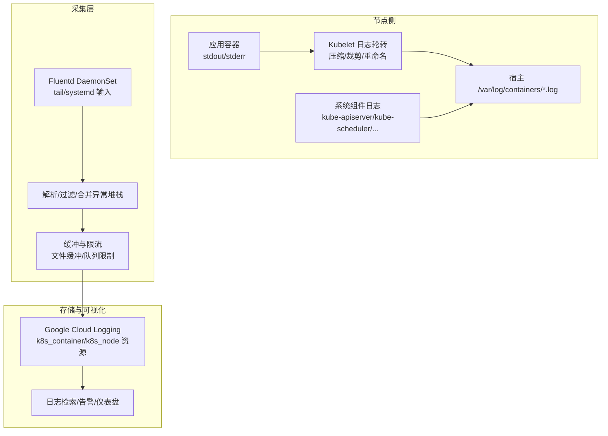
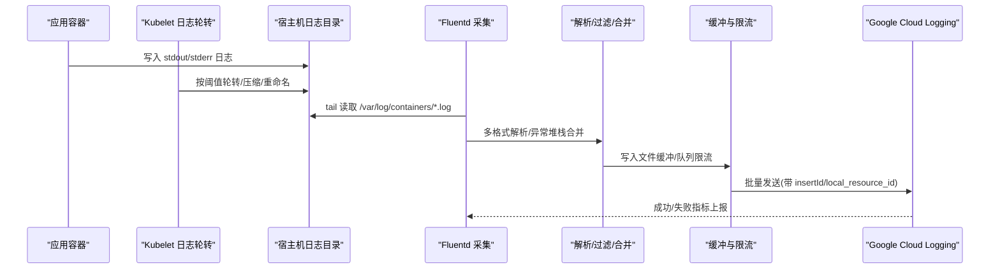
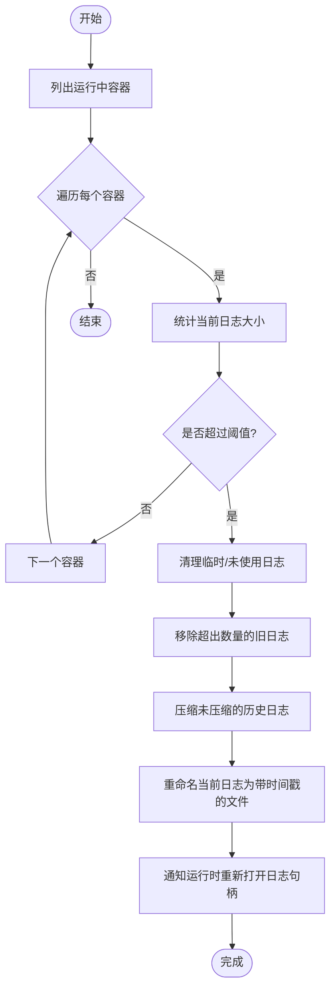
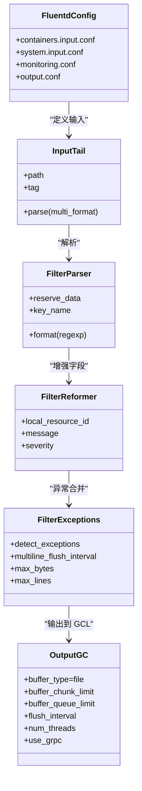
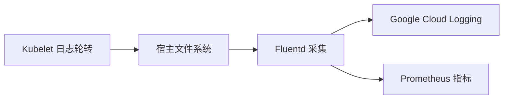

# 日志管理

<cite>
**本文引用的文件**   
- [fluentd-gcp-configmap.yaml](file://cluster/addons/fluentd-gcp/fluentd-gcp-configmap.yaml)
- [fluentd-gcp-ds.yaml](file://cluster/addons/fluentd-gcp/fluentd-gcp-ds.yaml)
- [fluentd-gcp-configmap-old.yaml](file://cluster/addons/fluentd-gcp/fluentd-gcp-configmap-old.yaml)
- [container_log_manager.go](file://pkg/kubelet/logs/container_log_manager.go)
- [README.md](file://cluster/log-dump/README.md)
</cite>

## 目录
1. [简介](#简介)
2. [项目结构](#项目结构)
3. [核心组件](#核心组件)
4. [架构总览](#架构总览)
5. [详细组件分析](#详细组件分析)
6. [依赖关系分析](#依赖关系分析)
7. [性能考虑](#性能考虑)
8. [故障排查指南](#故障排查指南)
9. [结论](#结论)
10. [附录](#附录)

## 简介
本技术文档面向在 Kubernetes 集群中构建企业级日志管理体系的工程师，围绕结构化日志规范、日志级别配置、日志收集器（Fluentd/Fluent Bit）部署与配置、日志轮转策略、存储后端与保留策略、集群与应用日志聚合、索引与搜索、可视化展示以及安全与访问控制等方面提供系统化指导。文档同时结合仓库内现有实现（Kubelet 容器日志轮转、Fluentd GCP 插件采集与输出）给出可落地的参考方案与最佳实践。

## 项目结构
仓库中与日志相关的关键位置包括：
- Kubelet 侧容器日志轮转实现：pkg/kubelet/logs
- Fluentd GCP 插件采集与输出配置：cluster/addons/fluentd-gcp
- 日志导出工具说明（已迁移至 test-infra）：cluster/log-dump

图表来源
- [fluentd-gcp-configmap.yaml:55-120](file://cluster/addons/fluentd-gcp/fluentd-gcp-configmap.yaml#L55-L120)
- [fluentd-gcp-configmap.yaml:324-452](file://cluster/addons/fluentd-gcp/fluentd-gcp-configmap.yaml#L324-L452)
- [fluentd-gcp-ds.yaml:29-99](file://cluster/addons/fluentd-gcp/fluentd-gcp-ds.yaml#L29-L99)
- [container_log_manager.go:193-305](file://pkg/kubelet/logs/container_log_manager.go#L193-L305)

章节来源
- [fluentd-gcp-configmap.yaml:1-458](file://cluster/addons/fluentd-gcp/fluentd-gcp-configmap.yaml#L1-L458)
- [fluentd-gcp-ds.yaml:1-118](file://cluster/addons/fluentd-gcp/fluentd-gcp-ds.yaml#L1-L118)
- [container_log_manager.go:1-437](file://pkg/kubelet/logs/container_log_manager.go#L1-L437)
- [README.md:1-20](file://cluster/log-dump/README.md#L1-L20)

## 核心组件
- Kubelet 容器日志轮转管理器
  - 负责运行中容器的日志大小阈值检测、旧日志清理、压缩归档、最新日志重命名与句柄重建，避免中断写入与读取。
- Fluentd 采集与输出
  - 通过 tail/systemd 输入源采集容器与系统组件日志；使用多格式解析、异常堆栈合并、记录转换、缓冲与重试机制，最终输出到 Google Cloud Logging。
- 资源类型与标签体系
  - 新资源类型 k8s_container/k8s_node 配合 local_resource_id 字段进行资源关联；旧资源类型 gke_container/gce_instance 兼容模式亦提供对应配置。

章节来源
- [container_log_manager.go:52-141](file://pkg/kubelet/logs/container_log_manager.go#L52-L141)
- [fluentd-gcp-configmap.yaml:55-120](file://cluster/addons/fluentd-gcp/fluentd-gcp-configmap.yaml#L55-L120)
- [fluentd-gcp-configmap.yaml:417-452](file://cluster/addons/fluentd-gcp/fluentd-gcp-configmap.yaml#L417-L452)
- [fluentd-gcp-configmap-old.yaml:1-105](file://cluster/addons/fluentd-gcp/fluentd-gcp-configmap-old.yaml#L1-L105)

## 架构总览
下图展示了从容器/系统组件产生日志，经 Kubelet 轮转后由 Fluentd 采集、处理并持久化到云端日志服务的端到端流程。

图表来源
- [container_log_manager.go:193-305](file://pkg/kubelet/logs/container_log_manager.go#L193-L305)
- [fluentd-gcp-configmap.yaml:55-120](file://cluster/addons/fluentd-gcp/fluentd-gcp-configmap.yaml#L55-L120)
- [fluentd-gcp-configmap.yaml:324-452](file://cluster/addons/fluentd-gcp/fluentd-gcp-configmap.yaml#L324-L452)

## 详细组件分析

### Kubelet 容器日志轮转
- 关键职责
  - 周期性扫描运行中容器，判断是否超过最大尺寸阈值；若超过则执行轮转。
  - 清理临时/未使用文件，移除过期历史文件，对历史文件进行 gzip 压缩。
  - 重命名当前日志文件并通知运行时重新打开句柄，保证写入不中断。
- 参数与策略
  - 最大文件大小、最大保留文件数、工作协程数、监控周期等。
- 复杂度与性能
  - 基于文件系统遍历与排序，时间复杂度近似 O(n log n)，n 为单容器历史日志数量；压缩与重命名操作受磁盘 IO 影响较大。
- 错误处理
  - 针对文件不存在、状态获取失败、重命名失败等情况进行回滚或重试提示。

图表来源
- [container_log_manager.go:193-305](file://pkg/kubelet/logs/container_log_manager.go#L193-L305)
- [container_log_manager.go:307-412](file://pkg/kubelet/logs/container_log_manager.go#L307-L412)
- [container_log_manager.go:414-436](file://pkg/kubelet/logs/container_log_manager.go#L414-L436)

章节来源
- [container_log_manager.go:52-141](file://pkg/kubelet/logs/container_log_manager.go#L52-L141)
- [container_log_manager.go:193-305](file://pkg/kubelet/logs/container_log_manager.go#L193-L305)
- [container_log_manager.go:307-412](file://pkg/kubelet/logs/container_log_manager.go#L307-L412)
- [container_log_manager.go:414-436](file://pkg/kubelet/logs/container_log_manager.go#L414-L436)

### Fluentd 采集与输出（GCP 插件）
- 输入源
  - 容器日志：tail 读取 /var/log/containers/*.log，支持 JSON 与 CRI 标准格式。
  - 系统组件日志：tail/systemd 读取 kube-apiserver、kube-scheduler、kube-controller-manager、etcd、docker/container-runtime 等。
- 解析与增强
  - 多格式解析、正则提取 severity/time/pid/source/message；异常堆栈合并；将 log 重命名为 message；根据 stream 推断 severity。
  - 为 k8s_container 与 k8s_node 设置 logging.googleapis.com/local_resource_id。
- 缓冲与可靠性
  - 文件缓冲、队列限制、分片大小、flush 间隔、重试退避、线程并行；对超长消息进行裁剪以避免丢弃。
- 输出目标
  - google_cloud 插件输出到 Google Cloud Logging，区分容器与节点两类资源路径。

图表来源
- [fluentd-gcp-configmap.yaml:55-120](file://cluster/addons/fluentd-gcp/fluentd-gcp-configmap.yaml#L55-L120)
- [fluentd-gcp-configmap.yaml:324-452](file://cluster/addons/fluentd-gcp/fluentd-gcp-configmap.yaml#L324-L452)

章节来源
- [fluentd-gcp-configmap.yaml:55-120](file://cluster/addons/fluentd-gcp/fluentd-gcp-configmap.yaml#L55-L120)
- [fluentd-gcp-configmap.yaml:324-452](file://cluster/addons/fluentd-gcp/fluentd-gcp-configmap.yaml#L324-L452)
- [fluentd-gcp-configmap-old.yaml:106-287](file://cluster/addons/fluentd-gcp/fluentd-gcp-configmap-old.yaml#L106-L287)
- [fluentd-gcp-configmap-old.yaml:309-412](file://cluster/addons/fluentd-gcp/fluentd-gcp-configmap-old.yaml#L309-L412)

### Fluentd DaemonSet 部署
- 以 DaemonSet 形式在每个节点运行，挂载宿主 /var/log 与容器日志目录，注入 NODE_NAME 环境变量，暴露本地 Prometheus 指标并通过 prometheus-to-sd-exporter 上报。
- 健康检查：基于缓冲目录更新频率判定是否卡死，必要时重启以恢复。

章节来源
- [fluentd-gcp-ds.yaml:1-118](file://cluster/addons/fluentd-gcp/fluentd-gcp-ds.yaml#L1-L118)

### 日志导出工具（已迁移）
- 原仓库中的 log-dump 脚本已迁移至 test-infra，建议在测试环境中采用新的日志导出机制。

章节来源
- [README.md:1-20](file://cluster/log-dump/README.md#L1-L20)

## 依赖关系分析
- 组件耦合
  - Kubelet 与运行时服务交互（ListContainers/ContainerStatus/ReopenContainerLog），与文件系统交互（Stat/Glob/Rename/Remove）。
  - Fluentd 与宿主文件系统交互（tail/systemd），与 Google Cloud Logging 通过 gRPC 输出。
- 外部依赖
  - Google Cloud Logging 插件与配额/大小限制；Prometheus 指标采集与上报。
- 潜在循环与风险
  - 需避免采集自身日志导致环路（已在匹配 fluent.** 时丢弃）。
  - 大日志条目可能导致缓冲膨胀，需合理设置 buffer_chunk_limit 与 queue_limit。

图表来源
- [container_log_manager.go:193-305](file://pkg/kubelet/logs/container_log_manager.go#L193-L305)
- [fluentd-gcp-configmap.yaml:324-452](file://cluster/addons/fluentd-gcp/fluentd-gcp-configmap.yaml#L324-L452)

章节来源
- [container_log_manager.go:193-305](file://pkg/kubelet/logs/container_log_manager.go#L193-L305)
- [fluentd-gcp-configmap.yaml:324-452](file://cluster/addons/fluentd-gcp/fluentd-gcp-configmap.yaml#L324-L452)

## 性能考虑
- 日志轮转
  - 合理设置 MaxSize 与 MaxFiles，避免频繁压缩与过多历史文件造成 IO 抖动。
  - 调整 worker 数量与监控周期，平衡 CPU 与吞吐。
- Fluentd 缓冲与批处理
  - 文件缓冲降低内存压力；合理设置 chunk 与 queue 限制，避免 OOM。
  - flush_interval 与 num_threads 调优以提升吞吐；use_grpc 提升网络效率。
- 长日志处理
  - 对超长消息进行裁剪，避免超过后端限制导致丢弃。
- 指标观测
  - 关注 logging_entry_count、successful/failed requests、ingested/dropped entries 等指标，及时发现瓶颈。

[本节为通用建议，无需特定文件引用]

## 故障排查指南
- 常见问题定位
  - 日志未采集：检查宿主目录挂载、tail 路径与 pos_file、Fluentd 健康检查与缓冲目录更新。
  - 日志丢失：确认 buffer 队列已满时的 action 与重试策略；观察 dropped entries 指标。
  - 轮转失败：查看 Kubelet 日志中关于重命名/句柄重建的错误信息。
- 快速验证步骤
  - 确认 /var/log/containers/*.log 存在且被 tail 读取。
  - 检查 Fluentd 缓冲目录是否有新文件生成。
  - 在 GCL 控制台检索 local_resource_id 对应的 k8s_container/k8s_node 资源。

章节来源
- [fluentd-gcp-ds.yaml:55-79](file://cluster/addons/fluentd-gcp/fluentd-gcp-ds.yaml#L55-L79)
- [fluentd-gcp-configmap.yaml:324-452](file://cluster/addons/fluentd-gcp/fluentd-gcp-configmap.yaml#L324-L452)
- [container_log_manager.go:414-436](file://pkg/kubelet/logs/container_log_manager.go#L414-L436)

## 结论
通过 Kubelet 的健壮日志轮转与 Fluentd 的高可靠采集输出，可在 Kubernetes 集群中构建稳定高效的日志管道。结合合理的缓冲与批处理策略、完善的指标观测与故障自愈机制，能够保障大规模集群下日志系统的可用性与性能。后续可根据业务需求引入 Fluent Bit 作为轻量替代或补充，并在上层建立统一的索引、查询与可视化能力。

[本节为总结性内容，无需特定文件引用]

## 附录

### 结构化日志格式规范与级别配置
- 推荐字段
  - time：ISO 8601 时间戳
  - level/severity：I/E/W/F 或 INFO/ERROR/WARN/FATAL
  - msg/message：日志正文
  - stream：stdout/stderr
  - service/component：组件名
  - trace/span：链路追踪标识（可选）
- 级别映射
  - 当未显式设置 severity 时，stderr 默认 ERROR，stdout 默认 INFO。
- 示例参考
  - JSON 与 CRI 标准行格式均在采集配置中支持解析。

章节来源
- [fluentd-gcp-configmap.yaml:55-120](file://cluster/addons/fluentd-gcp/fluentd-gcp-configmap.yaml#L55-L120)

### 日志收集器部署与配置（Fluentd/Fluent Bit）
- Fluentd
  - 使用 DaemonSet 部署，挂载宿主日志目录，配置 tail/systemd 输入与 google_cloud 输出。
  - 启用文件缓冲与重试，设置合理的 flush 间隔与线程数。
- Fluent Bit（概念性建议）
  - 可作为轻量采集器部署于节点侧，支持多种输入（tail/journald）、过滤器（parser/json_filter）与输出（cloud logging/http/s3）。
  - 适合低资源环境或对延迟敏感的场景。

章节来源
- [fluentd-gcp-ds.yaml:1-118](file://cluster/addons/fluentd-gcp/fluentd-gcp-ds.yaml#L1-L118)
- [fluentd-gcp-configmap.yaml:324-452](file://cluster/addons/fluentd-gcp/fluentd-gcp-configmap.yaml#L324-L452)

### 日志轮转策略与保留政策
- 轮转策略
  - 基于大小阈值触发，历史文件按时间戳命名并压缩，保留固定数量。
- 保留政策
  - 结合业务合规要求设定保留天数与空间上限；对冷数据可下沉至对象存储。

章节来源
- [container_log_manager.go:193-305](file://pkg/kubelet/logs/container_log_manager.go#L193-L305)
- [container_log_manager.go:307-412](file://pkg/kubelet/logs/container_log_manager.go#L307-L412)

### 存储后端与索引/搜索/可视化
- 存储后端
  - Google Cloud Logging 作为统一后端，支持结构化字段检索、告警与仪表板。
- 索引与搜索
  - 利用 local_resource_id、service/component、level 等字段建立筛选条件；结合时间范围与关键字组合查询。
- 可视化
  - 通过云平台的日志控制台或对接 BI/可视化平台进行趋势分析与告警。

章节来源
- [fluentd-gcp-configmap.yaml:417-452](file://cluster/addons/fluentd-gcp/fluentd-gcp-configmap.yaml#L417-L452)

### 安全与访问控制
- 敏感信息脱敏
  - 在采集前或输出前增加过滤器，对 token、密码、密钥等字段进行掩码或丢弃。
- 传输与存储加密
  - 使用 gRPC 与 TLS 通道；确保云平台侧开启静态加密与最小权限原则。
- 访问控制
  - 仅授予必要角色与资源访问权限；审计日志访问与导出操作。

[本节为通用建议，无需特定文件引用]