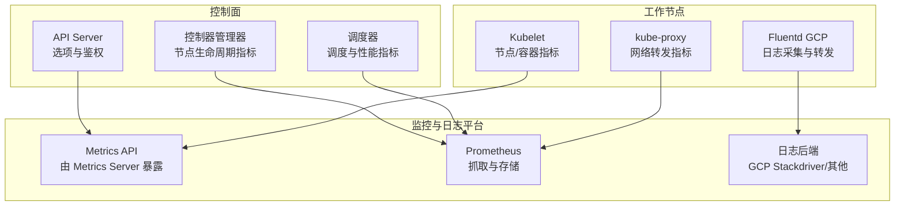
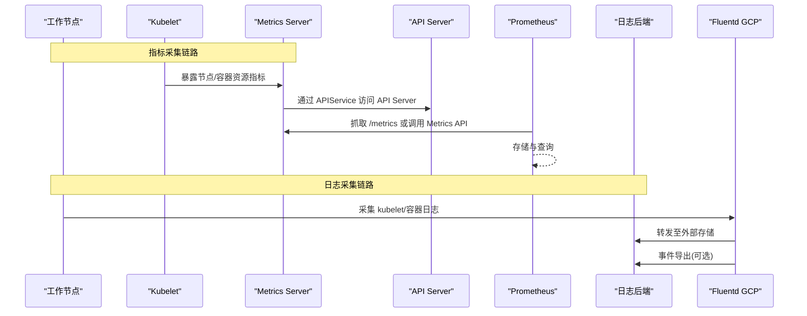
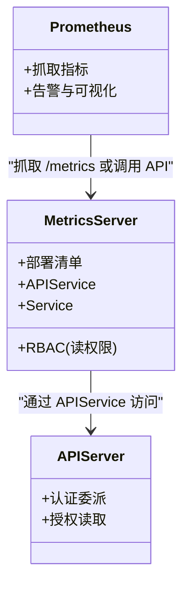
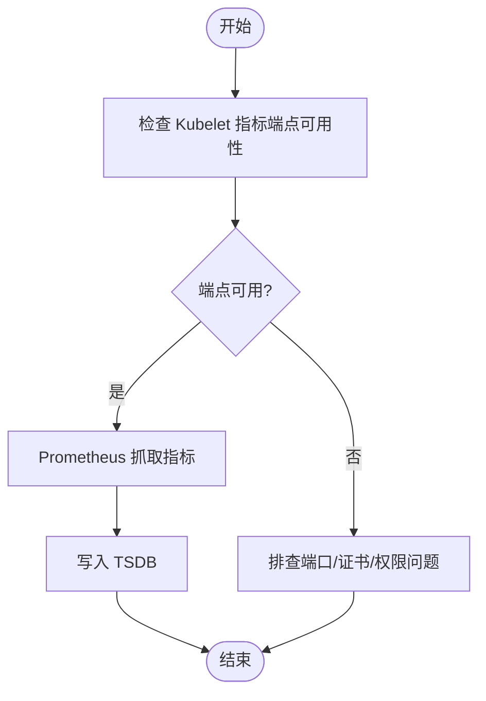
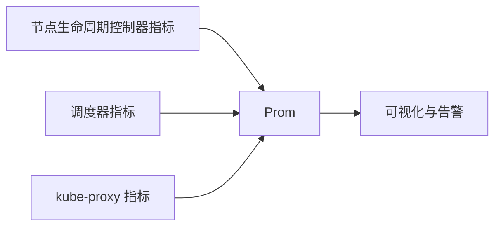
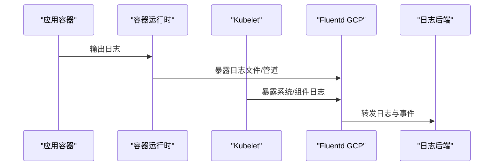
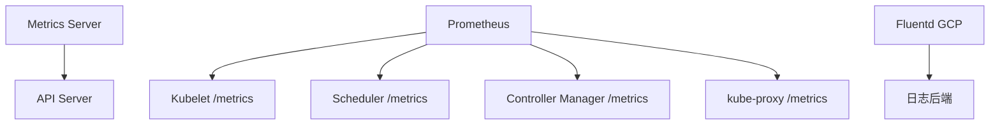

# 监控与可观测性

<cite>
**本文引用的文件**   
- [README.md](file://cluster/addons/metrics-server/README.md)
- [metrics.go](file://pkg/kubelet/metrics/metrics.go)
- [options.go](file://cmd/kube-apiserver/app/options/options.go)
- [validation.go](file://cmd/kube-apiserver/app/options/validation.go)
- [metrics.go](file://pkg/controller/nodelifecycle/metrics.go)
- [metrics.go](file://pkg/scheduler/metrics/metrics.go)
- [metric_recorder.go](file://pkg/scheduler/metrics/metric_recorder.go)
- [profile_metrics.go](file://pkg/scheduler/metrics/profile_metrics.go)
- [metrics.go](file://pkg/proxy/metrics/metrics.go)
- [fluentd-gcp-ds.yaml](file://cluster/addons/fluentd-gcp/fluentd-gcp-ds.yaml)
- [fluentd-gcp-configmap.yaml](file://cluster/addons/fluentd-gcp/fluentd-gcp-configmap.yaml)
- [fluentd-gcp-ds-sa.yaml](file://cluster/addons/fluentd-gcp/fluentd-gcp-ds-sa.yaml)
- [event-exporter.yaml](file://cluster/addons/fluentd-gcp/event-exporter.yaml)
- [scaler-deployment.yaml](file://cluster/addons/fluentd-gcp/scaler-deployment.yaml)
- [scaler-policy.yaml](file://cluster/addons/fluentd-gcp/scaler-policy.yaml)
- [scaler-rbac.yaml](file://cluster/addons/fluentd-gcp/scaler-rbac.yaml)
- [metrics-server-deployment.yaml](file://cluster/addons/metrics-server/metrics-server-deployment.yaml)
- [metrics-apiservice.yaml](file://cluster/addons/metrics-server/metrics-apiservice.yaml)
- [metrics-server-service.yaml](file://cluster/addons/metrics-server/metrics-server-service.yaml)
- [auth-reader.yaml](file://cluster/addons/metrics-server/auth-reader.yaml)
- [auth-delegator.yaml](file://cluster/addons/metrics-server/auth-delegator.yaml)
- [resource-reader.yaml](file://cluster/addons/metrics-server/resource-reader.yaml)
</cite>

## 目录
1. [简介](#简介)
2. [项目结构](#项目结构)
3. [核心组件](#核心组件)
4. [架构总览](#架构总览)
5. [详细组件分析](#详细组件分析)
6. [依赖关系分析](#依赖关系分析)
7. [性能考量](#性能考量)
8. [故障诊断指南](#故障诊断指南)
9. [结论](#结论)
10. [附录](#附录)

## 简介
本文件面向在 Kubernetes 上构建“监控与可观测性”体系的技术读者，围绕指标采集、日志收集与聚合、分布式追踪集成、告警规则与通知机制、集群健康与应用性能监控、容量规划以及关键组件的指标含义与阈值设置方法展开。文档结合仓库中的官方 Addon 部署清单与核心组件的指标实现位置，提供从架构到落地的完整实践路径，并给出可视化图示帮助理解数据流与控制流。

## 项目结构
仓库中与监控与可观测性直接相关的资源主要分布在以下区域：
- cluster/addons/metrics-server：Metrics Server 的部署清单与服务暴露配置，用于将节点与 Pod 的资源使用指标通过 Metrics API 对外暴露。
- cluster/addons/fluentd-gcp：Fluentd GCP 日志采集 DaemonSet、ConfigMap、RBAC、事件导出器与扩缩容策略等，用于统一采集 kubelet、容器运行时与应用日志并输出至外部存储。
- pkg/kubelet/metrics：Kubelet 侧指标定义与注册点，是节点与容器维度指标的重要来源。
- cmd/kube-apiserver/app/options：API Server 的可观测性与安全相关选项（如认证委派、授权读取等），影响 Metrics Server 访问权限与鉴权链路。
- pkg/controller/nodelifecycle/metrics：节点生命周期控制器指标。
- pkg/scheduler/metrics：调度器指标与性能画像指标。
- pkg/proxy/metrics：代理层指标。

图表来源
- [metrics-server-deployment.yaml](file://cluster/addons/metrics-server/metrics-server-deployment.yaml)
- [metrics-apiservice.yaml](file://cluster/addons/metrics-server/metrics-apiservice.yaml)
- [metrics-server-service.yaml](file://cluster/addons/metrics-server/metrics-server-service.yaml)
- [auth-reader.yaml](file://cluster/addons/metrics-server/auth-reader.yaml)
- [auth-delegator.yaml](file://cluster/addons/metrics-server/auth-delegator.yaml)
- [metrics.go](file://pkg/kubelet/metrics/metrics.go)
- [metrics.go](file://pkg/controller/nodelifecycle/metrics.go)
- [metrics.go](file://pkg/scheduler/metrics/metrics.go)
- [metrics.go](file://pkg/proxy/metrics/metrics.go)
- [fluentd-gcp-ds.yaml](file://cluster/addons/fluentd-gcp/fluentd-gcp-ds.yaml)

章节来源
- [README.md](file://cluster/addons/metrics-server/README.md)
- [fluentd-gcp-ds.yaml](file://cluster/addons/fluentd-gcp/fluentd-gcp-ds.yaml)
- [fluentd-gcp-configmap.yaml](file://cluster/addons/fluentd-gcp/fluentd-gcp-configmap.yaml)
- [fluentd-gcp-ds-sa.yaml](file://cluster/addons/fluentd-gcp/fluentd-gcp-ds-sa.yaml)
- [event-exporter.yaml](file://cluster/addons/fluentd-gcp/event-exporter.yaml)
- [scaler-deployment.yaml](file://cluster/addons/fluentd-gcp/scaler-deployment.yaml)
- [scaler-policy.yaml](file://cluster/addons/fluentd-gcp/scaler-policy.yaml)
- [scaler-rbac.yaml](file://cluster/addons/fluentd-gcp/scaler-rbac.yaml)
- [metrics-server-deployment.yaml](file://cluster/addons/metrics-server/metrics-server-deployment.yaml)
- [metrics-apiservice.yaml](file://cluster/addons/metrics-server/metrics-apiservice.yaml)
- [metrics-server-service.yaml](file://cluster/addons/metrics-server/metrics-server-service.yaml)
- [auth-reader.yaml](file://cluster/addons/metrics-server/auth-reader.yaml)
- [auth-delegator.yaml](file://cluster/addons/metrics-server/auth-delegator.yaml)
- [resource-reader.yaml](file://cluster/addons/metrics-server/resource-reader.yaml)
- [metrics.go](file://pkg/kubelet/metrics/metrics.go)
- [metrics.go](file://pkg/controller/nodelifecycle/metrics.go)
- [metrics.go](file://pkg/scheduler/metrics/metrics.go)
- [metric_recorder.go](file://pkg/scheduler/metrics/metric_recorder.go)
- [profile_metrics.go](file://pkg/scheduler/metrics/profile_metrics.go)
- [metrics.go](file://pkg/proxy/metrics/metrics.go)
- [options.go](file://cmd/kube-apiserver/app/options/options.go)
- [validation.go](file://cmd/kube-apiserver/app/options/validation.go)

## 核心组件
- Metrics Server：以 API 服务形式暴露节点与 Pod 的 CPU/内存等资源指标，供 HPA、kubectl top 等消费。其部署清单包含 Deployment、Service、APIService 及 RBAC 绑定。
- Fluentd GCP：以 DaemonSet 方式在每个节点采集 kubelet、容器运行时与应用日志，支持事件导出与自动扩缩容策略。
- Kubelet 指标：节点与容器维度的运行指标，作为 Metrics Server 的数据源之一。
- 控制面组件指标：节点生命周期控制器、调度器、kube-proxy 等组件均暴露 Prometheus 兼容指标，便于集中抓取。
- API Server 选项：与认证委派、授权读取等相关的配置项，直接影响 Metrics Server 对 API Server 的访问能力。

章节来源
- [README.md](file://cluster/addons/metrics-server/README.md)
- [metrics-server-deployment.yaml](file://cluster/addons/metrics-server/metrics-server-deployment.yaml)
- [metrics-apiservice.yaml](file://cluster/addons/metrics-server/metrics-apiservice.yaml)
- [metrics-server-service.yaml](file://cluster/addons/metrics-server/metrics-server-service.yaml)
- [auth-reader.yaml](file://cluster/addons/metrics-server/auth-reader.yaml)
- [auth-delegator.yaml](file://cluster/addons/metrics-server/auth-delegator.yaml)
- [resource-reader.yaml](file://cluster/addons/metrics-server/resource-reader.yaml)
- [fluentd-gcp-ds.yaml](file://cluster/addons/fluentd-gcp/fluentd-gcp-ds.yaml)
- [fluentd-gcp-configmap.yaml](file://cluster/addons/fluentd-gcp/fluentd-gcp-configmap.yaml)
- [fluentd-gcp-ds-sa.yaml](file://cluster/addons/fluentd-gcp/fluentd-gcp-ds-sa.yaml)
- [event-exporter.yaml](file://cluster/addons/fluentd-gcp/event-exporter.yaml)
- [scaler-deployment.yaml](file://cluster/addons/fluentd-gcp/scaler-deployment.yaml)
- [scaler-policy.yaml](file://cluster/addons/fluentd-gcp/scaler-policy.yaml)
- [scaler-rbac.yaml](file://cluster/addons/fluentd-gcp/scaler-rbac.yaml)
- [metrics.go](file://pkg/kubelet/metrics/metrics.go)
- [metrics.go](file://pkg/controller/nodelifecycle/metrics.go)
- [metrics.go](file://pkg/scheduler/metrics/metrics.go)
- [metric_recorder.go](file://pkg/scheduler/metrics/metric_recorder.go)
- [profile_metrics.go](file://pkg/scheduler/metrics/profile_metrics.go)
- [metrics.go](file://pkg/proxy/metrics/metrics.go)
- [options.go](file://cmd/kube-apiserver/app/options/options.go)
- [validation.go](file://cmd/kube-apiserver/app/options/validation.go)

## 架构总览
下图展示了从数据采集、聚合到可视化的端到端流程，涵盖指标与日志两条主线，并体现控制面与工作节点的交互。

图表来源
- [metrics-server-deployment.yaml](file://cluster/addons/metrics-server/metrics-server-deployment.yaml)
- [metrics-apiservice.yaml](file://cluster/addons/metrics-server/metrics-apiservice.yaml)
- [metrics-server-service.yaml](file://cluster/addons/metrics-server/metrics-server-service.yaml)
- [auth-reader.yaml](file://cluster/addons/metrics-server/auth-reader.yaml)
- [auth-delegator.yaml](file://cluster/addons/metrics-server/auth-delegator.yaml)
- [fluentd-gcp-ds.yaml](file://cluster/addons/fluentd-gcp/fluentd-gcp-ds.yaml)
- [event-exporter.yaml](file://cluster/addons/fluentd-gcp/event-exporter.yaml)

## 详细组件分析

### Metrics Server 组件分析
- 职责：将节点与 Pod 的 CPU/内存等资源指标以 API 服务形式暴露，支撑 HPA、kubectl top 等功能。
- 部署要点：Deployment、Service、APIService、RBAC（读权限）；需确保与 API Server 的通信与鉴权正确。
- 运维注意：在高密度 Pod 场景下可能受限于资源配额，必要时调整资源请求/限制。

图表来源
- [metrics-server-deployment.yaml](file://cluster/addons/metrics-server/metrics-server-deployment.yaml)
- [metrics-apiservice.yaml](file://cluster/addons/metrics-server/metrics-apiservice.yaml)
- [metrics-server-service.yaml](file://cluster/addons/metrics-server/metrics-server-service.yaml)
- [auth-reader.yaml](file://cluster/addons/metrics-server/auth-reader.yaml)
- [auth-delegator.yaml](file://cluster/addons/metrics-server/auth-delegator.yaml)
- [resource-reader.yaml](file://cluster/addons/metrics-server/resource-reader.yaml)

章节来源
- [README.md](file://cluster/addons/metrics-server/README.md)
- [metrics-server-deployment.yaml](file://cluster/addons/metrics-server/metrics-server-deployment.yaml)
- [metrics-apiservice.yaml](file://cluster/addons/metrics-server/metrics-apiservice.yaml)
- [metrics-server-service.yaml](file://cluster/addons/metrics-server/metrics-server-service.yaml)
- [auth-reader.yaml](file://cluster/addons/metrics-server/auth-reader.yaml)
- [auth-delegator.yaml](file://cluster/addons/metrics-server/auth-delegator.yaml)
- [resource-reader.yaml](file://cluster/addons/metrics-server/resource-reader.yaml)

### Kubelet 指标与采集
- 指标来源：Kubelet 暴露节点与容器维度的运行指标，是 Metrics Server 的关键数据源。
- 采集方式：Prometheus 可直接抓取 Kubelet 的 /metrics 端点，或通过 Metrics Server 间接获取资源指标。
- 关注点：指标命名规范、标签维度、采样频率与稳定性。

图表来源
- [metrics.go](file://pkg/kubelet/metrics/metrics.go)

章节来源
- [metrics.go](file://pkg/kubelet/metrics/metrics.go)

### 控制面组件指标（节点生命周期、调度器、代理）
- 节点生命周期控制器：暴露节点状态变更、驱逐、条件更新等指标，有助于评估节点健康与调度压力。
- 调度器：提供调度决策耗时、队列长度、失败原因分布、性能画像等指标，用于定位调度瓶颈。
- kube-proxy：提供连接跟踪、规则同步、转发延迟等指标，辅助网络性能分析。

图表来源
- [metrics.go](file://pkg/controller/nodelifecycle/metrics.go)
- [metrics.go](file://pkg/scheduler/metrics/metrics.go)
- [metric_recorder.go](file://pkg/scheduler/metrics/metric_recorder.go)
- [profile_metrics.go](file://pkg/scheduler/metrics/profile_metrics.go)
- [metrics.go](file://pkg/proxy/metrics/metrics.go)

章节来源
- [metrics.go](file://pkg/controller/nodelifecycle/metrics.go)
- [metrics.go](file://pkg/scheduler/metrics/metrics.go)
- [metric_recorder.go](file://pkg/scheduler/metrics/metric_recorder.go)
- [profile_metrics.go](file://pkg/scheduler/metrics/profile_metrics.go)
- [metrics.go](file://pkg/proxy/metrics/metrics.go)

### 日志收集与聚合（Fluentd GCP）
- 采集范围：kubelet、容器运行时与应用日志；支持事件导出。
- 部署形态：DaemonSet 每节点一个实例，配合 ConfigMap 配置采集规则与输出目标。
- 扩缩容：可通过 ScalingPolicy 调整基础资源请求/限制，应对高吞吐日志场景。
- 结构化日志：建议应用输出 JSON 格式，便于后续解析与检索。
- 日志轮转：由宿主文件系统与日志后端共同管理，避免本地磁盘占用过高。

图表来源
- [fluentd-gcp-ds.yaml](file://cluster/addons/fluentd-gcp/fluentd-gcp-ds.yaml)
- [fluentd-gcp-configmap.yaml](file://cluster/addons/fluentd-gcp/fluentd-gcp-configmap.yaml)
- [event-exporter.yaml](file://cluster/addons/fluentd-gcp/event-exporter.yaml)
- [scaler-deployment.yaml](file://cluster/addons/fluentd-gcp/scaler-deployment.yaml)
- [scaler-policy.yaml](file://cluster/addons/fluentd-gcp/scaler-policy.yaml)
- [scaler-rbac.yaml](file://cluster/addons/fluentd-gcp/scaler-rbac.yaml)

章节来源
- [fluentd-gcp-ds.yaml](file://cluster/addons/fluentd-gcp/fluentd-gcp-ds.yaml)
- [fluentd-gcp-configmap.yaml](file://cluster/addons/fluentd-gcp/fluentd-gcp-configmap.yaml)
- [fluentd-gcp-ds-sa.yaml](file://cluster/addons/fluentd-gcp/fluentd-gcp-ds-sa.yaml)
- [event-exporter.yaml](file://cluster/addons/fluentd-gcp/event-exporter.yaml)
- [scaler-deployment.yaml](file://cluster/addons/fluentd-gcp/scaler-deployment.yaml)
- [scaler-policy.yaml](file://cluster/addons/fluentd-gcp/scaler-policy.yaml)
- [scaler-rbac.yaml](file://cluster/addons/fluentd-gcp/scaler-rbac.yaml)

### 分布式追踪集成与性能分析
- 集成思路：在应用侧注入追踪 SDK，生成 Span 并通过 HTTP/gRPC 上报至 Jaeger/Zipkin 等后端；在 Ingress/Service Mesh 层开启透传。
- 性能分析方法：结合调度器性能画像指标与系统级 Profiling（CPU/Mem/Block/Goroutine），定位热点与瓶颈。
- 关联分析：将追踪 ID 与日志、指标进行关联，形成端到端可观测闭环。

[本节为概念性说明，不直接分析具体源码文件]

### 告警规则与通知机制
- 指标告警：基于 Prometheus 规则文件定义阈值与持续时间，触发后通过 Alertmanager 路由到邮件、Webhook、IM 等渠道。
- 日志告警：对错误级别日志、异常堆栈关键词进行匹配，结合日志后端实现实时告警。
- 事件告警：通过事件导出器将 Kubernetes 事件转发至日志后端或告警系统，覆盖资源创建/删除、Pod 重启等关键事件。

[本节为通用实践说明，不直接分析具体源码文件]

## 依赖关系分析
- Metrics Server 依赖 API Server 的认证委派与授权读取能力，需确保 RBAC 与 ServiceAccount 正确配置。
- Prometheus 抓取对象包括 Kubelet、Scheduler、Controller Manager、kube-proxy 等组件的 /metrics 端点。
- Fluentd GCP 依赖节点上的日志文件与容器运行时接口，同时需要访问外部日志后端。

图表来源
- [metrics-server-deployment.yaml](file://cluster/addons/metrics-server/metrics-server-deployment.yaml)
- [auth-reader.yaml](file://cluster/addons/metrics-server/auth-reader.yaml)
- [auth-delegator.yaml](file://cluster/addons/metrics-server/auth-delegator.yaml)
- [metrics.go](file://pkg/kubelet/metrics/metrics.go)
- [metrics.go](file://pkg/scheduler/metrics/metrics.go)
- [metrics.go](file://pkg/controller/nodelifecycle/metrics.go)
- [metrics.go](file://pkg/proxy/metrics/metrics.go)
- [fluentd-gcp-ds.yaml](file://cluster/addons/fluentd-gcp/fluentd-gcp-ds.yaml)

章节来源
- [metrics-server-deployment.yaml](file://cluster/addons/metrics-server/metrics-server-deployment.yaml)
- [auth-reader.yaml](file://cluster/addons/metrics-server/auth-reader.yaml)
- [auth-delegator.yaml](file://cluster/addons/metrics-server/auth-delegator.yaml)
- [metrics.go](file://pkg/kubelet/metrics/metrics.go)
- [metrics.go](file://pkg/scheduler/metrics/metrics.go)
- [metrics.go](file://pkg/controller/nodelifecycle/metrics.go)
- [metrics.go](file://pkg/proxy/metrics/metrics.go)
- [fluentd-gcp-ds.yaml](file://cluster/addons/fluentd-gcp/fluentd-gcp-ds.yaml)

## 性能考量
- 指标采集频率：合理设置抓取间隔，避免对组件造成额外负载。
- 指标基数与标签：控制标签基数，防止时序爆炸与存储膨胀。
- 日志吞吐：在高日志量场景下，调整 Fluentd 资源配额与并行度，必要时启用批处理与压缩。
- 存储与保留：根据业务需求设定指标与日志的保留周期，平衡成本与回溯需求。
- 容量规划：依据历史峰值与增长趋势，预估存储与计算资源，预留冗余。

[本节为通用指导，不直接分析具体源码文件]

## 故障诊断指南
- Metrics Server 不可用：
  - 检查 Deployment 与 Service/APIService 状态。
  - 验证 RBAC 与认证委派配置是否正确。
  - 查看组件日志与事件，确认与 API Server 的连通性。
- Kubelet 指标缺失：
  - 确认 /metrics 端点可达且返回正常。
  - 检查证书与权限，确保 Prometheus 具备访问能力。
- Fluentd 日志丢失：
  - 检查 DaemonSet 副本与 Pod 状态。
  - 核对 ConfigMap 配置与日志路径映射。
  - 观察日志后端连通性与配额限制。
- 调度与网络问题：
  - 分析调度器指标（排队时长、失败原因）。
  - 检查 kube-proxy 指标（规则同步延迟、连接数）。

章节来源
- [README.md](file://cluster/addons/metrics-server/README.md)
- [metrics-server-deployment.yaml](file://cluster/addons/metrics-server/metrics-server-deployment.yaml)
- [metrics-apiservice.yaml](file://cluster/addons/metrics-server/metrics-apiservice.yaml)
- [auth-reader.yaml](file://cluster/addons/metrics-server/auth-reader.yaml)
- [auth-delegator.yaml](file://cluster/addons/metrics-server/auth-delegator.yaml)
- [fluentd-gcp-ds.yaml](file://cluster/addons/fluentd-gcp/fluentd-gcp-ds.yaml)
- [fluentd-gcp-configmap.yaml](file://cluster/addons/fluentd-gcp/fluentd-gcp-configmap.yaml)
- [metrics.go](file://pkg/kubelet/metrics/metrics.go)
- [metrics.go](file://pkg/scheduler/metrics/metrics.go)
- [metrics.go](file://pkg/proxy/metrics/metrics.go)

## 结论
通过 Metrics Server、Fluentd GCP 与各组件指标的协同，可以构建覆盖指标、日志与事件的完整可观测体系。落地时需重点关注采集链路的可靠性、指标与日志的质量治理、告警规则的有效性以及容量规划的合理性。结合调度器与代理层的深度指标，能够更精准地定位性能瓶颈与故障根因。

[本节为总结性内容，不直接分析具体源码文件]

## 附录
- 最佳实践清单：
  - 指标：统一命名与标签规范，控制基数，分层告警。
  - 日志：结构化输出，分级记录，敏感信息脱敏。
  - 追踪：全链路透传，关键操作埋点，与日志/指标关联。
  - 告警：多通道通知，抑制与升级策略，演练与复盘。
  - 容量：定期压测与基线对比，弹性伸缩与资源预留。

[本节为通用建议，不直接分析具体源码文件]