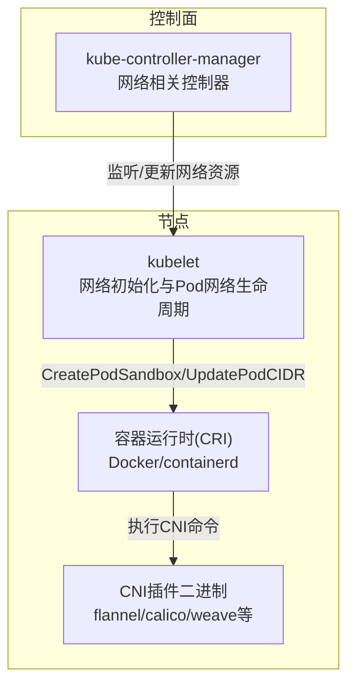
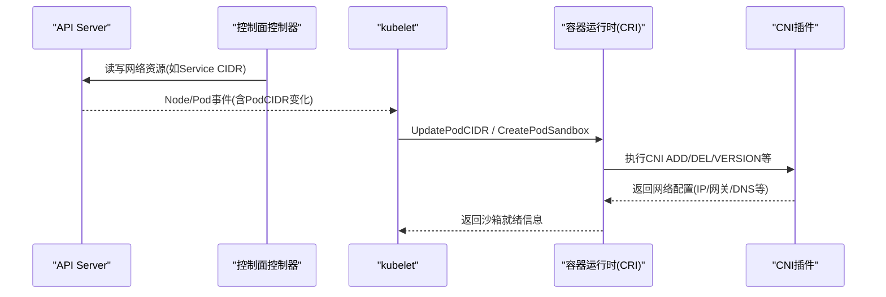
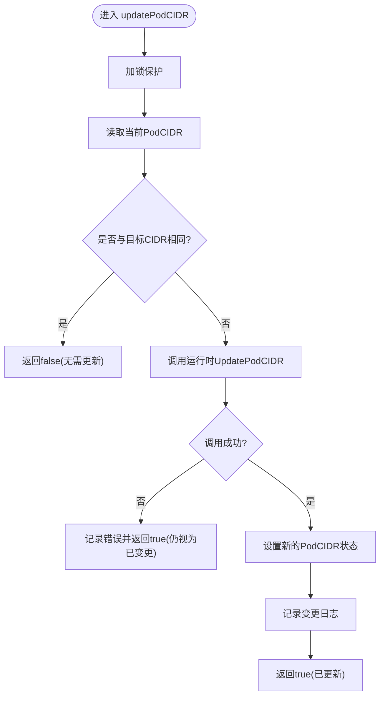
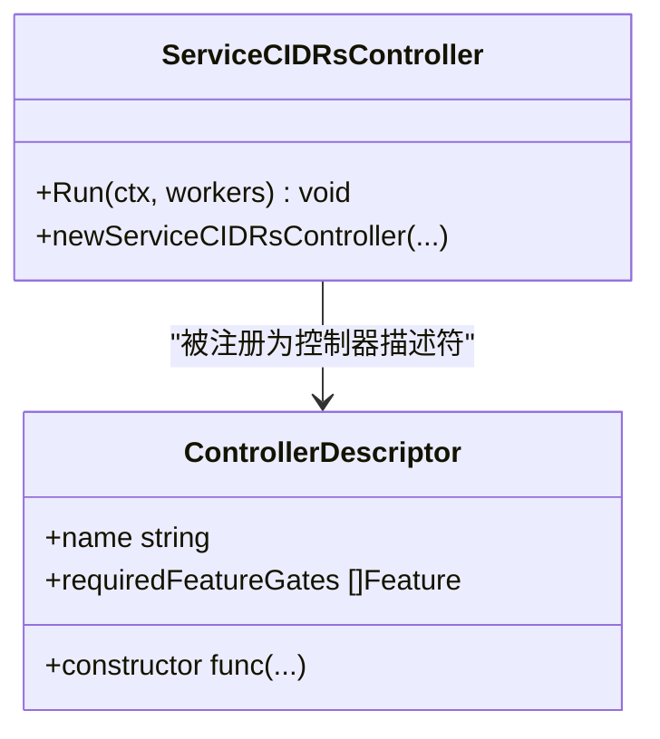
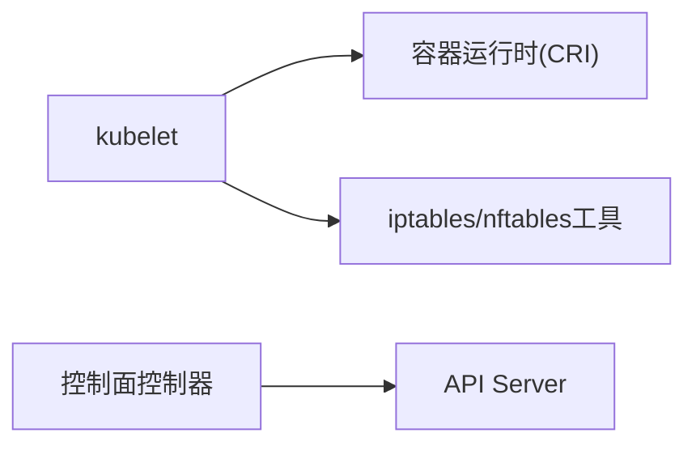

# CNI网络插件

<cite>
**本文引用的文件**   
- [kubelet_network.go](file://pkg/kubelet/kubelet_network.go)
- [kubelet_network_linux.go](file://pkg/kubelet/kubelet_network_linux.go)
- [networking.go](file://cmd/kube-controller-manager/app/networking.go)
</cite>

## 目录
1. [简介](#简介)
2. [项目结构](#项目结构)
3. [核心组件](#核心组件)
4. [架构总览](#架构总览)
5. [详细组件分析](#详细组件分析)
6. [依赖关系分析](#依赖关系分析)
7. [性能考虑](#性能考虑)
8. [故障排查指南](#故障排查指南)
9. [结论](#结论)
10. [附录](#附录)

## 简介
本文件面向Kubernetes CNI（Container Network Interface）插件生态，聚焦于Kubernetes中与CNI相关的集成点与实现机制。内容涵盖：
- CNI标准接口在Kubernetes中的调用路径与职责边界
- Pod网络CIDR的更新流程、网络命名空间生命周期与DNS配置来源
- 主流CNI插件（Calico、Flannel、Weave等）的网络模型与路由策略差异概览
- Pod IPAM（地址分配管理）机制与跨主机通信原理
- CNI插件开发要点（接口契约、配置参数、与网络策略集成）
- 网络性能优化、故障排查与监控最佳实践

说明：仓库中未包含第三方CNI插件源码，本文对插件差异与IPAM/跨主机通信的描述基于通用CNI规范与Kubernetes集成模式进行概念性阐述；涉及具体代码的部分将给出“章节来源”。

## 项目结构
与CNI直接相关的Kubernetes侧实现主要位于节点侧的kubelet以及控制面控制器模块中：
- kubelet负责Pod沙箱创建时的网络准备（通过CRI/CNI），并维护节点级网络状态（如Pod CIDR）
- 控制面提供与Service CIDR等相关的网络资源控制器

[此图为概念结构图，不映射到具体源文件，故无图表来源]

## 核心组件
本节聚焦仓库中与CNI集成密切相关的两个关键位置：
- kubelet网络能力：Pod CIDR更新、Linux平台iptables辅助规则同步、DNS配置获取
- 控制面网络控制器：Service CIDR控制器注册与运行

**章节来源**
- [kubelet_network.go:28-51](file://pkg/kubelet/kubelet_network.go#L28-L51)
- [kubelet_network_linux.go:38-64](file://pkg/kubelet/kubelet_network_linux.go#L38-L64)
- [networking.go:31-57](file://cmd/kube-controller-manager/app/networking.go#L31-L57)

## 架构总览
下图展示了Kubernetes与CNI的关键交互路径：控制面维护网络资源（如Node.Spec.PodCIDR、Service CIDR），kubelet根据节点状态与Pod调度结果，通过CRI调用CNI完成Pod网络配置。

[此图为概念流程图，不映射到具体源文件，故无图表来源]

## 详细组件分析

### 组件A：kubelet网络能力（Pod CIDR与Linux网络辅助）
- Pod CIDR更新
  - kubelet在检测到节点PodCIDR变化时，通过运行时接口下发新CIDR，确保底层网络栈与CNI感知最新网段
  - 该过程具备并发保护与日志记录，便于追踪变更
- Linux平台iptables辅助规则
  - kubelet尝试检测系统是否支持iptables，并在必要时创建提示链与防护规则，以兼容kube-proxy等组件的行为
  - 若系统仅支持nftables，则跳过iptables相关逻辑

**图表来源**
- [kubelet_network.go:28-51](file://pkg/kubelet/kubelet_network.go#L28-L51)

**章节来源**
- [kubelet_network.go:28-51](file://pkg/kubelet/kubelet_network.go#L28-L51)
- [kubelet_network_linux.go:38-64](file://pkg/kubelet/kubelet_network_linux.go#L38-L64)
- [kubelet_network_linux.go:66-118](file://pkg/kubelet/kubelet_network_linux.go#L66-L118)

### 组件B：控制面网络控制器（Service CIDR）
- Service CIDR控制器由控制面启动，订阅Service CIDR与IPAddress等资源，协调多集群CIDR分配与管理
- 该控制器受特性门控开关控制，按需启用

**图表来源**
- [networking.go:31-57](file://cmd/kube-controller-manager/app/networking.go#L31-L57)

**章节来源**
- [networking.go:31-57](file://cmd/kube-controller-manager/app/networking.go#L31-L57)

### 概念性总览：主流CNI插件网络模型与路由策略差异
以下为概念性对比，用于帮助理解不同CNI在网络模型与路由策略上的常见做法（非仓库源码）：
- Flannel
  - 典型采用Overlay隧道（VXLAN或UDP）实现跨主机互通
  - 路由策略简单，适合中小规模集群
- Calico
  - 原生BGP路由，结合eBPF加速，避免Overlay开销
  - 内置NetworkPolicy实现，细粒度安全隔离
- Weave
  - 自研加密Overlay网络，强调易用性与安全性
  - 适用于需要开箱即用加密的场景

[本节为概念性内容，不涉及具体源文件，故无章节来源]

### 概念性流程：Pod网络IPAM与跨主机通信
- IPAM（地址分配管理）
  - CNI插件通常承担Pod IP分配职责，可对接外部IPAM服务或内部存储
  - Kubernetes侧通过Node.Spec.PodCIDR告知可用网段，CNI据此分配Pod IP
- 跨主机通信
  - Overlay方案：通过隧道封装报文，在物理网络上建立虚拟网络
  - 原生路由方案：利用BGP/eBGP将Pod网段注入路由器，减少封装开销

[本节为概念性内容，不涉及具体源文件，故无章节来源]

## 依赖关系分析
- kubelet网络能力依赖容器运行时接口（CRI）以执行CNI命令
- Linux平台下kubelet会尝试初始化iptables辅助规则，以便与其他组件协同工作
- 控制面网络控制器依赖Informer与客户端访问API Server资源

[此图为概念依赖图，不映射到具体源文件，故无图表来源]

## 性能考虑
- 合理选择CNI模型
  - 大规模集群优先评估原生路由（如Calico+BGP/eBPF）以降低封装与转发开销
- 关注内核与子系统参数
  - 调整conntrack、netfilter、TCP栈参数以提升吞吐与延迟表现
- 监控与观测
  - 使用Prometheus/Grafana采集CNI与kubelet指标，关注Pod启动耗时、网络错误率、丢包与重传
- 避免不必要的SNAT/Masquerade
  - 在满足业务需求的前提下关闭冗余NAT，降低CPU占用

[本节为通用指导，不涉及具体源文件，故无章节来源]

## 故障排查指南
- 检查Pod CIDR是否生效
  - 确认节点PodCIDR是否正确下发至运行时，观察kubelet日志中的CIDR更新记录
- 验证CNI插件状态
  - 查看CNI插件日志与二进制版本，确认ADD/DEL调用是否成功
- 核对iptables/nftables规则
  - 在Linux节点上检查kubelet创建的提示链与防护规则是否存在且正确
- 网络连通性测试
  - 使用ping/tcpdump等工具定位跨主机连通性问题，区分Overlay与原生路由场景的差异

**章节来源**
- [kubelet_network.go:28-51](file://pkg/kubelet/kubelet_network.go#L28-L51)
- [kubelet_network_linux.go:38-64](file://pkg/kubelet/kubelet_network_linux.go#L38-L64)
- [kubelet_network_linux.go:66-118](file://pkg/kubelet/kubelet_network_linux.go#L66-L118)

## 结论
Kubernetes通过kubelet与控制面控制器与CNI生态紧密集成：kubelet负责节点侧网络生命周期与辅助规则，控制面负责网络资源编排。选择合适的CNI模型与IPAM策略，配合完善的监控与排障手段，可在不同规模与场景下获得稳定高效的集群网络体验。

[本节为总结性内容，不涉及具体源文件，故无章节来源]

## 附录
- CNI插件开发要点（概念性建议）
  - 遵循CNI标准接口（ADD/DEL/VERSION/CHECK等）
  - 正确处理配置参数与动态能力（如带宽限制、DNS等）
  - 与NetworkPolicy集成时，明确策略生效范围与优先级
  - 输出结构化日志与指标，便于问题定位与容量规划

[本节为概念性内容，不涉及具体源文件，故无章节来源]