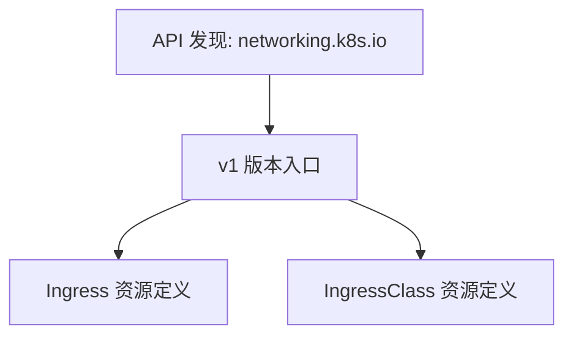
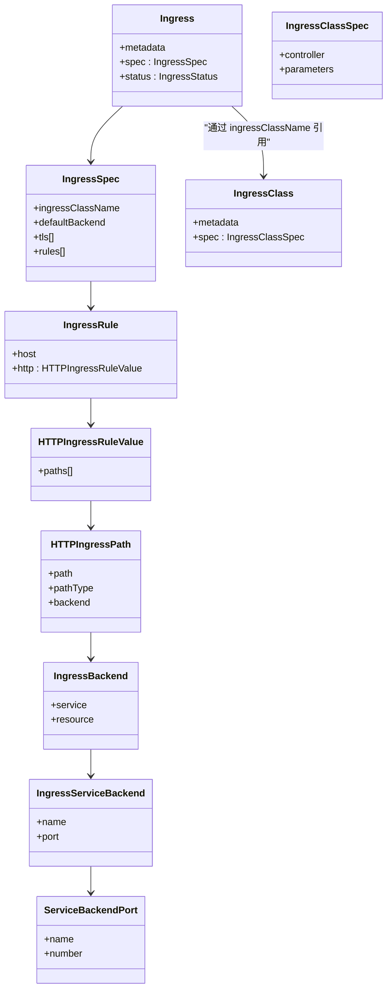
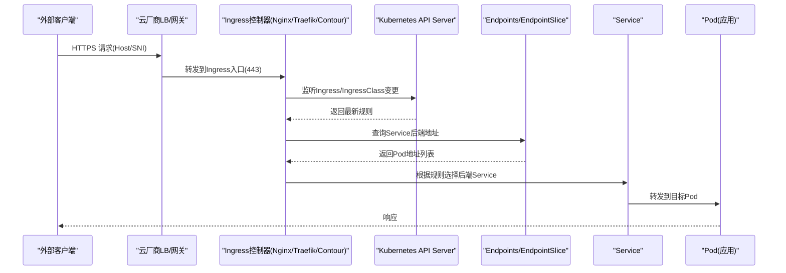
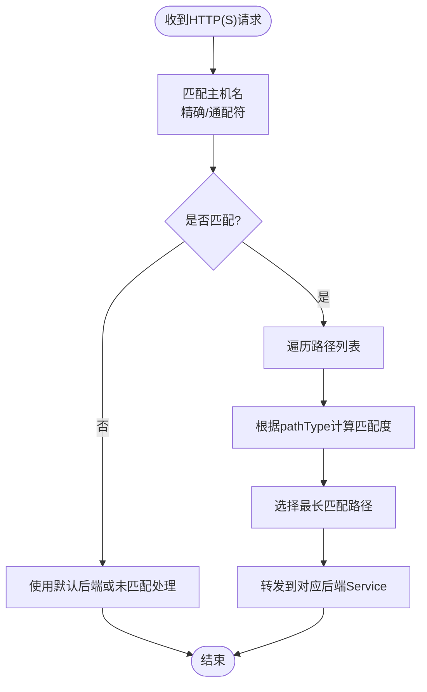
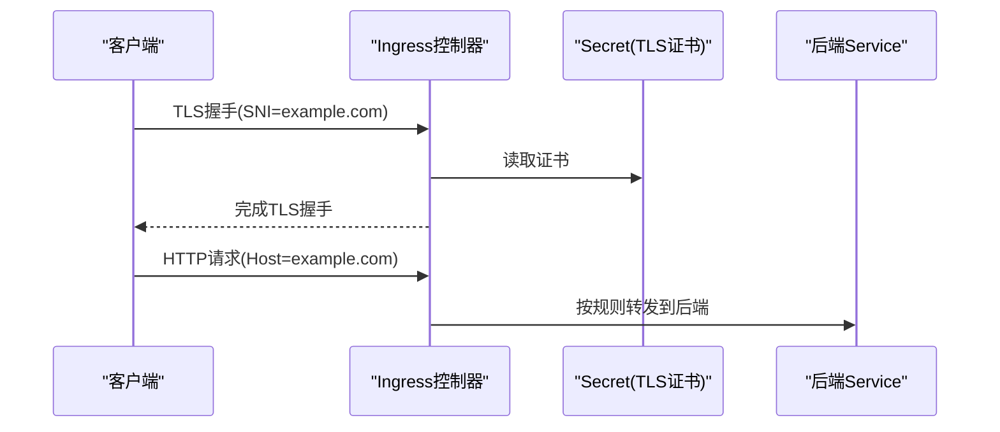
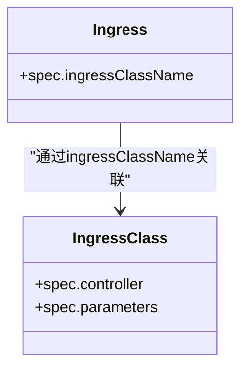
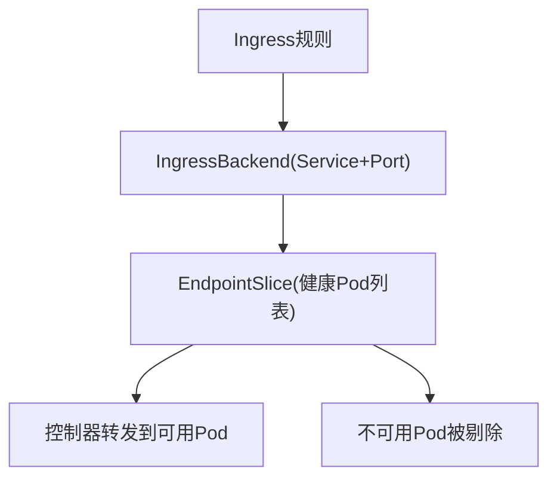
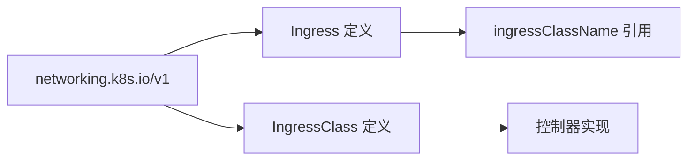

# Ingress与外部访问

<cite>
**本文引用的文件**   
- [staging/src/k8s.io/api/networking/v1/types.go](file://staging/src/k8s.io/api/networking/v1/types.go)
- [api/discovery/apis__networking.k8s.io.json](file://api/discovery/apis__networking.k8s.io.json)
</cite>

## 目录
1. [简介](#简介)
2. [项目结构](#项目结构)
3. [核心组件](#核心组件)
4. [架构总览](#架构总览)
5. [详细组件分析](#详细组件分析)
6. [依赖关系分析](#依赖关系分析)
7. [性能考量](#性能考量)
8. [故障排查指南](#故障排查指南)
9. [结论](#结论)
10. [附录](#附录)

## 简介
本技术文档围绕 Kubernetes Ingress 资源与外部访问机制展开，重点覆盖以下主题：
- HTTP/HTTPS 路由能力与 TLS 证书终止
- IngressClass 与控制器绑定（Nginx、Traefik、Contour）
- 路由匹配算法：主机名、路径类型与请求头过滤
- 安全配置：认证、授权与限流策略
- 与 Service 的集成、健康检查与故障转移
- 外部 DNS 集成与全局负载均衡方案

说明：本文档基于仓库中 networking.k8s.io/v1 API 定义进行解析，并结合通用实践给出可操作的指导。对于具体控制器的实现细节（如 Nginx/Traefik/Contour），以官方文档为准；本文提供概念性流程与最佳实践建议。

## 项目结构
Kubernetes 将 Ingress 相关 API 定义在 networking.k8s.io 组下，当前稳定版本为 v1。API 发现元数据表明该组仅暴露 v1 版本，便于客户端与服务端保持一致的契约。

图表来源
- [api/discovery/apis__networking.k8s.io.json:1-16](file://api/discovery/apis__networking.k8s.io.json#L1-L16)

章节来源
- [api/discovery/apis__networking.k8s.io.json:1-16](file://api/discovery/apis__networking.k8s.io.json#L1-L16)

## 核心组件
本节聚焦 Ingress 与 IngressClass 的核心数据结构与字段语义，帮助读者理解路由、TLS、后端与控制器绑定的关键要素。

- Ingress
  - 作用：声明一组入站规则，将外部 HTTP/HTTPS 流量按主机名和路径转发到后端服务。
  - 关键字段：
    - spec.rules：主机级规则集合，每个规则包含 host 与 HTTP 路径列表。
    - spec.defaultBackend：未命中任何规则的默认后端。
    - spec.tls：TLS 配置，指定 hosts 与 SecretName，用于 443 端口上的证书终止与 SNI 多域名复用。
    - spec.ingressClassName：指向 IngressClass，标识由哪个控制器处理该 Ingress。
- IngressRule / HTTPIngressRuleValue / HTTPIngressPath
  - 作用：描述主机与路径到后端的映射。
  - 关键字段：
    - host：精确或通配符主机名匹配。
    - paths：HTTP 路径列表，包含 path、pathType 与 backend。
    - pathType：Exact、Prefix、ImplementationSpecific 三种匹配模式。
- IngressBackend / IngressServiceBackend / ServiceBackendPort
  - 作用：将流量转发到 Service 的某个端口（名称或数字）。
- IngressClass / IngressClassSpec
  - 作用：描述一类 Ingress 控制器及其参数引用（支持集群或命名空间范围）。
  - 关键字段：
    - spec.controller：控制器标识（域前缀形式）。
    - spec.parameters：可选的参数资源引用（支持 scope 与 namespace）。

图表来源
- [staging/src/k8s.io/api/networking/v1/types.go:249-321](file://staging/src/k8s.io/api/networking/v1/types.go#L249-L321)
- [staging/src/k8s.io/api/networking/v1/types.go:397-514](file://staging/src/k8s.io/api/networking/v1/types.go#L397-L514)
- [staging/src/k8s.io/api/networking/v1/types.go:516-554](file://staging/src/k8s.io/api/networking/v1/types.go#L516-L554)
- [staging/src/k8s.io/api/networking/v1/types.go:566-636](file://staging/src/k8s.io/api/networking/v1/types.go#L566-L636)

章节来源
- [staging/src/k8s.io/api/networking/v1/types.go:249-321](file://staging/src/k8s.io/api/networking/v1/types.go#L249-L321)
- [staging/src/k8s.io/api/networking/v1/types.go:397-514](file://staging/src/k8s.io/api/networking/v1/types.go#L397-L514)
- [staging/src/k8s.io/api/networking/v1/types.go:516-554](file://staging/src/k8s.io/api/networking/v1/types.go#L516-L554)
- [staging/src/k8s.io/api/networking/v1/types.go:566-636](file://staging/src/k8s.io/api/networking/v1/types.go#L566-L636)

## 架构总览
下图展示从外部客户端到 Ingress 控制器再到 Service 的典型数据平面与控制平面交互。

图表来源
- [staging/src/k8s.io/api/networking/v1/types.go:249-321](file://staging/src/k8s.io/api/networking/v1/types.go#L249-L321)
- [staging/src/k8s.io/api/networking/v1/types.go:566-636](file://staging/src/k8s.io/api/networking/v1/types.go#L566-L636)

## 详细组件分析

### 路由匹配算法
- 主机名匹配
  - 精确匹配：请求 Host 与规则 host 完全一致。
  - 通配符匹配：*.example.com 匹配任意单标签前缀，例如 a.example.com。
- 路径匹配（pathType）
  - Exact：严格相等匹配。
  - Prefix：按“/”分段的前缀匹配，逐元素比较，最长匹配优先。
  - ImplementationSpecific：交由控制器实现决定（不同控制器行为可能不同）。
- 请求头过滤
  - 标准 Ingress 规范未直接提供请求头匹配字段。多数控制器通过注解或自定义 CRD 扩展实现（例如 Nginx 的 header 匹配注解）。

图表来源
- [staging/src/k8s.io/api/networking/v1/types.go:397-514](file://staging/src/k8s.io/api/networking/v1/types.go#L397-L514)

章节来源
- [staging/src/k8s.io/api/networking/v1/types.go:397-514](file://staging/src/k8s.io/api/networking/v1/types.go#L397-L514)

### TLS 证书终止与 SNI
- 证书终止
  - Ingress.spec.tls 指定 hosts 与 secretName，控制器在 443 端口终止 TLS，并将明文 HTTP 转发至后端。
- SNI 多域名复用
  - 同一监听端口可通过 SNI 区分不同证书，结合多个 hosts 共享一个 Ingress 条目。
- 注意事项
  - 若 SNI 与 Host 冲突，控制器通常以 SNI 作为终止依据，Host 用于后续路由。

图表来源
- [staging/src/k8s.io/api/networking/v1/types.go:323-340](file://staging/src/k8s.io/api/networking/v1/types.go#L323-L340)

章节来源
- [staging/src/k8s.io/api/networking/v1/types.go:323-340](file://staging/src/k8s.io/api/networking/v1/types.go#L323-L340)

### IngressClass 与控制器绑定
- 控制器选择
  - Ingress.spec.ingressClassName 指向 IngressClass，控制器通过自身 controller 字段匹配决定是否处理该 Ingress。
- 默认类
  - 当 Ingress 未显式指定类时，可使用默认 IngressClass（通过注解标记）。
- 参数化配置
  - IngressClass.spec.parameters 可引用集群或命名空间范围的自定义资源，供控制器读取额外配置。

图表来源
- [staging/src/k8s.io/api/networking/v1/types.go:286-298](file://staging/src/k8s.io/api/networking/v1/types.go#L286-L298)
- [staging/src/k8s.io/api/networking/v1/types.go:566-636](file://staging/src/k8s.io/api/networking/v1/types.go#L566-L636)

章节来源
- [staging/src/k8s.io/api/networking/v1/types.go:286-298](file://staging/src/k8s.io/api/networking/v1/types.go#L286-L298)
- [staging/src/k8s.io/api/networking/v1/types.go:566-636](file://staging/src/k8s.io/api/networking/v1/types.go#L566-L636)

### 与 Service 的集成、健康检查与故障转移
- 后端绑定
  - IngressBackend 指向 Service 的名称与端口（名称或数字），控制器根据 EndpointSlice 动态更新 Pod 列表。
- 健康检查
  - 标准 Ingress 不内置健康检查；控制器通常依赖 kube-proxy/EndpointSlice 的健康状态与探针结果。
- 故障转移
  - 当后端 Pod 不可用时，控制器自动剔除不可用端点，流量转发到其他可用副本。

图表来源
- [staging/src/k8s.io/api/networking/v1/types.go:516-554](file://staging/src/k8s.io/api/networking/v1/types.go#L516-L554)

章节来源
- [staging/src/k8s.io/api/networking/v1/types.go:516-554](file://staging/src/k8s.io/api/networking/v1/types.go#L516-L554)

### 安全配置：认证、授权与限流
- 认证
  - 标准 Ingress 不提供内置认证；常见做法是通过控制器注解或前置网关（如 OIDC、Basic Auth）实现。
- 授权
  - 可在控制器层实现基于路径或头的访问控制，或通过 Admission Webhook 校验 Ingress 配置。
- 限流
  - 控制器通常提供速率限制与并发限制能力（通过注解或参数资源），需参考具体控制器文档。

说明：以上为通用实践建议，具体实现因控制器而异。

[本节为概念性内容，不直接分析具体文件]

### 外部 DNS 集成与全局负载均衡
- 外部 DNS
  - 通过 LoadBalancer 的 hostname/ip 与外部 DNS 服务（如 CoreDNS、云厂商 DNS）配合，将域名解析到 Ingress 入口。
- 全局负载均衡
  - 在多集群或多区域场景，可使用云厂商 GSLB 或第三方方案（如 Multicluster Ingress）实现跨地域流量调度。

[本节为概念性内容，不直接分析具体文件]

## 依赖关系分析
- API 组与版本
  - networking.k8s.io 组仅暴露 v1 版本，确保 Ingress 与 IngressClass 的稳定契约。
- 控制器耦合
  - Ingress 与控制器通过 IngressClass 解耦，控制器通过 controller 字段匹配处理。

图表来源
- [api/discovery/apis__networking.k8s.io.json:1-16](file://api/discovery/apis__networking.k8s.io.json#L1-L16)
- [staging/src/k8s.io/api/networking/v1/types.go:286-298](file://staging/src/k8s.io/api/networking/v1/types.go#L286-L298)
- [staging/src/k8s.io/api/networking/v1/types.go:566-636](file://staging/src/k8s.io/api/networking/v1/types.go#L566-L636)

章节来源
- [api/discovery/apis__networking.k8s.io.json:1-16](file://api/discovery/apis__networking.k8s.io.json#L1-L16)
- [staging/src/k8s.io/api/networking/v1/types.go:286-298](file://staging/src/k8s.io/api/networking/v1/types.go#L286-L298)
- [staging/src/k8s.io/api/networking/v1/types.go:566-636](file://staging/src/k8s.io/api/networking/v1/types.go#L566-L636)

## 性能考量
- 路径匹配复杂度
  - Prefix 匹配按路径分段比较，长路径与大量规则会增加匹配开销；建议合理拆分路径与使用 Exact 提升确定性。
- TLS 终止位置
  - 在 Ingress 控制器终止 TLS 可减少后端加密开销，但会引入控制器 CPU 压力；可根据业务规模评估卸载到硬件或边缘节点。
- 控制器选择
  - 不同控制器在内存占用、吞吐与延迟方面表现不同；生产环境应结合压测与监控指标进行选择与调优。

[本节为通用性能讨论，不直接分析具体文件]

## 故障排查指南
- 常见问题定位
  - 未命中规则：检查 host 与 pathType 是否正确，确认是否存在默认后端。
  - TLS 错误：验证 Secret 存在且 hosts 与 SNI 一致，确认控制器已加载证书。
  - 后端不可达：检查 Service 与 EndpointSlice 状态，确认 Pod 健康探针通过。
- 诊断步骤
  - 查看 Ingress 状态与事件，确认控制器已同步规则。
  - 检查 IngressClass 与控制器绑定关系。
  - 使用 curl 或浏览器测试 Host/SNI 与路径匹配。

[本节为通用排障建议，不直接分析具体文件]

## 结论
Ingress 提供了标准化的 HTTP/HTTPS 路由与 TLS 终止能力，并通过 IngressClass 实现与多种控制器的解耦。在生产环境中，应结合路径匹配策略、安全配置与健康检查机制，选择合适的控制器与部署拓扑，以实现高可用与高性能的外部访问。

[本节为总结性内容，不直接分析具体文件]

## 附录
- 术语
  - Ingress：入站路由规则集合。
  - IngressClass：控制器类定义，用于选择控制器实例。
  - SNI：服务器名称指示，用于在同一端口上承载多域名证书。
- 参考
  - networking.k8s.io/v1 API 定义位于 staging/src/k8s.io/api/networking/v1/types.go。
  - API 发现元数据位于 api/discovery/apis__networking.k8s.io.json。

[本节为补充信息，不直接分析具体文件]