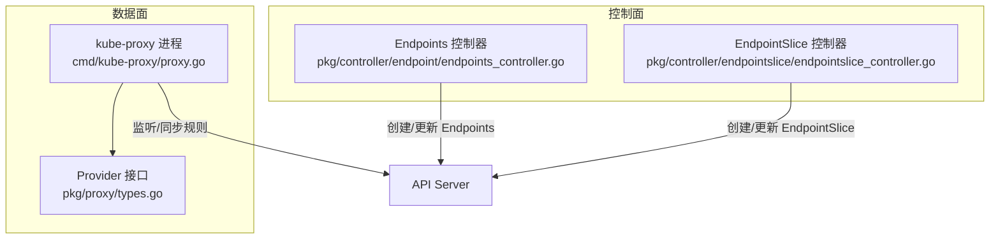
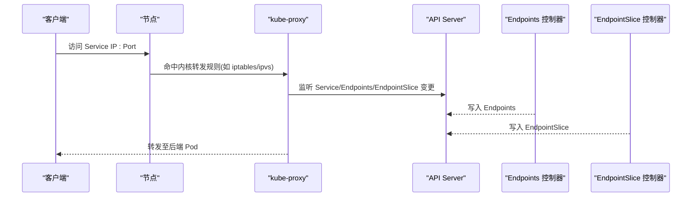
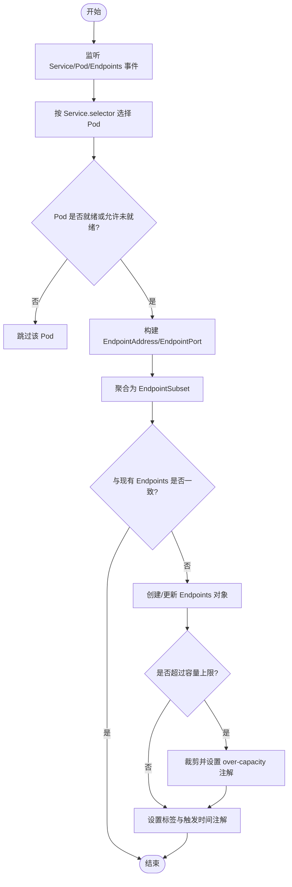
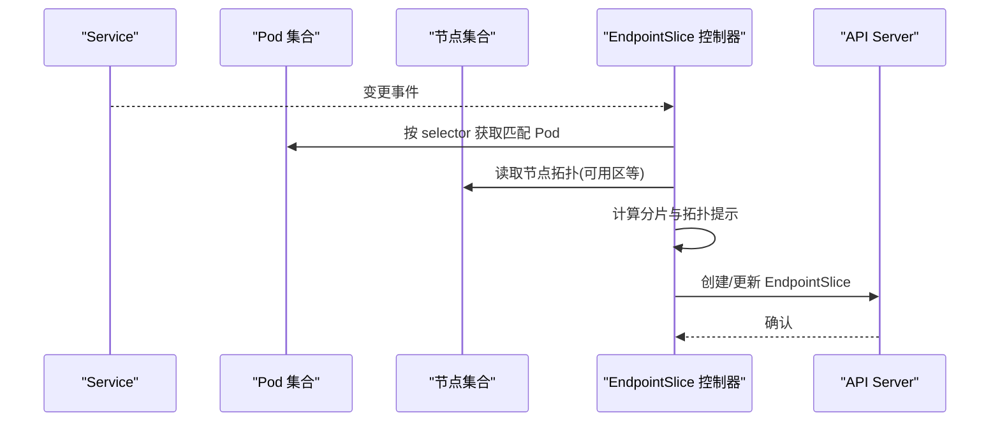
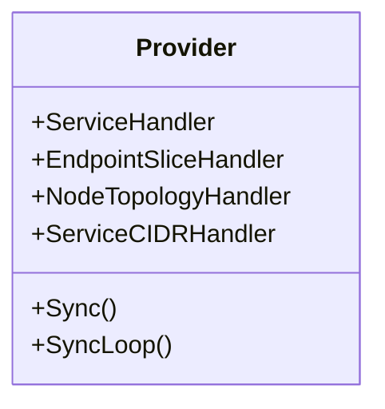
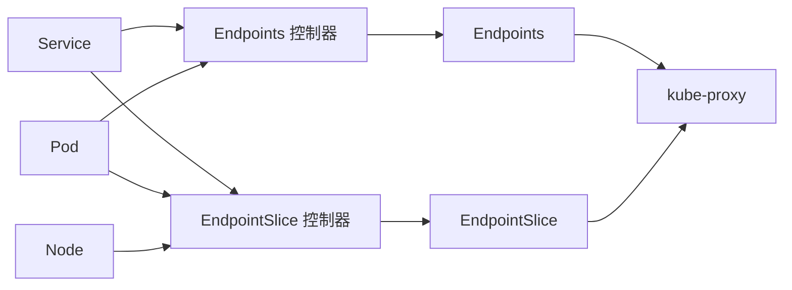

# Service与负载均衡

<cite>
**本文引用的文件**   
- [cmd/kube-proxy/proxy.go](file://cmd/kube-proxy/proxy.go)
- [pkg/proxy/types.go](file://pkg/proxy/types.go)
- [pkg/controller/endpoint/endpoints_controller.go](file://pkg/controller/endpoint/endpoints_controller.go)
- [pkg/controller/endpointslice/endpointslice_controller.go](file://pkg/controller/endpointslice/endpointslice_controller.go)
</cite>

## 目录
1. [简介](#简介)
2. [项目结构](#项目结构)
3. [核心组件](#核心组件)
4. [架构总览](#架构总览)
5. [详细组件分析](#详细组件分析)
6. [依赖关系分析](#依赖关系分析)
7. [性能考量](#性能考量)
8. [故障排查指南](#故障排查指南)
9. [结论](#结论)
10. [附录](#附录)

## 简介
本技术文档围绕 Kubernetes Service 资源与负载均衡机制，系统阐述以下内容：
- Service 的四种类型（ClusterIP、NodePort、LoadBalancer、ExternalName）的实现原理与适用场景
- kube-proxy 的三种代理模式（iptables、ipvs、userspace）的性能特点与适用场景
- Endpoint 与 EndpointSlice 的资源管理机制，包括后端 Pod 健康检查与流量分发算法
- Service 网络调试方法（端口转发、日志分析与性能监控）
- 多集群 Service 发现与跨网络域服务访问方案

## 项目结构
与 Service 和负载均衡相关的关键代码位于以下路径：
- kube-proxy 入口与 Provider 接口定义
- Endpoints 控制器：负责将 Service 选择器映射到 Endpoints
- EndpointSlice 控制器：负责将 Service 选择器映射到 EndpointSlice，并支持拓扑感知与分片

图表来源
- [cmd/kube-proxy/proxy.go:1-34](file://cmd/kube-proxy/proxy.go#L1-L34)
- [pkg/proxy/types.go:27-40](file://pkg/proxy/types.go#L27-L40)
- [pkg/controller/endpoint/endpoints_controller.go:182-219](file://pkg/controller/endpoint/endpoints_controller.go#L182-L219)
- [pkg/controller/endpointslice/endpointslice_controller.go:270-310](file://pkg/controller/endpointslice/endpointslice_controller.go#L270-L310)

章节来源
- [cmd/kube-proxy/proxy.go:1-34](file://cmd/kube-proxy/proxy.go#L1-L34)
- [pkg/proxy/types.go:27-40](file://pkg/proxy/types.go#L27-L40)
- [pkg/controller/endpoint/endpoints_controller.go:182-219](file://pkg/controller/endpoint/endpoints_controller.go#L182-L219)
- [pkg/controller/endpointslice/endpointslice_controller.go:270-310](file://pkg/controller/endpointslice/endpointslice_controller.go#L270-L310)

## 核心组件
- kube-proxy 入口与 Provider 抽象
  - 入口程序启动命令并运行主循环
  - Provider 接口定义了同步与事件处理契约，供 iptables/ipfs/userspace 等实现复用

- Endpoints 控制器
  - 基于 Service 的 selector 计算匹配 Pod，生成或更新 Endpoints 对象
  - 维护就绪/未就绪地址集合，支持容量裁剪与触发时间标注

- EndpointSlice 控制器
  - 基于 Service 的 selector 计算匹配 Pod，生成或更新 EndpointSlice 对象
  - 支持按节点拓扑分布优化，提供 TopologyAwareHints

章节来源
- [cmd/kube-proxy/proxy.go:29-33](file://cmd/kube-proxy/proxy.go#L29-L33)
- [pkg/proxy/types.go:27-40](file://pkg/proxy/types.go#L27-L40)
- [pkg/controller/endpoint/endpoints_controller.go:131-180](file://pkg/controller/endpoint/endpoints_controller.go#L131-L180)
- [pkg/controller/endpointslice/endpointslice_controller.go:192-268](file://pkg/controller/endpointslice/endpointslice_controller.go#L192-L268)

## 架构总览
Service 流量从客户端进入集群后，由 kube-proxy 在节点上建立转发规则；Endpoints/EndpointSlice 作为后端 Pod 列表的来源，由对应控制器持续维护。

图表来源
- [cmd/kube-proxy/proxy.go:29-33](file://cmd/kube-proxy/proxy.go#L29-L33)
- [pkg/controller/endpoint/endpoints_controller.go:348-556](file://pkg/controller/endpoint/endpoints_controller.go#L348-L556)
- [pkg/controller/endpointslice/endpointslice_controller.go:368-451](file://pkg/controller/endpointslice/endpointslice_controller.go#L368-L451)

## 详细组件分析

### Service 类型与实现要点
- ClusterIP
  - 仅在集群内部通过虚拟 IP 暴露服务，适合内部微服务通信
- NodePort
  - 在每个节点上开放一个静态端口，便于外部访问或测试
- LoadBalancer
  - 借助云厂商负载均衡器对外暴露，通常配合 NodePort 使用
- ExternalName
  - 不产生后端端点，仅返回 CNAME 记录，用于 DNS 别名

说明：上述类型为概念性总结，具体字段与行为以 API 定义为准。

章节来源
- [pkg/controller/endpoint/endpoints_controller.go:379-389](file://pkg/controller/endpoint/endpoints_controller.go#L379-L389)
- [pkg/controller/endpointslice/endpointslice_controller.go:392-402](file://pkg/controller/endpointslice/endpointslice_controller.go#L392-L402)

### kube-proxy 代理模式对比
- userspace
  - 早期模式，用户态转发，灵活性高但性能较低，已逐步弃用
- iptables
  - 基于 netfilter 的规则链进行 DNAT/SNAT，部署简单，规则规模大时存在更新延迟
- ipvs
  - 基于内核 IPVS 模块，具备更高吞吐与更低延迟，支持更丰富的调度策略

注意：不同模式的启用方式与能力差异取决于发行版与内核特性。

章节来源
- [cmd/kube-proxy/proxy.go:29-33](file://cmd/kube-proxy/proxy.go#L29-L33)
- [pkg/proxy/types.go:27-40](file://pkg/proxy/types.go#L27-L40)

### Endpoints 控制器工作机制
- 监听 Service/Pod/Endpoints 事件
- 根据 Service.selector 筛选 Pod，结合就绪状态与 PublishNotReadyAddresses 决定端点是否加入
- 生成或更新 Endpoints 对象，包含 Ready/NotReady 地址与端口信息
- 对超大端点进行容量裁剪，并设置相应注解
- 维护触发时间注解，辅助下游组件观测变化

图表来源
- [pkg/controller/endpoint/endpoints_controller.go:348-556](file://pkg/controller/endpoint/endpoints_controller.go#L348-L556)
- [pkg/controller/endpoint/endpoints_controller.go:642-752](file://pkg/controller/endpoint/endpoints_controller.go#L642-L752)

章节来源
- [pkg/controller/endpoint/endpoints_controller.go:182-219](file://pkg/controller/endpoint/endpoints_controller.go#L182-L219)
- [pkg/controller/endpoint/endpoints_controller.go:348-556](file://pkg/controller/endpoint/endpoints_controller.go#L348-L556)
- [pkg/controller/endpoint/endpoints_controller.go:642-752](file://pkg/controller/endpoint/endpoints_controller.go#L642-L752)

### EndpointSlice 控制器工作机制
- 监听 Service/Pod/Node/EndpointSlice 事件
- 根据 Service.selector 选择 Pod，结合节点拓扑信息生成多个 EndpointSlice
- 支持 TopologyAwareHints，优先将流量分发到同区域节点
- 对 EndpointSlice 的增删改进行幂等协调，避免重复或不一致

图表来源
- [pkg/controller/endpointslice/endpointslice_controller.go:368-451](file://pkg/controller/endpointslice/endpointslice_controller.go#L368-L451)
- [pkg/controller/endpointslice/endpointslice_controller.go:629-646](file://pkg/controller/endpointslice/endpointslice_controller.go#L629-L646)

章节来源
- [pkg/controller/endpointslice/endpointslice_controller.go:270-310](file://pkg/controller/endpointslice/endpointslice_controller.go#L270-L310)
- [pkg/controller/endpointslice/endpointslice_controller.go:368-451](file://pkg/controller/endpointslice/endpointslice_controller.go#L368-L451)
- [pkg/controller/endpointslice/endpointslice_controller.go:629-646](file://pkg/controller/endpointslice/endpointslice_controller.go#L629-L646)

### 健康检查与流量分发
- 健康检查
  - Endpoints/EndpointSlice 中的就绪/未就绪集合由控制器依据 Pod 就绪状态与 Service.PublishNotReadyAddresses 决定
- 流量分发算法
  - 由 kube-proxy 在具体代理模式下实现（如 iptables 的轮询/随机，ipvs 的多种调度策略），此处不展开具体实现细节

章节来源
- [pkg/controller/endpoint/endpoints_controller.go:409-450](file://pkg/controller/endpoint/endpoints_controller.go#L409-L450)
- [pkg/controller/endpointslice/endpointslice_controller.go:406-414](file://pkg/controller/endpointslice/endpointslice_controller.go#L406-L414)

### kube-proxy Provider 接口与职责
- Provider 接口统一了 Service、EndpointSlice、Node 拓扑、ServiceCIDR 等事件处理与同步能力
- 各代理模式（iptables/ipvs/userspace）实现该接口，完成规则下发与热更新

图表来源
- [pkg/proxy/types.go:27-40](file://pkg/proxy/types.go#L27-L40)

章节来源
- [pkg/proxy/types.go:27-40](file://pkg/proxy/types.go#L27-L40)

## 依赖关系分析
- Endpoints 控制器依赖 Service、Pod、Endpoints 的 Informer/Lister，并通过 workqueue 驱动同步
- EndpointSlice 控制器依赖 Service、Pod、Node、EndpointSlice 的 Informer/Lister，并使用 Reconciler 协调增量更新
- kube-proxy 通过 Provider 接口消费这些资源，并在节点上生效转发规则

图表来源
- [pkg/controller/endpoint/endpoints_controller.go:131-180](file://pkg/controller/endpoint/endpoints_controller.go#L131-L180)
- [pkg/controller/endpointslice/endpointslice_controller.go:192-268](file://pkg/controller/endpointslice/endpointslice_controller.go#L192-L268)
- [cmd/kube-proxy/proxy.go:29-33](file://cmd/kube-proxy/proxy.go#L29-L33)

章节来源
- [pkg/controller/endpoint/endpoints_controller.go:131-180](file://pkg/controller/endpoint/endpoints_controller.go#L131-L180)
- [pkg/controller/endpointslice/endpointslice_controller.go:192-268](file://pkg/controller/endpointslice/endpointslice_controller.go#L192-L268)
- [cmd/kube-proxy/proxy.go:29-33](file://cmd/kube-proxy/proxy.go#L29-L33)

## 性能考量
- Endpoints 控制器
  - 使用工作队列与指数退避重试，避免瞬时风暴
  - 对端点数量进行容量裁剪，防止资源膨胀
- EndpointSlice 控制器
  - 更高的默认退避与限流参数，降低 API Server 压力
  - 引入拓扑缓存与“过载服务”检测，减少不必要的重平衡
- kube-proxy
  - ipvs 模式在高并发下具有更好的吞吐与延迟表现
  - iptables 模式在大规模规则集下可能存在更新抖动

章节来源
- [pkg/controller/endpoint/endpoints_controller.go:54-77](file://pkg/controller/endpoint/endpoints_controller.go#L54-L77)
- [pkg/controller/endpointslice/endpointslice_controller.go:54-82](file://pkg/controller/endpointslice/endpointslice_controller.go#L54-L82)
- [pkg/controller/endpointslice/endpointslice_controller.go:629-646](file://pkg/controller/endpointslice/endpointslice_controller.go#L629-L646)

## 故障排查指南
- 观察控制器日志
  - 查看 Endpoints/EndpointSlice 控制器的同步与错误日志，定位失败原因
- 检查资源一致性
  - 核对 Service.selector 与 Pod 标签是否匹配
  - 确认 Endpoints/EndpointSlice 中是否存在预期端点
- 验证 kube-proxy 规则
  - 在节点上检查 iptables/ipvs 规则是否与 Service 期望一致
- 关注容量与过期
  - 若端点过多，检查是否触发了容量裁剪注解
  - 关注触发时间注解，判断是否为近期变更导致

章节来源
- [pkg/controller/endpoint/endpoints_controller.go:326-346](file://pkg/controller/endpoint/endpoints_controller.go#L326-L346)
- [pkg/controller/endpointslice/endpointslice_controller.go:349-366](file://pkg/controller/endpointslice/endpointslice_controller.go#L349-L366)
- [pkg/controller/endpoint/endpoints_controller.go:498-502](file://pkg/controller/endpoint/endpoints_controller.go#L498-L502)

## 结论
- Service 类型提供了灵活的暴露方式，适配内网互通与外网接入等不同场景
- kube-proxy 的代理模式需结合集群规模与性能需求进行选择
- Endpoints 与 EndpointSlice 共同承担后端发现职责，后者在大规模与拓扑感知方面更具优势
- 通过合理的容量控制、限流与拓扑优化，可显著提升整体稳定性与性能

## 附录
- 多集群 Service 发现与跨网络域访问
  - 可通过 Ingress/Gateway、Service Mesh、DNS 全局解析等方式实现跨集群/跨域访问
  - 具体方案与选型应结合业务需求与基础设施能力评估

[本节为概念性内容，不直接分析具体源码文件]