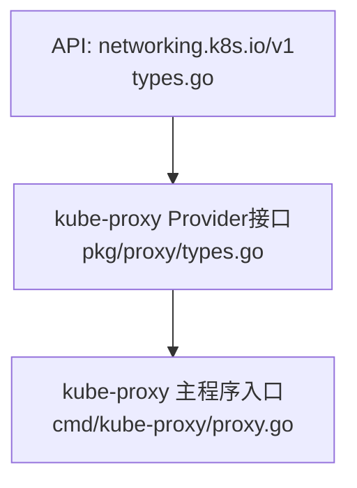
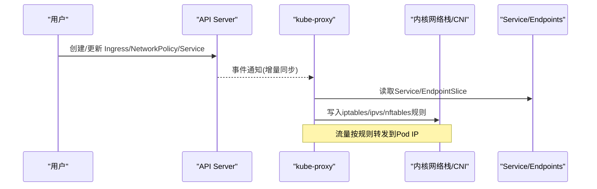
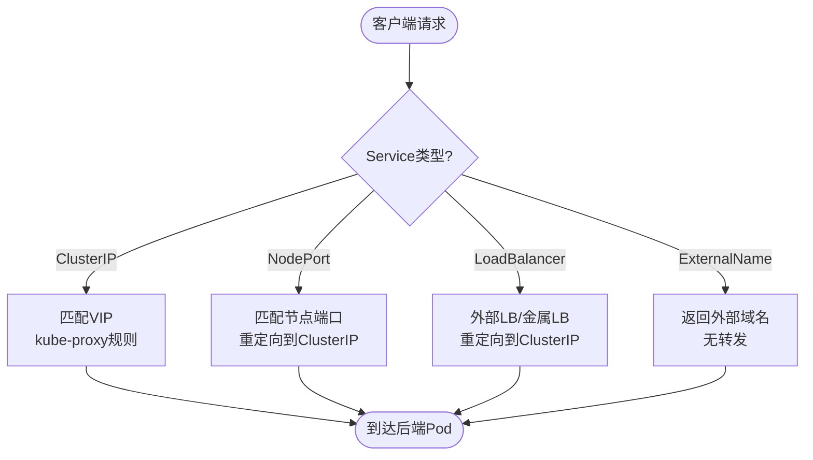
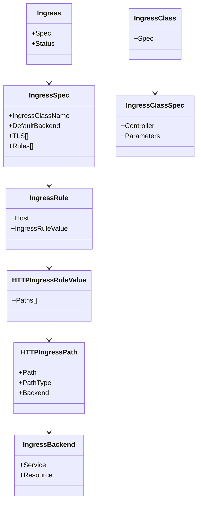
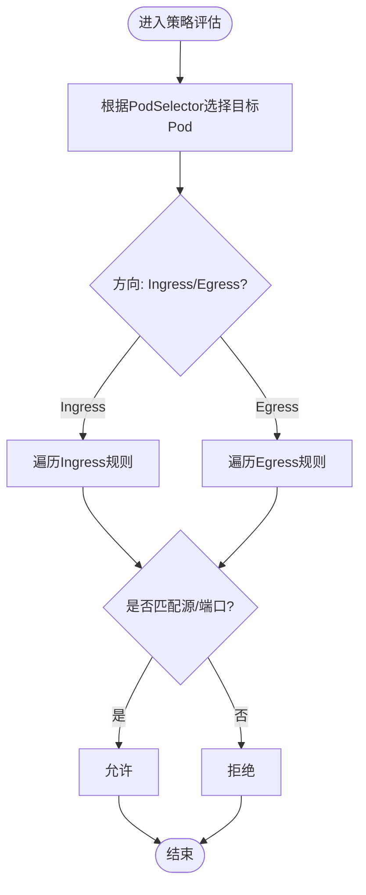
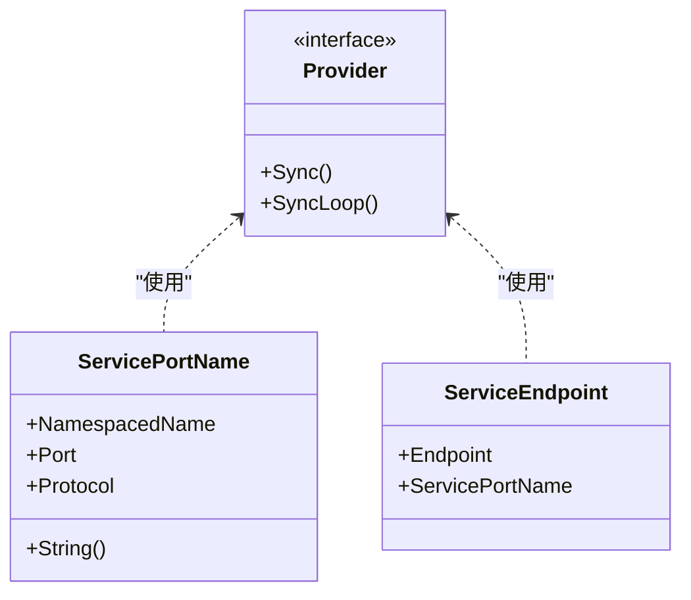
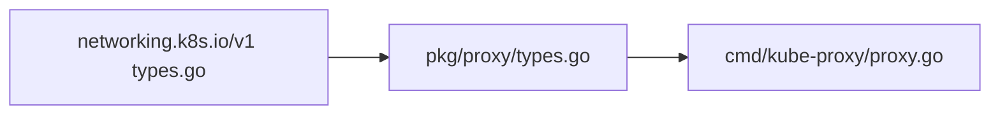

# 网络与通信

<cite>
**本文引用的文件**   
- [staging/src/k8s.io/api/networking/v1/types.go](file://staging/src/k8s.io/api/networking/v1/types.go)
- [pkg/proxy/types.go](file://pkg/proxy/types.go)
- [cmd/kube-proxy/proxy.go](file://cmd/kube-proxy/proxy.go)
</cite>

## 目录
1. [简介](#简介)
2. [项目结构](#项目结构)
3. [核心组件](#核心组件)
4. [架构总览](#架构总览)
5. [详细组件分析](#详细组件分析)
6. [依赖关系分析](#依赖关系分析)
7. [性能考虑](#性能考虑)
8. [故障排查指南](#故障排查指南)
9. [结论](#结论)
10. [附录](#附录)

## 简介
本文件面向Kubernetes网络与通信机制，聚焦以下主题：
- CNI插件架构与常见网络方案实现原理
- Service资源的网络抽象（ClusterIP、NodePort、LoadBalancer、ExternalName）
- Ingress的HTTP路由与TLS终止
- NetworkPolicy的安全策略模型与配置方法
- 网络调试工具与监控
- 多集群网络、跨主机通信与性能优化策略

为便于读者理解，文档在概念层面进行系统化阐述，并在涉及具体API定义与代理接口时给出源码级定位。

## 项目结构
围绕网络相关能力，仓库中与本主题直接相关的代码主要分布在：
- API层：networking.k8s.io/v1 定义了Ingress、NetworkPolicy、IngressClass、ServiceCIDR等网络资源类型
- 数据平面：kube-proxy通过Provider接口抽象不同实现（iptables/ipvs/nftables），负责将Service/Endpoint变更同步到内核转发规则
- 入口：kube-proxy主程序入口位于cmd/kube-proxy

图表来源
- [staging/src/k8s.io/api/networking/v1/types.go](file://staging/src/k8s.io/api/networking/v1/types.go)
- [pkg/proxy/types.go](file://pkg/proxy/types.go)
- [cmd/kube-proxy/proxy.go](file://cmd/kube-proxy/proxy.go)

章节来源
- [staging/src/k8s.io/api/networking/v1/types.go](file://staging/src/k8s.io/api/networking/v1/types.go)
- [pkg/proxy/types.go](file://pkg/proxy/types.go)
- [cmd/kube-proxy/proxy.go](file://cmd/kube-proxy/proxy.go)

## 核心组件
- networking.k8s.io/v1 API族
  - Ingress/IngressClass：用于HTTP/HTTPS七层路由与控制器绑定
  - NetworkPolicy：基于标签选择器的Pod入站/出站访问控制
  - ServiceCIDR/IPAddress：服务集群IP地址段与独立IP对象
- kube-proxy数据面
  - Provider接口：统一抽象不同转发实现（iptables/ipvs/nftables）
  - ServicePortName/ServiceEndpoint：标识负载均衡服务端口与端点

章节来源
- [staging/src/k8s.io/api/networking/v1/types.go](file://staging/src/k8s.io/api/networking/v1/types.go)
- [pkg/proxy/types.go](file://pkg/proxy/types.go)

## 架构总览
下图展示从用户声明到数据面转发的关键路径：用户创建Ingress/NetworkPolicy等资源；API Server持久化；kube-proxy监听并同步规则至内核；CNI提供Pod间二层/三层连通性。

图表来源
- [staging/src/k8s.io/api/networking/v1/types.go](file://staging/src/k8s.io/api/networking/v1/types.go)
- [pkg/proxy/types.go](file://pkg/proxy/types.go)
- [cmd/kube-proxy/proxy.go](file://cmd/kube-proxy/proxy.go)

## 详细组件分析

### CNI插件架构与网络方案
- 设计要点
  - CNI作为容器网络接口标准，由运行时在Pod生命周期内调用，完成网桥/VXLAN/BGP等能力注入
  - 典型方案：Calico（BGP+IPIP）、Flannel（VXLAN/Host-GW）、Cilium（eBPF）、Multus（多网卡）
- 与Kubernetes集成
  - kubelet在创建Pod前调用CNI，分配IP、设置路由、挂载veth等
  - CNI通常不处理Service/Ingress，这些由kube-proxy/Ingress Controller负责

[本节为概念性说明，不涉及具体源码文件]

### Service网络抽象（ClusterIP/NodePort/LoadBalancer/ExternalName）
- ClusterIP：在集群内部通过虚拟IP和kube-proxy规则进行四层转发
- NodePort：在每个节点暴露固定端口，将流量转发到ClusterIP
- LoadBalancer：结合云厂商LB或MetalLB，对外暴露公网/私网入口
- ExternalName：将Service解析为外部DNS名，不做转发

[本节为概念性说明，不涉及具体源码文件]

### Ingress HTTP路由与TLS终止
- 路由能力
  - 基于host与path的前缀/精确匹配，将请求分发到后端Service
  - PathType支持Exact、Prefix、ImplementationSpecific
- TLS终止
  - 通过Secret引用证书，IngressController在443端口终止TLS并按SNI/Host路由
- IngressClass
  - 使用controller字段指定控制器实现，支持参数扩展

图表来源
- [staging/src/k8s.io/api/networking/v1/types.go](file://staging/src/k8s.io/api/networking/v1/types.go)

章节来源
- [staging/src/k8s.io/api/networking/v1/types.go](file://staging/src/k8s.io/api/networking/v1/types.go)

### NetworkPolicy安全策略
- 模型要点
  - PodSelector选择目标Pod集合
  - Ingress/Egress规则分别控制入站/出站
  - Peer支持podSelector、namespaceSelector、ipBlock
  - PolicyTypes决定生效方向
- 语义
  - 未声明任何策略时默认允许
  - 一旦存在匹配策略，则仅允许显式匹配的流量

图表来源
- [staging/src/k8s.io/api/networking/v1/types.go](file://staging/src/k8s.io/api/networking/v1/types.go)

章节来源
- [staging/src/k8s.io/api/networking/v1/types.go](file://staging/src/k8s.io/api/networking/v1/types.go)

### kube-proxy数据面与Provider接口
- Provider接口统一了不同转发实现的同步能力，包括对Service、EndpointSlice、节点拓扑、ServiceCIDR的处理
- ServicePortName/ServiceEndpoint用于唯一标识服务端口与端点映射

图表来源
- [pkg/proxy/types.go](file://pkg/proxy/types.go)

章节来源
- [pkg/proxy/types.go](file://pkg/proxy/types.go)
- [cmd/kube-proxy/proxy.go](file://cmd/kube-proxy/proxy.go)

## 依赖关系分析
- API到数据面的依赖
  - networking.k8s.io/v1资源被kube-proxy消费以生成内核规则
  - kube-proxy主程序通过app命令初始化Provider并启动同步循环
- 耦合与内聚
  - Provider接口提高内聚性，屏蔽iptables/ipvs/nftables差异
  - API类型集中定义，利于版本演进与兼容性管理

图表来源
- [staging/src/k8s.io/api/networking/v1/types.go](file://staging/src/k8s.io/api/networking/v1/types.go)
- [pkg/proxy/types.go](file://pkg/proxy/types.go)
- [cmd/kube-proxy/proxy.go](file://cmd/kube-proxy/proxy.go)

章节来源
- [staging/src/k8s.io/api/networking/v1/types.go](file://staging/src/k8s.io/api/networking/v1/types.go)
- [pkg/proxy/types.go](file://pkg/proxy/types.go)
- [cmd/kube-proxy/proxy.go](file://cmd/kube-proxy/proxy.go)

## 性能考虑
- kube-proxy模式选择
  - ipvs在高并发场景下具备更好的可扩展性与低延迟
  - iptables在中小规模集群中稳定可靠
  - nftables在较新内核上提供更优的规则管理与性能
- 规则规模与增量同步
  - 合理划分Service与EndpointSlice粒度，避免单条规则过大
  - 利用增量同步减少全量刷新带来的抖动
- CNI与内核参数
  - 调整conntrack表大小、netfilter队列长度、TCP缓冲区等
  - 针对大二层/Overlay网络，优化MTU与分片策略

[本节为通用指导，不涉及具体源码文件]

## 故障排查指南
- 常用kubectl诊断
  - kubectl get endpointslice/<svc> -o wide：查看后端端点与健康状态
  - kubectl describe service/<svc>：检查ClusterIP/NodePort/类型与后端
  - kubectl get ingress/<ingress> -o yaml：核对host/path/TLS/IngressClass
  - kubectl get networkpolicy -A -o wide：确认策略作用域与规则
- 节点侧检查
  - iptables-save / ipvsadm --list / nft list ruleset：验证转发规则
  - conntrack -L | grep <port>：观察连接跟踪条目
  - ss/netstat：查看本地监听端口与连接数
- 日志与指标
  - kube-proxy日志：关注同步失败、规则冲突、超时
  - 控制器日志：Ingress Controller与CNI组件日志辅助定位

[本节为通用指导，不涉及具体源码文件]

## 结论
- Kubernetes网络由“声明式API + 控制器 + 数据面”协同工作：API描述意图，控制器转化为可执行规则，数据面负责高效转发
- Ingress与NetworkPolicy分别解决七层路由与安全隔离问题；Service提供统一的四层抽象
- 在生产环境中，应结合集群规模与业务特性选择合适的kube-proxy模式与CNI方案，并通过完善的观测与排障流程保障稳定性

[本节为总结性内容，不涉及具体源码文件]

## 附录
- 参考API定义位置
  - Ingress/NetworkPolicy/IngressClass/ServiceCIDR等类型定义见：[staging/src/k8s.io/api/networking/v1/types.go](file://staging/src/k8s.io/api/networking/v1/types.go)
- kube-proxy接口与入口
  - Provider接口与核心数据结构：[pkg/proxy/types.go](file://pkg/proxy/types.go)
  - 主程序入口：[cmd/kube-proxy/proxy.go](file://cmd/kube-proxy/proxy.go)