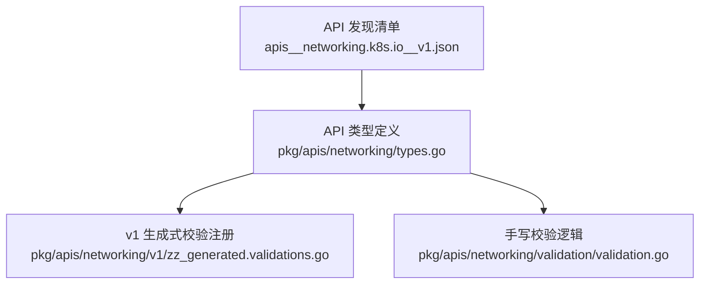
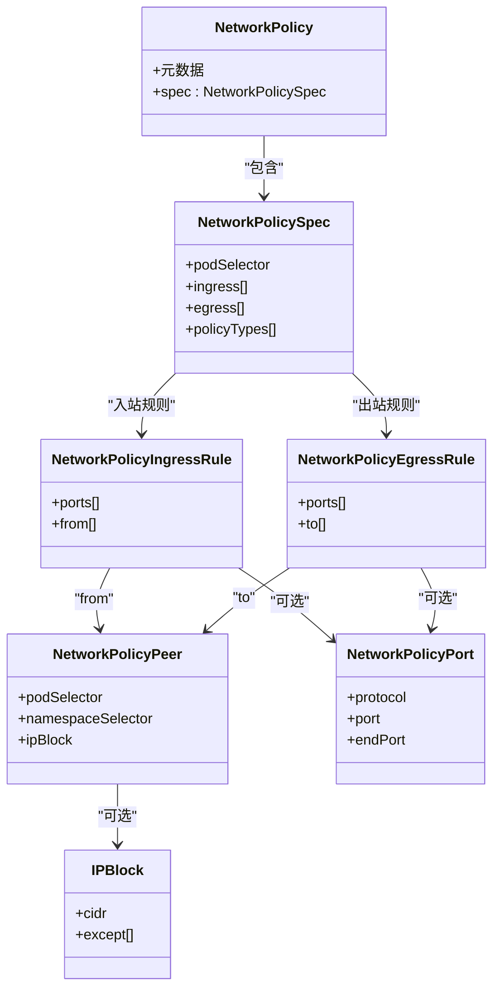
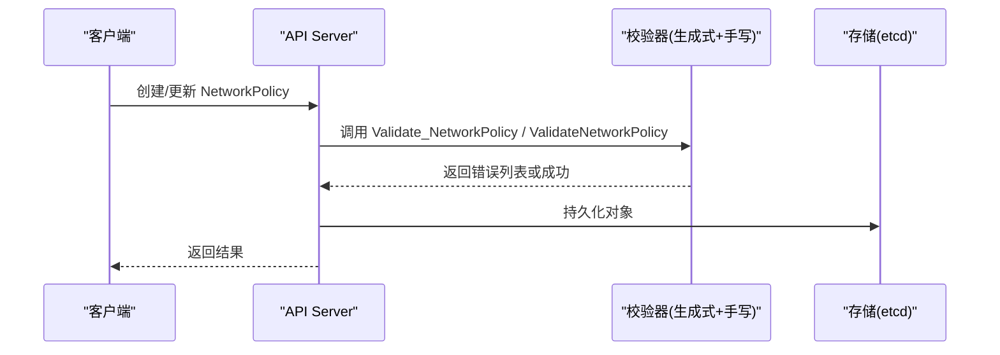
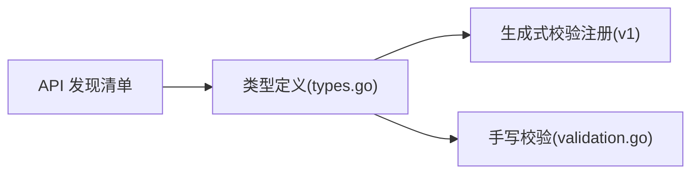

# 网络安全策略

<cite>
**本文引用的文件**   
- [types.go](file://pkg/apis/networking/types.go)
- [validation.go](file://pkg/apis/networking/validation/validation.go)
- [zz_generated.validations.go](file://pkg/apis/networking/v1/zz_generated.validations.go)
- [apis__networking.k8s.io__v1.json](file://api/discovery/apis__networking.k8s.io__v1.json)
</cite>

## 目录
1. [简介](#简介)
2. [项目结构](#项目结构)
3. [核心组件](#核心组件)
4. [架构总览](#架构总览)
5. [详细组件分析](#详细组件分析)
6. [依赖关系分析](#依赖关系分析)
7. [性能考量](#性能考量)
8. [故障排查指南](#故障排查指南)
9. [结论](#结论)
10. [附录](#附录)

## 简介
本技术文档聚焦于 Kubernetes 的网络安全策略（NetworkPolicy）资源，系统阐述其网络隔离机制与规则匹配逻辑，覆盖入站与出站流量控制、Pod 选择器、命名空间隔离、端口限制等关键能力。同时结合代码仓库中的 API 定义与校验实现，给出最佳实践、调试方法、性能监控建议以及多租户环境下的隔离方案与合规性要求说明。

## 项目结构
围绕 NetworkPolicy 的相关源码主要位于 networking API 包及其 v1 版本中，包含类型定义、API 注册与发现信息、以及生成式与手写校验逻辑。下图展示了与本主题直接相关的文件组织与职责：

**图表来源**
- [apis__networking.k8s.io__v1.json:75-92](file://api/discovery/apis__networking.k8s.io__v1.json#L75-L92)
- [types.go:27-93](file://pkg/apis/networking/types.go#L27-L93)
- [zz_generated.validations.go:89-103](file://pkg/apis/networking/v1/zz_generated.validations.go#L89-L103)
- [validation.go:186-189](file://pkg/apis/networking/validation/validation.go#L186-L189)

**章节来源**
- [apis__networking.k8s.io__v1.json:75-92](file://api/discovery/apis__networking.k8s.io__v1.json#L75-L92)
- [types.go:27-93](file://pkg/apis/networking/types.go#L27-L93)
- [zz_generated.validations.go:89-103](file://pkg/apis/networking/v1/zz_generated.validations.go#L89-L103)
- [validation.go:186-189](file://pkg/apis/networking/validation/validation.go#L186-L189)

## 核心组件
本节从 API 视角梳理 NetworkPolicy 的核心数据结构与语义，帮助读者理解“谁被选中”、“允许什么方向”、“如何限定端口与对端”。

- 资源与分组
  - 资源名：networkpolicies；短名：netpol；命名空间级资源；支持标准 CRUD 操作。
- 主对象
  - NetworkPolicy：描述一组 Pod 的网络访问策略。
- 规格字段
  - podSelector：选择受策略影响的 Pod。
  - ingress：入站规则列表。
  - egress：出站规则列表。
  - policyTypes：策略类型集合，决定该策略影响的方向（Ingress/Egress）。
- 规则对象
  - IngressRule：包含 Ports 与 From。
  - EgressRule：包含 Ports 与 To。
- 对端与端口
  - NetworkPolicyPeer：可组合使用 PodSelector、NamespaceSelector、IPBlock。
  - IPBlock：CIDR 及可选 Except 排除段。
  - NetworkPolicyPort：协议、端口或端口范围（port/endPort）。

上述字段与语义在 API 定义中明确，且通过 v1 版本的生成式校验与手写校验共同保障输入合法性。

**章节来源**
- [types.go:27-93](file://pkg/apis/networking/types.go#L27-L93)
- [types.go:95-197](file://pkg/apis/networking/types.go#L95-L197)
- [zz_generated.validations.go:462-515](file://pkg/apis/networking/v1/zz_generated.validations.go#L462-L515)
- [validation.go:186-189](file://pkg/apis/networking/validation/validation.go#L186-L189)

## 架构总览
下图展示 NetworkPolicy 在 API 层的数据模型与校验流程关系。注意：实际网络数据面由具体 CNI 插件实现，此处仅反映 API 与校验侧的结构。

**图表来源**
- [types.go:27-93](file://pkg/apis/networking/types.go#L27-L93)
- [types.go:95-197](file://pkg/apis/networking/types.go#L95-L197)

## 详细组件分析

### 入站流量控制（Ingress）
- 作用域：针对被 podSelector 选中的 Pod。
- 匹配逻辑要点
  - 若存在任何选中该 Pod 的 NetworkPolicy，则默认拒绝所有入站流量，除非匹配到至少一条入站规则。
  - 每条 IngressRule 内，Ports 与 From 为“与”的关系；多个规则之间为“或”的关系。
  - From 可为空表示允许任意来源；否则需匹配至少一个对端。
  - 本地节点发起的流量有特殊处理路径（由实现方决定），但策略语义以 API 为准。
- 典型用法
  - 仅允许特定标签 Pod 访问：设置 from.podSelector。
  - 跨命名空间访问：配合 namespaceSelector。
  - 限制端口：设置 ports 列表。

**章节来源**
- [types.go:61-70](file://pkg/apis/networking/types.go#L61-L70)
- [types.go:95-113](file://pkg/apis/networking/types.go#L95-L113)
- [types.go:173-197](file://pkg/apis/networking/types.go#L173-L197)

### 出站流量控制（Egress）
- 作用域：针对被 podSelector 选中的 Pod。
- 匹配逻辑要点
  - 若存在任何选中该 Pod 的 NetworkPolicy，则默认拒绝所有出站流量，除非匹配到至少一条出站规则。
  - 每条 EgressRule 内，Ports 与 To 为“与”的关系；多条规则之间为“或”的关系。
  - To 可为空表示允许任意目的地；否则需匹配至少一个对端。
- 典型用法
  - 仅允许访问特定服务：设置 to.podSelector 与 ports。
  - 允许访问外部 CIDR：设置 to.ipBlock.cidr。
  - 允许 DNS 解析：放行 UDP/TCP 53 至 kube-dns 所在 Pod 或服务网段。

**章节来源**
- [types.go:71-79](file://pkg/apis/networking/types.go#L71-L79)
- [types.go:115-134](file://pkg/apis/networking/types.go#L115-L134)
- [types.go:173-197](file://pkg/apis/networking/types.go#L173-L197)

### 对端与端口匹配
- 对端（NetworkPolicyPeer）
  - podSelector：按标签选择同命名空间或经 namespaceSelector 指定的命名空间内的 Pod。
  - namespaceSelector：按集群级标签选择命名空间。
  - ipBlock：基于 CIDR 的 IP 白名单，支持 except 排除段。
- 端口（NetworkPolicyPort）
  - protocol：TCP/UDP/SCTP，未指定时默认为 TCP。
  - port：数值或名称端口。
  - endPort：与 port 配合表示端口范围，必须大于等于 port，且仅在 port 为数值时有效。

**章节来源**
- [types.go:136-197](file://pkg/apis/networking/types.go#L136-L197)

### 策略生效与默认行为
- 当某个 Pod 被至少一个 NetworkPolicy 选中时：
  - 若未显式配置对应方向的规则，则该方向默认拒绝。
  - 若配置了规则，则只要匹配任一规则即允许。
- policyTypes 的作用
  - 用于显式声明策略影响的方向。若不指定，将根据是否存在 ingress/egress 字段进行推断。
  - 编写“仅出站”策略时，必须显式设置 policyTypes 包含 Egress。

**章节来源**
- [types.go:81-93](file://pkg/apis/networking/types.go#L81-L93)

### API 校验与约束
- 生成式校验（v1）
  - 将 NetworkPolicy 的元数据与 spec 递归校验，确保字段存在性与一致性。
- 手写校验（validation）
  - 提供 ValidateNetworkPolicy、ValidateNetworkPolicyUpdate 等函数，执行更细粒度的业务校验（如端口、对端组合等）。

**图表来源**
- [zz_generated.validations.go:89-103](file://pkg/apis/networking/v1/zz_generated.validations.go#L89-L103)
- [validation.go:186-189](file://pkg/apis/networking/validation/validation.go#L186-L189)

**章节来源**
- [zz_generated.validations.go:462-515](file://pkg/apis/networking/v1/zz_generated.validations.go#L462-L515)
- [validation.go:186-189](file://pkg/apis/networking/validation/validation.go#L186-L189)

## 依赖关系分析
- API 发现清单暴露 networkpolicies 资源，表明其作为 core networking 组的一部分对外可用。
- 类型定义位于 networking 包，v1 版本提供生成式校验注册，手写校验位于 validation 子包。
- 校验链路由生成式框架触发，再委派至手写校验函数完成领域规则检查。

**图表来源**
- [apis__networking.k8s.io__v1.json:75-92](file://api/discovery/apis__networking.k8s.io__v1.json#L75-L92)
- [types.go:27-93](file://pkg/apis/networking/types.go#L27-L93)
- [zz_generated.validations.go:89-103](file://pkg/apis/networking/v1/zz_generated.validations.go#L89-L103)
- [validation.go:186-189](file://pkg/apis/networking/validation/validation.go#L186-L189)

**章节来源**
- [apis__networking.k8s.io__v1.json:75-92](file://api/discovery/apis__networking.k8s.io__v1.json#L75-L92)
- [types.go:27-93](file://pkg/apis/networking/types.go#L27-L93)
- [zz_generated.validations.go:89-103](file://pkg/apis/networking/v1/zz_generated.validations.go#L89-L103)
- [validation.go:186-189](file://pkg/apis/networking/validation/validation.go#L186-L189)

## 性能考量
- 规则数量与复杂度
  - 单 Pod 上匹配的 NetworkPolicy 数量越多，规则评估开销越大。应遵循最小权限原则，避免过度宽泛的规则。
- 选择器与标签
  - 使用稳定且稳定的标签体系，减少频繁变更导致的策略重算。
- 端口范围
  - 尽量使用精确端口而非大范围端口区间，降低数据面匹配成本。
- 命名空间选择器
  - 跨命名空间访问需谨慎，避免过宽的 namespaceSelector 导致匹配范围过大。
- 数据面实现差异
  - 不同 CNI 插件对 NetworkPolicy 的支持与优化程度不同，可能带来性能差异。生产环境建议结合压测与监控验证所选 CNI 的性能表现。

[本节为通用指导，不直接分析具体文件]

## 故障排查指南
- 确认策略是否命中
  - 检查目标 Pod 的标签是否与 podSelector 匹配。
  - 确认策略的 policyTypes 是否包含期望的方向。
- 验证规则匹配
  - 入站：检查 from 与 ports 的组合是否正确。
  - 出站：检查 to 与 ports 的组合是否正确。
- 命名空间隔离
  - 若使用 namespaceSelector，请确认命名空间标签是否符合预期。
- 外部访问
  - 若使用 ipBlock，请确认 CIDR 与 except 的配置正确，并考虑云厂商安全组/防火墙的影响。
- 日志与事件
  - 关注 API Server 的准入与校验错误信息。
  - 借助 CNI 插件提供的诊断工具查看数据面规则下发情况。

**章节来源**
- [types.go:61-93](file://pkg/apis/networking/types.go#L61-L93)
- [types.go:115-197](file://pkg/apis/networking/types.go#L115-L197)
- [zz_generated.validations.go:462-515](file://pkg/apis/networking/v1/zz_generated.validations.go#L462-L515)
- [validation.go:186-189](file://pkg/apis/networking/validation/validation.go#L186-L189)

## 结论
NetworkPolicy 提供了以 Pod 为中心、面向命名空间的细粒度网络隔离能力。通过合理设计入站/出站规则、谨慎使用选择器与端口范围，并结合最小权限原则与默认拒绝策略，可在多租户环境中构建安全可控的网络边界。生产落地时需结合所选 CNI 的特性与性能表现，持续进行监控与调优。

[本节为总结性内容，不直接分析具体文件]

## 附录

### 最佳实践清单
- 默认拒绝
  - 在每个命名空间部署“默认拒绝入站/出站”的策略，再按需放开必要通信。
- 最小权限
  - 仅开放必要的端口与对端，避免使用通配符或过大的 CIDR。
- 标签治理
  - 建立统一的标签规范，确保选择器稳定可靠。
- 分阶段灰度
  - 先以观察模式（只记录不阻断）验证策略效果，再切换为阻断模式。
- 多租户隔离
  - 使用命名空间隔离应用，并通过 namespaceSelector 精细控制跨租户访问。
- 合规性
  - 结合审计与策略扫描，确保策略符合企业安全基线与监管要求。

[本节为通用指导，不直接分析具体文件]