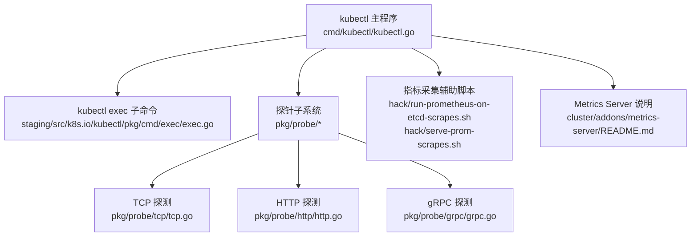
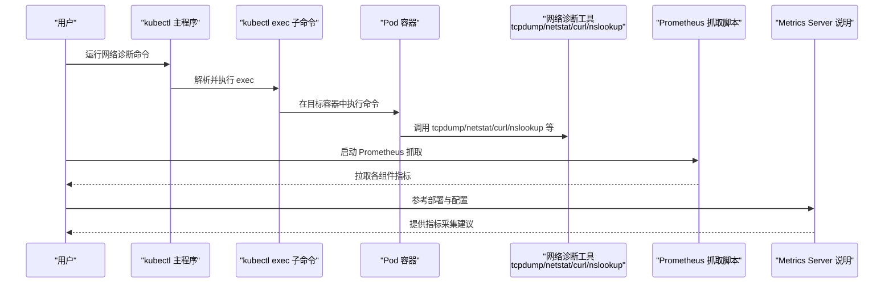
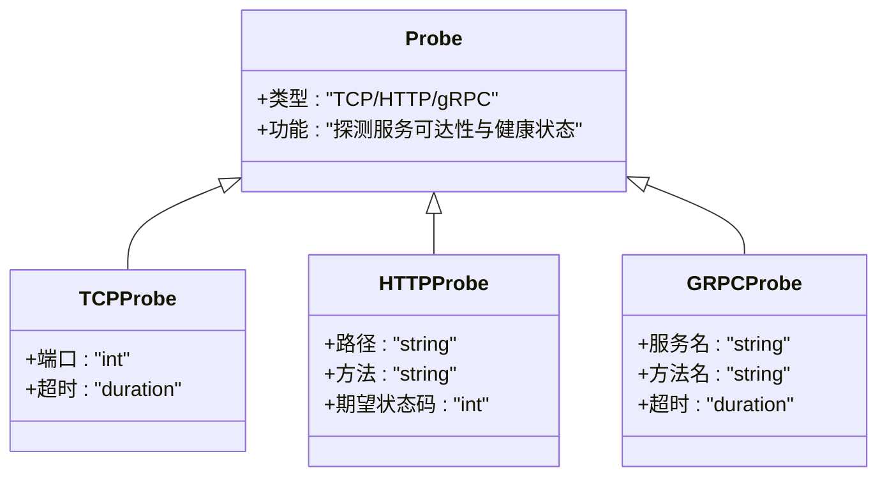
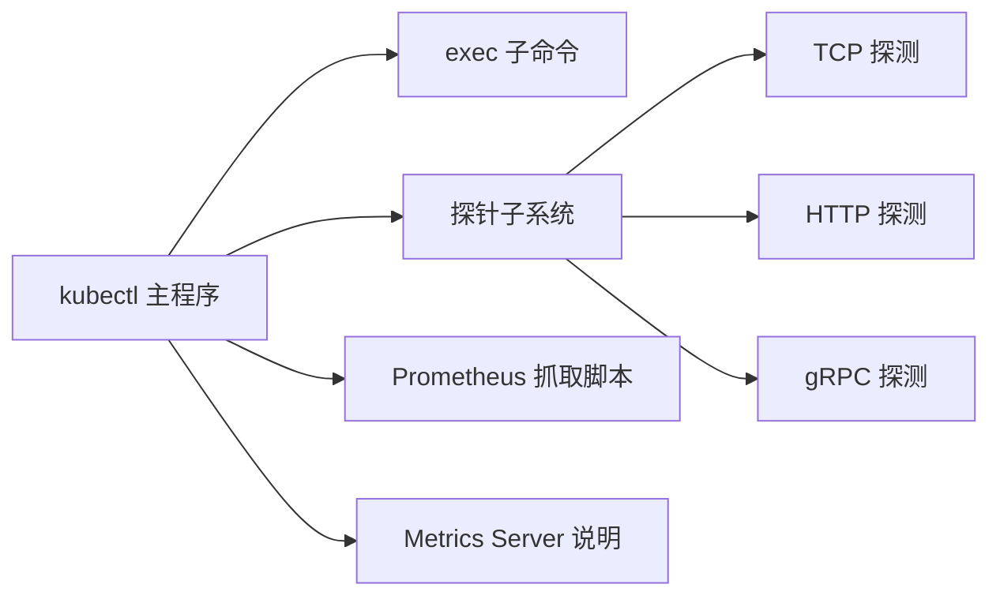
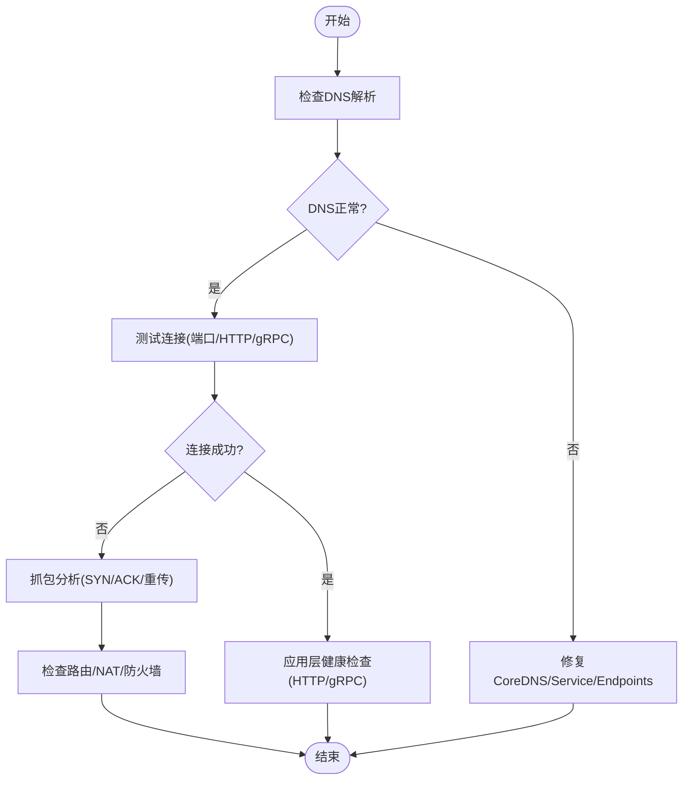

# 网络调试与监控

<cite>
**本文引用的文件**   
- [cmd/kubectl/kubectl.go](file://cmd/kubectl/kubectl.go)
- [staging/src/k8s.io/kubectl/pkg/cmd/exec/exec.go](file://staging/src/k8s.io/kubectl/pkg/cmd/exec/exec.go)
- [pkg/probe/tcp/tcp.go](file://pkg/probe/tcp/tcp.go)
- [pkg/probe/http/http.go](file://pkg/probe/http/http.go)
- [pkg/probe/grpc/grpc.go](file://pkg/probe/grpc/grpc.go)
- [pkg/probe/dialer_others.go](file://pkg/probe/dialer_others.go)
- [pkg/probe/util.go](file://pkg/probe/util.go)
- [cluster/addons/metrics-server/README.md](file://cluster/addons/metrics-server/README.md)
- [hack/run-prometheus-on-etcd-scrapes.sh](file://hack/run-prometheus-on-etcd-scrapes.sh)
- [hack/serve-prom-scrapes.sh](file://hack/serve-prom-scrapes.sh)
</cite>

## 目录
1. [简介](#简介)
2. [项目结构](#项目结构)
3. [核心组件](#核心组件)
4. [架构总览](#架构总览)
5. [详细组件分析](#详细组件分析)
6. [依赖关系分析](#依赖关系分析)
7. [性能考虑](#性能考虑)
8. [故障排查指南](#故障排查指南)
9. [结论](#结论)
10. [附录](#附录)

## 简介
本技术文档面向Kubernetes集群的网络调试与监控，聚焦以下目标：
- 使用kubectl进行网络诊断：包括kubectl debug、kubectl exec以及基于探针的连通性测试思路。
- 收集与分析网络指标：Prometheus抓取与Grafana可视化（结合仓库内metrics-server与Prometheus脚本）。
- 常见网络问题排查流程：连接超时、DNS解析失败、服务不可达等。
- 网络性能分析工具与实践：tcpdump、netstat及第三方方案；延迟测量、带宽监控与流量分析最佳实践。

## 项目结构
仓库包含kubectl源码入口、exec命令实现、探针子系统（TCP/HTTP/gRPC）以及用于指标采集的辅助脚本与说明文档。这些内容共同支撑了“从命令行到系统探针再到指标采集”的端到端网络可观测能力。

图表来源
- [cmd/kubectl/kubectl.go:1-45](file://cmd/kubectl/kubectl.go#L1-L45)
- [staging/src/k8s.io/kubectl/pkg/cmd/exec/exec.go](file://staging/src/k8s.io/kubectl/pkg/cmd/exec/exec.go)
- [pkg/probe/tcp/tcp.go](file://pkg/probe/tcp/tcp.go)
- [pkg/probe/http/http.go](file://pkg/probe/http/http.go)
- [pkg/probe/grpc/grpc.go](file://pkg/probe/grpc/grpc.go)
- [hack/run-prometheus-on-etcd-scrapes.sh](file://hack/run-prometheus-on-etcd-scrapes.sh)
- [hack/serve-prom-scrapes.sh](file://hack/serve-prom-scrapes.sh)
- [cluster/addons/metrics-server/README.md](file://cluster/addons/metrics-server/README.md)

章节来源
- [cmd/kubectl/kubectl.go:1-45](file://cmd/kubectl/kubectl.go#L1-L45)

## 核心组件
- kubectl 主程序：负责初始化日志级别、构建默认命令树并执行。该入口为所有kubectl子命令（含网络相关）的统一起点。
- kubectl exec：在Pod中执行命令，是进入容器进行网络诊断（如curl、nslookup、ping、tcpdump、netstat等）的关键手段。
- 探针子系统：提供TCP/HTTP/gRPC三类探测能力，可用于验证服务可达性与健康状态，间接辅助网络连通性判断。
- 指标采集辅助脚本：提供Prometheus抓取示例与本地转发能力，便于快速搭建最小化监控链路。
- Metrics Server说明：描述如何部署与启用资源指标，可作为网络指标可视化的基础数据源之一。

章节来源
- [cmd/kubectl/kubectl.go:1-45](file://cmd/kubectl/kubectl.go#L1-L45)
- [staging/src/k8s.io/kubectl/pkg/cmd/exec/exec.go](file://staging/src/k8s.io/kubectl/pkg/cmd/exec/exec.go)
- [pkg/probe/tcp/tcp.go](file://pkg/probe/tcp/tcp.go)
- [pkg/probe/http/http.go](file://pkg/probe/http/http.go)
- [pkg/probe/grpc/grpc.go](file://pkg/probe/grpc/grpc.go)
- [hack/run-prometheus-on-etcd-scrapes.sh](file://hack/run-prometheus-on-etcd-scrapes.sh)
- [hack/serve-prom-scrapes.sh](file://hack/serve-prom-scrapes.sh)
- [cluster/addons/metrics-server/README.md](file://cluster/addons/metrics-server/README.md)

## 架构总览
下图展示了从kubectl命令到容器内诊断、再到指标采集与可视化的整体路径。kubectl作为统一入口，通过exec进入容器执行网络诊断工具；同时，探针子系统可用于应用层连通性验证；指标侧通过Prometheus抓取各组件暴露的指标，并由Grafana展示。

图表来源
- [cmd/kubectl/kubectl.go:1-45](file://cmd/kubectl/kubectl.go#L1-L45)
- [staging/src/k8s.io/kubectl/pkg/cmd/exec/exec.go](file://staging/src/k8s.io/kubectl/pkg/cmd/exec/exec.go)
- [hack/run-prometheus-on-etcd-scrapes.sh](file://hack/run-prometheus-on-etcd-scrapes.sh)
- [hack/serve-prom-scrapes.sh](file://hack/serve-prom-scrapes.sh)
- [cluster/addons/metrics-server/README.md](file://cluster/addons/metrics-server/README.md)

## 详细组件分析

### kubectl 主程序
- 职责：设置日志级别、构建默认命令树、执行命令。
- 关键点：在正常流程之前提前解析verbosity参数，确保插件与配置文件解析阶段仍可使用klog输出。
- 与网络调试的关系：作为所有kubectl子命令（含debug、exec等）的统一入口。

章节来源
- [cmd/kubectl/kubectl.go:1-45](file://cmd/kubectl/kubectl.go#L1-L45)

### kubectl exec 子命令
- 职责：在指定Pod的容器中执行命令，支持交互式会话。
- 典型用法：进入容器后执行网络诊断工具（如curl、nslookup、ping、tcpdump、netstat/ss等），定位DNS、路由、端口监听、连接建立等问题。
- 注意事项：需具备相应RBAC权限；某些镜像可能不包含全部工具，可通过临时挂载或替换镜像方式补齐。

章节来源
- [staging/src/k8s.io/kubectl/pkg/cmd/exec/exec.go](file://staging/src/k8s.io/kubectl/pkg/cmd/exec/exec.go)

### 探针子系统（TCP/HTTP/gRPC）
- 职责：提供三种协议级别的探测能力，常用于健康检查与服务可达性验证。
- 适用场景：
  - TCP：验证端口是否开放与可达。
  - HTTP：验证HTTP接口可用性（状态码、响应体等）。
  - gRPC：验证gRPC服务可用性与元数据交互。
- 与网络调试的关系：当应用层出现异常时，探针结果可帮助区分是网络层问题还是应用逻辑问题。

图表来源
- [pkg/probe/tcp/tcp.go](file://pkg/probe/tcp/tcp.go)
- [pkg/probe/http/http.go](file://pkg/probe/http/http.go)
- [pkg/probe/grpc/grpc.go](file://pkg/probe/grpc/grpc.go)

章节来源
- [pkg/probe/tcp/tcp.go](file://pkg/probe/tcp/tcp.go)
- [pkg/probe/http/http.go](file://pkg/probe/http/http.go)
- [pkg/probe/grpc/grpc.go](file://pkg/probe/grpc/grpc.go)
- [pkg/probe/dialer_others.go](file://pkg/probe/dialer_others.go)
- [pkg/probe/util.go](file://pkg/probe/util.go)

### 指标采集与可视化（Prometheus/Grafana）
- 抓取脚本：仓库提供用于Prometheus抓取的脚本，便于快速拉起最小化监控环境。
- Metrics Server：提供资源指标（CPU/内存等）的聚合与API，可作为可视化面板的数据源之一。
- 可视化：将Prometheus指标导入Grafana，构建网络相关的仪表盘（如连接数、错误率、延迟分位等）。

章节来源
- [hack/run-prometheus-on-etcd-scrapes.sh](file://hack/run-prometheus-on-etcd-scrapes.sh)
- [hack/serve-prom-scrapes.sh](file://hack/serve-prom-scrapes.sh)
- [cluster/addons/metrics-server/README.md](file://cluster/addons/metrics-server/README.md)

## 依赖关系分析
- kubectl主程序依赖命令注册与CLI框架，从而加载exec等子命令。
- exec子命令依赖运行时客户端与容器运行时接口以在Pod中执行命令。
- 探针子系统依赖底层拨号器与通用工具函数，分别实现TCP/HTTP/gRPC探测。
- 指标采集脚本与Metrics Server说明为外部生态集成点，不直接耦合于kubectl代码。

图表来源
- [cmd/kubectl/kubectl.go:1-45](file://cmd/kubectl/kubectl.go#L1-L45)
- [staging/src/k8s.io/kubectl/pkg/cmd/exec/exec.go](file://staging/src/k8s.io/kubectl/pkg/cmd/exec/exec.go)
- [pkg/probe/tcp/tcp.go](file://pkg/probe/tcp/tcp.go)
- [pkg/probe/http/http.go](file://pkg/probe/http/http.go)
- [pkg/probe/grpc/grpc.go](file://pkg/probe/grpc/grpc.go)
- [hack/run-prometheus-on-etcd-scrapes.sh](file://hack/run-prometheus-on-etcd-scrapes.sh)
- [hack/serve-prom-scrapes.sh](file://hack/serve-prom-scrapes.sh)
- [cluster/addons/metrics-server/README.md](file://cluster/addons/metrics-server/README.md)

## 性能考虑
- 探针频率与超时：合理设置探测间隔与超时，避免对目标服务造成压力。
- 抓包范围与时长：tcpdump应限定时间窗口与过滤条件，减少I/O开销。
- 指标采样：Prometheus抓取间隔应与业务SLA匹配，避免过密导致存储与计算压力。
- 带宽与延迟：结合eBPF或内核统计（如tc、ss）进行更细粒度的带宽与延迟观测。

## 故障排查指南
以下为常见网络问题的系统化排查流程，结合kubectl exec与探针能力：

- 连接超时
  - 步骤：
    - 在Pod内执行基本连通性测试（如curl/telnet/nc）。
    - 使用tcpdump捕获握手过程，确认SYN/SYN-ACK/ACK是否正常。
    - 检查iptables/NAT规则与Service/Endpoint映射。
  - 关联组件：
    - exec子命令用于进入容器执行诊断。
    - 探针TCP能力用于快速验证端口可达性。

- DNS解析失败
  - 步骤：
    - 在Pod内执行nslookup/dig验证CoreDNS解析。
    - 检查kube-dns/CoreDNS Pod状态与日志。
    - 校验ClusterIP与Endpoints是否正确。
  - 关联组件：
    - exec子命令用于执行DNS查询。
    - 探针HTTP能力可用于验证上游服务是否可被正确解析与访问。

- 服务不可达
  - 步骤：
    - 使用kubectl describe查看Service、Endpoints、Ingress等资源状态。
    - 在Pod内执行curl验证HTTP/gRPC接口。
    - 使用探针HTTP/gRPC进行自动化健康检查。
  - 关联组件：
    - exec子命令用于执行应用层请求。
    - 探针HTTP/gRPC用于持续健康检查。

[此图为概念流程图，无需图表来源]

## 结论
通过将kubectl exec、探针子系统与Prometheus/Metrics Server相结合，可以形成覆盖“命令式诊断—自动化健康检查—指标采集与可视化”的完整网络可观测闭环。建议在生产环境中：
- 标准化exec诊断清单与常用镜像。
- 为关键服务配置TCP/HTTP/gRPC探针。
- 建立Prometheus+Grafana的最小化监控看板，持续跟踪连接、错误与延迟指标。

## 附录
- 常用诊断命令（在Pod内执行）：
  - curl：验证HTTP服务。
  - nslookup/dig：验证DNS解析。
  - ping/traceroute：验证网络路径。
  - tcpdump：抓包分析。
  - netstat/ss：查看连接与端口监听。
- 指标采集建议：
  - 使用仓库提供的Prometheus抓取脚本快速搭建。
  - 参考Metrics Server说明部署资源指标，并在Grafana中创建对应面板。