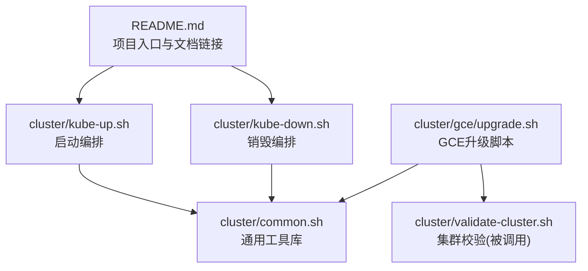
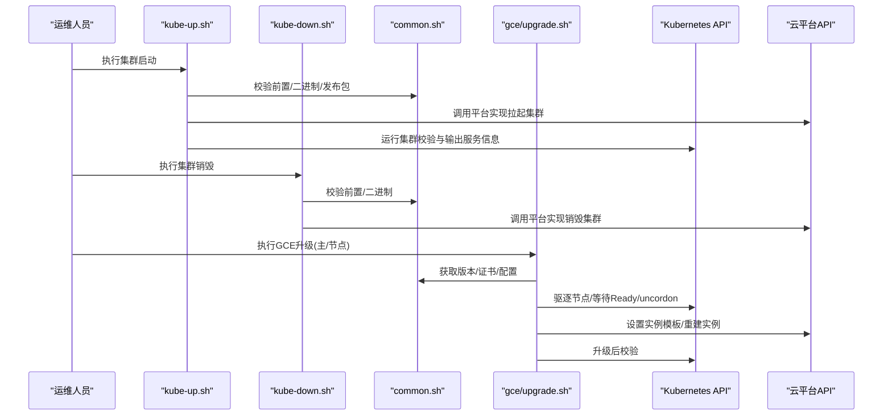
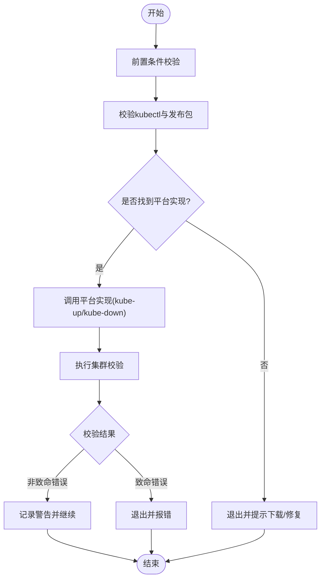
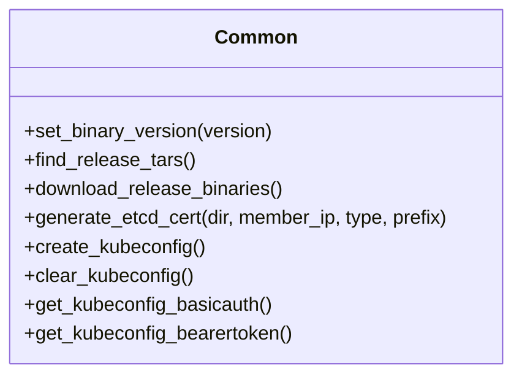
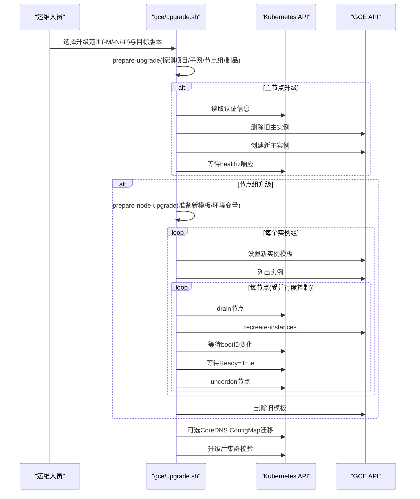
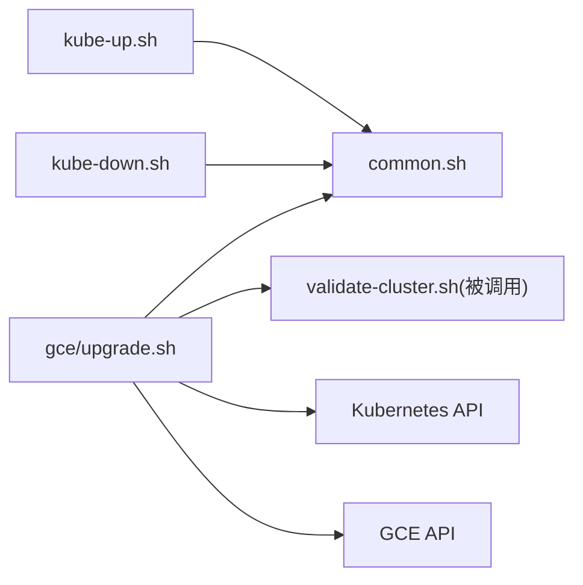

# 升级与维护

<cite>
**本文引用的文件**   
- [README.md](file://README.md)
- [kube-up.sh](file://cluster/kube-up.sh)
- [kube-down.sh](file://cluster/kube-down.sh)
- [common.sh](file://cluster/common.sh)
- [upgrade.sh](file://cluster/gce/upgrade.sh)
</cite>

## 目录
1. [简介](#简介)
2. [项目结构](#项目结构)
3. [核心组件](#核心组件)
4. [架构总览](#架构总览)
5. [详细组件分析](#详细组件分析)
6. [依赖关系分析](#依赖关系分析)
7. [性能与风险控制](#性能与风险控制)
8. [故障排查指南](#故障排查指南)
9. [结论](#结论)
10. [附录](#附录)

## 简介
本指南面向Kubernetes集群的升级与维护，聚焦以下目标：
- 版本升级策略与回滚机制
- 滚动升级的实施步骤与风险控制
- 不同升级路径（含API版本变更、数据格式转换）迁移指南
- 补丁管理与安全更新最佳实践
- 升级前准备清单与升级后验证步骤
- 常见问题的诊断与解决方法
- 备份恢复与灾难恢复流程

说明：
- 仓库根文档提供总体入口与社区支持链接，便于查阅官方文档与问题排查指引。
- 脚本层提供了集群启动/关闭、通用工具函数以及GCE平台的升级流程参考实现，可作为生产环境操作蓝本。

章节来源
- [README.md:1-101](file://README.md#L1-L101)

## 项目结构
围绕“升级与维护”主题，仓库中与操作相关的脚本主要位于 cluster 目录：
- cluster/kube-up.sh：集群启动编排入口，包含前置校验、调用平台相关 kube-up、集群校验与输出信息
- cluster/kube-down.sh：集群销毁编排入口，包含前置校验与调用平台相关 kube-down
- cluster/common.sh：通用工具库，涵盖版本解析、二进制查找与下载、证书生成、kubeconfig 管理、基础认证等
- cluster/gce/upgrade.sh：GCE 平台实验性升级脚本，覆盖主节点与节点组升级、CoreDNS配置迁移、升级前后校验等

图表来源
- [kube-up.sh:1-80](file://cluster/kube-up.sh#L1-L80)
- [kube-down.sh:1-41](file://cluster/kube-down.sh#L1-L41)
- [common.sh:1-554](file://cluster/common.sh#L1-L554)
- [upgrade.sh:1-691](file://cluster/gce/upgrade.sh#L1-L691)

章节来源
- [kube-up.sh:1-80](file://cluster/kube-up.sh#L1-L80)
- [kube-down.sh:1-41](file://cluster/kube-down.sh#L1-L41)
- [common.sh:1-554](file://cluster/common.sh#L1-L554)
- [upgrade.sh:1-691](file://cluster/gce/upgrade.sh#L1-L691)

## 核心组件
- 启动/销毁编排
  - kube-up.sh：负责前置条件检查、二进制与发布包校验、调用平台实现完成集群拉起，并执行集群校验与输出服务信息
  - kube-down.sh：负责前置条件检查、二进制校验、调用平台实现完成集群销毁
- 通用工具库
  - common.sh：提供版本解析、二进制查找与下载、证书生成、kubeconfig 创建/清理、基本认证与Bearer Token处理等能力
- GCE升级脚本
  - upgrade.sh：提供主节点与节点组的升级流程，包括实例模板准备、节点驱逐与重建、等待就绪、CoreDNS配置迁移、升级前后校验等

章节来源
- [kube-up.sh:1-80](file://cluster/kube-up.sh#L1-L80)
- [kube-down.sh:1-41](file://cluster/kube-down.sh#L1-L41)
- [common.sh:1-554](file://cluster/common.sh#L1-L554)
- [upgrade.sh:1-691](file://cluster/gce/upgrade.sh#L1-L691)

## 架构总览
从“升级与维护”视角，整体流程由编排脚本驱动，调用通用工具与平台特定逻辑，最终通过 kubectl 与云平台API完成资源与实例的变更。

图表来源
- [kube-up.sh:1-80](file://cluster/kube-up.sh#L1-L80)
- [kube-down.sh:1-41](file://cluster/kube-down.sh#L1-L41)
- [common.sh:1-554](file://cluster/common.sh#L1-L554)
- [upgrade.sh:1-691](file://cluster/gce/upgrade.sh#L1-L691)

## 详细组件分析

### 组件A：集群启动与销毁编排（kube-up.sh / kube-down.sh）
职责与要点
- 统一入口：封装平台无关的前置校验、二进制与发布包校验，再委派到具体平台实现
- 失败模式区分：对集群校验结果进行分级处理（致命错误与非致命错误）
- 代理提示：在启用代理时输出白名单配置提示

实施建议
- 在生产中，将 kube-up.sh/kube-down.sh 作为标准操作入口，避免直接调用平台脚本
- 结合CI/CD流水线，将前置校验与二进制校验纳入门禁

图表来源
- [kube-up.sh:1-80](file://cluster/kube-up.sh#L1-L80)
- [kube-down.sh:1-41](file://cluster/kube-down.sh#L1-L41)

章节来源
- [kube-up.sh:1-80](file://cluster/kube-up.sh#L1-L80)
- [kube-down.sh:1-41](file://cluster/kube-down.sh#L1-L41)

### 组件B：通用工具库（common.sh）
关键能力
- 版本解析与发布制品定位：根据传入的版本或发布通道解析实际版本号，并在多个已知位置查找服务器/节点/清单tar包
- 二进制下载：当缺失必要制品时，引导用户自动下载
- 证书生成：为etcd生成CA与server/client/peer证书，支持外部提供的CA密钥
- kubeconfig管理：创建/清理上下文、提取basic auth与Bearer Token、生成随机密码/Token

升级相关影响
- set_binary_version/find-release-tars/download-release-binaries 决定了升级使用的二进制来源与一致性
- generate-etcd-cert 可用于升级过程中证书轮换或新集群初始化

图表来源
- [common.sh:1-554](file://cluster/common.sh#L1-L554)

章节来源
- [common.sh:1-554](file://cluster/common.sh#L1-L554)

### 组件C：GCE平台升级脚本（upgrade.sh）
升级策略与流程
- 主节点升级：仅支持单副本主节点；删除旧主实例并创建新实例，等待健康探针返回
- 节点组升级：基于实例模板替换与受控并行度，逐节点驱逐、重建、等待Ready、取消污点
- CoreDNS配置迁移：检测新旧版本差异，使用迁移工具升级ConfigMap或在降级时应用默认配置
- 存储介质类型与etcd版本提示：在非交互模式下要求显式指定存储介质类型与etcd版本，避免不可回滚的升级路径

风险控制措施
- 并行度控制：通过参数限制同时升级的节点数，降低并发风险
- 状态等待：严格等待节点bootID变化与Ready=True，确保升级生效后再继续
- 模板管理：升级完成后清理旧实例模板，减少资源残留

回滚机制
- 主节点：可通过保留的主盘与镜像/模板快速重建旧版本主实例（需配合平台镜像与磁盘快照策略）
- 节点组：通过回退实例模板至旧版本，再次触发滚动重建实现回滚
- etcd：若涉及不可回滚的etcd版本升级，应提前备份并在必要时进行数据恢复

图表来源
- [upgrade.sh:1-691](file://cluster/gce/upgrade.sh#L1-L691)

章节来源
- [upgrade.sh:1-691](file://cluster/gce/upgrade.sh#L1-L691)

## 依赖关系分析
- 编排脚本依赖通用工具库进行版本与制品管理、证书与配置处理
- 升级脚本依赖k8s API进行节点驱逐与状态查询，依赖云平台API进行实例与模板操作
- 集群校验脚本在启动与升级后被调用，用于保障集群可用性

图表来源
- [kube-up.sh:1-80](file://cluster/kube-up.sh#L1-L80)
- [kube-down.sh:1-41](file://cluster/kube-down.sh#L1-L41)
- [common.sh:1-554](file://cluster/common.sh#L1-L554)
- [upgrade.sh:1-691](file://cluster/gce/upgrade.sh#L1-L691)

章节来源
- [kube-up.sh:1-80](file://cluster/kube-up.sh#L1-L80)
- [kube-down.sh:1-41](file://cluster/kube-down.sh#L1-L41)
- [common.sh:1-554](file://cluster/common.sh#L1-L554)
- [upgrade.sh:1-691](file://cluster/gce/upgrade.sh#L1-L691)

## 性能与风险控制
- 并行度控制：节点升级采用可控并行度，避免大规模并发导致的API压力与资源争用
- 状态机式等待：以bootID变化与Ready状态作为升级完成的强一致信号，防止误判
- 模板化升级：通过实例模板切换实现可预测的滚动升级，便于回滚与审计
- 最小权限与隔离：在自动化流程中使用最小权限的凭据与上下文，避免越权操作

[本节为通用指导，不直接分析具体文件]

## 故障排查指南
常见问题与定位思路
- 二进制缺失或版本不一致
  - 现象：前置校验失败或无法访问API
  - 处理：使用通用工具自动下载或手动放置对应版本的发布制品
- 认证失败
  - 现象：访问API报鉴权错误
  - 处理：检查kubeconfig中的basic auth或Bearer Token是否正确注入
- 节点无法就绪
  - 现象：drain成功但节点长时间未Ready
  - 处理：查看节点日志与事件，确认内核模块、容器运行时与网络插件是否正常
- CoreDNS异常
  - 现象：升级后域名解析失败
  - 处理：检查CoreDNS Deployment与ConfigMap，必要时回退到默认配置或重新迁移

章节来源
- [common.sh:1-554](file://cluster/common.sh#L1-L554)
- [upgrade.sh:1-691](file://cluster/gce/upgrade.sh#L1-L691)

## 结论
- 使用统一的编排入口与通用工具库，可显著提升升级的一致性与可重复性
- 基于实例模板与受控并行的滚动升级，能有效平衡可用性与风险
- 针对etcd与CoreDNS等关键组件，需在升级前明确存储介质类型与版本兼容性，并做好备份与回滚预案
- 将升级流程纳入CI/CD与变更管控，结合严格的校验与监控，可大幅降低生产风险

[本节为总结性内容，不直接分析具体文件]

## 附录

### 升级前准备工作清单
- 环境与制品
  - 确认目标版本与发布制品已就绪（服务器/节点/清单）
  - 校验kubectl客户端版本与集群兼容
- 备份与快照
  - 对etcd数据进行完整备份
  - 对主节点系统盘与数据盘进行快照
  - 保存当前实例模板与镜像清单
- 配置与依赖
  - 评估并记录etcd存储介质类型与版本兼容性
  - 评估CoreDNS版本与配置迁移需求
  - 准备必要的认证凭据（basic auth/Bearer Token）
- 计划与演练
  - 制定窗口期与回滚方案
  - 在预发环境进行全流程演练

章节来源
- [common.sh:1-554](file://cluster/common.sh#L1-L554)
- [upgrade.sh:1-691](file://cluster/gce/upgrade.sh#L1-L691)

### 滚动升级实施步骤（参考）
- 准备阶段
  - 确定升级范围（主节点/节点组）、目标版本与并行度
  - 准备新实例模板与环境变量
- 主节点升级（如适用）
  - 删除旧主实例并创建新实例
  - 等待API健康探针返回
- 节点组升级
  - 设置新实例模板
  - 按并行度逐个节点：drain → 重建 → 等待bootID变化 → 等待Ready → uncordon
  - 清理旧模板
- 附加组件升级
  - 根据版本差异迁移CoreDNS配置或应用默认配置
- 升级后校验
  - 运行集群校验脚本，确认各组件状态正常

章节来源
- [upgrade.sh:1-691](file://cluster/gce/upgrade.sh#L1-L691)

### 回滚机制与灾难恢复
- 主节点回滚
  - 使用快照恢复主节点系统盘与数据盘，重启旧版本主实例
- 节点组回滚
  - 将实例模板切换回旧版本，触发滚动重建
- etcd灾难恢复
  - 使用最近一次可靠备份恢复数据，并重启etcd成员
- CoreDNS回退
  - 在降级场景下应用默认CoreDNS配置，或回退到之前迁移前的ConfigMap

章节来源
- [upgrade.sh:1-691](file://cluster/gce/upgrade.sh#L1-L691)

### 补丁管理与安全更新最佳实践
- 建立基线与变更台账，记录每次升级的目标版本、变更项与验证结果
- 优先采用小步快跑与灰度发布策略，逐步扩大影响面
- 对关键组件（API Server、Controller Manager、Scheduler、Kubelet、CoreDNS、etcd）分别评估兼容性
- 将安全补丁纳入例行维护窗口，结合自动化测试与回归验证

[本节为通用指导，不直接分析具体文件]

### 升级后验证步骤
- 组件健康
  - 检查各组件Pod状态与事件
  - 验证API Server健康端点可达
- 工作负载
  - 抽样验证关键Deployment/StatefulSet/DaemonSet的滚动状态
  - 检查Service与Ingress连通性
- 存储与网络
  - 验证PV/PVC绑定与I/O
  - 验证跨节点Pod通信与DNS解析
- 监控与日志
  - 核对关键指标无异常波动
  - 收集并归档升级过程日志

章节来源
- [kube-up.sh:1-80](file://cluster/kube-up.sh#L1-L80)
- [upgrade.sh:1-691](file://cluster/gce/upgrade.sh#L1-L691)