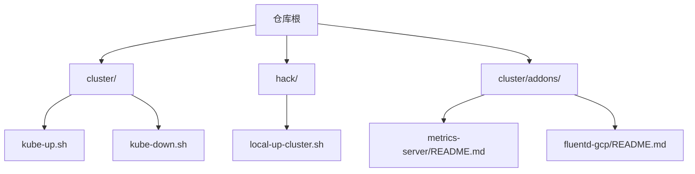
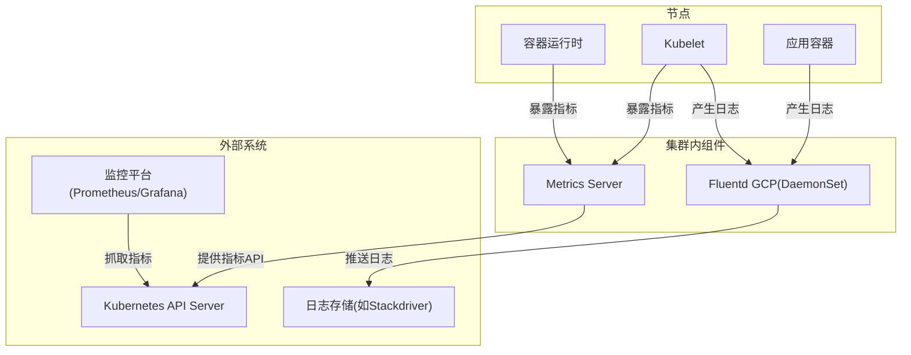
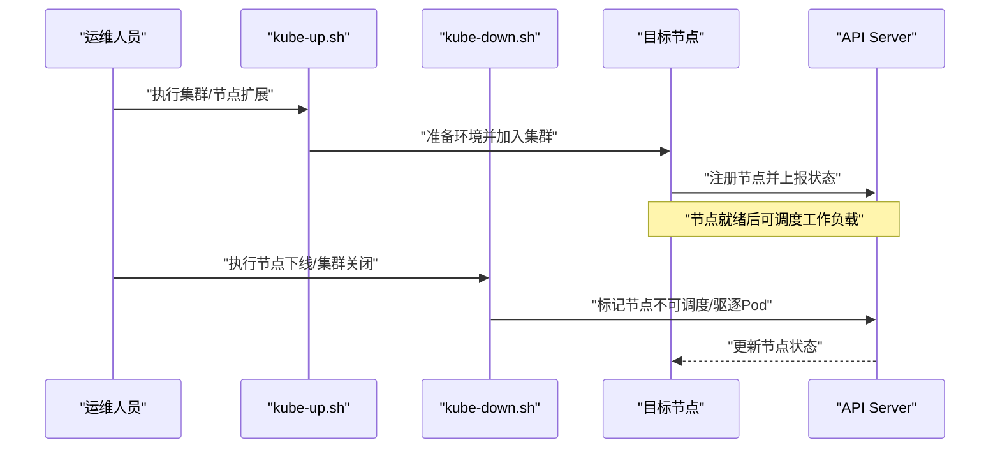
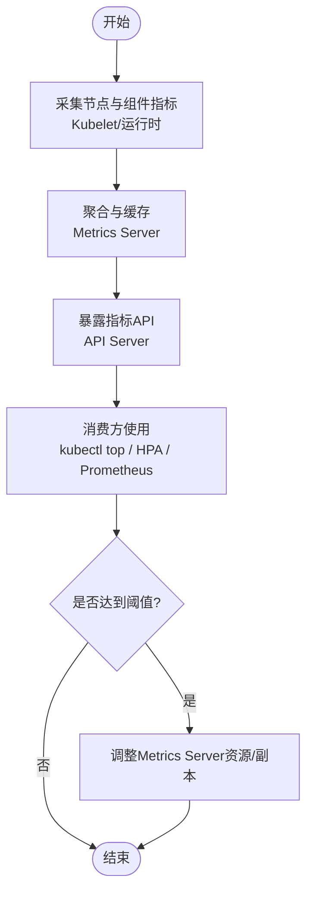
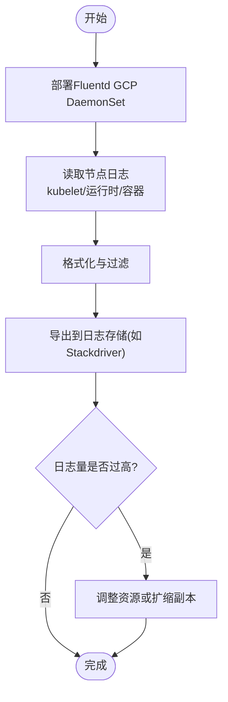
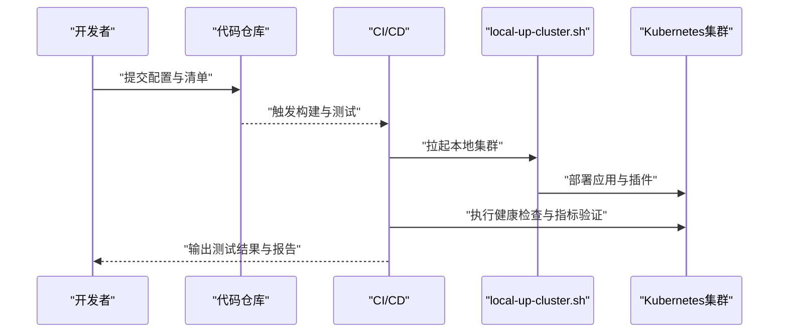
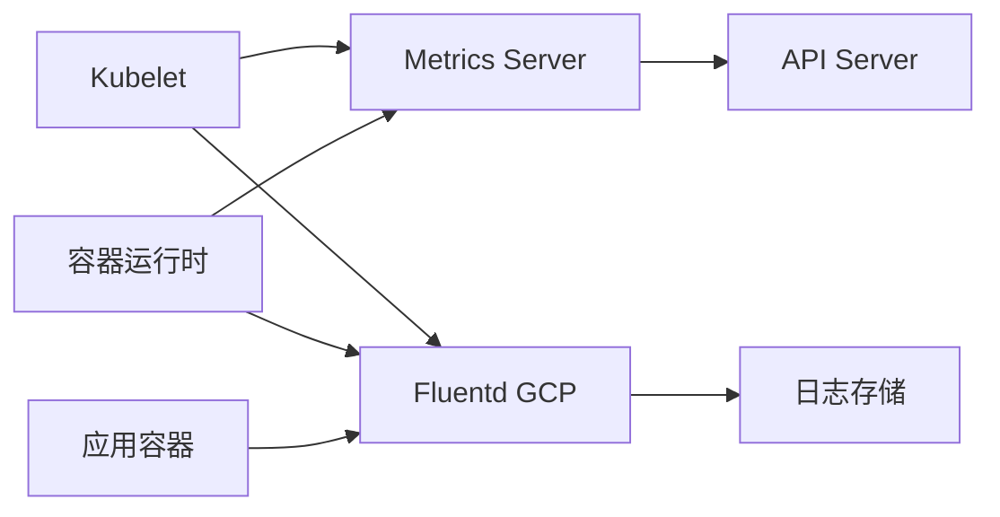

# 日常运维

<cite>
**本文引用的文件**   
- [README.md](file://README.md)
- [cluster/addons/metrics-server/README.md](file://cluster/addons/metrics-server/README.md)
- [cluster/addons/fluentd-gcp/README.md](file://cluster/addons/fluentd-gcp/README.md)
- [cluster/kube-up.sh](file://cluster/kube-up.sh)
- [cluster/kube-down.sh](file://cluster/kube-down.sh)
- [hack/local-up-cluster.sh](file://hack/local-up-cluster.sh)
</cite>

## 目录
1. [简介](#简介)
2. [项目结构](#项目结构)
3. [核心组件](#核心组件)
4. [架构总览](#架构总览)
5. [详细组件分析](#详细组件分析)
6. [依赖分析](#依赖分析)
7. [性能考虑](#性能考虑)
8. [故障排查指南](#故障排查指南)
9. [结论](#结论)
10. [附录](#附录)

## 简介
本指南面向Kubernetes日常运维，聚焦以下主题：节点管理（添加、移除、维护模式）、资源监控与性能分析（含Prometheus集成思路与指标收集）、故障排查标准流程与常用诊断工具、日志收集与聚合配置、容量规划与配额管理、成本优化策略、安全加固与合规检查、自动化运维脚本与CI/CD集成。内容基于仓库中现有文档与脚本进行提炼，确保可操作且可追溯。

## 项目结构
仓库包含集群启动/停止脚本、官方插件清单与说明等关键运维素材：
- cluster/kube-up.sh、cluster/kube-down.sh：集群启停相关脚本入口
- hack/local-up-cluster.sh：本地快速搭建集群的脚本
- cluster/addons/metrics-server/README.md：Metrics Server 插件说明与注意事项
- cluster/addons/fluentd-gcp/README.md：Fluentd GCP 日志采集插件说明与扩缩容建议
- README.md：项目总体说明与社区支持链接

图表来源
- [cluster/kube-up.sh](file://cluster/kube-up.sh)
- [cluster/kube-down.sh](file://cluster/kube-down.sh)
- [hack/local-up-cluster.sh](file://hack/local-up-cluster.sh)
- [cluster/addons/metrics-server/README.md](file://cluster/addons/metrics-server/README.md)
- [cluster/addons/fluentd-gcp/README.md](file://cluster/addons/fluentd-gcp/README.md)

章节来源
- [README.md:1-101](file://README.md#L1-L101)

## 核心组件
- Metrics Server：提供核心Kubernetes指标API，支撑kubectl top与HPA等功能；在大规模Pod场景下需关注资源限制与扩容策略。
- Fluentd GCP：以DaemonSet方式在每个节点采集kubelet、容器运行时与应用日志并上报至云端日志服务；高吞吐日志场景需要调整资源或扩缩副本。

章节来源
- [cluster/addons/metrics-server/README.md:1-19](file://cluster/addons/metrics-server/README.md#L1-L19)
- [cluster/addons/fluentd-gcp/README.md:1-75](file://cluster/addons/fluentd-gcp/README.md#L1-L75)

## 架构总览
下图展示“监控与日志”在日常运维中的典型数据流：节点侧组件采集指标与日志，通过API或外部系统汇聚，供运维人员查询与告警使用。

图表来源
- [cluster/addons/metrics-server/README.md:1-19](file://cluster/addons/metrics-server/README.md#L1-L19)
- [cluster/addons/fluentd-gcp/README.md:1-75](file://cluster/addons/fluentd-gcp/README.md#L1-L75)

## 详细组件分析

### 节点管理（添加、移除、维护模式）
- 节点添加
  - 使用集群初始化与扩缩脚本完成节点加入与注册，参考集群启动脚本入口。
- 节点移除
  - 通过集群停止/清理脚本执行节点下线与资源回收。
- 维护模式切换
  - 将节点置为维护模式通常涉及污点与驱逐策略，结合节点生命周期控制器实现。

图表来源
- [cluster/kube-up.sh](file://cluster/kube-up.sh)
- [cluster/kube-down.sh](file://cluster/kube-down.sh)

章节来源
- [cluster/kube-up.sh](file://cluster/kube-up.sh)
- [cluster/kube-down.sh](file://cluster/kube-down.sh)

### 资源监控与性能分析（Prometheus集成与指标收集）
- 指标来源
  - 节点与组件指标由Kubelet与容器运行时暴露，Metrics Server聚合后通过API Server对外提供。
- Prometheus集成思路
  - 通过Prometheus抓取API Server提供的指标端点，或使用各组件原生指标端点进行采集。
- 注意事项
  - 在大规模Pod场景下，Metrics Server可能受限于资源导致限流或OOM，需按官方建议调整资源或启用自动扩容策略。

图表来源
- [cluster/addons/metrics-server/README.md:1-19](file://cluster/addons/metrics-server/README.md#L1-L19)

章节来源
- [cluster/addons/metrics-server/README.md:1-19](file://cluster/addons/metrics-server/README.md#L1-L19)

### 日志收集与聚合（Fluentd GCP）
- 采集范围
  - DaemonSet在每个节点上运行，采集kubelet、容器运行时与应用日志。
- 高吞吐场景
  - 当日志量较大时，可能出现OOM，可通过定义ScalingPolicy调整CPU/内存基线值，或按需扩缩副本。
- 回退默认
  - 删除自定义ScalingPolicy即可恢复为默认资源配置。

图表来源
- [cluster/addons/fluentd-gcp/README.md:1-75](file://cluster/addons/fluentd-gcp/README.md#L1-L75)

章节来源
- [cluster/addons/fluentd-gcp/README.md:1-75](file://cluster/addons/fluentd-gcp/README.md#L1-L75)

### 容量规划、资源配额管理与成本优化
- 容量规划
  - 依据业务峰值与增长趋势评估节点规模，结合HPA与垂直/水平扩缩容策略。
- 资源配额
  - 使用Namespace级ResourceQuota与LimitRange约束资源使用，避免单租户独占。
- 成本优化
  - 对非关键负载采用Spot/抢占式实例；合理设置请求与上限，减少碎片化；定期清理闲置资源。

[本节为通用指导，不直接分析具体文件]

### 安全加固与合规检查
- 最小权限原则
  - RBAC精细化授权，避免使用ClusterAdmin；ServiceAccount仅授予必要权限。
- 网络与访问控制
  - 启用NetworkPolicy限制跨命名空间通信；严格管控API Server访问面。
- 镜像与供应链安全
  - 镜像签名与漏洞扫描；只允许白名单镜像仓库。
- 审计与合规
  - 开启审计日志；定期进行合规基线检查与补丁升级。

[本节为通用指导，不直接分析具体文件]

### 自动化运维脚本与CI/CD集成
- 本地与测试环境
  - 使用本地集群脚本快速拉起开发/测试环境，便于联调与回归。
- CI/CD流水线
  - 在流水线中集成集群启停、健康检查、指标与日志拉取、自动化测试与发布。
- 版本与变更管理
  - 通过GitOps管理集群配置与插件版本，确保可追溯与可回滚。

图表来源
- [hack/local-up-cluster.sh](file://hack/local-up-cluster.sh)

章节来源
- [hack/local-up-cluster.sh](file://hack/local-up-cluster.sh)

## 依赖分析
- 组件耦合关系
  - Metrics Server依赖API Server暴露的指标端点；Fluentd GCP依赖节点文件系统与日志路径。
- 外部依赖
  - 日志导出依赖云日志服务；监控平台依赖指标API或组件端点。
- 风险点
  - 大规模Pod场景下Metrics Server资源不足；高吞吐日志导致Fluentd OOM。

图表来源
- [cluster/addons/metrics-server/README.md:1-19](file://cluster/addons/metrics-server/README.md#L1-L19)
- [cluster/addons/fluentd-gcp/README.md:1-75](file://cluster/addons/fluentd-gcp/README.md#L1-L75)

章节来源
- [cluster/addons/metrics-server/README.md:1-19](file://cluster/addons/metrics-server/README.md#L1-L19)
- [cluster/addons/fluentd-gcp/README.md:1-75](file://cluster/addons/fluentd-gcp/README.md#L1-L75)

## 性能考虑
- 指标采集
  - 合理设置Metrics Server资源与副本数，避免在高并发场景下被限流或OOM。
- 日志采集
  - 针对高吞吐日志场景，调整Fluentd资源或扩缩副本，确保稳定导出。
- 调度与亲和性
  - 将监控与日志组件调度到专用节点，降低对业务节点的干扰。

[本节为通用指导，不直接分析具体文件]

## 故障排查指南
- 常见问题定位
  - 指标不可用：检查Metrics Server资源与API Server连通性。
  - 日志丢失：检查Fluentd Pod状态、节点磁盘与网络连通性。
- 常用命令
  - 查看插件状态与资源占用，确认是否达到限制。
  - 查看节点与Pod事件，定位异常原因。
- 回退与恢复
  - 删除自定义ScalingPolicy恢复默认配置；必要时重启相关组件。

章节来源
- [cluster/addons/metrics-server/README.md:1-19](file://cluster/addons/metrics-server/README.md#L1-L19)
- [cluster/addons/fluentd-gcp/README.md:1-75](file://cluster/addons/fluentd-gcp/README.md#L1-L75)

## 结论
通过合理利用Metrics Server与Fluentd GCP等内置插件，并结合集群启停脚本与本地开发脚本，可以构建稳定的监控与日志体系。配合容量规划、配额管理、安全加固与自动化流水线，能够显著提升Kubernetes集群的可观测性与运维效率。

[本节为总结性内容，不直接分析具体文件]

## 附录
- 参考链接
  - 项目总体说明与支持入口见仓库根目录说明。
- 快速上手
  - 本地快速搭建集群可使用本地脚本，便于开发与测试。

章节来源
- [README.md:1-101](file://README.md#L1-L101)
- [hack/local-up-cluster.sh](file://hack/local-up-cluster.sh)