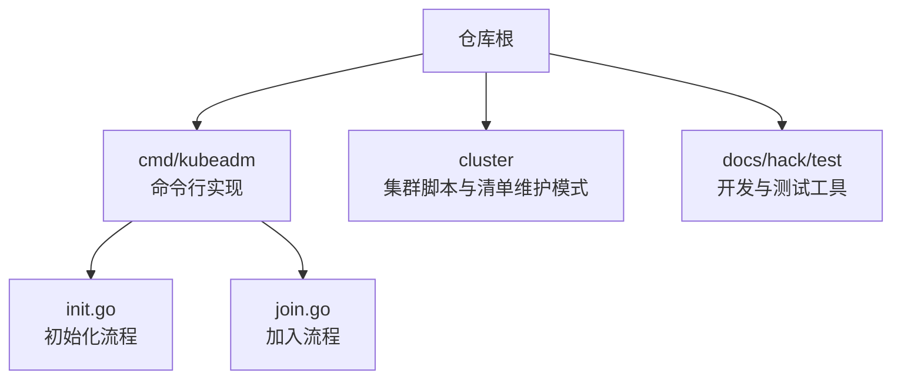
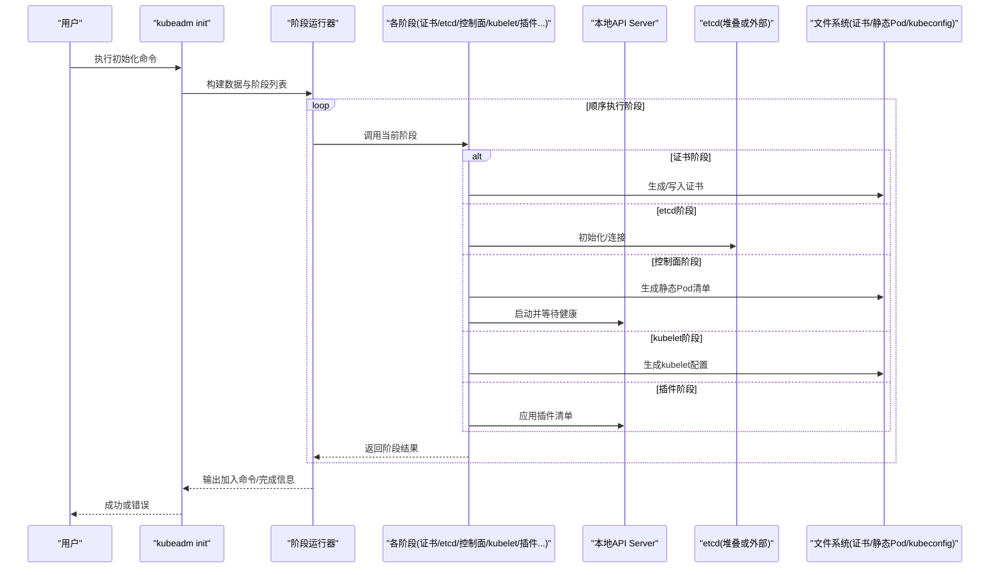
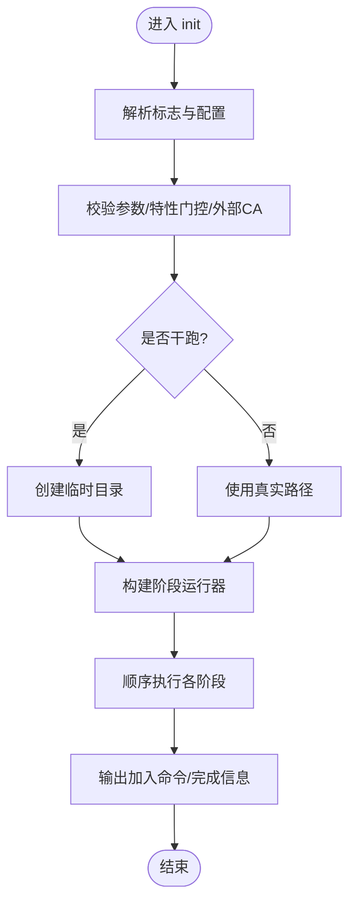
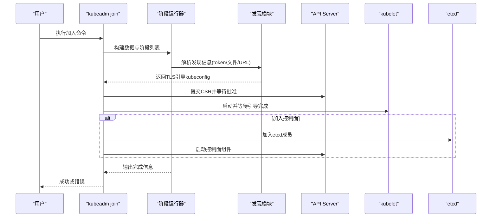
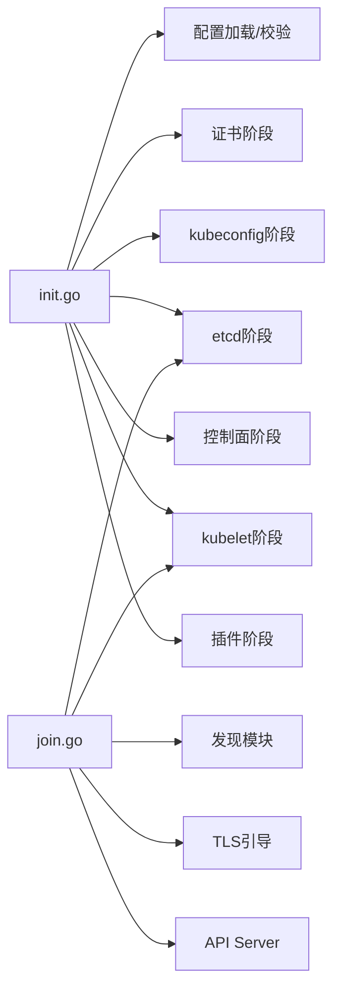

# 部署与运维

<cite>
**本文引用的文件**   
- [README.md](file://README.md)
- [cluster/README.md](file://cluster/README.md)
- [init.go](file://cmd/kubeadm/app/cmd/init.go)
- [join.go](file://cmd/kubeadm/app/cmd/join.go)
</cite>

## 目录
1. [简介](#简介)
2. [项目结构](#项目结构)
3. [核心组件](#核心组件)
4. [架构总览](#架构总览)
5. [详细组件分析](#详细组件分析)
6. [依赖关系分析](#依赖关系分析)
7. [性能考虑](#性能考虑)
8. [故障排查指南](#故障排查指南)
9. [结论](#结论)
10. [附录](#附录)

## 简介
本指南面向Kubernetes集群的部署与运维，聚焦于以下目标：
- 集群安装方式：kubeadm、二进制部署、云平台托管方案
- 高可用集群的架构设计与拓扑
- 升级策略与回滚机制
- 日常运维：节点管理、资源监控、故障处理
- 备份恢复、灾难恢复与安全加固最佳实践
- 性能调优参数与容量规划方法
- 自动化运维脚本与CI/CD集成实施方案

说明：仓库根README指向官方文档入口，cluster目录已处于维护模式并建议使用官方“开始使用”指南中的替代方案。因此，本文将结合仓库中kubeadm命令实现（init/join）进行落地化解读，并在需要处给出通用操作建议。

章节来源
- [README.md:1-101](file://README.md#L1-L101)
- [cluster/README.md:1-5](file://cluster/README.md#L1-L5)

## 项目结构
仓库包含大量源码与工具链，其中与部署和运维直接相关的部分包括：
- cmd/kubeadm：kubeadm命令行实现，涵盖初始化、加入、证书、配置、阶段执行等
- cluster：集群相关脚本与清单（已进入维护模式）
- docs/hack/test等：开发、测试与文档生成工具

图表来源
- [init.go:1-655](file://cmd/kubeadm/app/cmd/init.go#L1-L655)
- [join.go:1-729](file://cmd/kubeadm/app/cmd/join.go#L1-L729)

章节来源
- [README.md:1-101](file://README.md#L1-L101)
- [cluster/README.md:1-5](file://cluster/README.md#L1-L5)

## 核心组件
本节聚焦kubeadm在仓库中的关键实现，解释其如何驱动控制面与工作节点的创建与加入。

- kubeadm init
  - 负责控制面初始化，按阶段顺序执行：预检、证书、kubeconfig、etcd、控制面组件、kubelet启动、等待控制面就绪、上传配置与证书、标记控制面节点、引导令牌、最终化kubelet、加载插件、输出加入命令等
  - 支持外部CA、外部前端代理CA、dry-run、补丁目录、跳过阶段、网络与服务子网、DNS域、控制面端点、特性门控等
- kubeadm join
  - 负责工作节点或新控制面实例加入现有集群
  - 支持基于token的文件发现、TLS引导令牌、自动签发CSR、等待控制面健康检查、输出完成提示等
  - 支持dry-run、补丁目录、忽略预检错误、CRISocket等

章节来源
- [init.go:112-198](file://cmd/kubeadm/app/cmd/init.go#L112-L198)
- [init.go:200-279](file://cmd/kubeadm/app/cmd/init.go#L200-L279)
- [init.go:307-409](file://cmd/kubeadm/app/cmd/init.go#L307-L409)
- [join.go:165-255](file://cmd/kubeadm/app/cmd/join.go#L165-L255)
- [join.go:257-321](file://cmd/kubeadm/app/cmd/join.go#L257-L321)
- [join.go:346-485](file://cmd/kubeadm/app/cmd/join.go#L346-L485)

## 架构总览
下图展示kubeadm初始化与控制面扩展的核心交互流程，体现从CLI到各阶段的调用链以及对外部依赖（如API Server、etcd、静态Pod目录、kubeconfig）的访问。

图表来源
- [init.go:112-198](file://cmd/kubeadm/app/cmd/init.go#L112-L198)
- [init.go:307-409](file://cmd/kubeadm/app/cmd/init.go#L307-L409)

## 详细组件分析

### kubeadm init 组件分析
- 命令入口与选项绑定
  - 定义initOptions与initData，封装配置、干跑目录、证书目录、kubeconfig路径、客户端等运行时上下文
  - 通过cobra/pflag绑定各类标志，包括网络、DNS、控制面端点、证书SAN、特性门控、忽略预检错误、dry-run、上传证书、补丁目录等
- 阶段编排
  - 使用workflow.Runner串联多个阶段：preflight、certs、kubeconfig、etcd、controlplane、kubelet-start、wait-control-plane、upload-config、upload-certs、mark-control-plane、bootstrap-token、kubelet-finalize、addon、show-join-command
- 配置加载与校验
  - 合并默认值、验证混合参数、处理外部CA与外部前端代理CA、校验版本与特性门控、计算ignorePreflightErrors集合
- 客户端与干跑
  - 根据是否dry-run选择真实或模拟客户端；若使用默认admin.conf则确保ClusterRoleBinding以获取可工作的客户端
- 插件与跳过逻辑
  - 根据skip-phases与配置项联动控制DNS与kube-proxy的启用/禁用

图表来源
- [init.go:112-198](file://cmd/kubeadm/app/cmd/init.go#L112-L198)
- [init.go:307-409](file://cmd/kubeadm/app/cmd/init.go#L307-L409)

章节来源
- [init.go:53-107](file://cmd/kubeadm/app/cmd/init.go#L53-L107)
- [init.go:112-198](file://cmd/kubeadm/app/cmd/init.go#L112-L198)
- [init.go:200-279](file://cmd/kubeadm/app/cmd/init.go#L200-L279)
- [init.go:307-409](file://cmd/kubeadm/app/cmd/init.go#L307-L409)
- [init.go:558-598](file://cmd/kubeadm/app/cmd/init.go#L558-L598)

### kubeadm join 组件分析
- 命令入口与选项绑定
  - 定义joinOptions与joinData，封装JoinConfiguration、InitConfiguration、TLS引导kubeconfig、客户端、忽略预检错误、干跑目录等
  - 支持多种发现方式：基于token+API端点、基于文件/URL的kubeconfig、TLS引导令牌
- 阶段编排
  - 预检、控制面准备、检查etcd、启动kubelet、加入etcd、等待引导、加入控制面、等待控制面健康
- 发现与认证
  - 当未显式提供发现参数时，优先使用已存在的admin.conf进行TLS引导；否则通过token或文件/URL拉取集群信息
  - 支持CA公钥哈希校验，也可选择不安全跳过（不推荐）
- 客户端与干跑
  - 根据状态选择真实或模拟客户端；在dry-run下构造合适的Reactor以模拟读取集群信息与配置

图表来源
- [join.go:165-255](file://cmd/kubeadm/app/cmd/join.go#L165-L255)
- [join.go:346-485](file://cmd/kubeadm/app/cmd/join.go#L346-L485)
- [join.go:558-579](file://cmd/kubeadm/app/cmd/join.go#L558-L579)

章节来源
- [join.go:131-160](file://cmd/kubeadm/app/cmd/join.go#L131-L160)
- [join.go:165-255](file://cmd/kubeadm/app/cmd/join.go#L165-L255)
- [join.go:257-321](file://cmd/kubeadm/app/cmd/join.go#L257-L321)
- [join.go:346-485](file://cmd/kubeadm/app/cmd/join.go#L346-L485)
- [join.go:558-579](file://cmd/kubeadm/app/cmd/join.go#L558-L579)

### 概念性总览
- 安装方式概览
  - kubeadm：通过init/join两阶段快速搭建单/多控制面集群，适合大多数场景
  - 二进制部署：手动下载并编排各组件，适合高度定制与最小化环境
  - 云平台托管：由云厂商提供托管控制面，用户仅管理节点池与附加组件
- 高可用设计要点
  - 多控制面节点+负载均衡接入API Server
  - 堆叠etcd或多节点etcd集群
  - 合理设置ControlPlaneEndpoint与证书SAN
- 升级与回滚
  - 分阶段升级控制面与节点，先升级非关键组件，再滚动升级控制面，最后升级节点
  - 保留旧版本镜像与配置文件快照，必要时回滚至上一稳定版本
- 日常运维
  - 节点管理：扩容/缩容、污点/容忍、维护模式
  - 资源监控：metrics-server、Prometheus、Grafana
  - 故障处理：查看组件日志、事件、节点条件、kubelet状态
- 备份恢复与灾难恢复
  - 定期备份etcd数据与关键ConfigMap/Secret（谨慎处理敏感数据）
  - 制定RTO/RPO目标，演练恢复流程
- 安全加固
  - 最小权限RBAC、网络策略、Pod安全策略/标准、审计日志、密钥轮换
- 性能调优与容量规划
  - 调整调度器、控制器管理器、API Server、kubelet等关键参数
  - 基于CPU/内存/存储/网络I/O进行容量评估与弹性伸缩
- 自动化与CI/CD
  - 将kubeadm初始化与节点加入纳入基础设施即代码（IaC）
  - 在流水线中执行预检、升级、回滚与验证步骤

[本节为概念性内容，无需列出具体文件来源]

## 依赖关系分析
kubeadm init/join的实现依赖如下关键模块与外部系统：
- 内部模块
  - 配置加载与校验：configutil、validation、features
  - 证书与kubeconfig：certsphase、kubeconfigphase、pkiutil
  - 阶段执行：phases/*（preflight、certs、etcd、controlplane、kubelet、addon等）
  - 客户端与API：client-go、apiclient（含dry-run）
- 外部系统
  - API Server、etcd、CRI（容器运行时）、静态Pod目录、kubeconfig文件

图表来源
- [init.go:112-198](file://cmd/kubeadm/app/cmd/init.go#L112-L198)
- [join.go:165-255](file://cmd/kubeadm/app/cmd/join.go#L165-L255)

章节来源
- [init.go:112-198](file://cmd/kubeadm/app/cmd/init.go#L112-L198)
- [join.go:165-255](file://cmd/kubeadm/app/cmd/join.go#L165-L255)

## 性能考虑
- 控制面组件
  - API Server：合理设置并发请求、缓存大小、超时与限流参数
  - Controller Manager/Scheduler：调整并行度与队列长度
- 节点侧
  - kubelet：调整GC阈值、镜像拉取并发、资源预留与QoS策略
- 网络与存储
  - 选择合适的CNI与Ingress控制器，优化IPAM与路由表规模
  - 存储后端选择与I/O参数调优，避免热点瓶颈
- 监控与告警
  - 建立指标采集与告警基线，关注API延迟、调度失败率、节点NotReady比例

[本节为通用指导，无需列出具体文件来源]

## 故障排查指南
- 预检失败
  - 使用忽略预检错误参数进行定位，但需谨慎在生产环境使用
- 证书问题
  - 确认外部CA与前端代理CA配置完整，避免与上传证书冲突
- 发现与认证
  - 检查token有效性、CA公钥哈希、kubeconfig文件/URL可达性与权限
- 控制面健康
  - 等待控制面健康检查通过后继续后续阶段
- 日志与事件
  - 收集组件日志、节点事件与kubelet状态，定位根因

章节来源
- [init.go:200-279](file://cmd/kubeadm/app/cmd/init.go#L200-L279)
- [join.go:257-321](file://cmd/kubeadm/app/cmd/join.go#L257-L321)
- [join.go:346-485](file://cmd/kubeadm/app/cmd/join.go#L346-L485)

## 结论
- 对于大多数生产与非生产环境，kubeadm提供了开箱即用且可编排的集群初始化与扩缩容能力
- 高可用需结合多控制面、负载均衡与etcd集群设计
- 升级与回滚应遵循分阶段、可验证的策略，并保留足够快照
- 日常运维应以监控、日志与标准化流程为核心
- 安全与性能调优需贯穿全生命周期

[本节为总结性内容，无需列出具体文件来源]

## 附录
- 参考入口
  - 官方文档入口与社区资源见仓库根README
  - cluster目录已处于维护模式，建议使用官方“开始使用”指南中的替代方案

章节来源
- [README.md:1-101](file://README.md#L1-L101)
- [cluster/README.md:1-5](file://cluster/README.md#L1-L5)