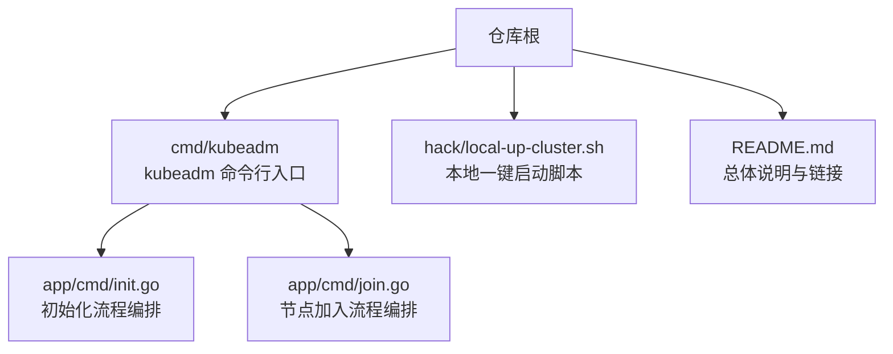
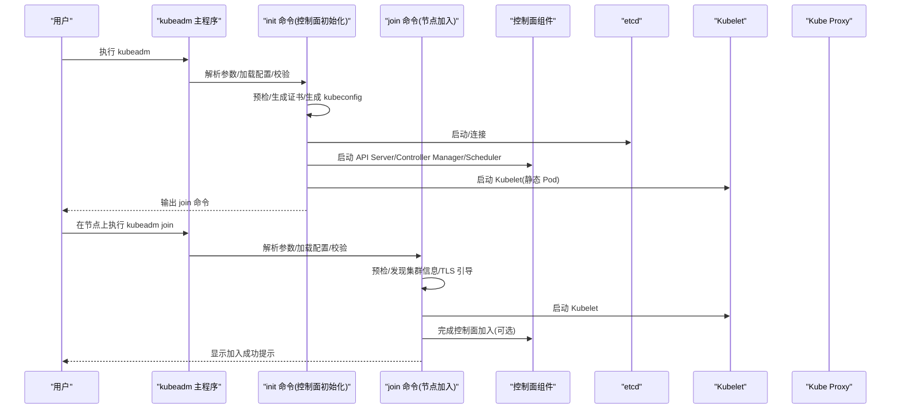
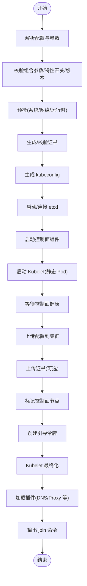
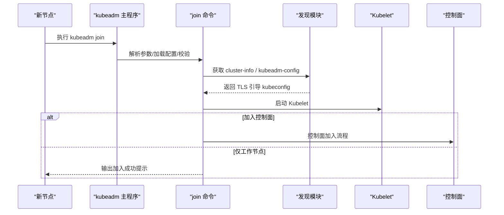
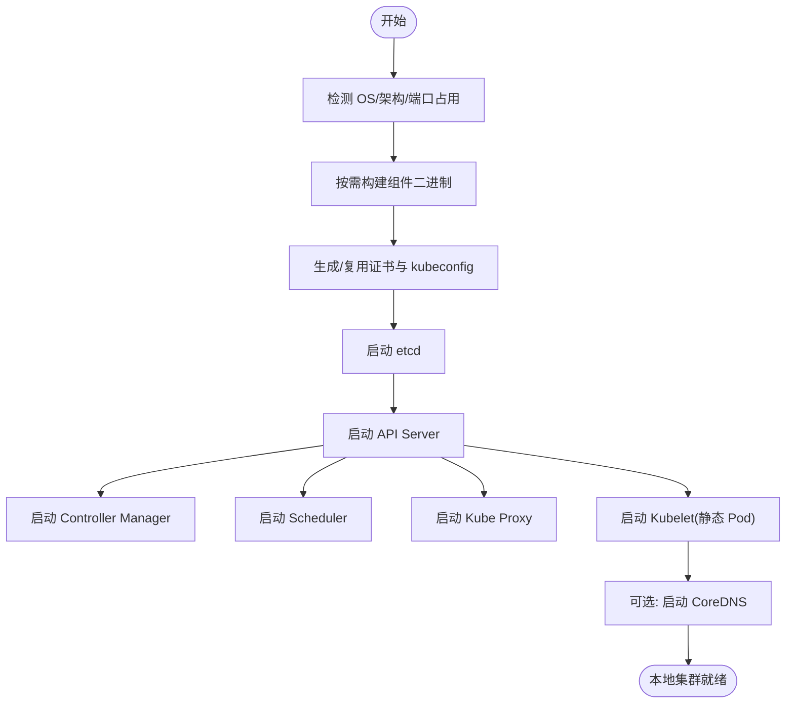
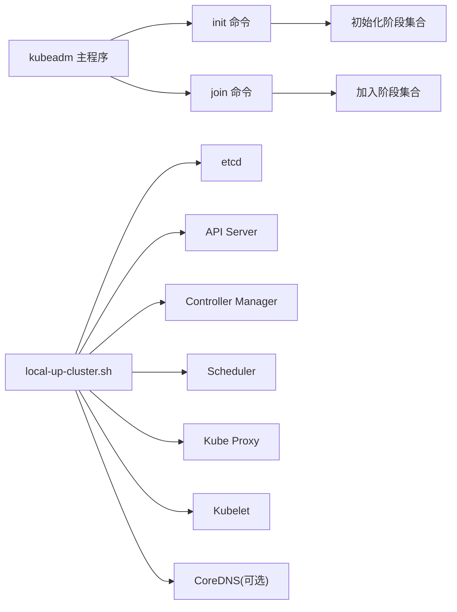

# 集群安装

<cite>
**本文引用的文件**   
- [README.md](file://README.md)
- [kubeadm.go](file://cmd/kubeadm/kubeadm.go)
- [init.go](file://cmd/kubeadm/app/cmd/init.go)
- [join.go](file://cmd/kubeadm/app/cmd/join.go)
- [local-up-cluster.sh](file://hack/local-up-cluster.sh)
</cite>

## 目录
1. [简介](#简介)
2. [项目结构](#项目结构)
3. [核心组件](#核心组件)
4. [架构总览](#架构总览)
5. [详细组件分析](#详细组件分析)
6. [依赖关系分析](#依赖关系分析)
7. [性能与容量规划](#性能与容量规划)
8. [故障排查指南](#故障排查指南)
9. [结论](#结论)
10. [附录](#附录)

## 简介
本指南面向在 Kubernetes 源码仓库环境中进行集群安装的读者，覆盖以下主题：
- kubeadm 工具安装（控制面初始化、工作节点加入）
- 二进制部署思路（基于本地构建产物）
- 云平台托管方案（概念性说明）
- 本地开发环境快速搭建（使用 local-up-cluster 脚本）
- 集群初始化配置参数与网络插件选择
- 常见问题排查与解决方案
- 不同环境（开发、测试、生产）的最佳实践

## 项目结构
仓库提供了多种与“安装/启动”相关的入口与脚本：
- kubeadm 命令行入口与命令实现
- 本地一键启动脚本（用于开发调试）
- 顶层 README 提供总体指引

图表来源
- [kubeadm.go:1-27](file://cmd/kubeadm/kubeadm.go#L1-L27)
- [init.go:109-198](file://cmd/kubeadm/app/cmd/init.go#L109-L198)
- [join.go:162-255](file://cmd/kubeadm/app/cmd/join.go#L162-L255)
- [local-up-cluster.sh:1-120](file://hack/local-up-cluster.sh#L1-L120)
- [README.md:26-34](file://README.md#L26-L34)

章节来源
- [README.md:26-34](file://README.md#L26-L34)

## 核心组件
- kubeadm 主程序：作为 CLI 入口，负责调用内部运行逻辑并处理错误。
- init 命令：编排控制面初始化阶段（预检、证书、kubeconfig、etcd、控制面组件、Kubelet、等待、上传配置、标记控制面、引导令牌、最终化、加载插件、输出 join 命令）。
- join 命令：编排节点加入流程（预检、控制面准备、检查 etcd、启动 Kubelet、etcd 加入、等待 TLS 引导、控制面加入、等待控制面就绪）。
- local-up-cluster 脚本：在本地一次性拉起 etcd、API Server、Controller Manager、Scheduler、Kubelet、Kube Proxy 等组件，适合开发与调试。

章节来源
- [kubeadm.go:17-27](file://cmd/kubeadm/kubeadm.go#L17-L27)
- [init.go:109-198](file://cmd/kubeadm/app/cmd/init.go#L109-L198)
- [join.go:162-255](file://cmd/kubeadm/app/cmd/join.go#L162-L255)
- [local-up-cluster.sh:1-120](file://hack/local-up-cluster.sh#L1-L120)

## 架构总览
下图展示了 kubeadm 的两种典型安装路径：初始化控制面与加入节点。

图表来源
- [kubeadm.go:17-27](file://cmd/kubeadm/kubeadm.go#L17-L27)
- [init.go:109-198](file://cmd/kubeadm/app/cmd/init.go#L109-L198)
- [join.go:162-255](file://cmd/kubeadm/app/cmd/join.go#L162-L255)

## 详细组件分析

### kubeadm 主程序
- 职责：作为可执行入口，调用应用层运行逻辑并统一处理错误返回。
- 关键点：错误处理封装，便于上层捕获与展示。

章节来源
- [kubeadm.go:17-27](file://cmd/kubeadm/kubeadm.go#L17-L27)

### kubeadm init（控制面初始化）
- 功能要点：
  - 参数与配置合并：支持配置文件与命令行标志混合输入，并进行一致性校验。
  - 阶段编排：预检、证书、kubeconfig、etcd、控制面、Kubelet、等待、上传配置、上传证书、标记控制面、引导令牌、Kubelet 最终化、插件、输出 join 命令。
  - 特性开关与版本校验：对 FeatureGates 与 Kubernetes 版本进行兼容性校验。
  - DryRun 模式：在不实际变更系统的前提下输出将要执行的步骤。
  - 外部 CA 与前代理 CA：支持外部 CA 场景下的证书与 kubeconfig 校验。
  - 插件启用/禁用：通过跳过阶段或配置项控制 DNS 与 kube-proxy 的启用状态。
- 关键参数（节选）：
  - 网络相关：ServiceSubnet、PodSubnet、DNSDomain
  - 控制面端点：ControlPlaneEndpoint、LocalAPIEndpoint.AdvertiseAddress/BindPort
  - 证书目录：CertificatesDir、APIServerCertSANs
  - 其他：FeatureGates、忽略预检错误列表、DryRun、上传证书、补丁目录等

图表来源
- [init.go:109-198](file://cmd/kubeadm/app/cmd/init.go#L109-L198)
- [init.go:200-279](file://cmd/kubeadm/app/cmd/init.go#L200-L279)
- [init.go:281-302](file://cmd/kubeadm/app/cmd/init.go#L281-L302)
- [init.go:304-409](file://cmd/kubeadm/app/cmd/init.go#L304-L409)
- [init.go:621-654](file://cmd/kubeadm/app/cmd/init.go#L621-L654)

章节来源
- [init.go:109-198](file://cmd/kubeadm/app/cmd/init.go#L109-L198)
- [init.go:200-279](file://cmd/kubeadm/app/cmd/init.go#L200-L279)
- [init.go:281-302](file://cmd/kubeadm/app/cmd/init.go#L281-L302)
- [init.go:304-409](file://cmd/kubeadm/app/cmd/init.go#L304-L409)
- [init.go:621-654](file://cmd/kubeadm/app/cmd/init.go#L621-L654)

### kubeadm join（节点加入）
- 功能要点：
  - 发现机制：支持基于共享 Token 或文件/URL 形式的 kubeconfig 发现集群信息；可选择是否校验 CA 公钥哈希。
  - TLS 引导：使用临时令牌向 API Server 提交 CSR，默认自动批准。
  - 阶段编排：预检、控制面准备、检查 etcd、启动 Kubelet、etcd 加入、等待 TLS 引导、控制面加入、等待控制面就绪。
  - DryRun 模式：模拟执行并输出预期动作。
  - 补丁目录：支持为组件清单打补丁。
- 关键参数（节选）：
  - 发现：BootstrapToken.Token/CACertHashes/UnsafeSkipCAVerification、File.KubeConfigPath
  - 控制面：CertificateKey、LocalAPIEndpoint.AdvertiseAddress/BindPort
  - 其他：忽略预检错误列表、DryRun、补丁目录等

图表来源
- [join.go:162-255](file://cmd/kubeadm/app/cmd/join.go#L162-L255)
- [join.go:257-321](file://cmd/kubeadm/app/cmd/join.go#L257-L321)
- [join.go:346-485](file://cmd/kubeadm/app/cmd/join.go#L346-L485)
- [join.go:559-729](file://cmd/kubeadm/app/cmd/join.go#L559-L729)

章节来源
- [join.go:162-255](file://cmd/kubeadm/app/cmd/join.go#L162-L255)
- [join.go:257-321](file://cmd/kubeadm/app/cmd/join.go#L257-L321)
- [join.go:346-485](file://cmd/kubeadm/app/cmd/join.go#L346-L485)
- [join.go:559-729](file://cmd/kubeadm/app/cmd/join.go#L559-L729)

### local-up-cluster 脚本（本地开发环境）
- 作用：在单机环境下构建并启动 etcd、API Server、Controller Manager、Scheduler、Kubelet、Kube Proxy 等，附带 DNS 与默认存储类，适合开发与调试。
- 关键环境变量（节选）：
  - 网络：CLUSTER_CIDR、SERVICE_CLUSTER_IP_RANGE、FIRST_SERVICE_CLUSTER_IP、DNS_SERVER_IP、DNS_DOMAIN
  - 组件端口：API_SECURE_PORT、KUBELET_PORT、PROXY_METRICS_PORT 等
  - 运行时：CONTAINER_RUNTIME_ENDPOINT、RUNTIME_REQUEST_TIMEOUT
  - 功能开关：FEATURE_GATES、ENABLE_ADMISSION_PLUGINS、DISABLE_ADMISSION_PLUGINS
  - 日志与调试：KUBE_VERBOSE、LOG_LEVEL、LOG_SPEC、LOG_DIR
  - 证书与密钥：CERT_DIR、REUSE_CERTS、SERVICE_ACCOUNT_KEY
  - 云集成：EXTERNAL_CLOUD_PROVIDER、CLOUD_PROVIDER、CLOUD_CONFIG
  - CSI：ENABLE_CSI_SNAPSHOTTER
- 运行模式：根据操作系统自动选择 START_MODE（Linux 默认 all，macOS 默认 nokubelet,nokubeproxy），可通过参数调整。

图表来源
- [local-up-cluster.sh:1-120](file://hack/local-up-cluster.sh#L1-L120)
- [local-up-cluster.sh:269-280](file://hack/local-up-cluster.sh#L269-L280)
- [local-up-cluster.sh:361-379](file://hack/local-up-cluster.sh#L361-L379)
- [local-up-cluster.sh:554-558](file://hack/local-up-cluster.sh#L554-L558)
- [local-up-cluster.sh:613-768](file://hack/local-up-cluster.sh#L613-L768)

章节来源
- [local-up-cluster.sh:1-120](file://hack/local-up-cluster.sh#L1-L120)
- [local-up-cluster.sh:269-280](file://hack/local-up-cluster.sh#L269-L280)
- [local-up-cluster.sh:361-379](file://hack/local-up-cluster.sh#L361-L379)
- [local-up-cluster.sh:554-558](file://hack/local-up-cluster.sh#L554-L558)
- [local-up-cluster.sh:613-768](file://hack/local-up-cluster.sh#L613-L768)

## 依赖关系分析
- 入口与子命令：
  - kubeadm 主程序 -> init/join 命令
  - init/join 命令 -> 各阶段实现（预检、证书、kubeconfig、etcd、控制面、Kubelet、插件等）
- 本地脚本：
  - local-up-cluster.sh -> 构建/启动 etcd、API Server、Controller Manager、Scheduler、Kube Proxy、Kubelet、CoreDNS 等

图表来源
- [kubeadm.go:17-27](file://cmd/kubeadm/kubeadm.go#L17-L27)
- [init.go:109-198](file://cmd/kubeadm/app/cmd/init.go#L109-L198)
- [join.go:162-255](file://cmd/kubeadm/app/cmd/join.go#L162-L255)
- [local-up-cluster.sh:613-768](file://hack/local-up-cluster.sh#L613-L768)

章节来源
- [kubeadm.go:17-27](file://cmd/kubeadm/kubeadm.go#L17-L27)
- [init.go:109-198](file://cmd/kubeadm/app/cmd/init.go#L109-L198)
- [join.go:162-255](file://cmd/kubeadm/app/cmd/join.go#L162-L255)
- [local-up-cluster.sh:613-768](file://hack/local-up-cluster.sh#L613-L768)

## 性能与容量规划
- 控制面资源：
  - API Server、Controller Manager、Scheduler 建议独立分配 CPU/内存，避免相互抢占。
  - etcd 磁盘建议使用高性能 SSD，IOPS 与延迟直接影响集群稳定性。
- 网络与 Pod 网段：
  - 合理划分 Service CIDR 与 Pod CIDR，避免与现有网络冲突。
  - 选择合适的 CNI 插件以满足大规模 Pod 通信需求。
- 资源预留：
  - 在生产节点设置 kube-reserved 与 system-reserved，保障系统组件稳定运行。
- 监控与审计：
  - 开启审计策略与指标采集，便于容量分析与问题定位。

[本节为通用指导，不直接分析具体文件]

## 故障排查指南
- 预检失败：
  - 关注 swap、内核模块、端口占用、CRI 套接字等常见项；可使用忽略列表跳过非关键检查（谨慎使用）。
- 证书与 kubeconfig：
  - 确认证书目录权限、外部 CA 与前代理 CA 完整性；必要时启用 DryRun 验证。
- 控制面未就绪：
  - 查看 API Server、Controller Manager、Scheduler 日志；确认 etcd 健康与网络连通。
- 节点加入失败：
  - 核对 Token 与 CA 公钥哈希；检查防火墙与端口；确认 TLS 引导是否成功。
- 本地环境异常：
  - 使用 local-up-cluster 的 verbose 模式与日志目录定位问题；清理残留进程与数据后重试。

章节来源
- [init.go:304-409](file://cmd/kubeadm/app/cmd/init.go#L304-L409)
- [join.go:346-485](file://cmd/kubeadm/app/cmd/join.go#L346-L485)
- [local-up-cluster.sh:1-120](file://hack/local-up-cluster.sh#L1-L120)

## 结论
- kubeadm 提供标准化的控制面初始化与节点加入流程，适合从开发到生产的渐进式落地。
- local-up-cluster 脚本极大简化了本地环境的搭建，有助于快速验证与调试。
- 在生产环境应结合安全、网络、存储与监控要求制定最佳实践，确保高可用与可观测性。

[本节为总结性内容，不直接分析具体文件]

## 附录

### 安装方式对比与适用场景
- kubeadm 安装
  - 适用：多节点集群、生产环境、需要标准化流程与自动化扩展。
  - 前置条件：满足系统预检要求（内核、cgroup、CRI、端口等）。
  - 步骤概览：初始化控制面 -> 安装 CNI -> 加入工作节点。
- 二进制部署
  - 适用：高度定制化、已有运维体系、需细粒度控制组件生命周期。
  - 步骤概览：下载/编译二进制 -> 生成证书与 kubeconfig -> 以 systemd 或容器方式管理组件。
- 云平台托管
  - 适用：希望由平台提供商管理控制面与升级，聚焦业务负载。
  - 步骤概览：在控制台创建集群 -> 配置网络与存储 -> 添加节点池。

[本节为概念性说明，不直接分析具体文件]

### 初始化配置参数速查（节选）
- 网络
  - Networking.ServiceSubnet：Service VIP 网段
  - Networking.PodSubnet：Pod 网段（配合 CNI 使用）
  - Networking.DNSDomain：服务域名后缀
- 控制面
  - ControlPlaneEndpoint：稳定的控制面地址
  - LocalAPIEndpoint.AdvertiseAddress/BindPort：API Server 监听与对外通告
- 证书与安全
  - CertificatesDir：证书目录
  - APIServerCertSANs：API Server 证书 SAN
  - FeatureGates：特性开关
- 其他
  - 忽略预检错误列表、DryRun、上传证书、补丁目录等

章节来源
- [init.go:200-279](file://cmd/kubeadm/app/cmd/init.go#L200-L279)

### 加入节点参数速查（节选）
- 发现
  - Discovery.BootstrapToken.Token/CACertHashes/UnsafeSkipCAVerification
  - Discovery.File.KubeConfigPath
- 控制面（新增控制面实例）
  - ControlPlane.CertificateKey
  - ControlPlane.LocalAPIEndpoint.AdvertiseAddress/BindPort
- 其他
  - 忽略预检错误列表、DryRun、补丁目录等

章节来源
- [join.go:257-321](file://cmd/kubeadm/app/cmd/join.go#L257-L321)
- [join.go:346-485](file://cmd/kubeadm/app/cmd/join.go#L346-L485)

### 本地开发环境快速搭建（local-up-cluster）
- 基本用法：在仓库根目录执行脚本，按提示完成构建与启动。
- 常用环境变量：
  - CLUSTER_CIDR、SERVICE_CLUSTER_IP_RANGE、DNS_SERVER_IP、DNS_DOMAIN
  - FEATURE_GATES、ENABLE_ADMISSION_PLUGINS、DISABLE_ADMISSION_PLUGINS
  - CONTAINER_RUNTIME_ENDPOINT、RUNTIME_REQUEST_TIMEOUT
  - CERT_DIR、REUSE_CERTS、SERVICE_ACCOUNT_KEY
  - EXTERNAL_CLOUD_PROVIDER、CLOUD_PROVIDER、CLOUD_CONFIG
  - ENABLE_CSI_SNAPSHOTTER
- 注意事项：
  - macOS 默认不启动 Kubelet/Kube Proxy，可在 Linux 下获得完整体验。
  - 如需保留 etcd 数据，设置 PRESERVE_ETCD 并指定 ETCD_DIR。

章节来源
- [local-up-cluster.sh:1-120](file://hack/local-up-cluster.sh#L1-L120)
- [local-up-cluster.sh:269-280](file://hack/local-up-cluster.sh#L269-L280)
- [local-up-cluster.sh:361-379](file://hack/local-up-cluster.sh#L361-L379)
- [local-up-cluster.sh:554-558](file://hack/local-up-cluster.sh#L554-L558)
- [local-up-cluster.sh:613-768](file://hack/local-up-cluster.sh#L613-L768)

### 不同环境的最佳实践
- 开发
  - 优先使用 local-up-cluster 快速迭代；开启详细日志；按需启用特性开关。
- 测试
  - 使用 kubeadm 初始化，固定网络与存储配置；引入 CI/CD 自动化；定期重建环境保证一致性。
- 生产
  - 多控制面节点与高可用 etcd；严格的安全基线（最小权限、证书轮换、审计）；完善的监控告警与备份恢复策略。

[本节为通用指导，不直接分析具体文件]