# 高可用部署

<cite>
**本文引用的文件**   
- [README.md](file://README.md)
- [cluster/kube-up.sh](file://cluster/kube-up.sh)
- [cluster/gce/config-default.sh](file://cluster/gce/config-default.sh)
- [cluster/gce/config-common.sh](file://cluster/gce/config-common.sh)
- [cmd/kubeadm/app/kubeadm.go](file://cmd/kubeadm/app/kubeadm.go)
</cite>

## 目录
1. [简介](#简介)
2. [项目结构](#项目结构)
3. [核心组件](#核心组件)
4. [架构总览](#架构总览)
5. [详细组件分析](#详细组件分析)
6. [依赖关系分析](#依赖关系分析)
7. [性能与容量规划](#性能与容量规划)
8. [故障转移与自动恢复](#故障转移与自动恢复)
9. [网络分区与脑裂防护](#网络分区与脑裂防护)
10. [监控告警与运维自动化](#监控告警与运维自动化)
11. [结论](#结论)

## 简介
本文件面向在 Kubernetes 上构建高可用（HA）控制平面的工程实践，结合仓库中的集群启动脚本、云平台配置模板以及 kubeadm 入口程序，系统阐述多控制平面节点设计、负载均衡策略、etcd 集群部署模式与一致性保证、不同云平台的 HA 部署模板要点、故障转移与自动恢复流程、网络分区处理与脑裂防护、容量规划与性能调优建议，以及监控告警与运维自动化方案。文档力求以可操作的方式呈现，同时提供与源码映射的图示与来源标注，便于读者对照实现细节进行落地。

## 项目结构
仓库提供了从通用入口到云平台特定配置的完整链路：
- 通用入口脚本负责前置校验、调用具体平台的上云逻辑并执行集群验证。
- GCE 默认配置集中定义了控制面与节点规模、磁盘与镜像、网络范围、DNS、日志、指标、特性开关等关键参数，是构建 HA 集群的重要参考。
- 公共函数库根据节点规模动态推荐主节点规格、根盘/数据盘大小、IP 段分配等，支撑大规模集群的容量规划。
- kubeadm 入口程序作为命令行工具链的起点，驱动初始化、加入、升级等工作流，常用于生产环境的多控制面搭建。

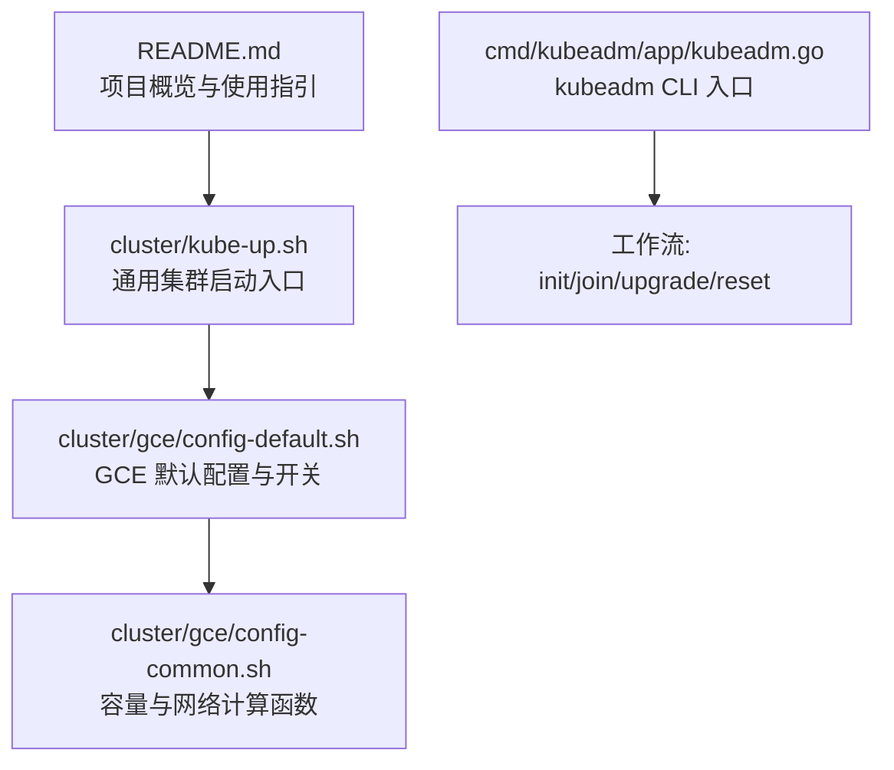

**图表来源** 
- [cluster/kube-up.sh:1-80](file://cluster/kube-up.sh#L1-L80)
- [cluster/gce/config-default.sh:1-543](file://cluster/gce/config-default.sh#L1-L543)
- [cluster/gce/config-common.sh:1-176](file://cluster/gce/config-common.sh#L1-L176)
- [cmd/kubeadm/app/kubeadm.go:1-50](file://cmd/kubeadm/app/kubeadm.go#L1-L50)

**章节来源**
- [README.md:1-101](file://README.md#L1-L101)
- [cluster/kube-up.sh:1-80](file://cluster/kube-up.sh#L1-L80)
- [cluster/gce/config-default.sh:1-543](file://cluster/gce/config-default.sh#L1-L543)
- [cluster/gce/config-common.sh:1-176](file://cluster/gce/config-common.sh#L1-L176)
- [cmd/kubeadm/app/kubeadm.go:1-50](file://cmd/kubeadm/app/kubeadm.go#L1-L50)

## 核心组件
- 集群启动入口
  - 负责前置条件检查、二进制与发布包校验、调用平台 kube-up 流程、执行集群验证、输出集群信息。
- GCE 默认配置
  - 定义主节点与节点数量、磁盘类型与大小、镜像族与版本、网络与 IP 范围、DNS、日志、指标、特性门控、控制器开关、证书与 TLS 套件、外部云控制器行为等。
- 容量与网络计算
  - 依据节点规模动态推荐主节点 CPU、根盘/数据盘大小、Node CIDR 与 Cluster CIDR、Pod IP 别名子网掩码等。
- kubeadm 入口
  - 注册命令与日志标志，创建并执行 kubeadm 命令树，驱动初始化、加入、升级、重置等工作流。

**章节来源**
- [cluster/kube-up.sh:1-80](file://cluster/kube-up.sh#L1-L80)
- [cluster/gce/config-default.sh:1-543](file://cluster/gce/config-default.sh#L1-L543)
- [cluster/gce/config-common.sh:1-176](file://cluster/gce/config-common.sh#L1-L176)
- [cmd/kubeadm/app/kubeadm.go:1-50](file://cmd/kubeadm/app/kubeadm.go#L1-L50)

## 架构总览
下图展示基于仓库脚本与配置的高可用控制面总体视图，包括多控制面节点、etcd 集群、API Server 访问路径与负载均衡、节点侧组件与附加组件。

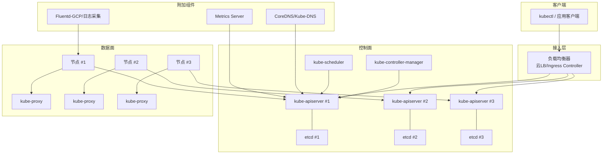

[此图为概念性架构图，不直接映射到具体源文件，故不提供图表来源]

## 详细组件分析

### 多控制平面与负载均衡
- 多控制面节点
  - 通过配置多个 master 实例，配合 etcd 集群形成高可用控制面。
  - 默认配置中定义了初始 etcd 集群成员名称、主节点标签与命名前缀，便于编排与识别。
- 负载均衡策略
  - 可通过启用 L7 负载均衡控制器（如 GLBC）对外暴露 Ingress；内部 API Server 访问通常由云厂商提供的负载均衡或自建四层/七层代理承担。
  - 健康检查与后端剔除由负载均衡器与 kube-apiserver 自身健康端点共同保障。
- 相关配置要点
  - 主节点规模、磁盘与镜像选择、是否注册主节点为 kubelet、是否启用私有集群、TLS 套件、外部云控制器运行控制器集合等。

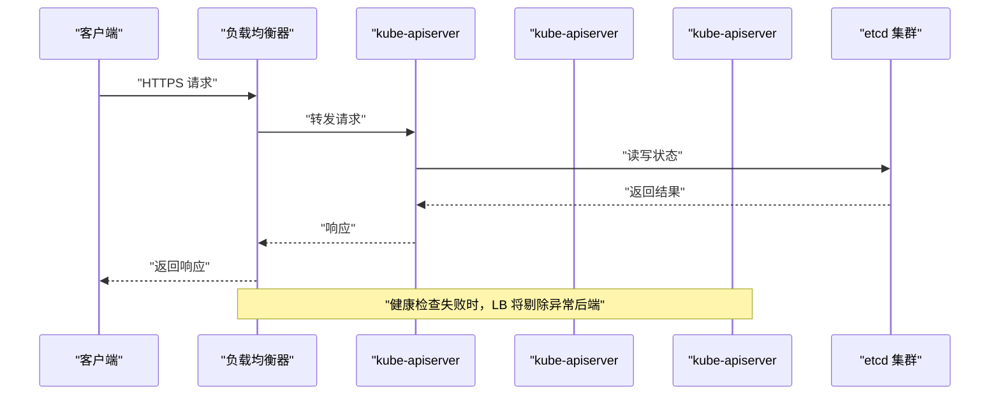

**图表来源** 
- [cluster/gce/config-default.sh:1-543](file://cluster/gce/config-default.sh#L1-L543)

**章节来源**
- [cluster/gce/config-default.sh:1-543](file://cluster/gce/config-default.sh#L1-L543)

### etcd 集群部署与数据一致性
- 部署模式
  - 采用奇数个节点（常见为 3）的 etcd 集群，确保多数派一致性与容错能力。
  - 每个控制面节点通常托管一个 etcd 进程（静态 Pod 或独立进程），并通过配置文件声明集群成员列表。
- 一致性保证
  - 基于 Raft 协议，写入需多数派确认，读操作支持线性化或快照读，结合 leader 选举避免脑裂。
- 配置要点
  - 初始集群成员、进度通知间隔、存储后端、磁盘与 I/O 优化、备份与恢复策略。
- 相关变量与流程
  - 初始 etcd 集群成员名、etcd 进度通知间隔等变量用于控制 etcd 行为。

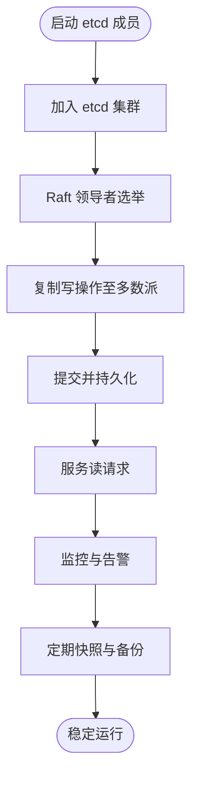

**图表来源** 
- [cluster/gce/config-default.sh:1-543](file://cluster/gce/config-default.sh#L1-L543)

**章节来源**
- [cluster/gce/config-default.sh:1-543](file://cluster/gce/config-default.sh#L1-L543)

### 不同云平台的 HA 部署模板与配置要点
- GCE 模板要点
  - 主节点与节点数量、机器规格、磁盘类型与大小、镜像族与版本、网络与 IP 范围、DNS、日志、指标、特性门控、控制器开关、证书与 TLS 套件、外部云控制器行为等。
  - 可选启用 L7 负载均衡控制器、DNS 水平扩展、节点本地 DNS、元数据代理、私有集群、Konnectivity 代理等。
- 其他云平台
  - 仓库未包含其他云平台的默认配置脚本，但可参照 GCE 模板的结构与变量组织方式，在对应平台适配相应资源与网络模型。

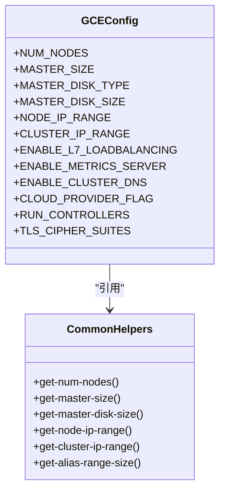

**图表来源** 
- [cluster/gce/config-default.sh:1-543](file://cluster/gce/config-default.sh#L1-L543)
- [cluster/gce/config-common.sh:1-176](file://cluster/gce/config-common.sh#L1-L176)

**章节来源**
- [cluster/gce/config-default.sh:1-543](file://cluster/gce/config-default.sh#L1-L543)
- [cluster/gce/config-common.sh:1-176](file://cluster/gce/config-common.sh#L1-L176)

### kubeadm 工作流与多控制面加入
- 入口程序
  - 注册日志标志与 pflag 归一化，创建并执行 kubeadm 命令树。
- 工作流
  - 初始化（init）：生成证书、拉起控制面组件、上传配置、等待控制面就绪。
  - 加入（join）：新控制面节点加入现有集群，准备控制面、拉取证书与配置、等待控制面就绪。
  - 升级（upgrade）：对控制面与节点进行平滑升级。
  - 重置（reset）：清理节点与控制面状态。
- 适用场景
  - 在生产环境中，常使用 kubeadm 在多主机上构建多控制面集群，并结合外部负载均衡与 etcd 集群实现高可用。

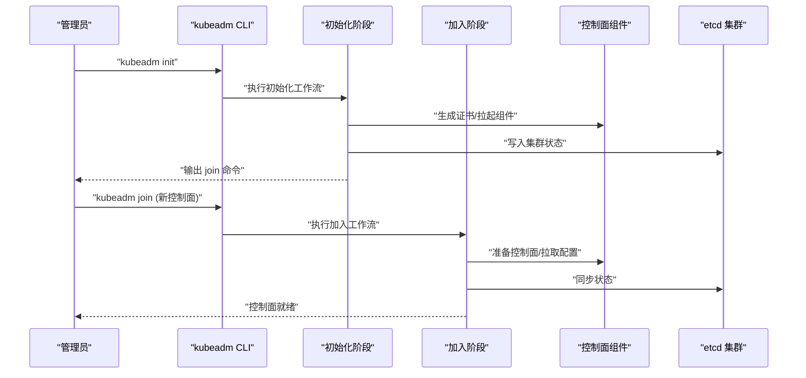

**图表来源** 
- [cmd/kubeadm/app/kubeadm.go:1-50](file://cmd/kubeadm/app/kubeadm.go#L1-L50)

**章节来源**
- [cmd/kubeadm/app/kubeadm.go:1-50](file://cmd/kubeadm/app/kubeadm.go#L1-L50)

## 依赖关系分析
- 入口脚本依赖平台配置与工具库
  - cluster/kube-up.sh 依赖 platform-specific kube-up 实现与 validate-cluster 验证。
- GCE 配置依赖公共函数库
  - config-default.sh 通过 config-common.sh 获取容量与网络建议值。
- kubeadm 入口依赖命令树与工作流
  - kubeadm.go 仅负责标志注册与命令执行，具体逻辑在 cmd 子模块中实现。

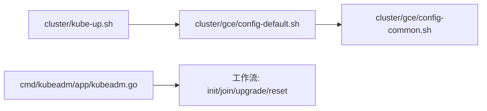

**图表来源** 
- [cluster/kube-up.sh:1-80](file://cluster/kube-up.sh#L1-L80)
- [cluster/gce/config-default.sh:1-543](file://cluster/gce/config-default.sh#L1-L543)
- [cluster/gce/config-common.sh:1-176](file://cluster/gce/config-common.sh#L1-L176)
- [cmd/kubeadm/app/kubeadm.go:1-50](file://cmd/kubeadm/app/kubeadm.go#L1-L50)

**章节来源**
- [cluster/kube-up.sh:1-80](file://cluster/kube-up.sh#L1-L80)
- [cluster/gce/config-default.sh:1-543](file://cluster/gce/config-default.sh#L1-L543)
- [cluster/gce/config-common.sh:1-176](file://cluster/gce/config-common.sh#L1-L176)
- [cmd/kubeadm/app/kubeadm.go:1-50](file://cmd/kubeadm/app/kubeadm.go#L1-L50)

## 性能与容量规划
- 主节点规格与磁盘
  - 根据节点规模动态推荐主节点 CPU 核数与根盘/数据盘大小，避免控制面成为瓶颈。
- 网络与 IP 规划
  - 依据节点规模推荐 Node CIDR 与 Cluster CIDR，Pod IP 别名子网掩码按最大 Pod 数计算，避免地址耗尽。
- 控制器并发与特性门控
  - 调整控制器同步并发度、关闭不必要的控制器，减少控制面压力。
- 日志与指标
  - 合理设置日志轮转与指标采集，避免 IO 与 CPU 占用过高影响控制面稳定性。

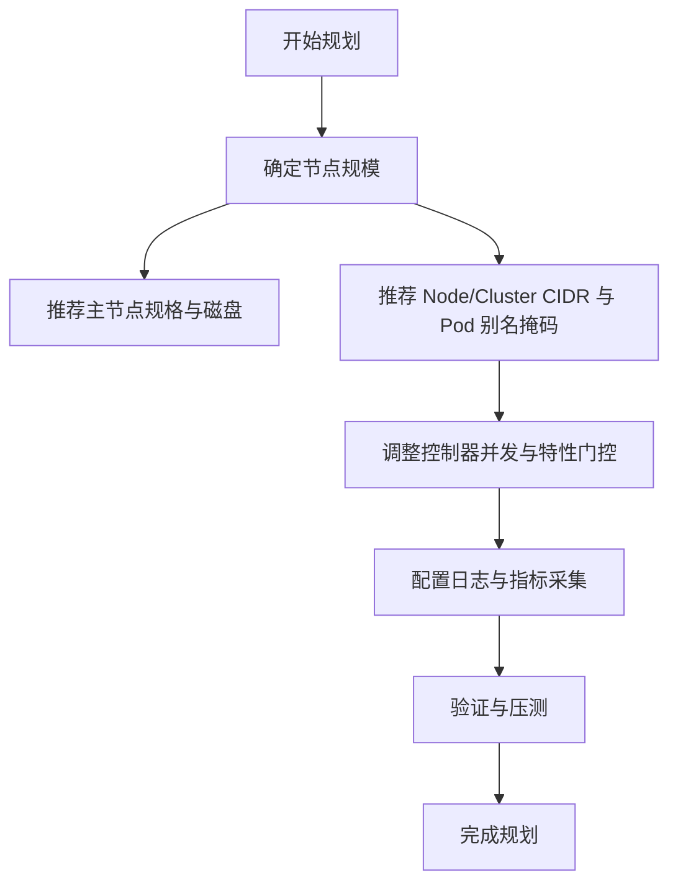

**图表来源** 
- [cluster/gce/config-common.sh:1-176](file://cluster/gce/config-common.sh#L1-L176)
- [cluster/gce/config-default.sh:1-543](file://cluster/gce/config-default.sh#L1-L543)

**章节来源**
- [cluster/gce/config-common.sh:1-176](file://cluster/gce/config-common.sh#L1-L176)
- [cluster/gce/config-default.sh:1-543](file://cluster/gce/config-default.sh#L1-L543)

## 故障转移与自动恢复
- 控制面故障转移
  - 多控制面节点配合 etcd 多数派机制，当某节点不可用时，负载均衡器剔除该后端，其余控制面继续提供服务。
- 自动恢复流程
  - 通过健康检查与探针检测控制面组件状态，异常时由容器编排或守护进程重启组件；etcd 成员下线后，集群自动重新选举并恢复一致性。
- 相关配置
  - 健康检查端口、etcd 进度通知间隔、证书轮换、外部云控制器控制器集合等。

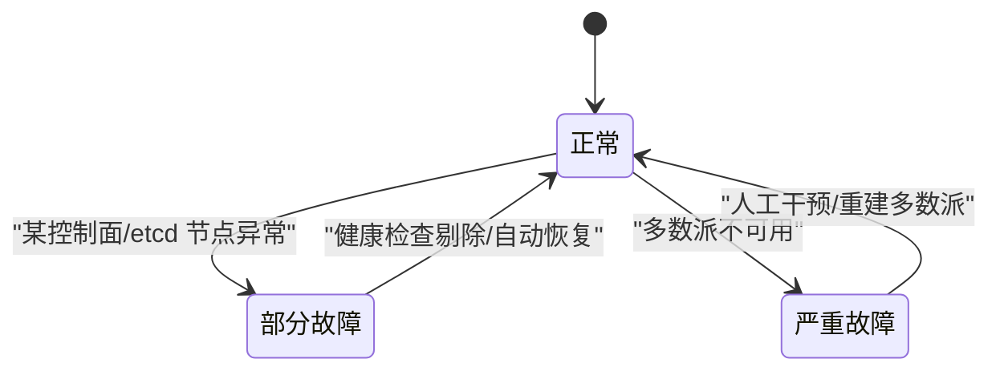

[此图为概念性状态图，不直接映射到具体源文件，故不提供图表来源]

**章节来源**
- [cluster/gce/config-default.sh:1-543](file://cluster/gce/config-default.sh#L1-L543)

## 网络分区与脑裂防护
- 脑裂防护
  - etcd 基于 Raft 的多数派原则，在网络分区情况下仅能维持少数派无法达成一致的分区，从而避免双主。
- 网络分区处理
  - 合理划分网络域与防火墙规则，确保控制面与 etcd 之间低延迟与高可靠连接；必要时引入 Konnectivity 代理统一出口流量。
- 相关配置
  - 私有集群、Konnectivity 代理开关与协议模式、TLS 套件与安全策略。

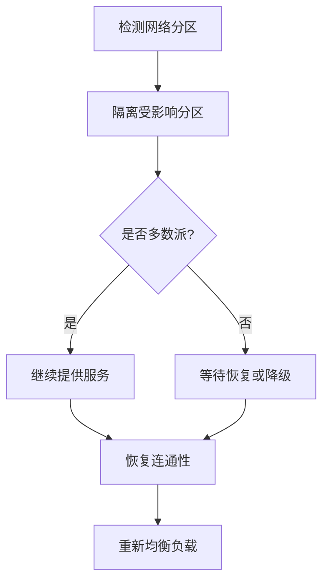

[此图为概念性流程图，不直接映射到具体源文件，故不提供图表来源]

**章节来源**
- [cluster/gce/config-default.sh:1-543](file://cluster/gce/config-default.sh#L1-L543)

## 监控告警与运维自动化
- 监控与指标
  - 启用 Metrics Server 与节点日志采集（如 Fluentd-GCP），收集控制面与节点指标，建立告警规则。
- 自动化运维
  - 使用集群启动脚本进行一键部署与验证；利用 kubeadm 工作流进行扩容、升级与重置；结合云平台的自动扩缩容与滚动更新策略。
- 日志与审计
  - 配置日志轮转与集中式日志存储，开启审计日志与事件导出，便于问题定位与合规审计。

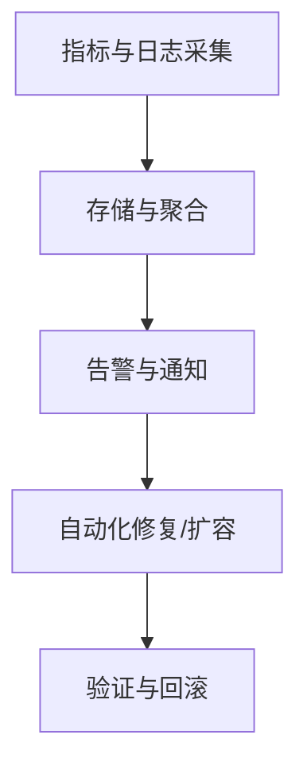

[此图为概念性流程图，不直接映射到具体源文件，故不提供图表来源]

**章节来源**
- [cluster/gce/config-default.sh:1-543](file://cluster/gce/config-default.sh#L1-L543)

## 结论
通过仓库中的通用入口脚本、GCE 默认配置与公共函数库，可以系统化地构建高可用 Kubernetes 控制面：多控制面节点与 etcd 集群提供强一致性与容错能力；合理的容量与网络规划避免资源瓶颈；完善的监控与自动化运维提升稳定性与可维护性。对于其他云平台，可参照 GCE 模板的组织方式与变量语义进行适配，以实现跨云的一致高可用体验。