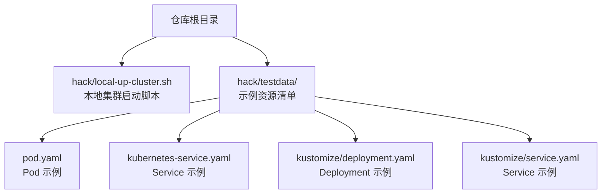
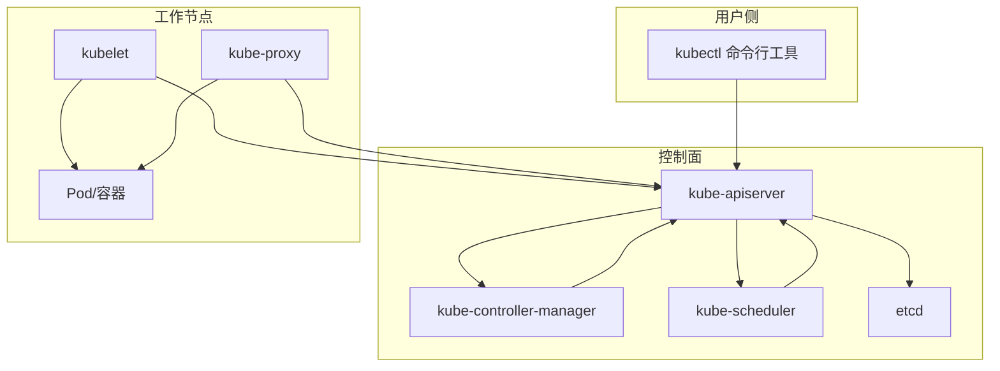
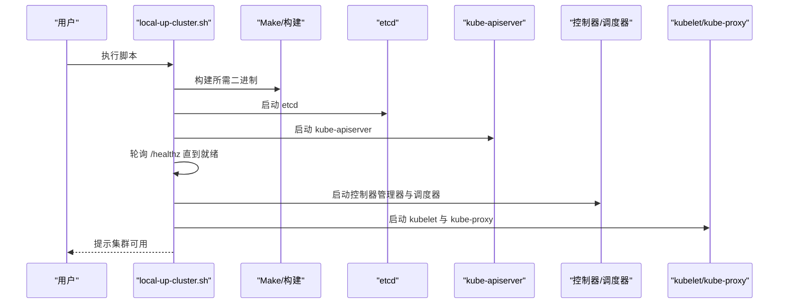
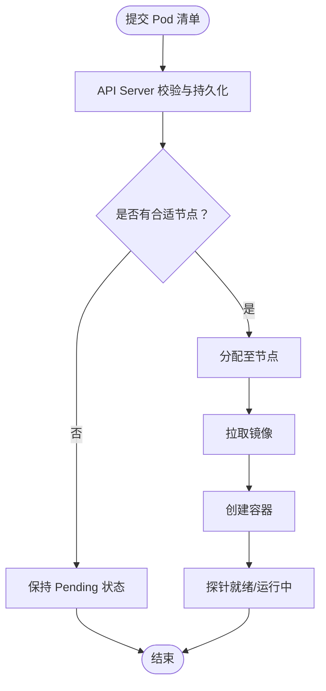
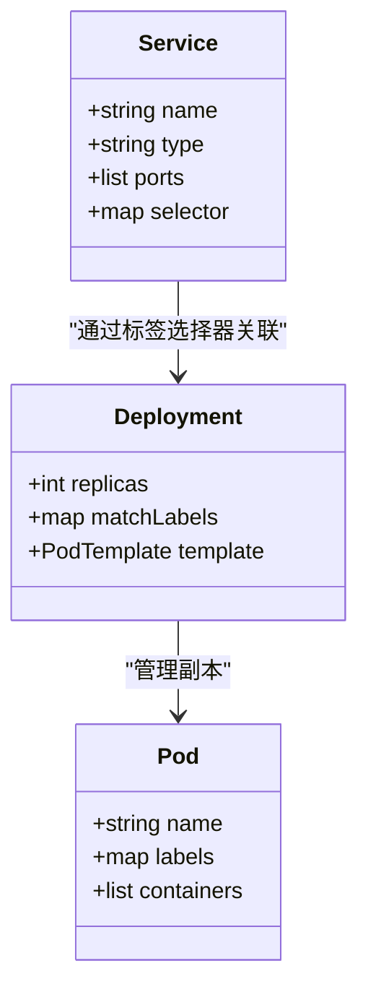
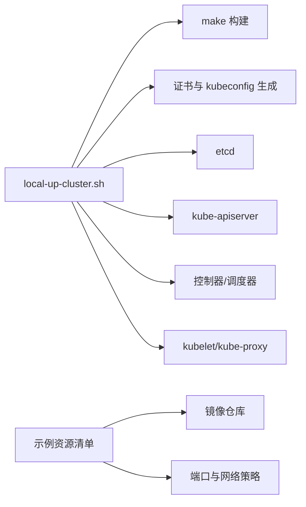

# 快速开始指南

<cite>
**本文引用的文件**   
- [README.md](file://README.md)
- [local-up-cluster.sh](file://hack/local-up-cluster.sh)
- [pod.yaml](file://hack/testdata/pod.yaml)
- [kubernetes-service.yaml](file://hack/testdata/kubernetes-service.yaml)
- [deployment.yaml](file://hack/testdata/kustomize/deployment.yaml)
- [service.yaml](file://hack/testdata/kustomize/service.yaml)
</cite>

## 目录
1. [简介](#简介)
2. [项目结构](#项目结构)
3. [核心组件](#核心组件)
4. [架构总览](#架构总览)
5. [详细组件分析](#详细组件分析)
6. [依赖分析](#依赖分析)
7. [性能考虑](#性能考虑)
8. [故障排查指南](#故障排查指南)
9. [结论](#结论)
10. [附录](#附录)

## 简介
本指南面向初学者，帮助你在本地环境中快速搭建 Kubernetes 集群并成功运行第一个应用。你将完成以下目标：
- 准备 Docker 环境（可选）
- 使用仓库提供的脚本在本地启动一个最小可用的单节点集群
- 创建并访问 Pod、Service 与 Deployment
- 掌握常用 kubectl 命令：查看资源、获取日志、端口转发等
- 了解 ClusterIP、NodePort、LoadBalancer 三种 Service 的访问方式
- 学会基础故障排查方法
- 通过一个 Web 应用的完整示例，在约 30 分钟内完成从环境到应用的端到端部署

说明：
- 官方文档入口与学习资源见根 README 中的链接。
- 本地开发/测试场景推荐使用仓库自带的本地集群启动脚本；生产或跨主机场景建议使用 Minikube 或 kind（本节提供思路与参考路径）。

章节来源
- [README.md:1-101](file://README.md#L1-L101)

## 项目结构
为便于快速上手，本次指南聚焦于以下与“本地集群启动”和“示例资源清单”相关的仓库内容：
- 本地集群启动脚本：位于 hack/local-up-cluster.sh，负责构建并拉起控制面组件、kubelet、kube-proxy 等，生成证书与 kubeconfig，并等待 API Server 就绪。
- 示例资源清单：位于 hack/testdata 下，包含 Pod、Service、Deployment 的最小化示例，可直接用于练习 kubectl 操作。

图表来源
- [local-up-cluster.sh:1-120](file://hack/local-up-cluster.sh#L1-L120)
- [pod.yaml:1-11](file://hack/testdata/pod.yaml#L1-L11)
- [kubernetes-service.yaml:1-13](file://hack/testdata/kubernetes-service.yaml#L1-L13)
- [deployment.yaml:1-36](file://hack/testdata/kustomize/deployment.yaml#L1-L36)
- [service.yaml:1-13](file://hack/testdata/kustomize/service.yaml#L1-L13)

章节来源
- [local-up-cluster.sh:1-120](file://hack/local-up-cluster.sh#L1-L120)
- [pod.yaml:1-11](file://hack/testdata/pod.yaml#L1-L11)
- [kubernetes-service.yaml:1-13](file://hack/testdata/kubernetes-service.yaml#L1-L13)
- [deployment.yaml:1-36](file://hack/testdata/kustomize/deployment.yaml#L1-L36)
- [service.yaml:1-13](file://hack/testdata/kustomize/service.yaml#L1-L13)

## 核心组件
- 本地集群启动脚本
  - 功能：检测系统架构与操作系统、选择二进制输出目录、按需构建必要组件（如 kubectl、kube-apiserver、kube-controller-manager、kube-scheduler、kube-proxy、kubelet），生成证书与 kubeconfig，启动 etcd、API Server、控制器管理器、调度器、kubelet、kube-proxy，并等待 API Server 健康检查通过。
  - 关键流程要点：
    - 环境变量控制：如 DNS 插件开关、CNI 配置、网络段、日志级别、是否保留 etcd 数据等。
    - 证书与认证：自动生成 CA、服务端与客户端证书，写入 kubeconfig，供各组件与 kubectl 使用。
    - 健康检查：循环探测 API Server 健康端点，成功后再启动后续组件。
    - 清理：捕获 CoreDNS 日志、终止进程、清理 etcd 数据目录等。
- 示例资源清单
  - Pod：最简容器定义，适合验证集群连通性与镜像拉取。
  - Service：将一组 Pod 暴露为稳定的网络端点，支持多种类型。
  - Deployment：声明式管理无状态副本集，支持滚动更新与回滚。

章节来源
- [local-up-cluster.sh:250-770](file://hack/local-up-cluster.sh#L250-L770)
- [pod.yaml:1-11](file://hack/testdata/pod.yaml#L1-L11)
- [kubernetes-service.yaml:1-13](file://hack/testdata/kubernetes-service.yaml#L1-L13)
- [deployment.yaml:1-36](file://hack/testdata/kustomize/deployment.yaml#L1-L36)
- [service.yaml:1-13](file://hack/testdata/kustomize/service.yaml#L1-L13)

## 架构总览
下图展示了本地集群启动后，主要组件之间的交互关系以及用户通过 kubectl 与 API Server 的通信路径。

图表来源
- [local-up-cluster.sh:613-770](file://hack/local-up-cluster.sh#L613-L770)

## 详细组件分析

### 本地集群启动流程（顺序图）
该顺序图描述了从执行脚本到 API Server 就绪的关键步骤。

图表来源
- [local-up-cluster.sh:269-330](file://hack/local-up-cluster.sh#L269-L330)
- [local-up-cluster.sh:554-560](file://hack/local-up-cluster.sh#L554-L560)
- [local-up-cluster.sh:613-770](file://hack/local-up-cluster.sh#L613-L770)

章节来源
- [local-up-cluster.sh:269-770](file://hack/local-up-cluster.sh#L269-L770)

### Pod 生命周期与调度（流程图）
下图展示了一个 Pod 从提交到运行的关键阶段，帮助你理解 kubectl 与 API Server、调度器、kubelet 的协作。

图表来源
- [pod.yaml:1-11](file://hack/testdata/pod.yaml#L1-L11)

章节来源
- [pod.yaml:1-11](file://hack/testdata/pod.yaml#L1-L11)

### Service 流量模型（类图）
Service 通过标签选择器匹配后端 Pod，并以 ClusterIP/NodePort/LoadBalancer 等方式对外暴露。

图表来源
- [kubernetes-service.yaml:1-13](file://hack/testdata/kubernetes-service.yaml#L1-L13)
- [deployment.yaml:1-36](file://hack/testdata/kustomize/deployment.yaml#L1-L36)
- [service.yaml:1-13](file://hack/testdata/kustomize/service.yaml#L1-L13)

章节来源
- [kubernetes-service.yaml:1-13](file://hack/testdata/kubernetes-service.yaml#L1-L13)
- [deployment.yaml:1-36](file://hack/testdata/kustomize/deployment.yaml#L1-L36)
- [service.yaml:1-13](file://hack/testdata/kustomize/service.yaml#L1-L13)

## 依赖分析
- 本地集群启动脚本依赖：
  - Go 构建工具链（make）以编译 kubectl、kube-apiserver、kube-controller-manager、kube-scheduler、kube-proxy、kubelet 等二进制。
  - 系统权限：部分路径需要 sudo 写入证书与 kubeconfig。
  - 运行时：默认使用 containerd 运行时端点（可通过环境变量调整）。
  - 网络：预留端口（如 API Server 安全端口、kubelet、kube-proxy 等）需未被占用。
- 示例资源清单依赖：
  - 镜像仓库可达性（例如示例 Pod 使用的 pause 镜像）。
  - 若使用 NodePort/LoadBalancer，需确保宿主机的端口范围与云厂商负载均衡能力满足要求。

图表来源
- [local-up-cluster.sh:269-330](file://hack/local-up-cluster.sh#L269-L330)
- [local-up-cluster.sh:554-560](file://hack/local-up-cluster.sh#L554-L560)
- [local-up-cluster.sh:613-770](file://hack/local-up-cluster.sh#L613-L770)
- [pod.yaml:1-11](file://hack/testdata/pod.yaml#L1-L11)
- [service.yaml:1-13](file://hack/testdata/kustomize/service.yaml#L1-L13)

章节来源
- [local-up-cluster.sh:269-770](file://hack/local-up-cluster.sh#L269-L770)
- [pod.yaml:1-11](file://hack/testdata/pod.yaml#L1-L11)
- [service.yaml:1-13](file://hack/testdata/kustomize/service.yaml#L1-L13)

## 性能考虑
- 本地集群建议：
  - 合理设置 CPU/内存预留与 QoS，避免系统资源争用导致 Pod 频繁重启。
  - 关闭不必要的 Admission Plugins 与审计日志以提升性能（仅用于本地实验）。
  - 控制镜像大小与拉取频率，优先使用本地缓存镜像。
- 网络与存储：
  - 本地 CNI 插件与宿主机网络栈对 Pod 间通信有直接影响，必要时调整内核参数。
  - 本地存储类与卷插件在开发环境可简化，但需注意 I/O 瓶颈。

[本节为通用指导，不直接分析具体文件]

## 故障排查指南
- 常见症状与定位思路
  - API Server 无法启动或健康检查失败：检查端口占用、证书目录权限、etcd 状态与日志。
  - Pod 处于 Pending：查看事件与调度日志，确认资源配额、污点容忍、镜像拉取问题。
  - Service 不可达：核对标签选择器、端口映射、网络插件状态与防火墙规则。
- 实用命令（结合示例资源）
  - 查看资源：列出 Pod/Service/Deployment 及其状态。
  - 查看事件：定位调度失败、镜像拉取错误等。
  - 获取日志：查看容器标准输出与错误日志。
  - 进入容器：在调试容器中执行命令。
  - 端口转发：将本地端口转发到 Pod 端口进行访问。
- 脚本辅助
  - 本地集群脚本在退出时会尝试收集 CoreDNS 日志，有助于排查 DNS 解析问题。
  - 健康检查函数会监控各组件进程存活情况，异常时给出告警信息。

章节来源
- [local-up-cluster.sh:453-505](file://hack/local-up-cluster.sh#L453-L505)
- [local-up-cluster.sh:509-539](file://hack/local-up-cluster.sh#L509-L539)

## 结论
通过本指南，你已了解如何在本地快速启动一个最小可用的 Kubernetes 集群，并使用示例资源完成 Pod、Service 与 Deployment 的创建与访问。同时掌握了常用 kubectl 命令与基础故障排查方法。建议在熟悉基本操作后，进一步探索 Ingress、ConfigMap、Secret、PV/PVC 等更丰富的资源类型，逐步构建完整的 Web 应用部署方案。

[本节为总结性内容，不直接分析具体文件]

## 附录

### 一、本地环境准备与集群启动
- 前置条件
  - 操作系统：Linux 或 macOS（脚本内对系统进行检测）。
  - 权限：可能需要 sudo 写入证书与 kubeconfig 目录。
  - 端口：确保 API Server 安全端口、kubelet、kube-proxy 等端口未被占用。
  - 运行时：默认使用 containerd 运行时端点，可通过环境变量调整。
- 启动本地集群
  - 执行仓库提供的本地集群启动脚本，它将自动构建必要组件、生成证书与 kubeconfig、启动 etcd 与控制面组件，并等待 API Server 健康检查通过后继续。
  - 如需只构建不运行，可使用脚本的 dry-run 模式打印将要执行的命令。
- 停止与清理
  - 脚本提供清理逻辑，包括终止进程、删除 etcd 数据目录（可按配置保留）、捕获 CoreDNS 日志等。

章节来源
- [local-up-cluster.sh:178-201](file://hack/local-up-cluster.sh#L178-L201)
- [local-up-cluster.sh:269-330](file://hack/local-up-cluster.sh#L269-L330)
- [local-up-cluster.sh:453-505](file://hack/local-up-cluster.sh#L453-L505)

### 二、创建第一个 Pod
- 使用示例 Pod 清单创建资源，观察 Pod 状态与事件。
- 若镜像拉取失败，请检查镜像仓库可达性与镜像名称是否正确。

章节来源
- [pod.yaml:1-11](file://hack/testdata/pod.yaml#L1-L11)

### 三、创建 Service 与 Deployment
- 使用示例 Deployment 与 Service 清单，创建无状态应用并暴露服务。
- 注意：
  - Deployment 的 selector 与 Pod 模板标签需一致。
  - Service 的 selector 需匹配 Pod 标签。
  - 根据环境选择合适的 Service 类型（ClusterIP/NodePort/LoadBalancer）。

章节来源
- [deployment.yaml:1-36](file://hack/testdata/kustomize/deployment.yaml#L1-L36)
- [service.yaml:1-13](file://hack/testdata/kustomize/service.yaml#L1-L13)

### 四、访问应用服务
- ClusterIP：仅在集群内部可达，常用于微服务间通信。
- NodePort：在每个节点上开放固定端口，外部可通过节点 IP+端口访问。
- LoadBalancer：由云平台提供外部负载均衡器，适用于云上环境。
- 本地调试：
  - 使用端口转发将本地端口映射到 Pod 端口，便于浏览器或 curl 访问。

章节来源
- [kubernetes-service.yaml:1-13](file://hack/testdata/kubernetes-service.yaml#L1-L13)
- [service.yaml:1-13](file://hack/testdata/kustomize/service.yaml#L1-L13)

### 五、常用 kubectl 命令速查
- 查看资源列表与详情
- 查看事件与描述信息
- 获取容器日志
- 进入容器执行命令
- 端口转发到 Pod
- 滚动更新与回滚（配合 Deployment）

[本节为通用指导，不直接分析具体文件]

### 六、Web 应用完整部署流程（示例）
- 步骤概览
  - 准备镜像与清单（Deployment + Service）。
  - 应用清单并验证 Pod 状态。
  - 通过 Service 类型访问应用（ClusterIP/NodePort/LoadBalancer）。
  - 使用端口转发进行本地调试。
  - 观察日志与事件，定位问题。
- 参考示例清单
  - Deployment 示例：包含副本数、标签选择器、容器镜像与环境变量。
  - Service 示例：包含端口映射与类型。

章节来源
- [deployment.yaml:1-36](file://hack/testdata/kustomize/deployment.yaml#L1-L36)
- [service.yaml:1-13](file://hack/testdata/kustomize/service.yaml#L1-L13)