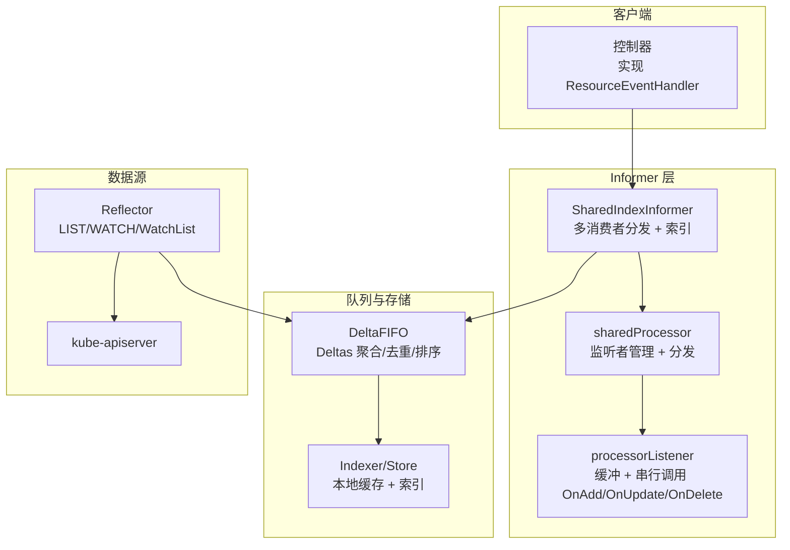
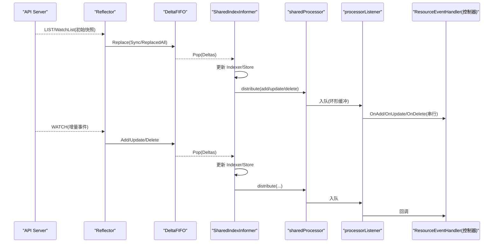
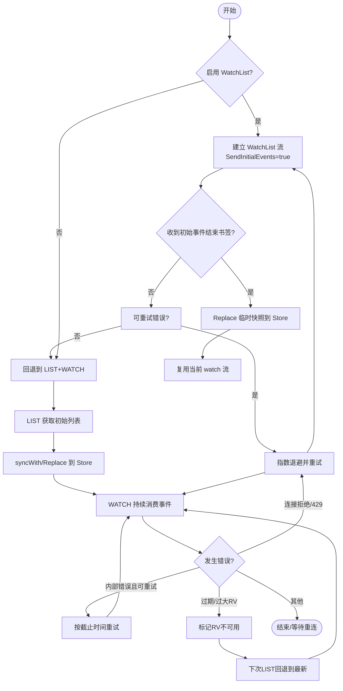
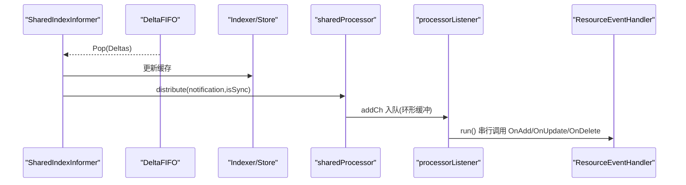
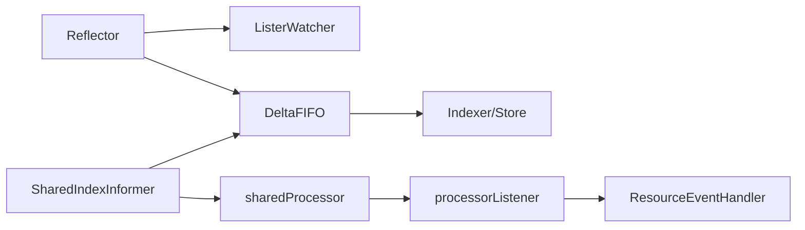

# 事件驱动架构

<cite>
**本文引用的文件**   
- [reflector.go](file://staging/src/k8s.io/client-go/tools/cache/reflector.go)
- [delta_fifo.go](file://staging/src/k8s.io/client-go/tools/cache/delta_fifo.go)
- [shared_informer.go](file://staging/src/k8s.io/client-go/tools/cache/shared_informer.go)
</cite>

## 目录
1. [简介](#简介)
2. [项目结构](#项目结构)
3. [核心组件](#核心组件)
4. [架构总览](#架构总览)
5. [详细组件分析](#详细组件分析)
6. [依赖关系分析](#依赖关系分析)
7. [性能考量](#性能考量)
8. [故障排查指南](#故障排查指南)
9. [结论](#结论)
10. [附录](#附录)

## 简介
本文件面向 Kubernetes 事件驱动架构中的 Informer 机制，系统性阐述从 API Server 变更到控制器响应的完整链路。重点覆盖：
- List-Watch 模式与缓存更新、事件分发
- ResourceEventHandler 接口与回调处理
- Reflector 与 API Server 的状态同步（含 WatchList 语义）
- DeltaFIFO 的事件排序与去重逻辑
- SharedIndexInformer 的多消费者支持与索引查询
- 事件丢失处理与重试机制
- Watch 超时与重新连接策略

## 项目结构
围绕 client-go/tools/cache 的三大核心文件组织：
- Reflector：负责与 API Server 交互，执行 LIST/WATCH/WatchList，维护资源版本并写入 Store
- DeltaFIFO：生产者-消费者队列，聚合对象变更为 Deltas，提供顺序消费与去重
- SharedIndexInformer：共享 informer，维护本地 Indexer 缓存，分发给多个 ResourceEventHandler，并提供索引查询能力



图表来源
- [shared_informer.go:597-647](file://staging/src/k8s.io/client-go/tools/cache/shared_informer.go#L597-L647)
- [shared_informer.go:1044-1189](file://staging/src/k8s.io/client-go/tools/cache/shared_informer.go#L1044-L1189)
- [delta_fifo.go:108-158](file://staging/src/k8s.io/client-go/tools/cache/delta_fifo.go#L108-L158)
- [reflector.go:105-171](file://staging/src/k8s.io/client-go/tools/cache/reflector.go#L105-L171)

章节来源
- [shared_informer.go:597-647](file://staging/src/k8s.io/client-go/tools/cache/shared_informer.go#L597-L647)
- [delta_fifo.go:108-158](file://staging/src/k8s.io/client-go/tools/cache/delta_fifo.go#L108-L158)
- [reflector.go:105-171](file://staging/src/k8s.io/client-go/tools/cache/reflector.go#L105-L171)

## 核心组件
- Reflector
  - 职责：发起 LIST/WATCH/WatchList；维护 lastSyncResourceVersion；错误分类与退避；将事件写入 Store
  - 关键流程：Run -> ListAndWatch -> (watchList 或 list) -> watchWithResync -> watch -> handleWatch/handleListWatch
- DeltaFIFO
  - 职责：按 key 聚合 Deltas；保证 FIFO 顺序；对重复删除进行去重；支持 Replace/Sync/ReplacedAll 等批量操作；支持 Resync
- SharedIndexInformer
  - 职责：维护 Indexer 本地缓存；创建 Controller 驱动 Reflector；通过 sharedProcessor 向多个处理器分发事件；提供 AddIndexers/GetIndexer 等索引能力

章节来源
- [reflector.go:416-509](file://staging/src/k8s.io/client-go/tools/cache/reflector.go#L416-L509)
- [reflector.go:561-670](file://staging/src/k8s.io/client-go/tools/cache/reflector.go#L561-L670)
- [reflector.go:674-783](file://staging/src/k8s.io/client-go/tools/cache/reflector.go#L674-L783)
- [reflector.go:804-908](file://staging/src/k8s.io/client-go/tools/cache/reflector.go#L804-L908)
- [delta_fifo.go:108-158](file://staging/src/k8s.io/client-go/tools/cache/delta_fifo.go#L108-L158)
- [delta_fifo.go:480-541](file://staging/src/k8s.io/client-go/tools/cache/delta_fifo.go#L480-L541)
- [delta_fifo.go:619-699](file://staging/src/k8s.io/client-go/tools/cache/delta_fifo.go#L619-L699)
- [shared_informer.go:597-647](file://staging/src/k8s.io/client-go/tools/cache/shared_informer.go#L597-L647)
- [shared_informer.go:728-792](file://staging/src/k8s.io/client-go/tools/cache/shared_informer.go#L728-L792)
- [shared_informer.go:861-951](file://staging/src/k8s.io/client-go/tools/cache/shared_informer.go#L861-L951)

## 架构总览
下图展示从 API Server 变更到控制器回调的端到端流程，包括 WatchList 初始一致性快照与后续增量事件。



图表来源
- [reflector.go:470-509](file://staging/src/k8s.io/client-go/tools/cache/reflector.go#L470-L509)
- [reflector.go:804-908](file://staging/src/k8s.io/client-go/tools/cache/reflector.go#L804-L908)
- [reflector.go:944-961](file://staging/src/k8s.io/client-go/tools/cache/reflector.go#L944-L961)
- [reflector.go:972-1095](file://staging/src/k8s.io/client-go/tools/cache/reflector.go#L972-L1095)
- [delta_fifo.go:619-699](file://staging/src/k8s.io/client-go/tools/cache/delta_fifo.go#L619-L699)
- [shared_informer.go:953-967](file://staging/src/k8s.io/client-go/tools/cache/shared_informer.go#L953-L967)
- [shared_informer.go:1123-1147](file://staging/src/k8s.io/client-go/tools/cache/shared_informer.go#L1123-L1147)
- [shared_informer.go:1365-1408](file://staging/src/k8s.io/client-go/tools/cache/shared_informer.go#L1365-L1408)

## 详细组件分析

### Reflector：与 API Server 状态同步
- 启动与循环
  - Run/RunWithContext 使用退避调度器反复执行 ListAndWatch
  - ListAndWatchWithContext 优先尝试 WatchList；若不可用则回退到传统 LIST+WATCH
- WatchList 语义
  - 发送 SendInitialEvents=true 与 ResourceVersionMatch=NotOlderThan，服务端返回“合成 Added”序列并以 Bookmark 结束，随后复用该 watch 流继续接收增量
  - 收到 Bookmark 后，将临时 Store 内容原子替换到目标 Store，并记录 lastSyncResourceVersion
- 传统 LIST+WATCH
  - list：分页拉取，处理过期/过大 RV 错误，必要时回退到 RV="" 以走 etcd 强一致路径；syncWith 将结果 Replace 进 Store
  - watch：设置随机化超时，允许书签；handleWatch 消费事件，更新 Store，并在满足条件时推进 lastSyncResourceVersion
- 错误与重试
  - isWatchErrorRetriable：连接拒绝/429 触发指数退避
  - isExpiredError/isTooLargeResourceVersionError：标记 lastSyncResourceVersion 不可用，下次 LIST 强制回退到最新
  - InternalError 带截止时间的重试
- 超时与重连
  - 每次 Watch 请求设置随机超时，避免雪崩；长时间无事件会触发警告（初始事件结束书签计时器）



图表来源
- [reflector.go:470-509](file://staging/src/k8s.io/client-go/tools/cache/reflector.go#L470-L509)
- [reflector.go:804-908](file://staging/src/k8s.io/client-go/tools/cache/reflector.go#L804-L908)
- [reflector.go:674-783](file://staging/src/k8s.io/client-go/tools/cache/reflector.go#L674-L783)
- [reflector.go:561-670](file://staging/src/k8s.io/client-go/tools/cache/reflector.go#L561-L670)
- [reflector.go:1154-1205](file://staging/src/k8s.io/client-go/tools/cache/reflector.go#L1154-L1205)

章节来源
- [reflector.go:416-509](file://staging/src/k8s.io/client-go/tools/cache/reflector.go#L416-L509)
- [reflector.go:561-670](file://staging/src/k8s.io/client-go/tools/cache/reflector.go#L561-L670)
- [reflector.go:674-783](file://staging/src/k8s.io/client-go/tools/cache/reflector.go#L674-L783)
- [reflector.go:804-908](file://staging/src/k8s.io/client-go/tools/cache/reflector.go#L804-L908)
- [reflector.go:944-961](file://staging/src/k8s.io/client-go/tools/cache/reflector.go#L944-L961)
- [reflector.go:972-1095](file://staging/src/k8s.io/client-go/tools/cache/reflector.go#L972-L1095)
- [reflector.go:1154-1205](file://staging/src/k8s.io/client-go/tools/cache/reflector.go#L1154-L1205)

### DeltaFIFO：事件排序与去重
- 数据结构
  - items[key] = Deltas[]；queue 保持 key 的 FIFO 顺序，无重复
  - 每个 key 至少有一个 Delta；Pop 返回完整的 Deltas 列表
- 入队与去重
  - queueActionLocked 追加 Delta 后调用 dedupDeltas，仅对末尾两个相同类型（尤其是 Deleted）做合并，保留信息更丰富的一个
- Replace 语义
  - 对新增项发出 Replaced（或兼容模式的 Sync），并对不在新列表中的旧键生成 DeletedFinalStateUnknown 删除事件
  - 结合 knownObjects 检测缺失键，确保断链恢复后的最终一致性
- Resync 语义
  - 遍历 knownObjects，为尚未入队的 key 插入 Sync 类型 Delta，用于周期性全量重处理
- 完成信号
  - HasSynced/DoneChecker：当首次 Replace 的所有项被 Pop 后，认为初始同步完成

```mermaid
classDiagram
class DeltaFIFO {
-map~string,Deltas~ items
-[]string queue
-bool populated
-int initialPopulationCount
-KeyFunc keyFunc
-KeyListerGetter knownObjects
-bool emitDeltaTypeReplaced
+Add(obj) error
+Update(obj) error
+Delete(obj) error
+Replace(list,rv) error
+Resync() error
+Pop(process) (interface{},error)
+HasSynced() bool
}
class Deltas {
+Oldest() *Delta
+Newest() *Delta
}
class Delta {
+Type DeltaType
+Object interface{}
}
class DeletedFinalStateUnknown {
+Key string
+Obj interface{}
}
DeltaFIFO --> Deltas : "items[key]"
Deltas --> Delta : "包含"
DeltaFIFO --> DeletedFinalStateUnknown : "删除探测"
```

图表来源
- [delta_fifo.go:108-158](file://staging/src/k8s.io/client-go/tools/cache/delta_fifo.go#L108-L158)
- [delta_fifo.go:210-224](file://staging/src/k8s.io/client-go/tools/cache/delta_fifo.go#L210-L224)
- [delta_fifo.go:480-541](file://staging/src/k8s.io/client-go/tools/cache/delta_fifo.go#L480-L541)
- [delta_fifo.go:619-699](file://staging/src/k8s.io/client-go/tools/cache/delta_fifo.go#L619-L699)
- [delta_fifo.go:701-747](file://staging/src/k8s.io/client-go/tools/cache/delta_fifo.go#L701-L747)
- [delta_fifo.go:793-800](file://staging/src/k8s.io/client-go/tools/cache/delta_fifo.go#L793-L800)

章节来源
- [delta_fifo.go:108-158](file://staging/src/k8s.io/client-go/tools/cache/delta_fifo.go#L108-L158)
- [delta_fifo.go:480-541](file://staging/src/k8s.io/client-go/tools/cache/delta_fifo.go#L480-L541)
- [delta_fifo.go:619-699](file://staging/src/k8s.io/client-go/tools/cache/delta_fifo.go#L619-L699)
- [delta_fifo.go:701-747](file://staging/src/k8s.io/client-go/tools/cache/delta_fifo.go#L701-L747)
- [delta_fifo.go:793-800](file://staging/src/k8s.io/client-go/tools/cache/delta_fifo.go#L793-L800)

### SharedIndexInformer：多消费者与索引
- 生命周期
  - RunWithContext 构建 QueueFIFO（基于 DeltaFIFO）、Controller，启动 processor 与 mutation detector
  - 当 Controller 完成 HasSynced 后，关闭 informer.synced，表示缓存已同步
- 事件处理
  - handleDeltas/handleBatchDeltas 在持有 blockDeltas 锁下调用 processDeltas，更新 Indexer/Store
  - OnAdd/OnUpdate/OnDelete 将通知封装为 add/update/deleteNotification，交由 sharedProcessor.distribute
- 多消费者分发
  - sharedProcessor 维护多个 processorListener；非 sync 消息广播给所有 listener；sync 消息仅发送给需要 resync 的 listener
  - processorListener 使用环形缓冲与三 goroutine（add/pop/run）解耦入队与调用，保证单个 handler 内串行执行
- 索引能力
  - 通过 AddIndexers 注册索引函数，GetIndexer 暴露 Indexer 供外部查询
- 资源版本
  - LastSyncResourceVersion 透传自底层 controller/reflector



图表来源
- [shared_informer.go:728-792](file://staging/src/k8s.io/client-go/tools/cache/shared_informer.go#L728-L792)
- [shared_informer.go:953-967](file://staging/src/k8s.io/client-go/tools/cache/shared_informer.go#L953-L967)
- [shared_informer.go:1123-1147](file://staging/src/k8s.io/client-go/tools/cache/shared_informer.go#L1123-L1147)
- [shared_informer.go:1365-1408](file://staging/src/k8s.io/client-go/tools/cache/shared_informer.go#L1365-L1408)
- [shared_informer.go:846-855](file://staging/src/k8s.io/client-go/tools/cache/shared_informer.go#L846-L855)

章节来源
- [shared_informer.go:728-792](file://staging/src/k8s.io/client-go/tools/cache/shared_informer.go#L728-L792)
- [shared_informer.go:861-951](file://staging/src/k8s.io/client-go/tools/cache/shared_informer.go#L861-L951)
- [shared_informer.go:1044-1189](file://staging/src/k8s.io/client-go/tools/cache/shared_informer.go#L1044-L1189)
- [shared_informer.go:1240-1322](file://staging/src/k8s.io/client-go/tools/cache/shared_informer.go#L1240-L1322)
- [shared_informer.go:1365-1408](file://staging/src/k8s.io/client-go/tools/cache/shared_informer.go#L1365-L1408)

### ResourceEventHandler 接口与回调
- 接口约定
  - OnAdd(obj, isInInitialList)：新增对象；isInInitialList 指示是否来自初始列表
  - OnUpdate(old, new)：更新对象；当 old/new 的 ResourceVersion 未变化时，视为 resync 事件
  - OnDelete(old)：删除对象；传递的是最后已知非空状态（其 RV 指向“不存在”的版本）
- 调用特性
  - 同一 handler 的回调串行执行；不同 handler 之间无序
  - 对于 UID 替换场景，可能只看到一次 Update（从 O1 到 O2），需自行比较 UID 判断重建

章节来源
- [shared_informer.go:969-1004](file://staging/src/k8s.io/client-go/tools/cache/shared_informer.go#L969-L1004)

## 依赖关系分析
- Reflector 依赖 ListerWatcher 与 Store（DeltaFIFO 实现了 TransformingStore/ReflectorStore 子集）
- SharedIndexInformer 组合 Controller（内部使用 Reflector）、DeltaFIFO、Indexer/Store、sharedProcessor
- sharedProcessor 与 processorListener 构成多消费者分发管道
- DeltaFIFO 依赖 KeyListerGetter（knownObjects）以增强删除检测与 Resync



图表来源
- [reflector.go:105-171](file://staging/src/k8s.io/client-go/tools/cache/reflector.go#L105-L171)
- [shared_informer.go:597-647](file://staging/src/k8s.io/client-go/tools/cache/shared_informer.go#L597-L647)
- [shared_informer.go:1044-1189](file://staging/src/k8s.io/client-go/tools/cache/shared_informer.go#L1044-L1189)
- [delta_fifo.go:108-158](file://staging/src/k8s.io/client-go/tools/cache/delta_fifo.go#L108-L158)

章节来源
- [reflector.go:105-171](file://staging/src/k8s.io/client-go/tools/cache/reflector.go#L105-L171)
- [shared_informer.go:597-647](file://staging/src/k8s.io/client-go/tools/cache/shared_informer.go#L597-L647)
- [shared_informer.go:1044-1189](file://staging/src/k8s.io/client-go/tools/cache/shared_informer.go#L1044-L1189)
- [delta_fifo.go:108-158](file://staging/src/k8s.io/client-go/tools/cache/delta_fifo.go#L108-L158)

## 性能考量
- Watch 超时随机化：在 [min,max] 区间内随机选择，降低控制面抖动
- WatchList 减少内存与带宽：相比分页 LIST，WatchList 以流式方式传输初始快照，显著降低服务器压力
- DeltaFIFO 去重：仅在末尾相邻 Delta 上合并，避免不必要的处理
- 处理器背压：processorListener 使用环形缓冲，但需注意慢消费者可能导致内存增长
- 批处理：支持 handleBatchDeltas，减少锁竞争与分发开销

[本节为通用指导，不直接分析具体文件]

## 故障排查指南
- 常见错误分类
  - 过期/过大 RV：标记 lastSyncResourceVersion 不可用，下次 LIST 强制回退到最新
  - 连接拒绝/429：指数退避重试
  - 内部错误：带截止时间的有限次重试
  - 极短 Watch：小于 1 秒且无事件，抛出 VeryShortWatchError
- 诊断建议
  - 检查 Watch 超时与事件计数日志
  - 关注初始事件结束书签是否按时到达
  - 观察 DeltaFIFO 队列深度与处理器堆积情况
  - 确认 Resync 周期与最小周期约束是否合理

章节来源
- [reflector.go:561-670](file://staging/src/k8s.io/client-go/tools/cache/reflector.go#L561-L670)
- [reflector.go:1154-1205](file://staging/src/k8s.io/client-go/tools/cache/reflector.go#L1154-L1205)
- [reflector.go:1294-1305](file://staging/src/k8s.io/client-go/tools/cache/reflector.go#L1294-L1305)
- [shared_informer.go:865-878](file://staging/src/k8s.io/client-go/tools/cache/shared_informer.go#L865-L878)

## 结论
Kubernetes Informer 通过 Reflector 的 List-Watch/WatchList、DeltaFIFO 的有序去重、以及 SharedIndexInformer 的多消费者分发与索引能力，构建了高可靠、可扩展的事件驱动基础。配合完善的错误分类、退避与重试策略，能够在网络波动与服务异常情况下维持最终一致性。

[本节为总结性内容，不直接分析具体文件]

## 附录
- 术语
  - WatchList：带初始事件的流式 LIST，以 Bookmark 标识初始事件结束
  - Resync：周期性全量重处理，由 Sync 类型 Delta 触发
  - DeletedFinalStateUnknown：因错过删除事件而使用的占位符，携带最后已知对象
- 最佳实践
  - 控制器回调应尽快返回，耗时逻辑异步化
  - 合理配置 ResyncPeriod，避免过小导致频繁重算
  - 谨慎使用 TransformFunc，确保幂等性与高性能

[本节为补充说明，不直接分析具体文件]