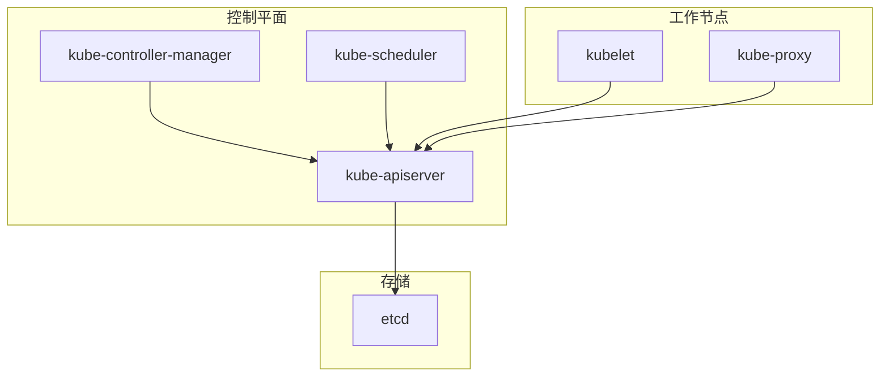
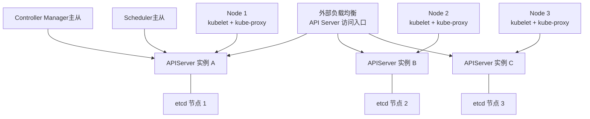
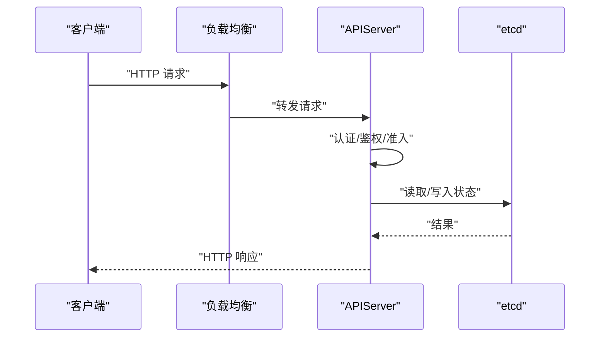
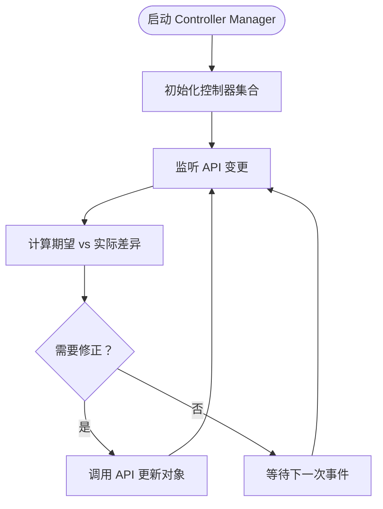
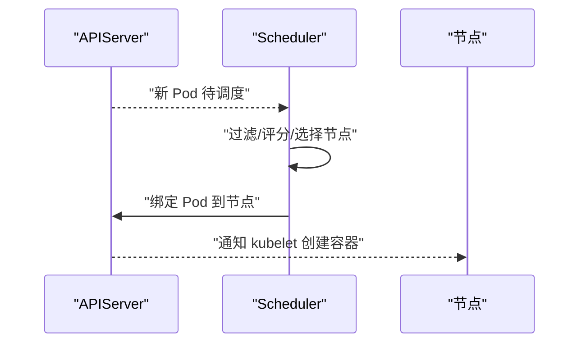
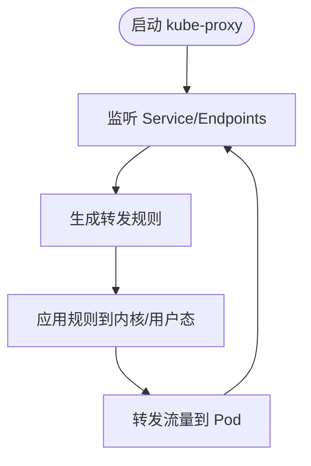
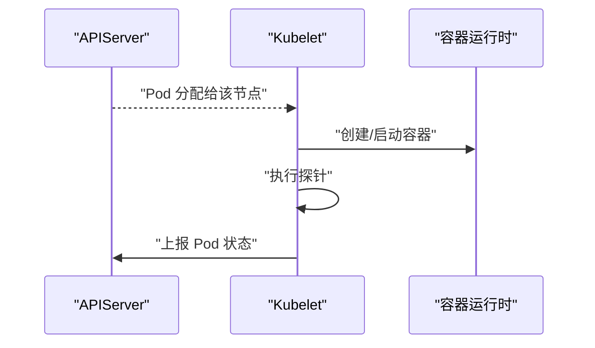
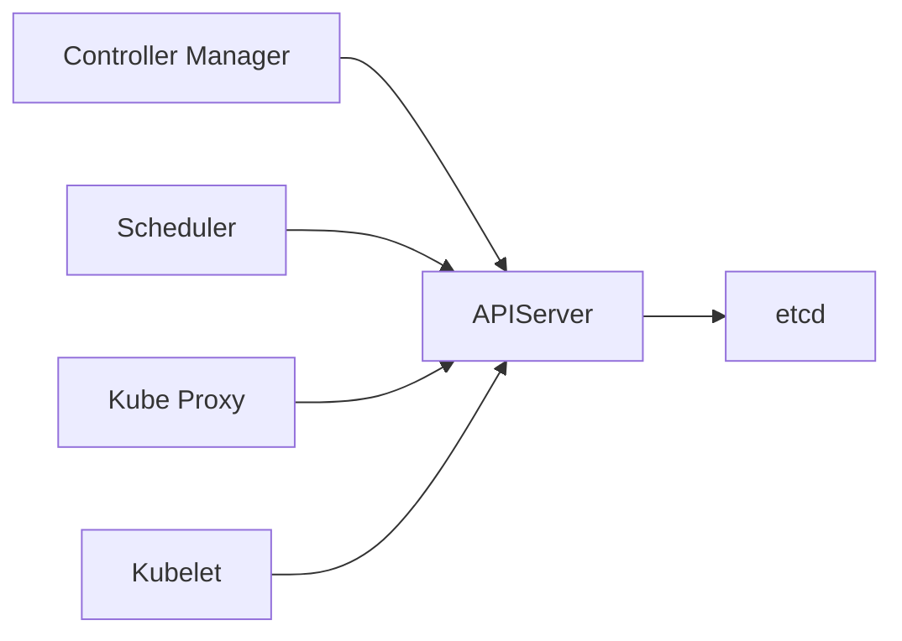

# 微服务架构模式

<cite>
**本文引用的文件**   
- [README.md](file://README.md)
- [apiserver.go](file://cmd/kube-apiserver/apiserver.go)
- [controller-manager.go](file://cmd/kube-controller-manager/controller-manager.go)
- [scheduler.go](file://cmd/kube-scheduler/scheduler.go)
- [proxy.go](file://cmd/kube-proxy/proxy.go)
</cite>

## 目录
1. [简介](#简介)
2. [项目结构](#项目结构)
3. [核心组件](#核心组件)
4. [架构总览](#架构总览)
5. [详细组件分析](#详细组件分析)
6. [依赖关系分析](#依赖关系分析)
7. [性能与高可用](#性能与高可用)
8. [故障排查指南](#故障排查指南)
9. [结论](#结论)
10. [附录](#附录)

## 简介
本文件面向在 Kubernetes 之上构建微服务的工程团队，围绕“独立进程、职责分离、统一通信协议、服务发现与负载均衡、集中配置与动态更新、可观测性（日志/指标/追踪）、部署拓扑与高可用、熔断限流降级、跨语言客户端 SDK”等主题，给出基于仓库中控制平面组件的落地方案与最佳实践。内容既提供高层概念，也结合仓库中的入口程序与启动流程进行映射说明，帮助读者将通用微服务模式与 Kubernetes 生态对齐。

## 项目结构
仓库采用多二进制入口的组织方式，每个控制面组件以独立进程运行，遵循单一职责原则：
- kube-apiserver：集群 API 网关，统一认证鉴权、请求路由、持久化到 etcd
- kube-controller-manager：控制器集合，维护期望状态与实际状态一致
- kube-scheduler：调度器，选择合适节点执行 Pod
- kube-proxy：网络代理，实现 Service 到 Pod 的流量转发与负载均衡

图表来源
- [apiserver.go:1-37](file://cmd/kube-apiserver/apiserver.go#L1-L37)
- [controller-manager.go:1-39](file://cmd/kube-controller-manager/controller-manager.go#L1-L39)
- [scheduler.go:1-34](file://cmd/kube-scheduler/scheduler.go#L1-L34)
- [proxy.go:1-34](file://cmd/kube-proxy/proxy.go#L1-L34)

章节来源
- [README.md:1-101](file://README.md#L1-L101)
- [apiserver.go:1-37](file://cmd/kube-apiserver/apiserver.go#L1-L37)
- [controller-manager.go:1-39](file://cmd/kube-controller-manager/controller-manager.go#L1-L39)
- [scheduler.go:1-34](file://cmd/kube-scheduler/scheduler.go#L1-L34)
- [proxy.go:1-34](file://cmd/kube-proxy/proxy.go#L1-L34)

## 核心组件
- 独立进程设计
  - 每个组件通过独立的 main 函数启动，使用统一的 CLI 框架加载命令树并运行，便于横向扩展与隔离故障。
  - 组件内默认注册 JSON 日志格式与 Prometheus 版本/客户端指标，为可观测性提供基础能力。
- 职责分离
  - apiserver 作为唯一数据面入口，对外暴露 RESTful API；内部负责认证、授权、准入、审计、缓存与持久化。
  - controller-manager 聚合多个控制器，循环对比期望与实际状态，驱动变更。
  - scheduler 专注调度决策，依据资源、亲和性、污点容忍等策略选择节点。
  - proxy 监听 Service/Endpoint 变化，更新内核或用户态转发规则，实现 L4/L7 负载均衡。

章节来源
- [apiserver.go:1-37](file://cmd/kube-apiserver/apiserver.go#L1-L37)
- [controller-manager.go:1-39](file://cmd/kube-controller-manager/controller-manager.go#L1-L39)
- [scheduler.go:1-34](file://cmd/kube-scheduler/scheduler.go#L1-L34)
- [proxy.go:1-34](file://cmd/kube-proxy/proxy.go#L1-L34)

## 架构总览
下图展示典型的多实例部署与高可用拓扑：apiserver 多副本配合外部负载均衡；etcd 三副本保证强一致；控制器与调度器主从选举避免脑裂；kube-proxy 在每个节点部署，确保就近转发。

图表来源
- [apiserver.go:1-37](file://cmd/kube-apiserver/apiserver.go#L1-L37)
- [controller-manager.go:1-39](file://cmd/kube-controller-manager/controller-manager.go#L1-L39)
- [scheduler.go:1-34](file://cmd/kube-scheduler/scheduler.go#L1-L34)
- [proxy.go:1-34](file://cmd/kube-proxy/proxy.go#L1-L34)

## 详细组件分析

### 组件 A：API Server（统一 API 网关）
- 角色与边界
  - 对外提供 HTTP REST 接口，是集群唯一的数据面入口；对内协调认证、鉴权、准入、审计、缓存与持久化。
- 关键流程（简化）
  - 接收请求 → 认证/鉴权 → 路由到对应资源处理器 → 读写 etcd → 返回响应。
- 可观测性
  - 默认注册 Prometheus 版本与 client-go 指标，便于监控 QPS、延迟、错误率等。
- 高可用
  - 多副本部署于外部负载均衡之后，共享同一 etcd 集群。

图表来源
- [apiserver.go:1-37](file://cmd/kube-apiserver/apiserver.go#L1-L37)

章节来源
- [apiserver.go:1-37](file://cmd/kube-apiserver/apiserver.go#L1-L37)

### 组件 B：Controller Manager（状态同步器）
- 角色与边界
  - 聚合多个控制器，持续观察 API 变更，驱动实际状态收敛至期望状态。
- 关键流程（简化）
  - 启动控制器集合 → 监听 API 事件 → 计算差异 → 调用 API 修正状态。
- 高可用
  - 通过主从选举确保只有一个实例处于 Active 状态，避免重复执行。

图表来源
- [controller-manager.go:1-39](file://cmd/kube-controller-manager/controller-manager.go#L1-L39)

章节来源
- [controller-manager.go:1-39](file://cmd/kube-controller-manager/controller-manager.go#L1-L39)

### 组件 C：Scheduler（调度器）
- 角色与边界
  - 对未绑定的 Pod 进行打分与选择，将其绑定到合适的节点。
- 关键流程（简化）
  - 监听待调度队列 → 过滤候选节点 → 评分排序 → 绑定 Pod 到节点。
- 高可用
  - 主从选举，避免重复调度。

图表来源
- [scheduler.go:1-34](file://cmd/kube-scheduler/scheduler.go#L1-L34)

章节来源
- [scheduler.go:1-34](file://cmd/kube-scheduler/scheduler.go#L1-L34)

### 组件 D：Kube Proxy（Service 负载均衡）
- 角色与边界
  - 监听 Service/Endpoint 变化，更新内核表项或用户态转发规则，实现 L4/L7 负载均衡与健康检查。
- 关键流程（简化）
  - 监听 API → 生成转发规则 → 下发到内核/用户态 → 转发流量到后端 Pod。
- 高可用
  - 每节点部署，天然具备就近转发与容错能力。

图表来源
- [proxy.go:1-34](file://cmd/kube-proxy/proxy.go#L1-L34)

章节来源
- [proxy.go:1-34](file://cmd/kube-proxy/proxy.go#L1-L34)

### 组件 E：Kubelet（节点代理）
- 角色与边界
  - 节点级代理，负责 Pod 生命周期管理、镜像拉取、探针执行、资源上报等。
- 关键流程（简化）
  - 监听 API → 根据 PodSpec 拉起容器 → 健康检查 → 上报状态。

[本节为概念性描述，不直接分析具体源码文件]

## 依赖关系分析
- 组件耦合
  - 所有控制面组件均依赖 APIServer 提供的 REST API；kube-proxy 依赖 Service/Endpoint 资源；kubelet 依赖 Pod/Node 等资源。
- 外部依赖
  - APIServer 依赖 etcd 作为持久化存储；各组件通过 TLS 与 mTLS 保障安全。
- 可观测性依赖
  - 组件默认注册 Prometheus 指标，便于集中采集与告警。

图表来源
- [apiserver.go:1-37](file://cmd/kube-apiserver/apiserver.go#L1-L37)
- [controller-manager.go:1-39](file://cmd/kube-controller-manager/controller-manager.go#L1-L39)
- [scheduler.go:1-34](file://cmd/kube-scheduler/scheduler.go#L1-L34)
- [proxy.go:1-34](file://cmd/kube-proxy/proxy.go#L1-L34)

章节来源
- [apiserver.go:1-37](file://cmd/kube-apiserver/apiserver.go#L1-L37)
- [controller-manager.go:1-39](file://cmd/kube-controller-manager/controller-manager.go#L1-L39)
- [scheduler.go:1-34](file://cmd/kube-scheduler/scheduler.go#L1-L34)
- [proxy.go:1-34](file://cmd/kube-proxy/proxy.go#L1-L34)

## 性能与高可用
- 多实例与主从
  - APIServer 多副本置于负载均衡后；Controller Manager 与 Scheduler 启用主从选举，避免重复执行。
- 负载均衡策略
  - L4：基于 IPVS/iptables/NFTables 的轮询、最少连接、源地址哈希等策略。
  - L7：Ingress/Service 层按域名/路径分发，结合健康检查与权重。
- 弹性伸缩
  - 水平扩缩容：HPA/VPA 基于 CPU/内存/自定义指标自动调整副本数。
- 容量规划
  - 合理设置 APIServer 并发、缓存大小、etcd 磁盘 I/O 与网络带宽，关注慢查询与长事务。

[本节为通用指导，不直接分析具体源码文件]

## 故障排查指南
- 日志
  - 组件默认注册 JSON 日志格式，建议集中收集到 ELK/Loki 等平台，统一检索与关联。
- 指标
  - 利用 Prometheus 抓取各组件指标，建立 SLO 与告警（如 APIServer 延迟、错误率、etcd 写放大）。
- 追踪
  - 在 APIServer 与业务服务中集成分布式追踪（如 OpenTelemetry），以 TraceID 贯穿请求链路。
- 常见问题定位
  - 无法访问 API：检查负载均衡健康检查、证书与 RBAC 权限。
  - Pod 未调度：查看 Scheduler 日志与节点资源/污点/亲和性配置。
  - 服务不可达：检查 Endpoint 是否就绪、kube-proxy 规则是否生效。

[本节为通用指导，不直接分析具体源码文件]

## 结论
通过将控制面组件拆分为独立进程并明确职责边界，Kubernetes 提供了稳定可扩展的微服务基础设施。结合统一 API、服务发现与负载均衡、集中配置与动态更新、以及完善的可观测性与高可用机制，可在其上构建健壮、可演进的微服务体系。

[本节为总结性内容，不直接分析具体源码文件]

## 附录

### 通信协议与使用场景
- gRPC
  - 适用场景：组件间高性能双向流式通信（如插件、遥测上报、实时日志推送）。
  - 建议：定义稳定的 proto 契约，开启压缩与超时控制，结合重试与退避。
- HTTP REST
  - 适用场景：标准 API 交互（APIServer 对外接口）、Webhook、健康检查与配置拉取。
  - 建议：遵循幂等与版本化，启用 TLS 与鉴权。
- WebSocket
  - 适用场景：实时日志、交互式调试、控制台输出。
  - 建议：限制速率与窗口，做好断线重连与背压。

[本节为通用指导，不直接分析具体源码文件]

### 服务发现与负载均衡
- 服务发现
  - 通过 Service/Endpoint/EndpointSlice 实现声明式服务发现；客户端可通过 DNS 或环境变量解析。
- 负载均衡
  - 内核态（IPVS/iptables/NFTables）与用户态（eBPF/边车）两种路径；支持会话保持与权重。

[本节为通用指导，不直接分析具体源码文件]

### 配置管理与动态更新
- 集中化
  - ConfigMap/Secret 作为配置中心，结合 Volume 挂载或环境变量注入。
- 动态更新
  - 热更新：通过文件卷或 Sidecar 监听变更并触发进程重载。
  - 滚动重启：针对不支持热更新的组件，采用滚动更新策略。

[本节为通用指导，不直接分析具体源码文件]

### 可观测性统一方案
- 日志
  - 结构化 JSON 日志，统一采集到集中平台，按服务/命名空间/实例维度索引。
- 指标
  - 暴露 Prometheus 端点，结合 Grafana 可视化与 Alertmanager 告警。
- 分布式追踪
  - 在 APIServer 与业务服务中注入追踪中间件，统一 TraceID 传播。

[本节为通用指导，不直接分析具体源码文件]

### 服务熔断、限流与降级
- 熔断
  - 基于失败率/延迟阈值快速失败，避免雪崩；恢复后逐步放量。
- 限流
  - 令牌桶/漏桶算法，区分租户/接口粒度；结合优先级与抢占。
- 降级
  - 非核心功能开关、只读模式、缓存兜底与默认值。

[本节为通用指导，不直接分析具体源码文件]

### 跨语言客户端 SDK 设计与实现
- 设计原则
  - 语言无关的 API 契约（OpenAPI/gRPC proto），自动生成多语言客户端。
  - 统一错误模型与重试/退避策略，内置 TLS 与鉴权。
- 实现要点
  - 类型安全与序列化一致性；分页与列表增量同步；上下文与超时控制。
  - 可插拔的传输层（HTTP/gRPC）与拦截器（日志/追踪/指标）。

[本节为通用指导，不直接分析具体源码文件]