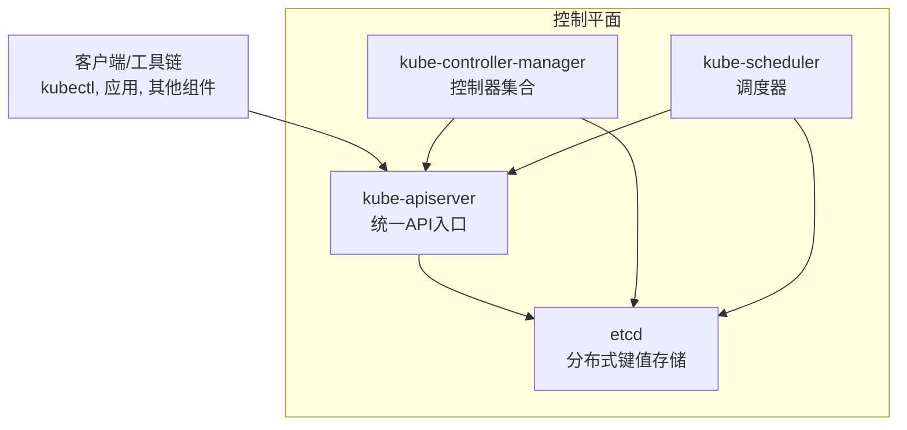
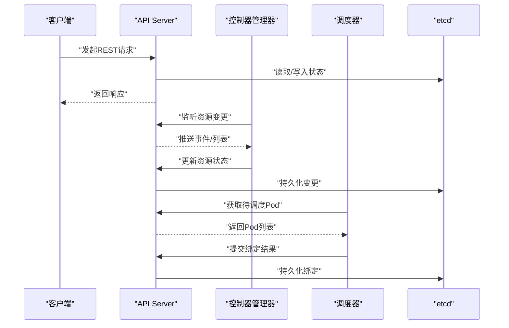
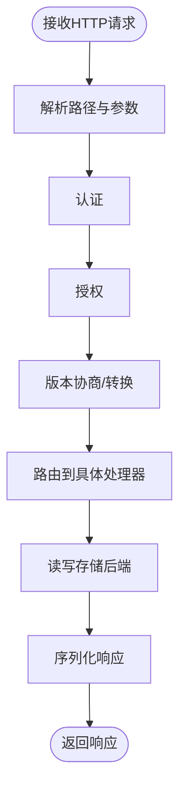
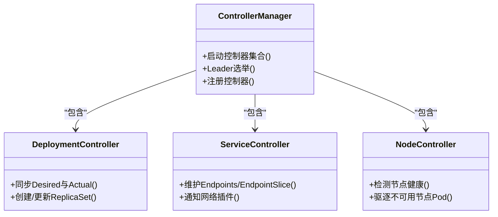
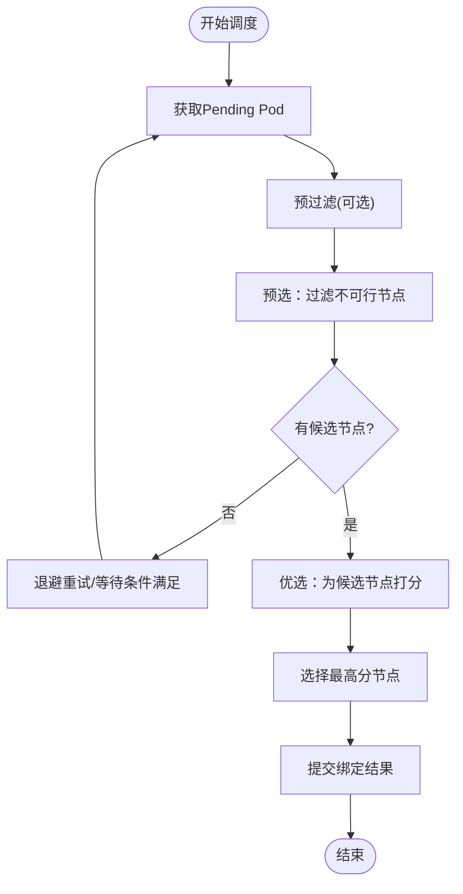
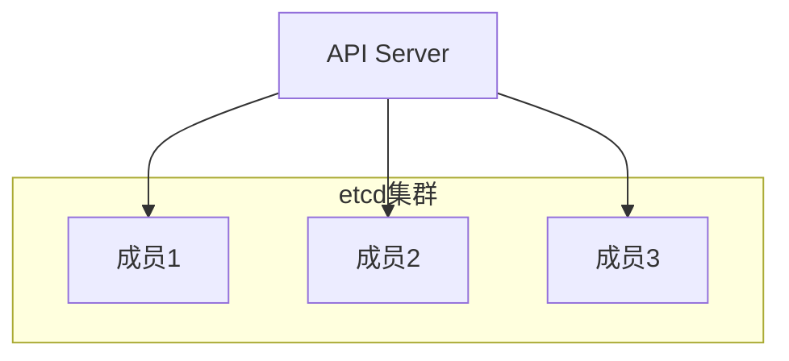
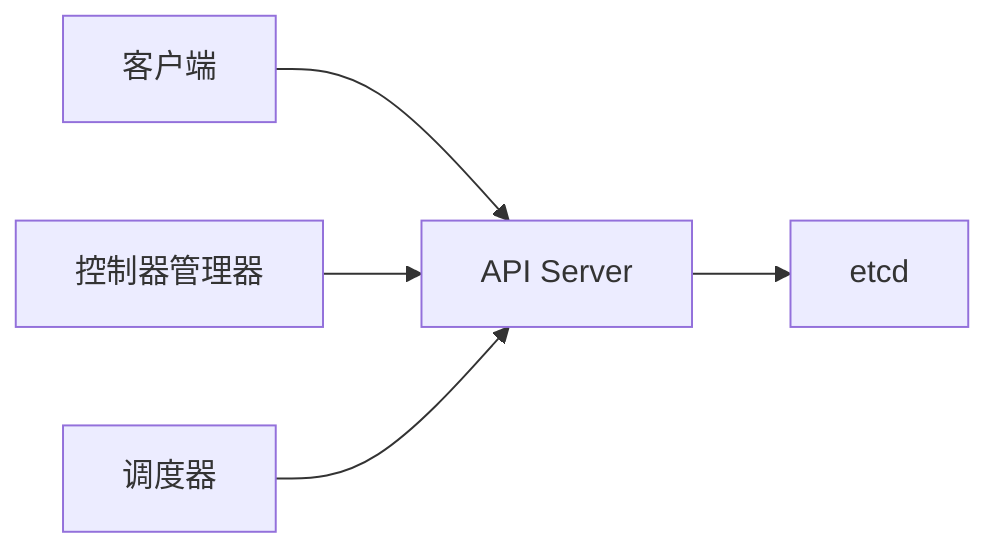

# 控制平面架构

<cite>
**本文引用的文件**   
- [apiserver.go](file://cmd/kube-apiserver/apiserver.go)
- [controller-manager.go](file://cmd/kube-controller-manager/controller-manager.go)
- [scheduler.go](file://cmd/kube-scheduler/scheduler.go)
- [README.md](file://README.md)
</cite>

## 目录
1. [简介](#简介)
2. [项目结构](#项目结构)
3. [核心组件](#核心组件)
4. [架构总览](#架构总览)
5. [详细组件分析](#详细组件分析)
6. [依赖关系分析](#依赖关系分析)
7. [性能考量](#性能考量)
8. [故障排查指南](#故障排查指南)
9. [结论](#结论)
10. [附录](#附录)

## 简介
本文件面向Kubernetes控制平面，聚焦API Server、Controller Manager与Scheduler三大核心组件的职责、交互流程与关键机制。文档从代码入口出发，结合仓库中的主程序入口文件，梳理请求处理链路、控制器框架与调度流程，并给出高可用部署与故障恢复的通用建议。

## 项目结构
仓库采用多模块组织方式，控制平面各组件以独立可执行程序形式提供：
- kube-apiserver：集群的统一API入口，负责REST API路由、认证授权、版本协商、存储后端集成等。
- kube-controller-manager：运行一组内置控制器，持续观察集群状态并驱动其向期望状态收敛。
- kube-scheduler：将待调度的Pod分配到合适的节点，完成预选、优选与绑定阶段。

[此图为概念性架构图，不直接映射具体源码文件，故无图表来源]

**章节来源**
- [README.md:1-101](file://README.md#L1-L101)

## 核心组件
本节概述三个控制平面组件在仓库中的入口点及其职责边界。

- kube-apiserver
  - 入口：创建命令对象并执行，作为集群管理API的服务端。
  - 职责：REST API路由、认证与授权、准入控制、版本协商、存储后端（如etcd）读写、事件与日志、指标暴露等。
  
- kube-controller-manager
  - 入口：创建命令对象并执行，启动多个控制器循环。
  - 职责：监听API资源变化，协调Deployment、Service、Node、Endpoint等资源的期望与实际状态一致。

- kube-scheduler
  - 入口：创建命令对象并执行，进入调度主循环。
  - 职责：对Pending状态的Pod进行预选、优选与绑定，输出最终调度决策。

**章节来源**
- [apiserver.go:17-36](file://cmd/kube-apiserver/apiserver.go#L17-L36)
- [controller-manager.go:17-38](file://cmd/kube-controller-manager/controller-manager.go#L17-L38)
- [scheduler.go:17-33](file://cmd/kube-scheduler/scheduler.go#L17-L33)

## 架构总览
下图展示了控制平面整体交互：外部客户端通过API Server访问集群；控制器与调度器通过API Server读取/写入状态；所有持久化数据由etcd保证一致性。

[此图为概念性序列图，不直接映射具体源码文件，故无图表来源]

## 详细组件分析

### API Server：统一API入口
- REST API处理
  - 负责解析HTTP请求、匹配资源与版本、调用对应处理器，并将结果序列化返回。
- 认证与授权
  - 在请求进入业务逻辑前，完成身份认证与权限校验，确保只有合法主体能访问受保护资源。
- 版本管理
  - 支持多版本API共存与协商，保障客户端与服务端之间的兼容演进。
- 存储后端集成
  - 通过抽象层对接底层存储（通常为etcd），实现CRUD、Watch、事务与一致性语义。

[此图为概念性流程图，不直接映射具体源码文件，故无图表来源]

**章节来源**
- [apiserver.go:17-36](file://cmd/kube-apiserver/apiserver.go#L17-L36)

### Controller Manager：控制器框架与内置控制器
- 控制器框架设计
  - 每个控制器维护一个“期望状态”与“实际状态”的差集，并通过事件驱动的循环不断收敛差异。
  - 典型步骤：List/Watch资源 -> 计算差异 -> 调用API修改资源 -> 等待下一次事件。
- 常见内置控制器职责
  - Deployment：管理ReplicaSet与Pod副本数，支持滚动升级与回滚。
  - Service：维护Endpoints或EndpointSlice，配合网络插件实现服务发现与负载均衡。
  - Node：监控节点健康与条件，回收不可用节点上的Pod，维护节点资源视图。
  - 其他：ReplicaSet、StatefulSet、DaemonSet、Job/CronJob、GC、TTL等。
- 协调机制
  - 通过Leader Election避免重复执行；使用资源Versioned字段保证并发安全；借助缓存减少API压力。

[此图为概念性类图，不直接映射具体源码文件，故无图表来源]

**章节来源**
- [controller-manager.go:17-38](file://cmd/kube-controller-manager/controller-manager.go#L17-L38)

### Scheduler：调度算法与策略
- 调度阶段
  - 预选（Predicates）：基于资源、亲和/反亲和、污点容忍、拓扑约束等过滤不可行节点。
  - 优选（Priorities）：对候选节点打分，选择最优节点。
  - 绑定（Binding）：将Pod与节点绑定，触发后续容器生命周期管理。
- 扩展点
  - 通过插件化框架注入自定义预选/优选逻辑，满足复杂调度需求。
- 与API Server和etcd的交互
  - 读取待调度Pod与节点信息，提交绑定结果，确保状态一致。

[此图为概念性流程图，不直接映射具体源码文件，故无图表来源]

**章节来源**
- [scheduler.go:17-33](file://cmd/kube-scheduler/scheduler.go#L17-L33)

### etcd：分布式键值存储与一致性
- 角色
  - 作为Kubernetes的事实源（Source of Truth），持久化所有API对象的状态与元数据。
- 一致性保证
  - 基于Raft协议提供线性一致性读/写，确保控制平面在多实例下的一致性与强一致语义。
- 高可用
  - 通常部署奇数个成员（如3或5），通过多数派投票达成共识，容忍少数节点故障。

[此图为概念性架构图，不直接映射具体源码文件，故无图表来源]

## 依赖关系分析
控制平面组件之间通过API Server进行松耦合通信，降低直接依赖，提升可扩展性与可维护性。

[此图为概念性依赖图，不直接映射具体源码文件，故无图表来源]

**章节来源**
- [apiserver.go:17-36](file://cmd/kube-apiserver/apiserver.go#L17-L36)
- [controller-manager.go:17-38](file://cmd/kube-controller-manager/controller-manager.go#L17-L38)
- [scheduler.go:17-33](file://cmd/kube-scheduler/scheduler.go#L17-L33)

## 性能考量
- API Server
  - 合理设置并发与限流参数，启用缓存与分页，避免大对象频繁全量拉取。
  - 利用Watch增量订阅替代轮询，降低带宽与CPU消耗。
- 控制器
  - 使用工作队列与速率限制，避免风暴式重入；按资源粒度拆分控制器，提高并行度。
- 调度器
  - 优化预选/优选算法复杂度，按需启用插件；对大规模集群考虑分区调度与批量处理。
- etcd
  - 调整快照与压缩策略，监控磁盘I/O与网络延迟；保持合理的对象大小与数量。

[本节为通用指导，不涉及具体源码文件]

## 故障排查指南
- API Server
  - 检查认证/授权配置与证书有效性；查看准入控制日志；确认存储后端连通性与一致性。
- 控制器
  - 关注控制器日志与事件；验证Leader选举是否成功；检查资源版本冲突与重试策略。
- 调度器
  - 分析调度失败原因（资源不足、亲和/反亲和、污点/容忍）；检查预选/优选插件输出。
- etcd
  - 监控成员健康与Raft状态；检查磁盘空间与I/O瓶颈；必要时进行快照恢复。

[本节为通用指导，不涉及具体源码文件]

## 结论
Kubernetes控制平面以API Server为核心枢纽，控制器与调度器围绕其构建事件驱动的自愈系统。etcd提供强一致的持久化能力，支撑整个系统的可靠性与可扩展性。通过插件化与模块化设计，平台具备良好的演进能力与生态兼容性。

[本节为总结性内容，不涉及具体源码文件]

## 附录
- 高可用部署模式
  - API Server多实例+负载均衡；etcd奇数成员集群；控制器与调度器启用Leader Election。
- 故障恢复策略
  - 自动重试与指数退避；优雅降级与熔断；定期快照与备份；灰度发布与快速回滚。

[本节为通用指导，不涉及具体源码文件]