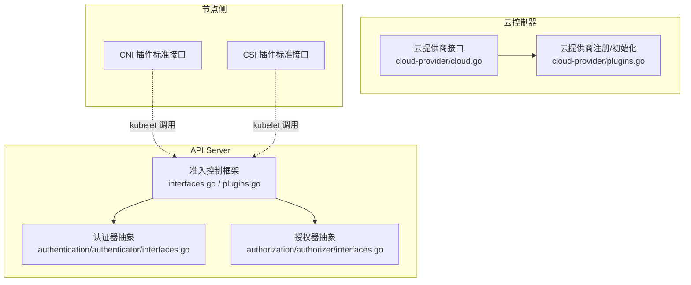
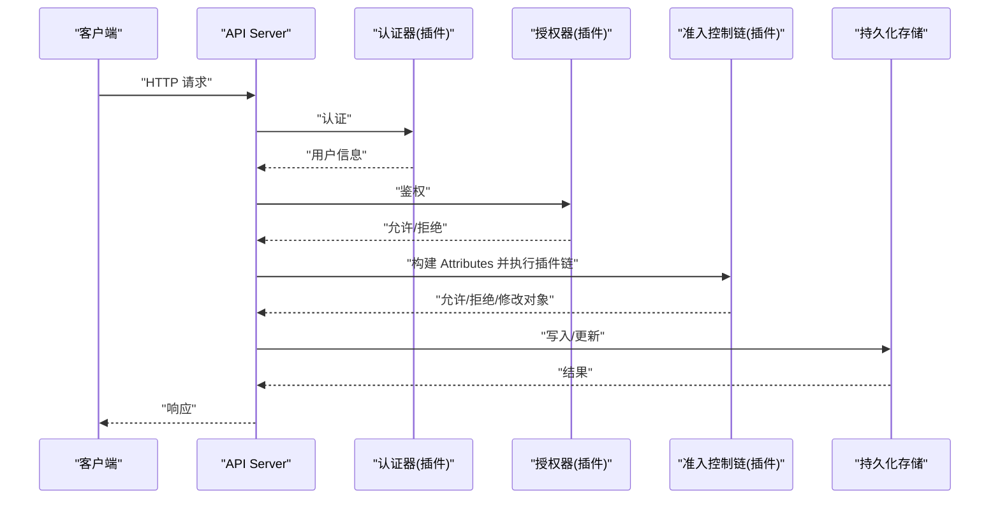
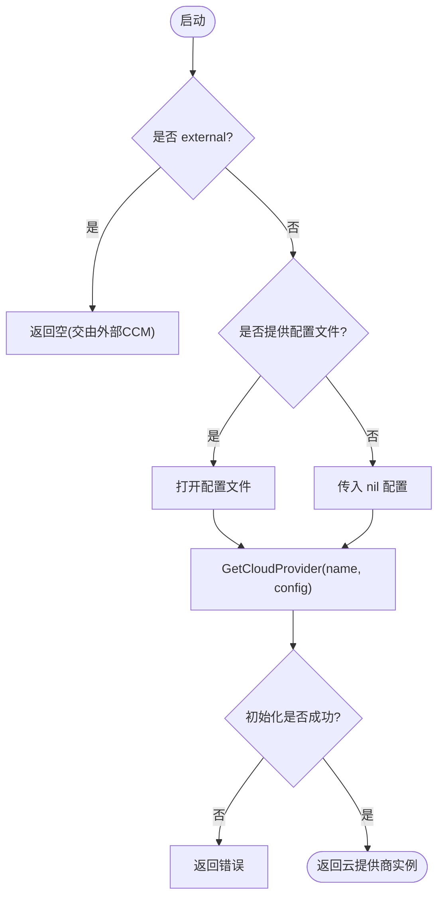
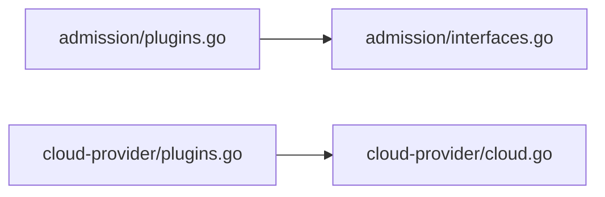

# 插件化架构

<cite>
**本文引用的文件**   
- [staging/src/k8s.io/apiserver/pkg/admission/interfaces.go](file://staging/src/k8s.io/apiserver/pkg/admission/interfaces.go)
- [staging/src/k8s.io/apiserver/pkg/admission/plugins.go](file://staging/src/k8s.io/apiserver/pkg/admission/plugins.go)
- [staging/src/k8s.io/cloud-provider/cloud.go](file://staging/src/k8s.io/cloud-provider/cloud.go)
- [staging/src/k8s.io/cloud-provider/plugins.go](file://staging/src/k8s.io/cloud-provider/plugins.go)
</cite>

## 目录
1. [简介](#简介)
2. [项目结构](#项目结构)
3. [核心组件](#核心组件)
4. [架构总览](#架构总览)
5. [详细组件分析](#详细组件分析)
6. [依赖关系分析](#依赖关系分析)
7. [性能考量](#性能考量)
8. [故障排查指南](#故障排查指南)
9. [结论](#结论)
10. [附录](#附录)

## 简介
本文件围绕 Kubernetes 的插件化架构，聚焦以下主题：
- 准入控制插件的设计与扩展点（注册、初始化、调用链）
- 认证与授权插件的抽象接口与集成方式
- 云提供商抽象层设计与多云平台集成机制
- CSI 存储插件与 CNI 网络插件的标准接口定位与职责边界
- 插件生命周期管理、配置加载与错误处理
- 插件开发指南、最佳实践、版本兼容性与依赖管理
- 安全沙箱与权限控制机制

说明：
- 本文所有代码级分析与图示均基于仓库中实际源码路径进行引用。
- 对于未在仓库中直接实现的具体细节（如外部 CNI/CSI 二进制通信），以概念性说明为主，不附加具体源码来源。

## 项目结构
与插件化相关的关键目录与文件：
- 准入控制框架与内置插件
  - 接口定义与插件工厂：staging/src/k8s.io/apiserver/pkg/admission/interfaces.go、plugins.go
  - 内置插件示例：plugin/pkg/admission/*（例如 alwayspullimages、limitranger、security/podsecurity 等）
- 认证与授权
  - 认证器抽象：staging/src/k8s.io/apiserver/pkg/authentication/authenticator/interfaces.go
  - 授权器抽象：staging/src/k8s.io/apiserver/pkg/authorization/authorizer/interfaces.go
- 云控制器与云提供商抽象
  - 云提供商接口与实例元数据：staging/src/k8s.io/cloud-provider/cloud.go
  - 云提供商注册与初始化：staging/src/k8s.io/cloud-provider/plugins.go



图表来源
- [staging/src/k8s.io/apiserver/pkg/admission/interfaces.go:123-175](file://staging/src/k8s.io/apiserver/pkg/admission/interfaces.go#L123-L175)
- [staging/src/k8s.io/apiserver/pkg/admission/plugins.go:31-109](file://staging/src/k8s.io/apiserver/pkg/admission/plugins.go#L31-L109)
- [staging/src/k8s.io/cloud-provider/cloud.go:42-69](file://staging/src/k8s.io/cloud-provider/cloud.go#L42-L69)
- [staging/src/k8s.io/cloud-provider/plugins.go:42-76](file://staging/src/k8s.io/cloud-provider/plugins.go#L42-L76)

章节来源
- [staging/src/k8s.io/apiserver/pkg/admission/interfaces.go:123-175](file://staging/src/k8s.io/apiserver/pkg/admission/interfaces.go#L123-L175)
- [staging/src/k8s.io/apiserver/pkg/admission/plugins.go:31-109](file://staging/src/k8s.io/apiserver/pkg/admission/plugins.go#L31-L109)
- [staging/src/k8s.io/cloud-provider/cloud.go:42-69](file://staging/src/k8s.io/cloud-provider/cloud.go#L42-L69)
- [staging/src/k8s.io/cloud-provider/plugins.go:42-76](file://staging/src/k8s.io/cloud-provider/plugins.go#L42-L76)

## 核心组件
- 准入控制插件
  - 核心接口：Interface、MutationInterface、ValidationInterface
  - 请求上下文：Attributes、ObjectInterfaces、ReinvocationContext
  - 插件工厂与注册：Factory、Plugins.Register、NewFromPlugins
  - 初始化与校验：PluginInitializer、InitializationValidator
- 认证与授权
  - 认证器接口：Authentication authenticator 包中的 Interface
  - 授权器接口：Authorization authorizer 包中的 Interface
- 云提供商抽象
  - 云提供商主接口：cloudprovider.Interface
  - 子能力接口：LoadBalancer、Instances、InstancesV2、Zones、Routes、Clusters
  - 注册与初始化：RegisterCloudProvider、GetCloudProvider、InitCloudProvider

章节来源
- [staging/src/k8s.io/apiserver/pkg/admission/interfaces.go:123-175](file://staging/src/k8s.io/apiserver/pkg/admission/interfaces.go#L123-L175)
- [staging/src/k8s.io/apiserver/pkg/admission/plugins.go:31-109](file://staging/src/k8s.io/apiserver/pkg/admission/plugins.go#L31-L109)
- [staging/src/k8s.io/cloud-provider/cloud.go:42-69](file://staging/src/k8s.io/cloud-provider/cloud.go#L42-L69)
- [staging/src/k8s.io/cloud-provider/plugins.go:42-76](file://staging/src/k8s.io/cloud-provider/plugins.go#L42-L76)

## 架构总览
Kubernetes 的插件化通过“接口 + 工厂 + 注册表”的模式解耦核心系统与扩展实现：
- API Server 在启动时根据配置加载并初始化一组准入控制插件，形成 AdmissionChain 对请求进行验证与变更。
- 认证与授权分别由独立的插件体系提供，API Server 将认证结果注入到 Attributes 供准入插件使用。
- 云控制器管理器通过 cloud-provider 抽象对接不同云平台，暴露 LoadBalancer、Instances、Routes 等能力。
- 节点侧通过 CNI 与 CSI 标准接口与内核/运行时交互，完成网络与存储能力的扩展。



[此图为概念流程示意，未直接映射具体源码文件，故不附图表来源]

## 详细组件分析

### 准入控制插件系统
- 设计要点
  - 统一入口：Interface 声明 Handles(operation)，用于判断是否处理某操作类型。
  - 两类能力：MutationInterface（可修改对象）、ValidationInterface（仅校验）。
  - 上下文传递：Attributes 提供请求元数据；ObjectInterfaces 提供对象创建/转换/默认值工具；ReinvocationContext 支持重入策略。
  - 插件工厂与注册：Factory 函数返回插件实例；Plugins 维护注册表并提供 NewFromPlugins 组装链。
  - 初始化与校验：PluginInitializer 注入共享资源；InitializationValidator 做二次校验。
- 关键流程
  - 启动阶段：读取配置 -> 解析插件名列表 -> 为每个插件获取配置 -> 调用 InitPlugin -> 可选装饰器 -> 加入链。
  - 运行阶段：构造 Attributes -> 遍历链 -> 依次调用 Validate/Admit -> 汇总结果。

```mermaid
classDiagram
class Interface {
+Handles(operation) bool
}
class MutationInterface {
+Admit(ctx, a, o) error
}
class ValidationInterface {
+Validate(ctx, a, o) error
}
class Attributes {
+GetName() string
+GetNamespace() string
+GetResource() GroupVersionResource
+GetSubresource() string
+GetOperation() Operation
+GetObject() runtime.Object
+GetOldObject() runtime.Object
+GetKind() GroupVersionKind
+GetUserInfo() user.Info
+AddAnnotation(key, value) error
+AddAnnotationWithLevel(key, value, level) error
+GetReinvocationContext() ReinvocationContext
}
class ObjectInterfaces {
+GetObjectCreater()
+GetObjectTyper()
+GetObjectDefaulter()
+GetObjectConvertor()
+GetEquivalentResourceMapper()
}
class ReinvocationContext {
+IsReinvoke() bool
+SetIsReinvoke()
+ShouldReinvoke() bool
+SetShouldReinvoke()
+SetValue(plugin, v)
+Value(plugin) interface{}
}
class PluginInitializer {
+Initialize(plugin)
}
class InitializationValidator {
+ValidateInitialization() error
}
class ConfigProvider {
+ConfigFor(pluginName) io.Reader
}
class Plugins {
+Register(name, Factory)
+NewFromPlugins(names, configProvider, initializer, decorator)
+InitPlugin(name, config, initializer)
}
MutationInterface ..|> Interface
ValidationInterface ..|> Interface
AdmissionChain --> Interface : "组合多个插件"
AdmissionChain --> Attributes : "传入请求上下文"
AdmissionChain --> ObjectInterfaces : "对象工具"
AdmissionChain --> ReinvocationContext : "重入策略"
Plugins --> PluginInitializer : "初始化插件"
Plugins --> ConfigProvider : "读取配置"
```

图表来源
- [staging/src/k8s.io/apiserver/pkg/admission/interfaces.go:30-121](file://staging/src/k8s.io/apiserver/pkg/admission/interfaces.go#L30-L121)
- [staging/src/k8s.io/apiserver/pkg/admission/interfaces.go:123-175](file://staging/src/k8s.io/apiserver/pkg/admission/interfaces.go#L123-L175)
- [staging/src/k8s.io/apiserver/pkg/admission/plugins.go:31-109](file://staging/src/k8s.io/apiserver/pkg/admission/plugins.go#L31-L109)
- [staging/src/k8s.io/apiserver/pkg/admission/plugins.go:125-187](file://staging/src/k8s.io/apiserver/pkg/admission/plugins.go#L125-L187)

章节来源
- [staging/src/k8s.io/apiserver/pkg/admission/interfaces.go:30-121](file://staging/src/k8s.io/apiserver/pkg/admission/interfaces.go#L30-L121)
- [staging/src/k8s.io/apiserver/pkg/admission/interfaces.go:123-175](file://staging/src/k8s.io/apiserver/pkg/admission/interfaces.go#L123-L175)
- [staging/src/k8s.io/apiserver/pkg/admission/plugins.go:31-109](file://staging/src/k8s.io/apiserver/pkg/admission/plugins.go#L31-L109)
- [staging/src/k8s.io/apiserver/pkg/admission/plugins.go:125-187](file://staging/src/k8s.io/apiserver/pkg/admission/plugins.go#L125-L187)

### 认证与授权插件
- 认证器（Authentication）
  - 目标：从请求中提取并验证身份，输出用户信息。
  - 集成点：API Server 在请求进入后先调用认证器，成功后将用户信息注入 Attributes，供后续授权与准入插件使用。
- 授权器（Authorization）
  - 目标：基于用户/组/角色等策略决定请求是否被允许。
  - 集成点：认证通过后，API Server 调用授权器进行访问控制决策。
- 注意：认证与授权的具体接口定义位于 authentication/authenticator 与 authorization/authorizer 包中，本文不展开其内部实现细节。

章节来源
- [staging/src/k8s.io/apiserver/pkg/authentication/authenticator/interfaces.go](file://staging/src/k8s.io/apiserver/pkg/authentication/authenticator/interfaces.go)
- [staging/src/k8s.io/apiserver/pkg/authorization/authorizer/interfaces.go](file://staging/src/k8s.io/apiserver/pkg/authorization/authorizer/interfaces.go)

### 云提供商抽象层
- 设计要点
  - 统一入口：cloudprovider.Interface 提供 Initialize、ProviderName、HasClusterID 以及各能力接口的按需获取。
  - 能力拆分：LoadBalancer、Instances、InstancesV2、Zones、Routes、Clusters 等接口按功能域划分，便于按需启用。
  - 外部云模式：当指定 external 时，表示使用外部云控制器管理器，内嵌云提供商将被禁用。
- 注册与初始化
  - RegisterCloudProvider：在应用启动时注册云提供商工厂。
  - GetCloudProvider/InitCloudProvider：根据名称与配置文件创建实例，支持外部模式与错误提示。



图表来源
- [staging/src/k8s.io/cloud-provider/plugins.go:98-136](file://staging/src/k8s.io/cloud-provider/plugins.go#L98-L136)
- [staging/src/k8s.io/cloud-provider/plugins.go:42-76](file://staging/src/k8s.io/cloud-provider/plugins.go#L42-L76)
- [staging/src/k8s.io/cloud-provider/cloud.go:42-69](file://staging/src/k8s.io/cloud-provider/cloud.go#L42-L69)

章节来源
- [staging/src/k8s.io/cloud-provider/cloud.go:42-69](file://staging/src/k8s.io/cloud-provider/cloud.go#L42-L69)
- [staging/src/k8s.io/cloud-provider/plugins.go:42-76](file://staging/src/k8s.io/cloud-provider/plugins.go#L42-L76)
- [staging/src/k8s.io/cloud-provider/plugins.go:98-136](file://staging/src/k8s.io/cloud-provider/plugins.go#L98-L136)

### CSI 存储插件与 CNI 网络插件
- CSI（Container Storage Interface）
  - 职责：为容器编排系统提供统一的存储抽象，包括卷创建、挂载、快照、克隆等。
  - 集成点：kubelet 通过 CSI gRPC 接口与 CSI 驱动进程通信；API Server 通过 CRD（如 VolumeSnapshotClass、VolumeAttachment 等）协调状态。
- CNI（Container Network Interface）
  - 职责：为容器提供网络能力，包括 IPAM、网络配置下发、路由/防火墙规则管理等。
  - 集成点：kubelet 在 Pod 生命周期中调用 CNI 插件二进制或库，完成网络命名空间与设备配置。
- 说明：CSI/CNI 属于外部插件生态，通过标准协议与 kubelet 交互，不在 API Server 插件链之内。

[本节为概念性说明，不涉及具体源码文件，故不附章节来源]

### 插件生命周期管理与配置加载
- 准入控制
  - 注册：插件在应用启动时通过 Plugins.Register 注册工厂。
  - 初始化：NewFromPlugins 根据配置 Provider 为每个插件生成配置 Reader，调用 InitPlugin 完成实例化与共享资源注入。
  - 校验：若插件实现 InitializationValidator，则调用 ValidateInitialization 进行自检。
  - 执行：请求到达时，Attributes 携带用户信息与对象上下文，链式调用 Validate/Admit。
- 云提供商
  - 注册：RegisterCloudProvider 在启动时注册。
  - 初始化：InitCloudProvider 根据名称与配置文件创建实例，支持 external 模式。
  - 能力获取：通过 Interface 的 LoadBalancer()/Instances()/Routes() 等方法按需获取。

章节来源
- [staging/src/k8s.io/apiserver/pkg/admission/plugins.go:125-187](file://staging/src/k8s.io/apiserver/pkg/admission/plugins.go#L125-L187)
- [staging/src/k8s.io/cloud-provider/plugins.go:98-136](file://staging/src/k8s.io/cloud-provider/plugins.go#L98-L136)

### 错误处理机制
- 准入控制
  - 未知插件：返回“unknown admission plugin”错误。
  - 初始化失败：返回包含原始错误的包装错误。
  - 重复注册：日志致命错误，防止覆盖。
- 云提供商
  - 未找到：返回“unknown cloud provider”错误。
  - 初始化失败：返回包含原始错误的包装错误。
  - 外部模式：明确提示需迁移至外部云控制器管理器。

章节来源
- [staging/src/k8s.io/apiserver/pkg/admission/plugins.go:165-187](file://staging/src/k8s.io/apiserver/pkg/admission/plugins.go#L165-L187)
- [staging/src/k8s.io/cloud-provider/plugins.go:98-136](file://staging/src/k8s.io/cloud-provider/plugins.go#L98-L136)

### 插件开发指南与最佳实践
- 准入控制插件
  - 实现建议
    - 明确 Handles 的操作范围，避免不必要的处理。
    - 区分 Mutation 与 Validation 的职责，尽量保持幂等与无副作用。
    - 使用 Attributes.AddAnnotation 记录审计相关信息。
    - 利用 ReinvocationContext 配合重入策略，避免重复工作。
  - 配置与初始化
    - 通过 ConfigProvider 读取插件专属配置。
    - 若需要共享资源，实现 PluginInitializer 并在 Initialize 中注入。
    - 实现 InitializationValidator 进行启动期自检。
- 云提供商插件
  - 实现建议
    - 遵循 cloudprovider.Interface 的能力拆分，按需返回 nil 表示不支持。
    - 正确设置 ProviderName 与 HasClusterID。
    - 对外部云模式做好兼容与提示。
- 通用最佳实践
  - 错误语义清晰：区分“未实现”、“未找到”、“临时不可用”等。
  - 日志与指标：记录关键路径与异常，便于排障。
  - 并发安全：注册表与全局状态加锁保护。
  - 向后兼容：保留旧字段与行为，逐步弃用。

[本节为通用指导，不直接分析具体文件，故不附章节来源]

### 插件间依赖关系与版本兼容性
- 依赖关系
  - 准入插件之间可通过 ReinvocationContext 交换轻量状态，避免紧耦合。
  - 云控制器与 API Server 通过标准 API 对象交互，降低耦合度。
- 版本兼容
  - 插件应声明支持的 API 版本，并在初始化时校验。
  - 对废弃能力提供降级路径与告警。
  - 采用渐进式弃用策略，确保跨版本升级平滑。

[本节为概念性说明，不直接分析具体文件，故不附章节来源]

### 安全沙箱与权限控制
- 准入控制
  - 通过 RBAC 限制对敏感资源的访问。
  - 使用 Audit 级别与注解记录变更，满足合规审计。
- 云控制器
  - 最小权限原则：仅授予必要的 ServiceAccount 权限。
  - 隔离部署：外部云控制器独立运行，减少攻击面。
- 节点侧插件（CNI/CSI）
  - 以独立进程运行，限制文件系统与网络访问。
  - 通过 Unix Socket/gRPC 与 kubelet 通信，避免直接暴露端口。

[本节为概念性说明，不直接分析具体文件，故不附章节来源]

## 依赖关系分析
- 准入控制
  - 插件注册表与工厂：plugins.go
  - 插件接口与上下文：interfaces.go
- 云提供商
  - 接口定义：cloud.go
  - 注册与初始化：plugins.go



图表来源
- [staging/src/k8s.io/apiserver/pkg/admission/plugins.go:31-109](file://staging/src/k8s.io/apiserver/pkg/admission/plugins.go#L31-L109)
- [staging/src/k8s.io/apiserver/pkg/admission/interfaces.go:123-175](file://staging/src/k8s.io/apiserver/pkg/admission/interfaces.go#L123-L175)
- [staging/src/k8s.io/cloud-provider/plugins.go:42-76](file://staging/src/k8s.io/cloud-provider/plugins.go#L42-L76)
- [staging/src/k8s.io/cloud-provider/cloud.go:42-69](file://staging/src/k8s.io/cloud-provider/cloud.go#L42-L69)

章节来源
- [staging/src/k8s.io/apiserver/pkg/admission/plugins.go:31-109](file://staging/src/k8s.io/apiserver/pkg/admission/plugins.go#L31-L109)
- [staging/src/k8s.io/apiserver/pkg/admission/interfaces.go:123-175](file://staging/src/k8s.io/apiserver/pkg/admission/interfaces.go#L123-L175)
- [staging/src/k8s.io/cloud-provider/plugins.go:42-76](file://staging/src/k8s.io/cloud-provider/plugins.go#L42-L76)
- [staging/src/k8s.io/cloud-provider/cloud.go:42-69](file://staging/src/k8s.io/cloud-provider/cloud.go#L42-L69)

## 性能考量
- 准入控制
  - 合理划分 Mutation/Validation，减少不必要的对象拷贝与序列化。
  - 使用缓存与去重逻辑，避免重复计算。
  - 控制插件链长度与复杂度，必要时引入超时与熔断。
- 云控制器
  - 批量操作与分页查询，降低 API 调用频率。
  - 使用 Informer 增量同步，避免全量轮询。
- 节点侧插件
  - CNI/CSI 调用异步化与重试退避，提升稳定性。
  - 资源隔离与限流，避免影响宿主机稳定性。

[本节为通用指导，不直接分析具体文件，故不附章节来源]

## 故障排查指南
- 准入控制
  - 检查插件是否重复注册或未找到。
  - 查看初始化错误与 ValidateInitialization 返回值。
  - 确认 Attributes 中用户信息与对象是否正确注入。
- 云提供商
  - 确认名称是否为 external，以及配置文件路径是否正确。
  - 检查 GetCloudProvider/InitCloudProvider 的错误信息。
  - 核对能力接口返回的布尔标志，确认是否实现。

章节来源
- [staging/src/k8s.io/apiserver/pkg/admission/plugins.go:165-187](file://staging/src/k8s.io/apiserver/pkg/admission/plugins.go#L165-L187)
- [staging/src/k8s.io/cloud-provider/plugins.go:98-136](file://staging/src/k8s.io/cloud-provider/plugins.go#L98-L136)

## 结论
Kubernetes 通过清晰的接口与工厂模式实现了高度可扩展的插件化架构。准入控制、认证授权、云控制器以及节点侧的 CNI/CSI 共同构成了完整的扩展生态。遵循本文提供的开发指南与最佳实践，可以在保证稳定与安全的前提下，快速集成与迭代各类扩展能力。

## 附录
- 术语
  - 准入控制：在对象持久化前进行的校验与变更过程。
  - 认证/授权：身份识别与访问控制。
  - 云控制器：负责与云平台交互的控制器集合。
  - CSI/CNI：容器存储与网络的标准化接口。

[本节为概念性说明，不直接分析具体文件，故不附章节来源]