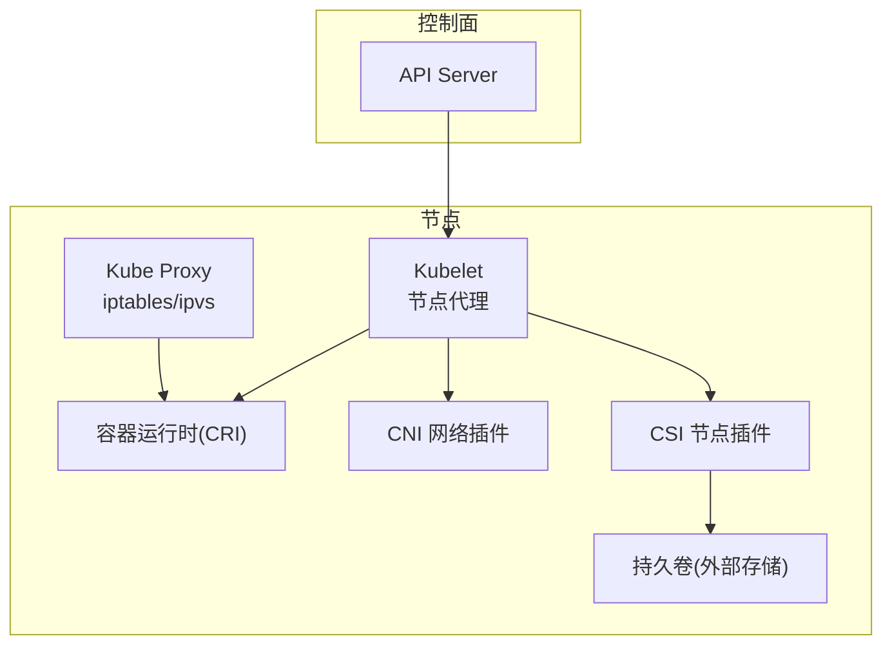
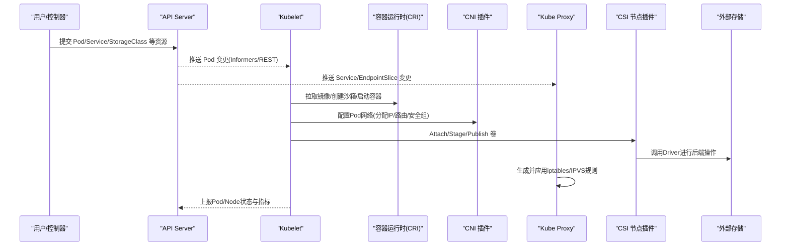
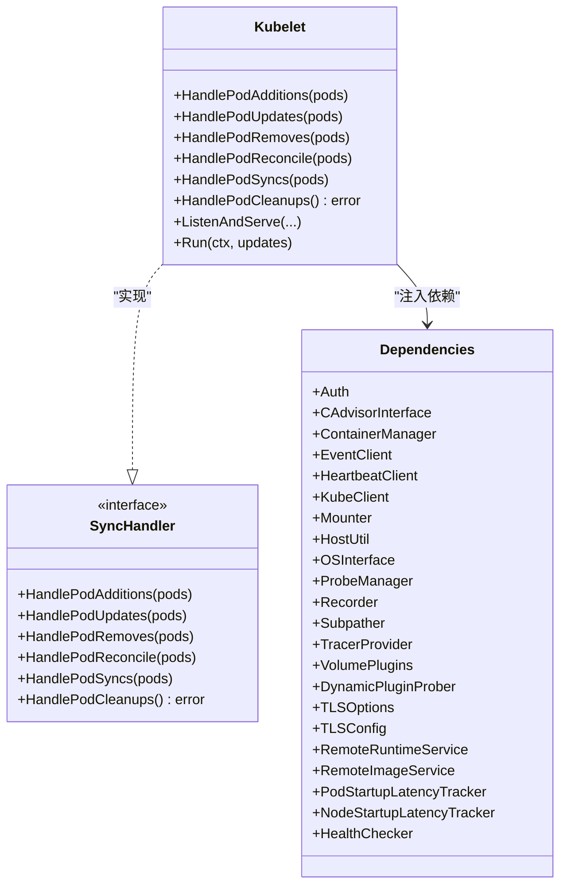
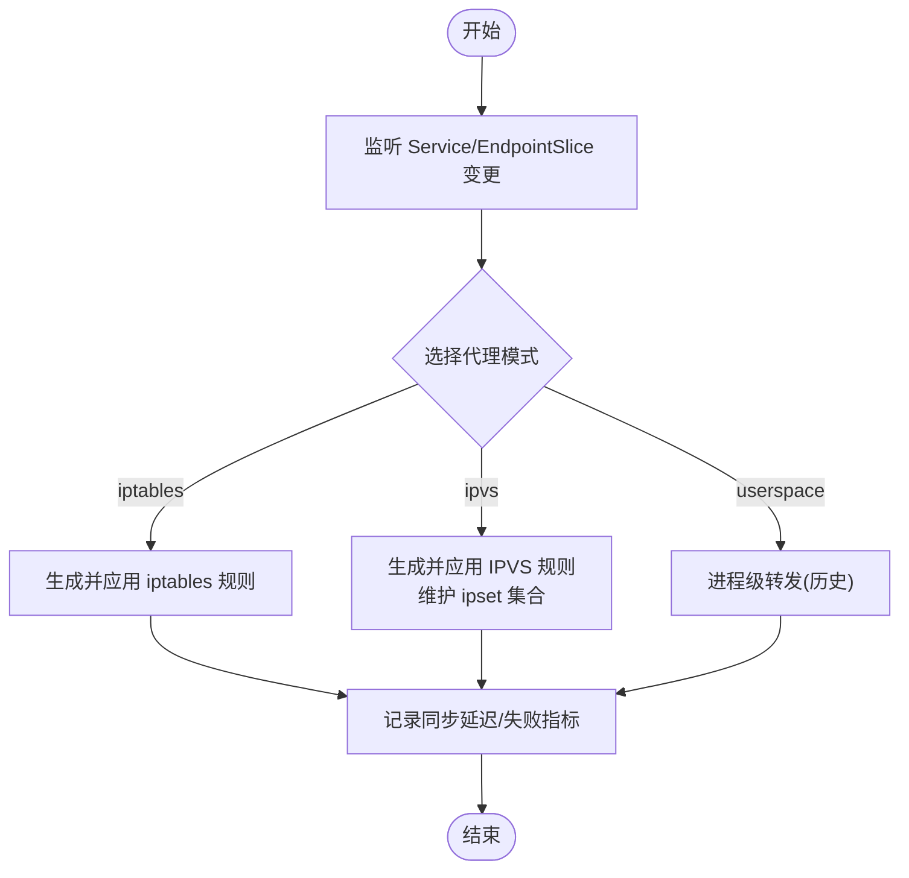
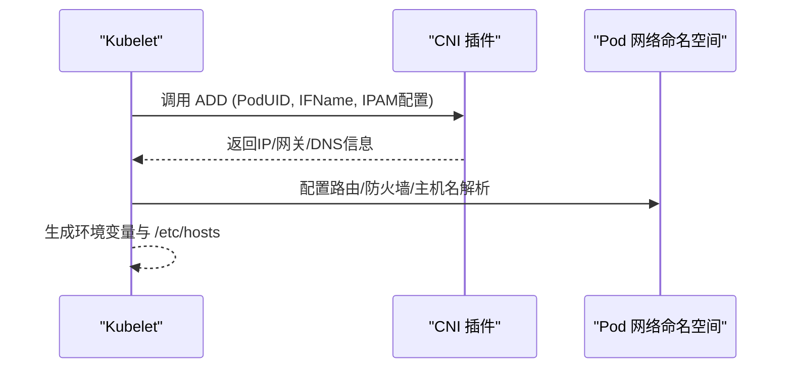
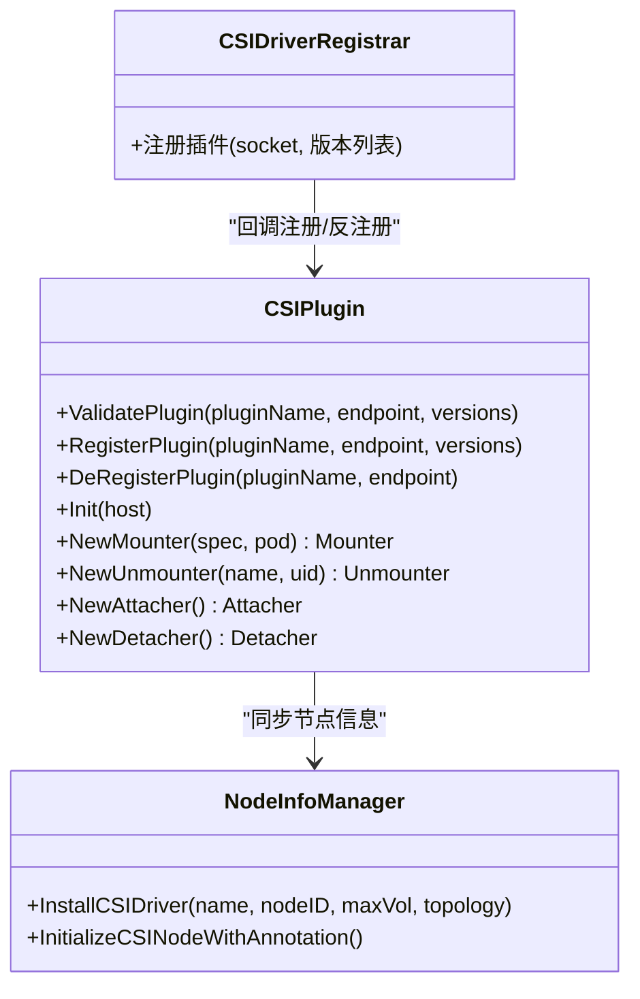
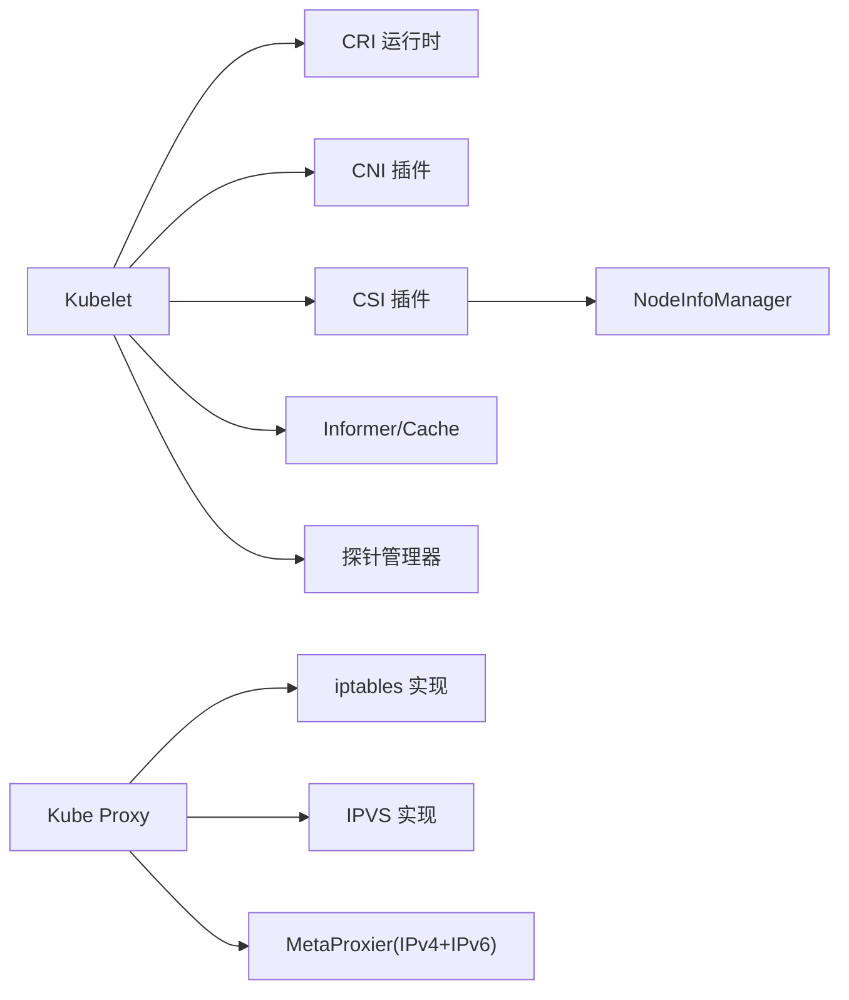

# 数据平面架构

<cite>
**本文引用的文件**   
- [cmd/kubelet/kubelet.go](file://cmd/kubelet/kubelet.go)
- [pkg/kubelet/kubelet.go](file://pkg/kubelet/kubelet.go)
- [pkg/kubelet/kubelet_pods.go](file://pkg/kubelet/kubelet_pods.go)
- [cmd/kube-proxy/proxy.go](file://cmd/kube-proxy/proxy.go)
- [pkg/proxy/types.go](file://pkg/proxy/types.go)
- [pkg/proxy/iptables/proxier.go](file://pkg/proxy/iptables/proxier.go)
- [pkg/proxy/ipvs/proxier.go](file://pkg/proxy/ipvs/proxier.go)
- [pkg/volume/csi/csi_plugin.go](file://pkg/volume/csi/csi_plugin.go)
</cite>

## 目录
1. [简介](#简介)
2. [项目结构](#项目结构)
3. [核心组件](#核心组件)
4. [架构总览](#架构总览)
5. [详细组件分析](#详细组件分析)
6. [依赖关系分析](#依赖关系分析)
7. [性能考量](#性能考量)
8. [故障排查指南](#故障排查指南)
9. [结论](#结论)
10. [附录](#附录)

## 简介
本文件面向Kubernetes数据平面，聚焦节点侧关键组件与机制：Kubelet作为节点代理的职责（Pod生命周期管理、容器运行时接口、健康检查与资源监控）、Kube Proxy的服务发现与负载均衡（iptables、ipvs、userspace模式原理与性能差异）、CNI网络插件与容器网络模型、CSI存储插件接口与持久化存储管理。文档同时提供从API Server到节点执行的端到端数据流图，并讨论节点自治性与故障隔离的设计要点。

## 项目结构
仓库采用按功能域分层组织的方式，数据平面相关代码主要分布在以下路径：
- cmd/kubelet: Kubelet二进制入口
- pkg/kubelet: Kubelet核心实现（生命周期、运行时、探针、状态上报等）
- cmd/kube-proxy: Kube Proxy二进制入口
- pkg/proxy: 服务发现与负载均衡实现（iptables/ipvs等）
- pkg/volume/csi: CSI存储插件在节点侧的实现

[无图表来源；该图为概念性结构示意]

## 核心组件
- Kubelet
  - 职责：维护节点上Pod期望与实际状态一致；通过CRI与容器运行时交互；执行健康检查；采集并上报节点与Pod资源指标；协调卷挂载与网络配置。
  - 关键能力：Pod同步循环、PLEG事件驱动、探针管理器、资源回收与驱逐、节点状态上报、插件注册与发现。
- Kube Proxy
  - 职责：监听Service/EndpointSlice变化，将转发规则写入内核子系统（iptables或IPVS），实现集群内服务发现与负载均衡。
  - 代理模式：iptables、ipvs、userspace（历史模式）。
- CNI
  - 职责：为Pod分配网络命名空间、IP地址、路由与防火墙策略，提供跨节点通信能力。
- CSI
  - 职责：在节点侧与CSI Driver通信，完成卷的Attach/Stage/Publish/Unpublish等操作，支持块设备与文件系统挂载。

章节来源
- [cmd/kubelet/kubelet.go:1-40](file://cmd/kubelet/kubelet.go#L1-L40)
- [pkg/kubelet/kubelet.go:285-345](file://pkg/kubelet/kubelet.go#L285-L345)
- [cmd/kube-proxy/proxy.go:1-34](file://cmd/kube-proxy/proxy.go#L1-L34)
- [pkg/proxy/types.go:27-40](file://pkg/proxy/types.go#L27-L40)
- [pkg/volume/csi/csi_plugin.go:74-80](file://pkg/volume/csi/csi_plugin.go#L74-L80)

## 架构总览
下图展示从API Server到节点执行的完整数据流：控制器更新对象→API Server持久化→Kubelet/Kube Proxy监听变更→节点侧执行（创建Pod、下发网络/存储规则、更新转发规则）。

图表来源
- [pkg/kubelet/kubelet.go:449-800](file://pkg/kubelet/kubelet.go#L449-L800)
- [pkg/proxy/iptables/proxier.go:412-432](file://pkg/proxy/iptables/proxier.go#L412-L432)
- [pkg/proxy/ipvs/proxier.go:548-566](file://pkg/proxy/ipvs/proxier.go#L548-L566)
- [pkg/volume/csi/csi_plugin.go:117-170](file://pkg/volume/csi/csi_plugin.go#L117-L170)

## 详细组件分析

### Kubelet：节点代理的核心职责
- Pod生命周期管理
  - 通过PodConfig聚合多源配置（静态文件、HTTP、API Server），由SyncHandler统一处理新增/更新/删除/重同步/清理。
  - PLEG（Pod Lifecycle Event Generator）以事件驱动方式感知容器运行态变化，触发Pod同步。
- 容器运行时接口
  - 通过CRI gRPC接口连接容器运行时，封装为RemoteRuntimeService/RemoteImageService，负责镜像拉取、沙箱与容器生命周期管理。
- 健康检查与探针
  - 集成探针管理器（exec/http/grpc/tcp），结果缓存至liveness/readiness/startup管理器，影响Pod就绪与重启策略。
- 资源监控与回收
  - 基于cadvisor收集系统/容器指标，结合eviction阈值策略进行资源回收与Pod驱逐；周期性GC清理无用容器与镜像。
- 节点状态上报
  - 定期上报Node条件、容量、可分配资源、镜像/磁盘使用率等，支撑调度与健康判断。

图表来源
- [pkg/kubelet/kubelet.go:285-345](file://pkg/kubelet/kubelet.go#L285-L345)
- [pkg/kubelet/kubelet.go:449-800](file://pkg/kubelet/kubelet.go#L449-L800)

章节来源
- [cmd/kubelet/kubelet.go:17-22](file://cmd/kubelet/kubelet.go#L17-L22)
- [pkg/kubelet/kubelet.go:368-401](file://pkg/kubelet/kubelet.go#L368-L401)
- [pkg/kubelet/kubelet.go:403-431](file://pkg/kubelet/kubelet.go#L403-L431)
- [pkg/kubelet/kubelet.go:449-800](file://pkg/kubelet/kubelet.go#L449-L800)

### Kube Proxy：服务发现与负载均衡
- 统一接口
  - Provider接口定义Sync/SyncLoop及Service/EndpointSlice/Topology/CIDR处理器，屏蔽底层实现差异。
- iptables模式
  - 监听Service与EndpointSlice变更，增量或全量同步到iptables链（如KUBE-SERVICES、KUBE-NODEPORTS、KUBE-FORWARD等），实现DNAT/转发与SNAT伪装。
  - 具备大集群优化（减少注释、批量restore、预计算概率）与监控指标。
- ipvs模式
  - 在高性能场景下，通过IPVS内核模块建立虚拟服务与真实服务器映射，配合ipset加速匹配；仍需少量iptables用于辅助逻辑（如NodePort、LB源地址过滤）。
  - 支持严格ARP、超时参数、优雅终止等特性。
- userspace模式
  - 历史模式，由kube-proxy进程转发流量，灵活性高但性能较差，现代部署通常不推荐。

图表来源
- [pkg/proxy/types.go:27-40](file://pkg/proxy/types.go#L27-L40)
- [pkg/proxy/iptables/proxier.go:412-432](file://pkg/proxy/iptables/proxier.go#L412-L432)
- [pkg/proxy/ipvs/proxier.go:548-566](file://pkg/proxy/ipvs/proxier.go#L548-L566)

章节来源
- [cmd/kube-proxy/proxy.go:17-33](file://cmd/kube-proxy/proxy.go#L17-L33)
- [pkg/proxy/types.go:27-40](file://pkg/proxy/types.go#L27-L40)
- [pkg/proxy/iptables/proxier.go:126-206](file://pkg/proxy/iptables/proxier.go#L126-L206)
- [pkg/proxy/ipvs/proxier.go:147-236](file://pkg/proxy/ipvs/proxier.go#L147-L236)

### CNI网络插件与容器网络模型
- 插件发现与注册
  - kubelet通过插件管理器扫描并加载CNI插件，依据Pod网络需求调用插件执行ADD/DEL等操作。
- 网络模型
  - 每个Pod拥有独立网络命名空间与IP；跨节点通过Overlay或BGP等方式互通；Service通过Kube Proxy规则将ClusterIP映射到后端Endpoints。
- 典型流程
  - Pod创建→CNI ADD分配IP/路由→kubelet注入环境变量与/etc/hosts→容器启动。

[无图表来源；该图为概念性流程示意]

### CSI存储插件接口与持久化存储管理
- 插件注册与版本协商
  - 通过kubelet插件watcher检测CSI Driver registrar注册的socket，校验支持的CSI版本并建立gRPC客户端。
- 节点信息同步
  - 调用NodeGetInfo获取节点ID、最大卷数、拓扑能力，写入CSINode对象，供控制面调度决策。
- 卷生命周期
  - NewAttacher/NewDetacher处理Attach/Detach；NewMounter/NewUnmounter处理Stage/Publish/Unstage/Unmount；支持块设备直通与文件系统挂载。
- 迁移与兼容
  - 支持in-tree存储向CSI迁移，动态识别已迁移驱动并初始化CSINode。

图表来源
- [pkg/volume/csi/csi_plugin.go:103-170](file://pkg/volume/csi/csi_plugin.go#L103-L170)
- [pkg/volume/csi/csi_plugin.go:361-429](file://pkg/volume/csi/csi_plugin.go#L361-L429)
- [pkg/volume/csi/csi_plugin.go:474-538](file://pkg/volume/csi/csi_plugin.go#L474-L538)

章节来源
- [pkg/volume/csi/csi_plugin.go:74-80](file://pkg/volume/csi/csi_plugin.go#L74-L80)
- [pkg/volume/csi/csi_plugin.go:103-170](file://pkg/volume/csi/csi_plugin.go#L103-L170)
- [pkg/volume/csi/csi_plugin.go:361-429](file://pkg/volume/csi/csi_plugin.go#L361-L429)
- [pkg/volume/csi/csi_plugin.go:474-538](file://pkg/volume/csi/csi_plugin.go#L474-L538)

## 依赖关系分析
- Kubelet对CRI、CNI、CSI、Informer、Metrics、Prober等存在强耦合，通过Dependencies注入降低测试难度与提升可替换性。
- Kube Proxy的iptables/ipvs实现共享通用接口（Provider），并通过metaproxier组合IPv4/IPv6单栈实例。
- CSI插件与NodeInfoManager协作，确保控制面掌握节点存储能力。

图表来源
- [pkg/kubelet/kubelet.go:449-800](file://pkg/kubelet/kubelet.go#L449-L800)
- [pkg/proxy/iptables/proxier.go:94-124](file://pkg/proxy/iptables/proxier.go#L94-L124)
- [pkg/proxy/ipvs/proxier.go:109-145](file://pkg/proxy/ipvs/proxier.go#L109-L145)
- [pkg/volume/csi/csi_plugin.go:361-429](file://pkg/volume/csi/csi_plugin.go#L361-L429)

章节来源
- [pkg/kubelet/kubelet.go:449-800](file://pkg/kubelet/kubelet.go#L449-L800)
- [pkg/proxy/iptables/proxier.go:94-124](file://pkg/proxy/iptables/proxier.go#L94-L124)
- [pkg/proxy/ipvs/proxier.go:109-145](file://pkg/proxy/ipvs/proxier.go#L109-L145)
- [pkg/volume/csi/csi_plugin.go:361-429](file://pkg/volume/csi/csi_plugin.go#L361-L429)

## 性能考量
- Kubelet
  - 合理设置sync频率、GC周期与驱逐阈值，避免频繁全量同步；利用缓存与批处理减少API压力。
  - 探针并发度与超时需与业务容忍度匹配，防止误判导致频繁重启。
- Kube Proxy
  - iptables在大集群场景下规则数量增长显著，建议关注full/partial sync延迟与失败指标；必要时切换ipvs模式以获得更高吞吐与更低CPU占用。
  - ipvs模式下注意内核版本与sysctl要求（conntrack、arp_ignore/announce等），并合理配置超时与调度算法。
- CSI
  - 控制Driver响应时延与重试策略，避免阻塞Pod启动；合理使用RequiresRepublish与资源耗尽检测，及时刷新CSINode能力。

[本节为通用指导，无需特定文件来源]

## 故障排查指南
- Kubelet无法启动或Ready
  - 检查CRI连通性、证书与权限；查看Node状态与错误事件；确认插件（CNI/CSI）是否成功注册。
- Pod无法启动或反复重启
  - 核对镜像拉取、探针失败原因、资源不足（CPU/Memory/EphemeralStorage）；观察kubelet日志中的Reason与BackOff。
- Service不可达
  - 验证Kube Proxy模式与规则是否生效（iptables-save/ipvsadm）；检查EndpointSlice与拓扑标签；关注同步延迟与失败指标。
- 卷挂载失败
  - 检查CSI Driver日志与NodeGetInfo返回；查看VolumeAttachment状态与AttachError；确认CSINode能力标注是否正确。

章节来源
- [pkg/kubelet/kubelet.go:449-800](file://pkg/kubelet/kubelet.go#L449-L800)
- [pkg/proxy/iptables/proxier.go:625-713](file://pkg/proxy/iptables/proxier.go#L625-L713)
- [pkg/proxy/ipvs/proxier.go:658-740](file://pkg/proxy/ipvs/proxier.go#L658-L740)
- [pkg/volume/csi/csi_plugin.go:172-190](file://pkg/volume/csi/csi_plugin.go#L172-L190)

## 结论
Kubernetes数据平面以Kubelet为核心，协同Kube Proxy、CNI与CSI共同完成Pod编排、网络连通与持久化存储。不同代理模式在性能与复杂度间权衡，生产环境应依据规模与SLA选择合适的模式。通过完善的健康检查、资源监控与插件生态，数据平面具备良好的可扩展性与弹性。

[本节为总结性内容，无需特定文件来源]

## 附录
- 术语
  - CRI：容器运行时接口
  - CNI：容器网络接口
  - CSI：容器存储接口
  - EndpointSlice：高效扩展的Endpoint集合
- 参考路径
  - Kubelet入口与核心：[cmd/kubelet/kubelet.go](file://cmd/kubelet/kubelet.go)、[pkg/kubelet/kubelet.go](file://pkg/kubelet/kubelet.go)
  - Kube Proxy入口与实现：[cmd/kube-proxy/proxy.go](file://cmd/kube-proxy/proxy.go)、[pkg/proxy/iptables/proxier.go](file://pkg/proxy/iptables/proxier.go)、[pkg/proxy/ipvs/proxier.go](file://pkg/proxy/ipvs/proxier.go)
  - CSI插件：[pkg/volume/csi/csi_plugin.go](file://pkg/volume/csi/csi_plugin.go)