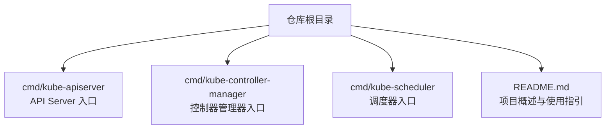
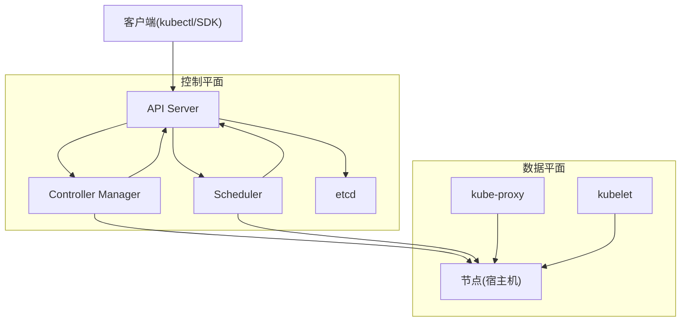
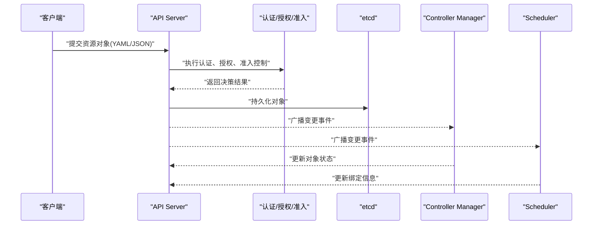
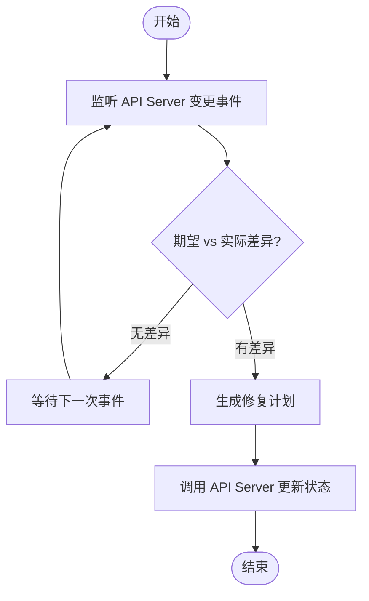
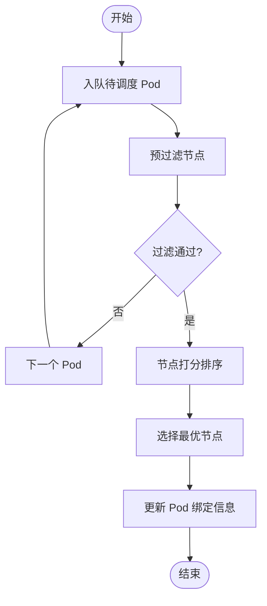
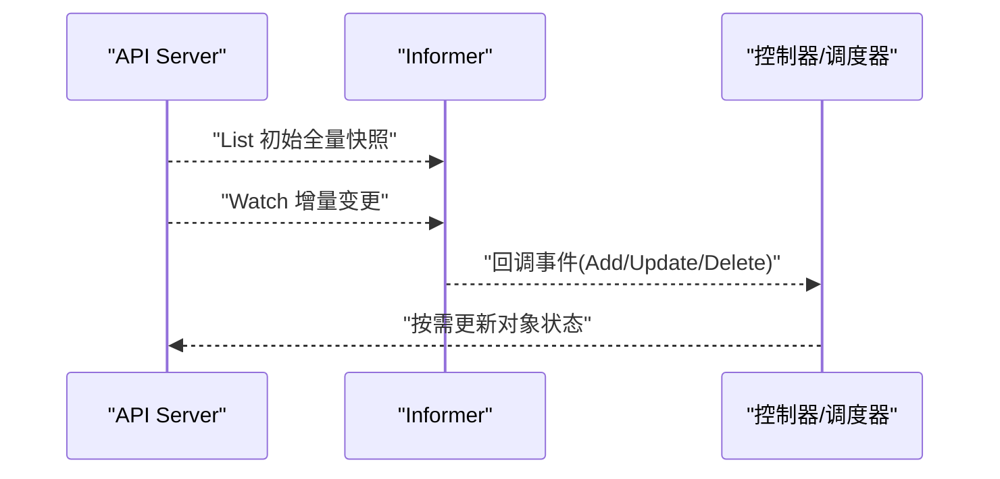
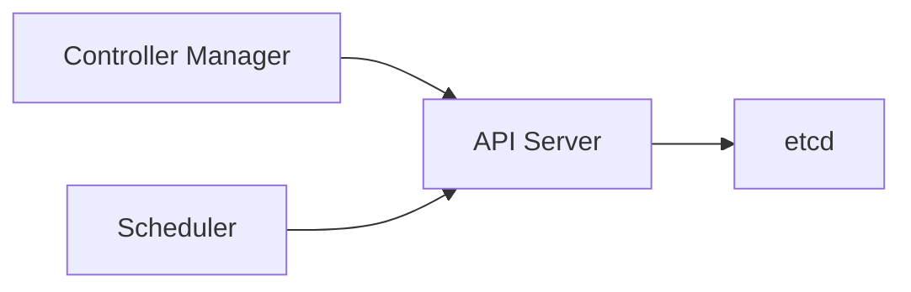

# 架构设计原理

<cite>
**本文引用的文件**   
- [README.md](file://README.md)
- [apiserver.go](file://cmd/kube-apiserver/apiserver.go)
- [controller-manager.go](file://cmd/kube-controller-manager/controller-manager.go)
- [scheduler.go](file://cmd/kube-scheduler/scheduler.go)
</cite>

## 目录
1. [简介](#简介)
2. [项目结构](#项目结构)
3. [核心组件](#核心组件)
4. [架构总览](#架构总览)
5. [详细组件分析](#详细组件分析)
6. [依赖关系分析](#依赖关系分析)
7. [性能与可扩展性](#性能与可扩展性)
8. [故障排查指南](#故障排查指南)
9. [结论](#结论)
10. [附录](#附录)

## 简介
本文件面向希望深入理解 Kubernetes 控制平面与数据平面整体架构的读者，围绕以下主题展开：
- 控制平面关键组件（API Server、Controller Manager、Scheduler、etcd）的职责与交互
- 微服务架构在 Kubernetes 中的体现与独立部署/扩展能力
- 声明式 API 的设计理念与期望状态管理
- 插件化架构（认证、授权、准入控制等扩展点）
- 事件驱动架构与 Informer 机制的工作流程
- 高可用性与可扩展性的设计考量
- 架构图表展示组件间通信关系与数据流向

## 项目结构
仓库根目录提供了多语言文档与构建脚本，控制平面各组件以独立可执行程序形式存在，入口位于 cmd 目录下。通过 README 可知，Kubernetes 是用于跨主机编排容器化应用的开源系统，强调微服务与云原生生态。

图表来源
- [README.md:1-101](file://README.md#L1-L101)
- [apiserver.go:17-36](file://cmd/kube-apiserver/apiserver.go#L17-L36)
- [controller-manager.go:17-38](file://cmd/kube-controller-manager/controller-manager.go#L17-L38)
- [scheduler.go:17-33](file://cmd/kube-scheduler/scheduler.go#L17-L33)

章节来源
- [README.md:1-101](file://README.md#L1-L101)
- [apiserver.go:17-36](file://cmd/kube-apiserver/apiserver.go#L17-L36)
- [controller-manager.go:17-38](file://cmd/kube-controller-manager/controller-manager.go#L17-L38)
- [scheduler.go:17-33](file://cmd/kube-scheduler/scheduler.go#L17-L33)

## 核心组件
- API Server：集群的统一管理接口，负责处理 RESTful 请求、鉴权、鉴权、持久化到 etcd，并广播变更事件。
- Controller Manager：运行各类内置控制器（如 Deployment、ReplicaSet、Node、Endpoint 等），将当前状态收敛至期望状态。
- Scheduler：监听待调度 Pod，根据策略选择合适节点并完成绑定。
- etcd：强一致分布式键值存储，保存集群所有对象的状态。

这些组件以微服务方式独立部署，各自拥有独立的进程与生命周期，便于水平扩展与弹性伸缩。

章节来源
- [apiserver.go:17-36](file://cmd/kube-apiserver/apiserver.go#L17-L36)
- [controller-manager.go:17-38](file://cmd/kube-controller-manager/controller-manager.go#L17-L38)
- [scheduler.go:17-33](file://cmd/kube-scheduler/scheduler.go#L17-L33)

## 架构总览
下图展示了控制平面与数据平面的整体交互：客户端通过 API Server 提交声明式配置；API Server 持久化后通知控制器与调度器；控制器与调度器协作将工作负载落地到节点；kube-proxy 维护网络规则以实现 Service 访问。

图表来源
- [apiserver.go:17-36](file://cmd/kube-apiserver/apiserver.go#L17-L36)
- [controller-manager.go:17-38](file://cmd/kube-controller-manager/controller-manager.go#L17-L38)
- [scheduler.go:17-33](file://cmd/kube-scheduler/scheduler.go#L17-L33)

## 详细组件分析

### API Server 组件分析
- 职责
  - 暴露统一的 REST API，作为集群唯一事实源的前端
  - 实现认证、授权、准入控制链
  - 读写 etcd，保证强一致性
  - 广播资源变更事件，驱动控制器与调度器
- 启动与初始化
  - 入口程序创建命令对象并运行，完成日志、指标等基础设施注册
- 典型请求流
  - 客户端提交 YAML/JSON 描述的资源对象
  - API Server 校验、鉴权、准入控制通过后写入 etcd
  - 触发事件，控制器与调度器消费事件进行后续处理

图表来源
- [apiserver.go:17-36](file://cmd/kube-apiserver/apiserver.go#L17-L36)

章节来源
- [apiserver.go:17-36](file://cmd/kube-apiserver/apiserver.go#L17-L36)

### Controller Manager 组件分析
- 职责
  - 运行多个内置控制器，持续观察资源变化并将实际状态收敛到期望状态
  - 与 API Server 交互，读取与更新对象状态
- 启动与初始化
  - 入口程序创建命令对象并运行，完成日志、指标等基础设施注册
- 典型控制循环
  - 监听资源变更事件
  - 计算期望与实际差异
  - 调用 API Server 修正状态（创建/删除/更新）

图表来源
- [controller-manager.go:17-38](file://cmd/kube-controller-manager/controller-manager.go#L17-L38)

章节来源
- [controller-manager.go:17-38](file://cmd/kube-controller-manager/controller-manager.go#L17-L38)

### Scheduler 组件分析
- 职责
  - 监听未绑定的 Pod，基于策略选择合适节点并完成绑定
- 启动与初始化
  - 入口程序创建命令对象并运行，完成日志、指标等基础设施注册
- 典型调度流程
  - 获取候选节点集合
  - 过滤不符合条件的节点
  - 打分排序选出最优节点
  - 更新 Pod 的节点绑定信息

图表来源
- [scheduler.go:17-33](file://cmd/kube-scheduler/scheduler.go#L17-L33)

章节来源
- [scheduler.go:17-33](file://cmd/kube-scheduler/scheduler.go#L17-L33)

### 事件驱动与 Informer 机制（概念说明）
- Informer 基于 List-Watch 模式高效同步缓存本地视图，减少直连 etcd 的压力
- 控制器与调度器通过 Informer 订阅资源变更，触发各自的控制循环
- 该机制提升了系统的可扩展性与响应性，避免轮询带来的开销

[本节为概念性说明，不直接分析具体源码文件]

## 依赖关系分析
控制平面组件之间通过 API Server 进行松耦合交互，形成“中心总线”式的依赖结构。每个组件仅依赖 API Server 提供的稳定接口，便于独立演进与替换。

图表来源
- [apiserver.go:17-36](file://cmd/kube-apiserver/apiserver.go#L17-L36)
- [controller-manager.go:17-38](file://cmd/kube-controller-manager/controller-manager.go#L17-L38)
- [scheduler.go:17-33](file://cmd/kube-scheduler/scheduler.go#L17-L33)

章节来源
- [apiserver.go:17-36](file://cmd/kube-apiserver/apiserver.go#L17-L36)
- [controller-manager.go:17-38](file://cmd/kube-controller-manager/controller-manager.go#L17-L38)
- [scheduler.go:17-33](file://cmd/kube-scheduler/scheduler.go#L17-L33)

## 性能与可扩展性
- 微服务拆分：API Server、Controller Manager、Scheduler 独立部署，可按负载水平扩展
- 事件驱动：Informer 机制降低对 etcd 的直接压力，提升吞吐
- 声明式 API：通过期望状态驱动收敛，避免复杂的状态机逻辑
- 插件化：认证、授权、准入控制等扩展点支持按场景定制，兼顾安全与性能
- 高可用：API Server 与 etcd 均可多副本部署，配合负载均衡与选举机制保障可用性

[本节提供通用指导，不直接分析具体源码文件]

## 故障排查指南
- 确认入口程序是否成功启动与注册必要基础设施（日志、指标）
- 检查 API Server 健康端点与日志，定位鉴权/准入失败原因
- 观察控制器与调度器日志，确认事件消费与状态更新是否正常
- 验证 etcd 连通性与一致性，确保 API Server 能正常读写

章节来源
- [apiserver.go:17-36](file://cmd/kube-apiserver/apiserver.go#L17-L36)
- [controller-manager.go:17-38](file://cmd/kube-controller-manager/controller-manager.go#L17-L38)
- [scheduler.go:17-33](file://cmd/kube-scheduler/scheduler.go#L17-L33)

## 结论
Kubernetes 采用微服务与事件驱动的架构，通过 API Server 统一暴露声明式接口，结合 Informer 机制与控制器循环，将期望状态收敛到实际状态。插件化与高可用设计使其具备强大的可扩展性与稳定性，适合大规模生产环境。

[本节为总结性内容，不直接分析具体源码文件]

## 附录
- 参考仓库根目录 README，了解项目背景、社区与贡献方式
- 关注 cmd 下各组件入口文件，理解其启动流程与依赖注入点

章节来源
- [README.md:1-101](file://README.md#L1-L101)