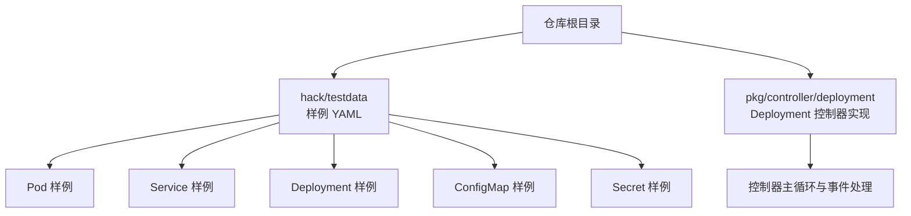
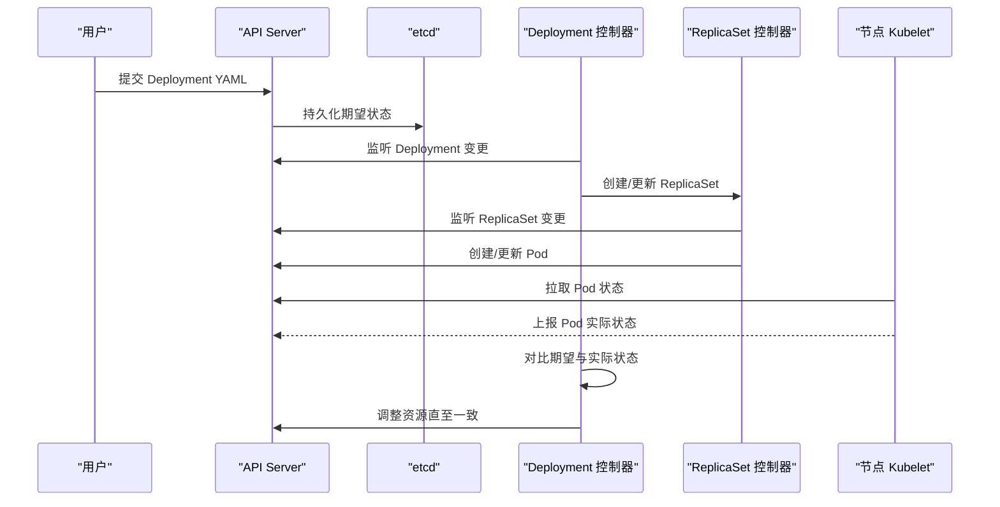
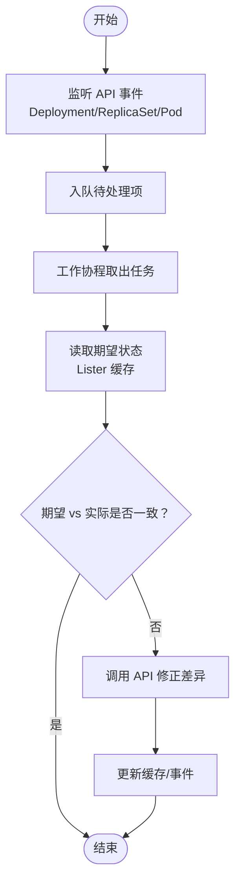
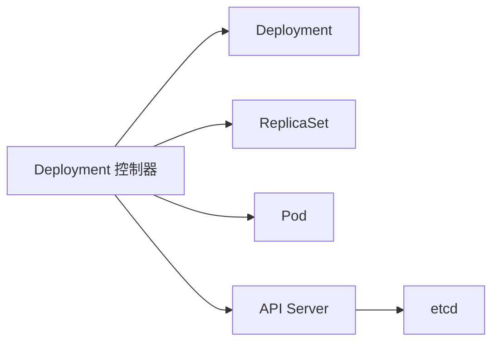

# 核心概念介绍

<cite>
**本文引用的文件**   
- [README.md](file://README.md)
- [pod.yaml](file://hack/testdata/pod.yaml)
- [kubernetes-service.yaml](file://hack/testdata/kubernetes-service.yaml)
- [deployment-multicontainer.yaml](file://hack/testdata/deployment-multicontainer.yaml)
- [configmap.yaml](file://hack/testdata/configmap.yaml)
- [secret.yaml](file://hack/testdata/secret.yaml)
- [deployment_controller.go](file://pkg/controller/deployment/deployment_controller.go)
</cite>

## 目录
1. [简介](#简介)
2. [项目结构](#项目结构)
3. [核心组件](#核心组件)
4. [架构总览](#架构总览)
5. [详细组件分析](#详细组件分析)
6. [依赖关系分析](#依赖关系分析)
7. [性能考量](#性能考量)
8. [故障排查指南](#故障排查指南)
9. [结论](#结论)
10. [附录：YAML 示例与最佳实践](#附录yaml-示例与最佳实践)

## 简介
本章节面向初学者，系统性地介绍 Kubernetes 的核心概念与资源对象，包括 Pod、Service、Deployment、ConfigMap、Secret 等，并解释命名空间的作用与隔离机制、标签与选择器的使用方式、注解的常见用途，以及控制器模式的工作原理（期望状态与实际状态的同步）。文档同时提供与代码库一致的术语说明，帮助读者建立从“声明式配置”到“控制循环”的整体认知。

## 项目结构
仓库根目录包含大量源码、测试数据与工具脚本。为便于理解核心概念，本节聚焦于以下与概念相关的样例与实现：
- 样例 YAML：位于 hack/testdata 下，涵盖 Pod、Service、Deployment、ConfigMap、Secret 的最小可用定义。
- 控制器实现：pkg/controller/deployment 下的 Deployment 控制器，体现“期望状态 vs 实际状态”的同步机制。

图表来源
- [deployment_controller.go:170-200](file://pkg/controller/deployment/deployment_controller.go#L170-L200)

章节来源
- [README.md:1-101](file://README.md#L1-L101)

## 核心组件
- Pod：Kubernetes 中最小的可部署计算单元，封装一个或多个容器及其运行环境。
- Service：为一组 Pod 提供稳定的网络访问入口，支持 ClusterIP、NodePort、LoadBalancer 等类型。
- Deployment：声明式地管理无状态应用的副本集与滚动更新策略，负责创建和升级 ReplicaSet 与 Pod。
- ConfigMap：以键值对形式存储非敏感的配置数据，供 Pod 通过环境变量或卷挂载使用。
- Secret：用于安全地存储敏感信息（如密码、密钥），同样可通过环境变量或卷挂载注入到 Pod。
- 命名空间：逻辑隔离集群资源的边界，不同命名空间内的同名资源互不影响。
- 标签与选择器：标签是附加在资源上的键值对；选择器用于匹配一组资源（如 Deployment 的 selector.matchLabels）。
- 注解：附加在资源上的键值对，通常用于记录元数据或工具扩展信息，不参与调度与选择。

章节来源
- [pod.yaml:1-11](file://hack/testdata/pod.yaml#L1-L11)
- [kubernetes-service.yaml:1-13](file://hack/testdata/kubernetes-service.yaml#L1-L13)
- [deployment-multicontainer.yaml:1-24](file://hack/testdata/deployment-multicontainer.yaml#L1-L24)
- [configmap.yaml:1-7](file://hack/testdata/configmap.yaml#L1-L7)
- [secret.yaml:1-8](file://hack/testdata/secret.yaml#L1-L8)

## 架构总览
Kubernetes 采用“声明式 API + 控制器模式”的架构。用户通过 YAML 声明期望状态，API Server 持久化后，各控制器通过 Informer/Lister 监听变化，并在本地缓存中比对“期望状态”与“实际状态”，驱动工作队列执行 reconcile 操作，最终将集群状态收敛至期望状态。

图表来源
- [deployment_controller.go:170-200](file://pkg/controller/deployment/deployment_controller.go#L170-L200)

## 详细组件分析

### Pod 概念与用法
- 作用：承载应用容器的生命周期，定义镜像、端口、探针、资源限制、卷挂载等。
- 关键要点：
  - 单 Pod 内多容器共享网络与存储命名空间。
  - 探针（liveness/readiness/startup）用于健康检查与服务可用性。
  - 资源请求与限制影响调度与 QoS。
- 参考样例路径：[pod.yaml:1-11](file://hack/testdata/pod.yaml#L1-L11)

章节来源
- [pod.yaml:1-11](file://hack/testdata/pod.yaml#L1-L11)

### Service 概念与用法
- 作用：为后端 Pod 集合提供稳定的虚拟 IP 与负载均衡，屏蔽 Pod 动态变化。
- 关键要点：
  - 通过 selector 匹配目标 Pod 的标签。
  - 端口映射：port/targetPort/protocol。
  - 类型：ClusterIP（默认）、NodePort、LoadBalancer、ExternalName。
- 参考样例路径：[kubernetes-service.yaml:1-13](file://hack/testdata/kubernetes-service.yaml#L1-L13)

章节来源
- [kubernetes-service.yaml:1-13](file://hack/testdata/kubernetes-service.yaml#L1-L13)

### Deployment 概念与用法
- 作用：声明式管理无状态应用的副本数与滚动更新策略，自动维护 ReplicaSet 与 Pod。
- 关键要点：
  - spec.selector.matchLabels 决定受管 Pod 集合。
  - spec.template.metadata.labels 需与 selector 匹配。
  - 支持滚动更新、回滚、扩缩容。
- 参考样例路径：[deployment-multicontainer.yaml:1-24](file://hack/testdata/deployment-multicontainer.yaml#L1-L24)

章节来源
- [deployment-multicontainer.yaml:1-24](file://hack/testdata/deployment-multicontainer.yaml#L1-L24)

### ConfigMap 与 Secret
- ConfigMap：
  - 用途：存储非敏感配置，供 Pod 以环境变量或卷挂载方式使用。
  - 参考样例路径：[configmap.yaml:1-7](file://hack/testdata/configmap.yaml#L1-L7)
- Secret：
  - 用途：存储敏感信息，建议以 base64 编码的 data 字段或通过 kubectl create secret 生成。
  - 参考样例路径：[secret.yaml:1-8](file://hack/testdata/secret.yaml#L1-L8)

章节来源
- [configmap.yaml:1-7](file://hack/testdata/configmap.yaml#L1-L7)
- [secret.yaml:1-8](file://hack/testdata/secret.yaml#L1-L8)

### 命名空间与资源隔离
- 命名空间提供逻辑隔离，同一命名空间内资源名唯一，跨命名空间可通过完整限定名访问。
- 典型用途：按团队/环境划分资源，配合 RBAC 进行权限控制。
- 注意：某些资源（如 Node、PersistentVolume）为集群级，不受命名空间约束。

### 标签、选择器与注解
- 标签：
  - 用于标识与分组资源，如 app=nginx、env=prod。
  - 选择器语法支持等于、不等于、集合等表达式。
- 选择器：
  - Deployment.spec.selector.matchLabels 必须与模板 Pod 的 labels 一致。
- 注解：
  - 用于附加不可用于选择的元数据，如变更记录、负责人信息等。

### 控制器模式与同步机制
- 工作原理：
  - 控制器通过 Informer 监听 API Server 的事件，维护本地 Lister 缓存。
  - 事件进入工作队列，由 worker 并发处理，执行 reconcile 逻辑。
  - 对比期望状态（用户声明）与实际状态（集群现状），调用 API 修正差异。
- 示例流程（Deployment 控制器）：
  - 监听 Deployment/ReplicaSet/Pod 事件。
  - 根据 Deployment 的 replicas 与 selector 创建/更新 ReplicaSet。
  - ReplicaSet 进一步管理 Pod 的生命周期。
  - 通过事件与缓存持续收敛状态。

图表来源
- [deployment_controller.go:170-200](file://pkg/controller/deployment/deployment_controller.go#L170-L200)

章节来源
- [deployment_controller.go:170-200](file://pkg/controller/deployment/deployment_controller.go#L170-L200)

## 依赖关系分析
- 控制器与资源的关系：
  - Deployment 控制器依赖 Deployment、ReplicaSet、Pod 三类资源。
  - 通过 Informer 订阅事件，Lister 提供只读缓存。
- 外部依赖：
  - API Server 作为统一入口，etcd 作为持久化存储。
  - kube-proxy 基于 Service 与 EndpointSlice 更新转发规则。
- 耦合与内聚：
  - 控制器内部职责单一（仅关注 Deployment 的期望状态收敛）。
  - 通过接口抽象（如 RSControlInterface）降低耦合度。

图表来源
- [deployment_controller.go:170-200](file://pkg/controller/deployment/deployment_controller.go#L170-L200)

## 性能考量
- 控制器并行度：通过 workers 参数控制并发 reconcile 数量，避免热点资源阻塞。
- 事件去重与退避：工作队列内置速率限制与重试退避，防止风暴。
- 缓存命中：Lister 缓存减少 API 压力，提升响应速度。
- 资源粒度：合理拆分命名空间与资源规模，避免超大对象导致 GC 与序列化开销。

## 故障排查指南
- 常见问题定位步骤：
  - 查看资源状态与事件：kubectl describe <resource> <name>。
  - 检查控制器日志：确认 reconcile 是否触发及错误原因。
  - 验证标签与选择器：确保 selector 能正确匹配目标 Pod。
  - 检查资源配额与限制：确认命名空间配额未超限。
- 参考样例与路径：
  - 若 Deployment 无法滚动更新，检查 template.labels 与 selector.matchLabels 一致性。
  - 若 Service 无法访问，检查后端 Pod 的 readiness 探针与端口映射。

章节来源
- [deployment_multicontainer.yaml:1-24](file://hack/testdata/deployment-multicontainer.yaml#L1-L24)
- [kubernetes-service.yaml:1-13](file://hack/testdata/kubernetes-service.yaml#L1-L13)

## 结论
Kubernetes 通过声明式 API 与控制器模式，将复杂的状态管理抽象为“期望 vs 实际”的收敛过程。掌握 Pod、Service、Deployment、ConfigMap、Secret 等核心资源的概念与用法，结合命名空间、标签与选择器，能够高效地编排与管理容器化应用。理解控制器的同步机制有助于深入诊断问题与优化集群行为。

## 附录：YAML 示例与最佳实践
- Pod 最小定义：
  - 参考路径：[pod.yaml:1-11](file://hack/testdata/pod.yaml#L1-L11)
- Service 暴露端口：
  - 参考路径：[kubernetes-service.yaml:1-13](file://hack/testdata/kubernetes-service.yaml#L1-L13)
- Deployment 多容器与副本：
  - 参考路径：[deployment-multicontainer.yaml:1-24](file://hack/testdata/deployment-multicontainer.yaml#L1-L24)
- ConfigMap 存储配置：
  - 参考路径：[configmap.yaml:1-7](file://hack/testdata/configmap.yaml#L1-L7)
- Secret 存储敏感信息：
  - 参考路径：[secret.yaml:1-8](file://hack/testdata/secret.yaml#L1-L8)

最佳实践清单
- 始终为资源设置清晰的标签，并确保选择器与模板标签一致。
- 使用命名空间隔离不同环境或团队资源。
- 将配置与敏感信息分别放入 ConfigMap 与 Secret，并通过环境变量或卷挂载注入。
- 为关键服务配置就绪探针，确保流量仅在 Pod 真正可用时进入。
- 合理设置资源请求与限制，提升调度质量与稳定性。