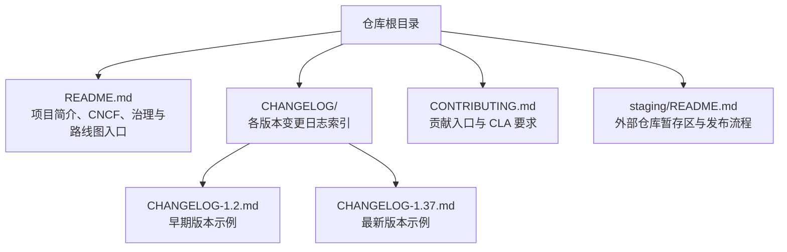
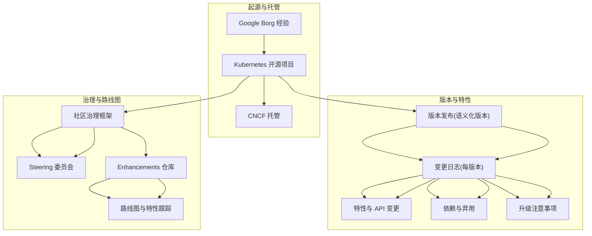
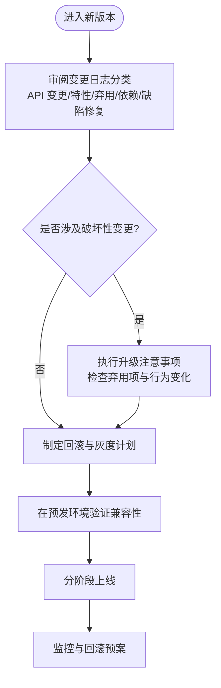
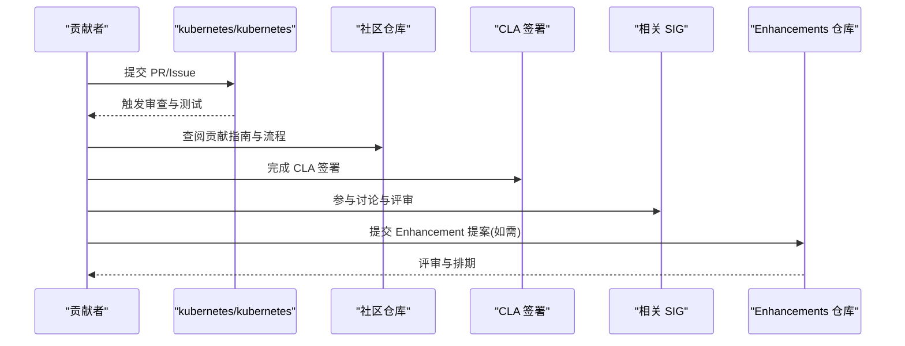
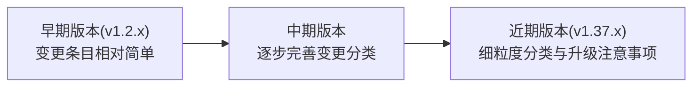
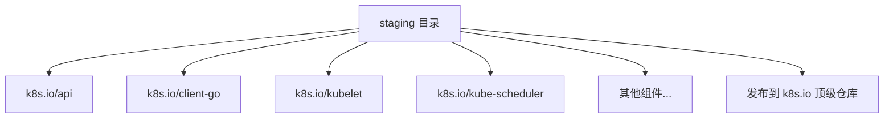

# 项目历史与发展路线

<cite>
**本文引用的文件**   
- [README.md](file://README.md)
- [CHANGELOG/README.md](file://CHANGELOG/README.md)
- [CHANGELOG/CHANGELOG-1.37.md](file://CHANGELOG/CHANGELOG-1.37.md)
- [CHANGELOG/CHANGELOG-1.2.md](file://CHANGELOG/CHANGELOG-1.2.md)
- [CONTRIBUTING.md](file://CONTRIBUTING.md)
- [staging/README.md](file://staging/README.md)
</cite>

## 目录
1. [引言](#引言)
2. [项目结构](#项目结构)
3. [核心组件](#核心组件)
4. [架构总览](#架构总览)
5. [详细组件分析](#详细组件分析)
6. [依赖分析](#依赖分析)
7. [性能考虑](#性能考虑)
8. [故障排查指南](#故障排查指南)
9. [结论](#结论)
10. [附录](#附录)

## 引言
本文件聚焦 Kubernetes 的发展历史与演进路线，结合仓库中的官方说明与变更日志，梳理从 Google Borg 到开源项目的演进、CNCF 生态中的地位与历程、版本发布策略与向后兼容性保证机制、治理结构与社区贡献流程，以及主要功能特性的发展时间线与当前版本状态和未来规划。文档旨在为开发者与管理者提供了解项目发展方向和社区动态的窗口。

## 项目结构
Kubernetes 仓库包含根级 README、变更日志索引与各版本变更详情、贡献指南、以及 staging 区域对外发布的子模块清单等关键信息，这些材料共同构成了理解项目历史与路线图的基础资料。

图示来源
- [README.md:1-101](file://README.md#L1-L101)
- [CHANGELOG/README.md:1-39](file://CHANGELOG/README.md#L1-L39)
- [CHANGELOG/CHANGELOG-1.2.md:1-200](file://CHANGELOG/CHANGELOG-1.2.md#L1-L200)
- [CHANGELOG/CHANGELOG-1.37.md:1-200](file://CHANGELOG/CHANGELOG-1.37.md#L1-L200)
- [CONTRIBUTING.md:1-10](file://CONTRIBUTING.md#L1-L10)
- [staging/README.md:1-121](file://staging/README.md#L1-L121)

章节来源
- [README.md:1-101](file://README.md#L1-L101)
- [CHANGELOG/README.md:1-39](file://CHANGELOG/README.md#L1-L39)

## 核心组件
围绕“历史与发展路线”的主题，以下为核心信息来源与要点：
- 项目起源与 CNCF 地位：根 README 明确说明 Kubernetes 基于 Google 内部系统 Borg 的经验，并托管于 CNCF。
- 版本发布与特性记录：CHANGELOG 目录按版本组织，提供每个版本的下载、变更分类（API 变更、特性、弃用、依赖更新等）与升级注意事项。
- 贡献与治理：根 CONTRIBUTING 指向社区仓库与 CLA；根 README 指向社区治理与 Steering 仓库；根 README 还指向 Enhancements 仓库用于路线图与特性跟踪。
- 模块化与发布：staging 目录列出已拆分至独立仓库的组件，体现项目的模块化与长期维护策略。

章节来源
- [README.md:13-22](file://README.md#L13-L22)
- [README.md:90-101](file://README.md#L90-L101)
- [CHANGELOG/README.md:1-39](file://CHANGELOG/README.md#L1-L39)
- [CHANGELOG/CHANGELOG-1.37.md:1-200](file://CHANGELOG/CHANGELOG-1.37.md#L1-L200)
- [CONTRIBUTING.md:1-10](file://CONTRIBUTING.md#L1-L10)
- [staging/README.md:1-41](file://staging/README.md#L1-L41)

## 架构总览
下图以概念方式展示“历史与路线图”的信息流：从项目起源与 CNCF 托管，到版本发布与变更记录，再到治理与路线图管理，最终形成对社区与用户的持续沟通。

[此图为概念性流程图，不直接映射具体源码文件，故无图示来源]

## 详细组件分析

### 历史与 CNCF 生态
- 起源：根 README 指出 Kubernetes 构建在 Google 运行大规模生产负载的系统 Borg 之上，体现了其工程实践与规模化经验的传承。
- CNCF 托管：根 README 明确 Kubernetes 由 CNCF 托管，并提供公告链接，表明其在云原生生态中的核心地位。

章节来源
- [README.md:13-22](file://README.md#L13-L22)

### 版本发布策略与向后兼容性
- 版本发布：CHANGELOG 目录按主版本组织，涵盖从早期版本到最新版本的完整记录，体现稳定的发布节奏与可追溯性。
- 变更分类：以 v1.37 为例，变更日志包含“API Change”“Feature”“Deprecation”“Dependency”“Bug or Regression”等类别，便于用户评估影响面。
- 升级注意事项：v1.37 包含“Urgent Upgrade Notes”，提示管理员在升级前必须关注的关键变更，体现对兼容性与稳定性的重视。
- 向后兼容性：通过“Deprecation”与“Graduated to GA”等条目可见，项目采用渐进式弃用与成熟度提升策略，保障既有工作负载的平滑迁移。

图示来源
- [CHANGELOG/CHANGELOG-1.37.md:1-200](file://CHANGELOG/CHANGELOG-1.37.md#L1-L200)
- [CHANGELOG/CHANGELOG-1.2.md:1-200](file://CHANGELOG/CHANGELOG-1.2.md#L1-L200)

章节来源
- [CHANGELOG/README.md:1-39](file://CHANGELOG/README.md#L1-L39)
- [CHANGELOG/CHANGELOG-1.37.md:1-200](file://CHANGELOG/CHANGELOG-1.37.md#L1-L200)
- [CHANGELOG/CHANGELOG-1.2.md:1-200](file://CHANGELOG/CHANGELOG-1.2.md#L1-L200)

### 治理结构与社区贡献流程
- 治理框架：根 README 指向社区治理文档与 Steering 仓库，表明项目由明确的治理原则与流程驱动。
- 贡献入口：CONTRIBUTING 指引贡献者阅读社区指南并完成 CLA 签署，确保合规参与。
- 路线图与特性跟踪：根 README 指向 Enhancements 仓库，作为版本规划与特性生命周期管理的权威来源。

图示来源
- [README.md:90-101](file://README.md#L90-L101)
- [CONTRIBUTING.md:1-10](file://CONTRIBUTING.md#L1-L10)

章节来源
- [README.md:90-101](file://README.md#L90-L101)
- [CONTRIBUTING.md:1-10](file://CONTRIBUTING.md#L1-L10)

### 主要功能特性发展时间线（基于变更日志）
- 早期版本（示例：v1.2.x）：变更日志包含“Other notable changes”“Action required”等条目，反映当时功能的快速迭代与稳定性改进。
- 近期版本（示例：v1.37.x）：变更日志细化为“API Change”“Feature”“Deprecation”“Dependency”“Bug or Regression”等，体现更成熟的特性管理与兼容性控制。

图示来源
- [CHANGELOG/CHANGELOG-1.2.md:1-200](file://CHANGELOG/CHANGELOG-1.2.md#L1-L200)
- [CHANGELOG/CHANGELOG-1.37.md:1-200](file://CHANGELOG/CHANGELOG-1.37.md#L1-L200)

章节来源
- [CHANGELOG/CHANGELOG-1.2.md:1-200](file://CHANGELOG/CHANGELOG-1.2.md#L1-L200)
- [CHANGELOG/CHANGELOG-1.37.md:1-200](file://CHANGELOG/CHANGELOG-1.37.md#L1-L200)

### 当前版本状态与未来发展规划
- 当前版本状态：CHANGELOG 索引显示最新版本为 v1.37，包含 alpha 阶段的多个子版本，表明该系列处于活跃开发与测试阶段。
- 未来规划：根 README 指向 Enhancements 仓库，作为路线图与特性跟踪的权威来源，建议持续关注该仓库以获取未来版本的功能规划与里程碑。

章节来源
- [CHANGELOG/README.md:1-39](file://CHANGELOG/README.md#L1-L39)
- [README.md:98-101](file://README.md#L98-L101)

### 模块化与发布策略（staging 区域）
- 模块化：staging 目录列出已拆分至独立仓库的组件（如 api、client-go、kubelet、scheduler 等），体现长期维护与独立演进的策略。
- 发布流程：staging 目录的 README 描述了将代码发布到 k8s.io 顶级仓库的流程与规则，有助于理解项目的发布与依赖管理策略。

图示来源
- [staging/README.md:1-41](file://staging/README.md#L1-L41)

章节来源
- [staging/README.md:1-121](file://staging/README.md#L1-L121)

## 依赖分析
- 版本依赖与弃用：v1.37 变更日志中包含“Dependency”与“Deprecation”条目，反映第三方库升级与内置能力弃用的情况，需关注其对集群的影响。
- 组件依赖：staging 目录列出的组件之间存在明确的依赖关系，发布流程中会维护依赖列表与规则，确保跨仓库的版本一致性。

章节来源
- [CHANGELOG/CHANGELOG-1.37.md:1-200](file://CHANGELOG/CHANGELOG-1.37.md#L1-L200)
- [staging/README.md:1-121](file://staging/README.md#L1-L121)

## 性能考虑
- WatchList 压缩：v1.37 变更日志提到 Beta 支持 WatchList 请求的压缩响应，默认启用，有助于降低客户端带宽消耗与网络开销。
- 调度与资源：v1.37 变更日志包含调度相关的改进（如 PodGroup 调度优化），有助于在高密度场景下提升整体吞吐与稳定性。

章节来源
- [CHANGELOG/CHANGELOG-1.37.md:1-200](file://CHANGELOG/CHANGELOG-1.37.md#L1-L200)

## 故障排查指南
- 审计日志与错误处理：v1.37 变更日志包含对审计请求日志与校验策略评估差异的修复，有助于定位与诊断复杂请求路径下的问题。
- 事件与条件：v1.37 变更日志包含 FailedScheduling 事件与 PodScheduled 条件的改进，有助于在调度失败时进行更精确的诊断。

章节来源
- [CHANGELOG/CHANGELOG-1.37.md:1-200](file://CHANGELOG/CHANGELOG-1.37.md#L1-L200)

## 结论
通过对仓库中官方说明与变更日志的分析，可以清晰看到 Kubernetes 从 Google Borg 的工程实践出发，在 CNCF 生态中持续演进，形成了稳定的版本发布策略、完善的向后兼容与弃用机制、清晰的治理与贡献流程，以及面向未来的路线图管理。对于开发者与管理者而言，持续关注 CHANGELOG 与 Enhancements 仓库，是把握项目发展方向与社区动态的关键。

## 附录
- 社区参与方式与贡献指南链接：
  - 贡献指南与 CLA：参见 CONTRIBUTING 文件中的链接。
  - 社区治理与 Steering：参见根 README 中的治理与 Steering 仓库链接。
  - 路线图与特性跟踪：参见根 README 中的 Enhancements 仓库链接。

章节来源
- [CONTRIBUTING.md:1-10](file://CONTRIBUTING.md#L1-L10)
- [README.md:90-101](file://README.md#L90-L101)