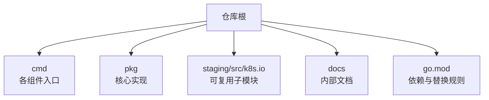
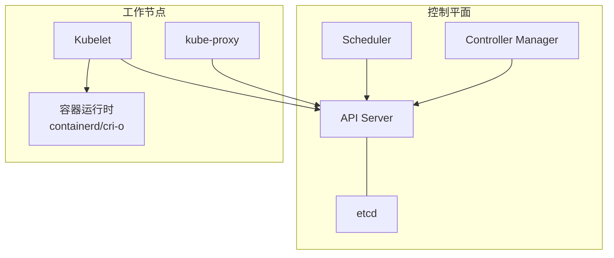
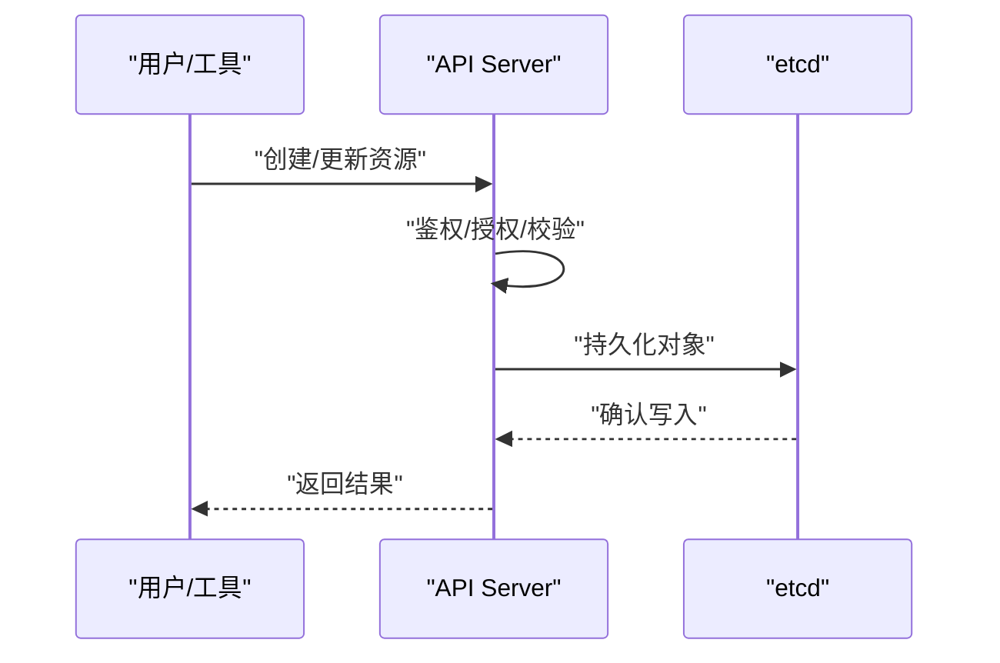
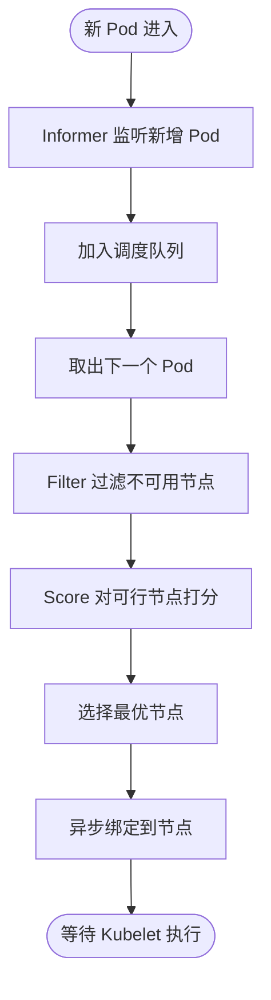
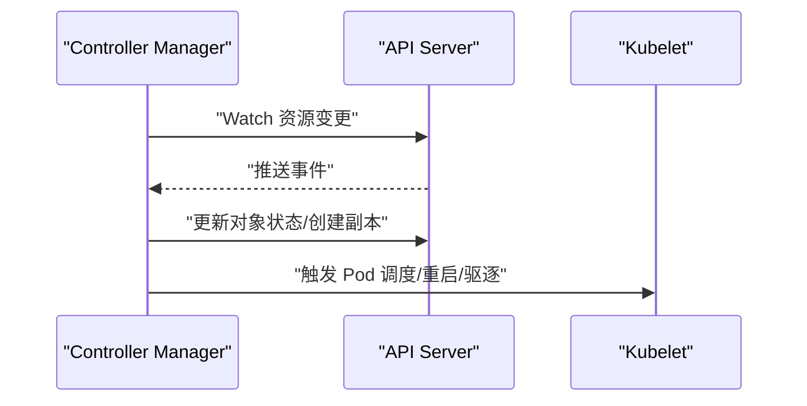
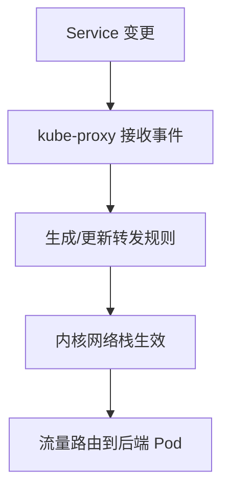
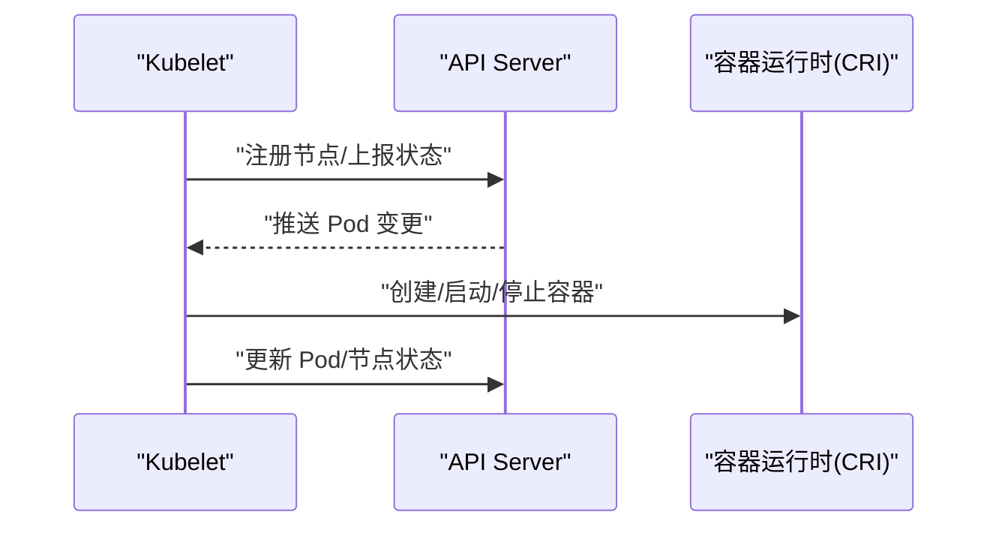
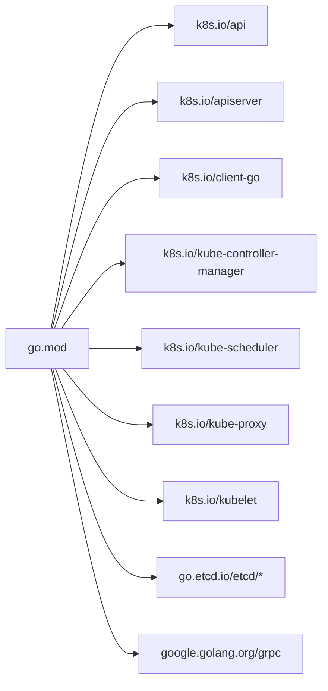

# 项目概述

<cite>
**本文引用的文件**   
- [README.md](file://README.md)
- [go.mod](file://go.mod)
- [kubernetes-internals-deep-dive.md](file://docs/kubernetes-internals-deep-dive.md)
- [apiserver.go](file://cmd/kube-apiserver/apiserver.go)
- [controller-manager.go](file://cmd/kube-controller-manager/controller-manager.go)
- [scheduler.go](file://cmd/kube-scheduler/scheduler.go)
- [proxy.go](file://cmd/kube-proxy/proxy.go)
- [kubelet.go](file://cmd/kubelet/kubelet.go)
</cite>

## 目录
1. [引言](#引言)
2. [项目结构](#项目结构)
3. [核心组件](#核心组件)
4. [架构总览](#架构总览)
5. [详细组件分析](#详细组件分析)
6. [依赖分析](#依赖分析)
7. [性能考量](#性能考量)
8. [故障排查指南](#故障排查指南)
9. [结论](#结论)
10. [附录：快速开始与术语对照](#附录快速开始与术语对照)

## 引言
Kubernetes（简称 K8s）是一个开源的容器编排平台，用于在多台主机上管理容器化应用的部署、维护与扩展。它建立在 Google 长期生产实践的基础上，并融合了社区最佳实践，由云原生计算基金会（CNCF）托管，是云原生生态的核心基础设施之一。

本概述面向初学者与有经验的开发者，既提供清晰的概念入门，也给出与代码库一致的术语和架构细节，帮助读者理解 Kubernetes 作为分布式系统的核心价值与设计理念。

## 项目结构
仓库采用“多模块 + 分阶段发布”的组织方式：
- 顶层 cmd 目录包含各控制平面与工作节点二进制入口（如 kube-apiserver、kube-controller-manager、kube-scheduler、kube-proxy、kubelet）。
- pkg 与 staging/src/k8s.io 下组织核心包与可复用子模块（API、客户端、控制器、调度器、代理等）。
- docs 提供内部深度解析文档，便于从源码视角理解系统行为。
- go.mod 声明了主模块与众多外部依赖，并通过 replace 将 k8s.io/* 指向 staging 下的本地实现，体现模块化与内聚性。

**图表来源** 
- [go.mod:1-260](file://go.mod#L1-L260)

**章节来源**
- [README.md:1-101](file://README.md#L1-L101)
- [go.mod:1-260](file://go.mod#L1-L260)

## 核心组件
- API Server：集群的统一管理入口，暴露 RESTful API，负责鉴权、校验、持久化到 etcd。
- Scheduler：监听未调度的 Pod，选择最优节点并完成绑定。
- Controller Manager：运行多个内置控制器（Node、Deployment、DaemonSet、HPA 等），驱动期望状态与实际状态一致。
- etcd：分布式键值存储，保存集群状态。
- Kubelet：工作节点上的守护进程，管理 Pod 生命周期并与容器运行时交互。
- kube-proxy：维护 Service 网络转发规则（iptables/IPVS/nftables）。

这些组件的职责与协作关系在内部深度文档中有系统性说明，包括控制面与数据面的通信路径、Watch/Informer 机制、调度流程、节点状态上报与监控等。

**章节来源**
- [kubernetes-internals-deep-dive.md:22-67](file://docs/kubernetes-internals-deep-dive.md#L22-L67)

## 架构总览
Kubernetes 的架构本质上是“声明式 + 控制循环”的分布式状态机。用户通过 API Server 提交期望状态，控制面组件持续比对期望与实际状态，并通过工作节点上的 Kubelet 执行变更，最终收敛到一致状态。

**图表来源** 
- [kubernetes-internals-deep-dive.md:22-67](file://docs/kubernetes-internals-deep-dive.md#L22-L67)

**章节来源**
- [kubernetes-internals-deep-dive.md:22-67](file://docs/kubernetes-internals-deep-dive.md#L22-L67)

## 详细组件分析

### 组件一：API Server（控制面入口）
- 职责：统一入口、RESTful API、鉴权与授权、对象持久化、聚合 API 能力。
- 启动入口：位于 cmd/kube-apiserver/apiserver.go，调用应用层命令构建器并运行。
- 关键特性：支持 OpenAPI/Swagger 规范、Webhook 准入控制、审计日志、流式接口（watch/list）。

**图表来源** 
- [apiserver.go:1-37](file://cmd/kube-apiserver/apiserver.go#L1-L37)

**章节来源**
- [apiserver.go:1-37](file://cmd/kube-apiserver/apiserver.go#L1-L37)

### 组件二：Scheduler（调度器）
- 职责：监听未调度 Pod，执行 Filter/Score 策略，完成绑定。
- 启动入口：位于 cmd/kube-scheduler/scheduler.go。
- 关键机制：插件化框架（PreFilter→Filter→PostFilter→PreScore→Score→Reserve→Permit→PreBind→Bind→PostBind），并行过滤与打分，假设（Assume）优化提升吞吐。

**图表来源** 
- [scheduler.go:1-34](file://cmd/kube-scheduler/scheduler.go#L1-L34)
- [kubernetes-internals-deep-dive.md:135-238](file://docs/kubernetes-internals-deep-dive.md#L135-L238)

**章节来源**
- [scheduler.go:1-34](file://cmd/kube-scheduler/scheduler.go#L1-L34)
- [kubernetes-internals-deep-dive.md:135-238](file://docs/kubernetes-internals-deep-dive.md#L135-L238)

### 组件三：Controller Manager（控制器管理器）
- 职责：运行多个内置控制器，驱动期望状态与实际状态一致（如 Node、Deployment、ReplicaSet、DaemonSet、HPA 等）。
- 启动入口：位于 cmd/kube-controller-manager/controller-manager.go。
- 关键模式：基于 Informer/Watch 的事件驱动；每个控制器维护一个或多个控制循环。

**图表来源** 
- [controller-manager.go:1-39](file://cmd/kube-controller-manager/controller-manager.go#L1-L39)

**章节来源**
- [controller-manager.go:1-39](file://cmd/kube-controller-manager/controller-manager.go#L1-L39)

### 组件四：kube-proxy（服务网络代理）
- 职责：监听 Service 与 Endpoints 变化，维护节点上的转发规则，实现 Service 到 Pod 的负载均衡。
- 启动入口：位于 cmd/kube-proxy/proxy.go。
- 后端模式：iptables、IPVS、nftables。

**图表来源** 
- [proxy.go:1-34](file://cmd/kube-proxy/proxy.go#L1-L34)

**章节来源**
- [proxy.go:1-34](file://cmd/kube-proxy/proxy.go#L1-L34)

### 组件五：Kubelet（节点代理）
- 职责：节点守护进程，管理 Pod 生命周期，与容器运行时交互，定期上报节点状态。
- 启动入口：位于 cmd/kubelet/kubelet.go。
- 关键机制：通过 Watch 获取分配给本节点的 Pod；PodWorkers 为每个 Pod 维护独立协程；CRI 接口抽象容器运行时。

**图表来源** 
- [kubelet.go:1-40](file://cmd/kubelet/kubelet.go#L1-L40)
- [kubernetes-internals-deep-dive.md:240-374](file://docs/kubernetes-internals-deep-dive.md#L240-L374)

**章节来源**
- [kubelet.go:1-40](file://cmd/kubelet/kubelet.go#L1-L40)
- [kubernetes-internals-deep-dive.md:240-374](file://docs/kubernetes-internals-deep-dive.md#L240-L374)

## 依赖分析
- 主模块：k8s.io/kubernetes。
- 核心依赖：etcd 客户端、gRPC/Protobuf、OpenAPI/Kube-openapi、Prometheus 指标、CNI/CRI 相关库等。
- 模块化设计：通过 go.mod 的 replace 将 k8s.io/api、client-go、apiserver、controller-manager、scheduler、proxy、kubelet 等指向 staging 下的本地实现，保证版本一致与内聚开发。

**图表来源** 
- [go.mod:1-260](file://go.mod#L1-L260)

**章节来源**
- [go.mod:1-260](file://go.mod#L1-L260)

## 性能考量
- 控制面侧：
  - 使用 Informer/Reflector 的 List-Watch 与本地缓存，避免频繁直连 API Server。
  - Scheduler 的并行过滤与打分、假设（Assume）机制减少阻塞。
- 数据面侧：
  - kube-proxy 支持 IPVS/nftables 等高性能内核转发模式。
  - Kubelet 的 PodWorkers 并发处理不同 Pod 的生命周期事件。
- 存储侧：
  - etcd 的高可用与一致性协议保障控制面稳定性。

[本节为通用指导，不直接分析具体文件]

## 故障排查指南
- 控制面健康：
  - 检查 API Server 日志与指标，确认 etcd 连接与健康。
  - 观察 Scheduler/Controller Manager 的告警与事件。
- 节点健康：
  - 关注 Kubelet 日志、节点状态与 Lease 心跳。
  - 检查 kube-proxy 规则是否按预期生效。
- 常见问题定位：
  - Pod 无法调度：查看调度日志与过滤器/打分器输出。
  - Service 不通：检查 Endpoints 与 kube-proxy 规则。
  - 节点 NotReady：核查 Kubelet 注册、Lease 更新与网络连通性。

**章节来源**
- [kubernetes-internals-deep-dive.md:421-533](file://docs/kubernetes-internals-deep-dive.md#L421-L533)

## 结论
Kubernetes 以声明式 API 与控制循环为核心，通过控制平面与工作节点的解耦设计，实现了高可扩展、高可用的容器编排能力。其插件化架构与丰富的生态使得在多云与异构环境中也能灵活落地。理解 API Server、Scheduler、Controller Manager、Kubelet、kube-proxy 的职责与协作，是掌握 Kubernetes 的关键。

[本节为总结性内容，不直接分析具体文件]

## 附录：快速开始与术语对照
- 快速开始
  - 官方文档与课程：参考 README 中的链接指引。
  - 源码构建：提供 make 与 quick-release 两种常见方式。
- 术语对照（与代码库一致）
  - 控制平面（Control Plane）：API Server、Scheduler、Controller Manager、etcd。
  - 数据平面（Data Plane）：Kubelet、kube-proxy、容器运行时。
  - 声明式 API：用户提交期望状态，系统自动收敛。
  - 控制器模式：控制循环持续比对期望与实际状态并执行动作。
  - 插件架构：Scheduler 框架、准入控制、认证/授权、CSI 等。

**章节来源**
- [README.md:26-59](file://README.md#L26-L59)